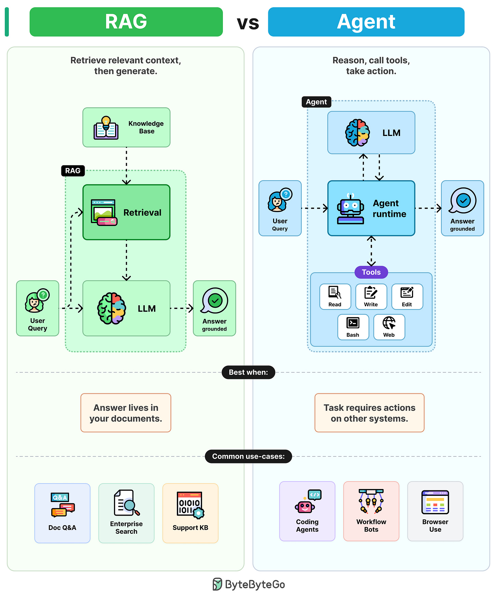

## Key Takeaways

- RAG: retrieve context, then generate — one retrieval, one generation, cheap and predictable
- Agents: reasoning loop with tools — flexible but token-intensive and harder to debug
- Decision rule: RAG when the answer lives in your documents, agents when the task requires action on other systems

## RAG (Retrieval-Augmented Generation)

Retrieve relevant context, then generate.

1. User query gets embedded and sent to retrieval
2. Retrieval pulls relevant chunks from knowledge bases (PDFs, wikis, etc.)
3. Chunks are inserted into the prompt as context
4. LLM generates answers grounded in retrieved text

One retrieval. One generation. Cheap, predictable, and easy to debug.

**Best when:** Answer lives in your documents.
**Common use cases:** Doc Q&A, enterprise search, support KB.

## Agents

Reason, call tools, take action.

1. User query enters the agent runtime (a reasoning loop around an LLM)
2. LLM reads the goal and selects a tool (Read, Write, Edit, Bash, etc.)
3. Runtime executes the tool and feeds results back to the LLM
4. LLM reasons again, picks the next tool, and loops until completion

More flexible but more token-intensive and harder to debug — errors compound across steps.

**Best when:** Task requires actions on other systems.
**Common use cases:** Coding agents, workflow bots, browser use.
