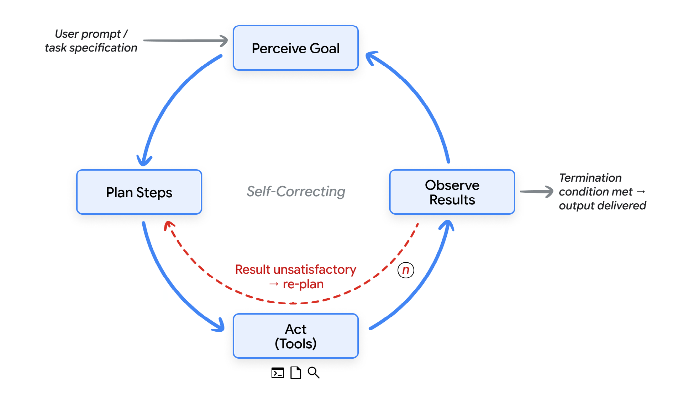
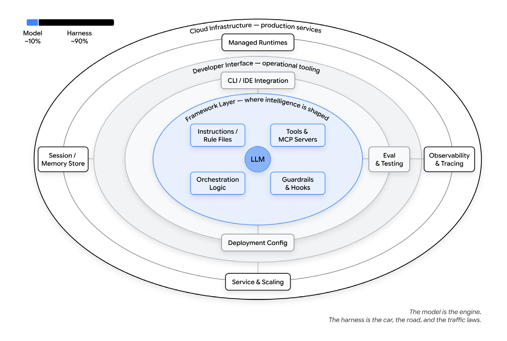
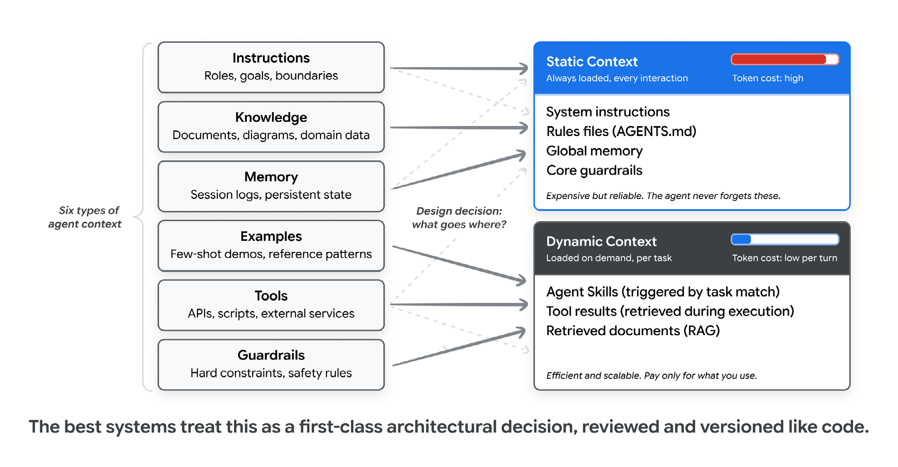
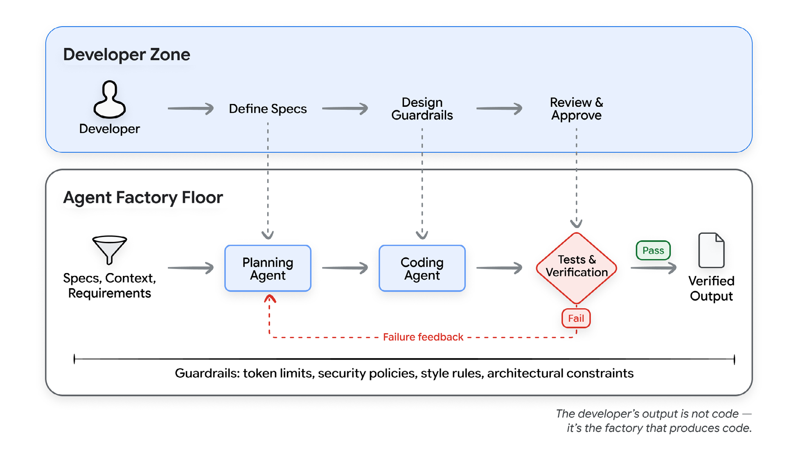
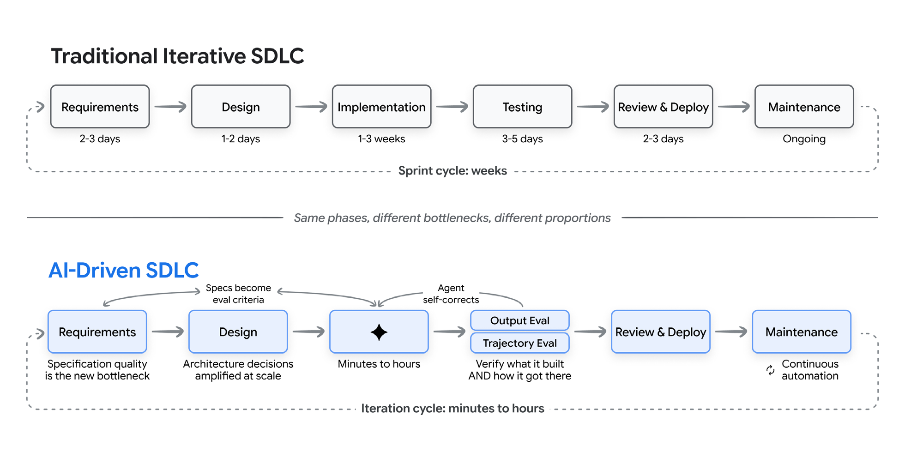
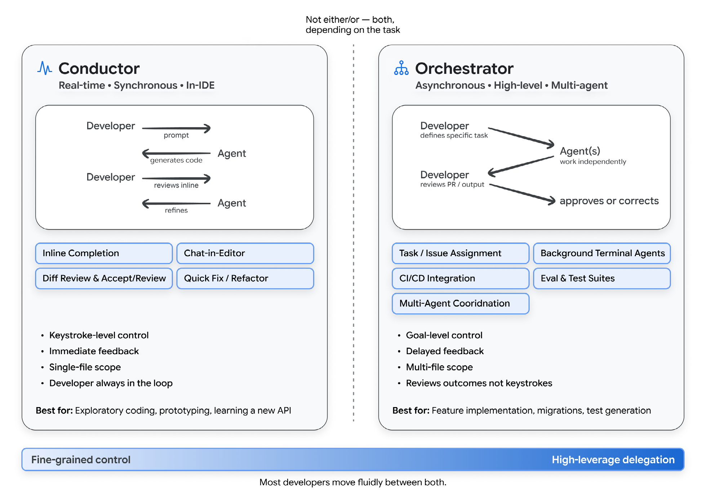

# SDLC with Agent Harness

Google's framework for AI-driven software development: the harness is what turns a raw model into a working agent, and the SDLC is redesigned around it. From "The New SDLC with Vibe Coding" (Addy Osmani, Shubham Saboo, Sokratis Kartakis — Google, May 2026).

## Key Takeaways

- **Agent = Model + Harness**: the model is the engine; the harness (prompts, tools, sandboxes, orchestration, guardrails, observability) is the car, the road, and the traffic laws. Most agent failures are harness failures, not model failures
- **Harness is the SDLC's new primary artifact**: the developer's job shifts from writing code to configuring the harness that writes code — specs, rule files, evals, guardrails, tool access, feedback loops
- **Four phases, each with a distinct harness role**: Requirements/Planning (configuring), Implementation (running), Testing & QA (feedback loop), Code Review/Deployment (observing)
- **Two developer modes**: Conductor (real-time, keystroke-level, in-IDE) and Orchestrator (async, goal-level, multi-agent delegation). Effective engineers move fluidly between both
- **The 80% problem is structural**: agents quickly generate ~80% of a feature; the last 20% — edge cases, integration points, subtle correctness — requires deep contextual knowledge. The skill is knowing which 20% to focus human attention on

## The Vibe → Agentic Engineering Spectrum

The differentiator is not whether you use AI — it's how outputs get verified.

| Dimension | Vibe Coding | Structured AI-Assisted | Agentic Engineering |
|---|---|---|---|
| Intent specification | Casual prompts | Detailed prompts + constraints | Formal specs, architecture docs, memory files |
| Verification | "Does it seem to work?" | Manual testing, spot-checking | Automated test suites, CI/CD gates, LM judges |
| Codebase understanding | Minimal; may not read generated code | Selective review of critical paths | Comprehensive review of architecture |
| Error handling | Copy-paste errors back to AI | Developer diagnoses, AI implements fix | Agents self-diagnose within defined bounds |
| Appropriate scope | Prototypes, scripts, hackathons | Features in established codebases | Production systems, team-scale development |
| Risk profile | High; acceptable for disposable code | Moderate; human judgment at key checkpoints | Low; systematic verification at every stage |

Applied rule: a weekend prototype can be pure vibe coding. A production API handling financial transactions demands agentic engineering. The skill is knowing where to draw the line.

## Agent = Model + Harness

```
Agent = Model + Harness
```

Model ≈ 10% of what shapes agent behavior. Harness ≈ 90%. Evidence: On Terminal Bench 2.0, one team moved from outside Top 30 to Top 5 by changing *only the harness*, no model change. A LangChain study raised a benchmark score 13.7 points by tweaking only the system prompt, tools, and middleware.

Most agent failures, examined honestly, are configuration failures — missing tool, vague rule, absent guardrail, context window stuffed with noise.

### Agent Loop



The loop: perceive the goal → plan steps → act through tools → observe results → re-plan if unsatisfactory → repeat until termination condition met.

### Harness Anatomy



| Harness Component | What it owns |
|---|---|
| **Instructions & Rule Files** | `AGENTS.md`, `CLAUDE.md`, `GEMINI.md`, skill files, sub-agent prompts — defines who the agent is, what it cares about, what it's forbidden from doing |
| **Tools** | MCP servers, APIs, functions the agent can call, plus prose telling the model when/how to call them |
| **Sandboxes & Execution Environments** | Where agent code runs, what it has access to, what it cannot reach |
| **Orchestration Logic** | Sub-agent spawning, model routing, hand-offs between specialists |
| **Guardrails / Hooks** | Deterministic code at specific lifecycle points (before tool call, after file edit, before commit) |
| **Observability** | Logs, traces, evals, cost and latency metering |

## Context Engineering



Six types of context every agent needs: **Instructions** (role, goals, boundaries) · **Knowledge** (docs, diagrams, domain data) · **Memory** (session logs + persistent state) · **Examples** (few-shot demos, reference patterns) · **Tools** (API definitions, scripts) · **Guardrails** (hard constraints, safety rules).

**Static context** (always loaded, high token cost): system instructions, rule files, global memory, core guardrails — the agent never forgets these.

**Dynamic context** (loaded per task, low per-turn cost): skill instructions triggered by task match, tool results, RAG-retrieved docs — pay only when needed.

The static/dynamic boundary is a first-class architectural decision, reviewed and versioned like code. Too much static context dilutes signal; too little means the agent forgets critical rules.

## The Factory Model



The developer's primary output is not code — it's **the system that produces code**:
- Specifications and context that define what needs to be built
- Agents that translate specifications into implementation
- Tests and quality gates that verify correctness
- Feedback loops that route failures back to agents for correction
- Guardrails that constrain agents to safe, predictable behavior

Give agents **success criteria rather than step-by-step instructions**, then let them iterate.

## The AI-Driven SDLC



AI compresses implementation (weeks → hours) but leaves requirements, architecture, and verification stubbornly human-paced. The new bottleneck is **specification quality**, not coding speed.

### How Each Phase Changes

**Requirements & Planning:**
- AI generates user stories, edge cases, API schemas from natural-language descriptions
- Requirements become a conversation that produces spec + initial implementation simultaneously
- Spec quality is the new bottleneck

**Design & Architecture:**
- Architecture trade-offs (consistency vs. availability, build vs. buy) still require human judgment
- Once decisions are made, AI scaffolds applications and enforces conventions at scale

**Implementation:**
- 25–39% productivity improvement industry-wide; METR counter-study: experienced devs 19% *slower* on some tasks due to verification overhead
- AI transforms implementation from *writing* to *reviewing, guiding, and verifying*

**Testing & QA:**
- **Output eval**: does the code compile, do tests pass?
- **Trajectory eval**: did the agent take the right sequence of steps? (A fluent output that skipped verification steps is more dangerous than one with a visible error)
- Tests and evals are the primary mechanism for communicating intent to AI agents
- Quality flywheel: evaluate → diagnose → optimize prompts/tools → verify fixes → monitor production

**Code Review & Deployment:**
- AI as first-pass reviewer: bugs, style violations, security vulnerabilities before human eyes it
- Strategic alignment and design maintainability still require human judgment
- Deployment pipelines become AI-aware: health monitoring, automatic rollback, risk prediction

**Maintenance:**
- Legacy codebases navigable with AI assistance; "too risky to touch" debt can now be refactored safely

## Harness in SDLC — Four Phases

| Phase | Harness role | Components used | What the harness does |
|---|---|---|---|
| **Requirements, Planning, & Architecture** | Configuring | Instructions & Rule Files | Developer writes `AGENTS.md`, defines tool access, sets architectural constraints before any code is generated |
| **Implementation** | Running | Sandboxes, Tools | Code executes in isolated sandbox; all file reads, web searches go through harness-provided tools |
| **Testing & QA** | Feedback loop | Orchestration Logic, Guardrails | Runs tests in sandbox; on failure, captures error output and routes back to model — the automated "think → act → observe" loop |
| **Code Review, Deployment, Maintenance** | Observing | Hooks, Observability | Deterministic hooks block unsafe actions (e.g., hard-coded password in commit); observability tracks token cost, latency, agent drift |

## Developer Roles: Conductor vs Orchestrator



- **Conductor** — real-time, in-IDE, keystroke-level control. Immediate feedback, single-file scope. Best for exploratory coding, prototyping, learning a new API. Risk: becomes a bottleneck if the developer directs every keystroke.
- **Orchestrator** — async, goal-level, multi-agent delegation. Developer defines tasks, agents work independently, developer reviews PR/output. Best for feature implementation, migrations, test generation. Requires strong specification, decomposition, and evaluation skills.

Most developers move fluidly between both depending on the task.

## The 80% Problem

AI rapidly generates ~80% of a feature. The remaining 20% — edge cases, error handling, integration points, subtle correctness — demands deep contextual knowledge current models often lack. AI errors have shifted from visible syntax mistakes to insidious conceptual failures that "look right" and may pass basic tests.

**Winning posture**: use AI for well-specified implementation tasks; reserve human attention for ambiguous requirements, architectural trade-offs, and correctness verification. Focus expertise where it matters most.

## Coding Agents in Practice

| Mode | What it is | Best for |
|---|---|---|
| **In the editor** | Inline completion, chat panels, codebase-aware IDE | Quick edits, explanations without leaving flow |
| **In the terminal** | Full FS access, multi-file, runs tools, iterates on results | Multi-file work, exploration, tasks needing code execution |
| **In the background** | Autonomous in cloud sandbox, often hours, outputs a PR | Well-specified tasks the dev can describe and walk away from |

## Durable Principles

1. **Structure scales, vibes don't.** Specs, tests, guardrails, and architectural oversight are not optional for software organizations depend on.
2. **AI amplifies your engineering culture.** Strong testing + clear standards = dramatically more value. Weak culture + AI = faster technical debt accumulation. AI is a force multiplier of both strengths and weaknesses.
3. **The human role is evolving, not diminishing.** Skills shift from implementation to judgment: specification, evaluation, architectural decisions, reviewing AI output.

> *"Generation is solved. Verification, judgment, and direction are the new craft."*

---

**Source:** Imported from /Users/vimittal/Downloads/Day_1_v3.pdf ("The New SDLC with Vibe Coding" — Addy Osmani, Shubham Saboo, Sokratis Kartakis, Google, May 2026)
**Date:** 2026-06-26
**Tags:** sdlc, agentic-engineering, harness, vibe-coding, factory-model, context-engineering, conductor-orchestrator, coding-agents, agent-loop, evals, guardrails, observability
