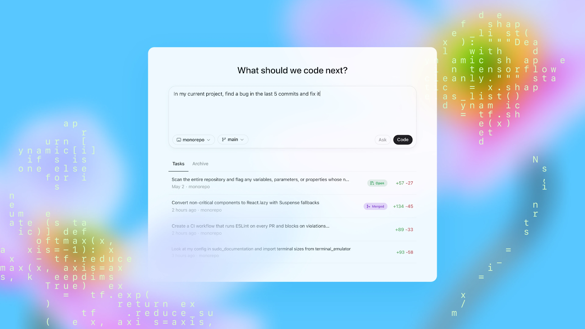
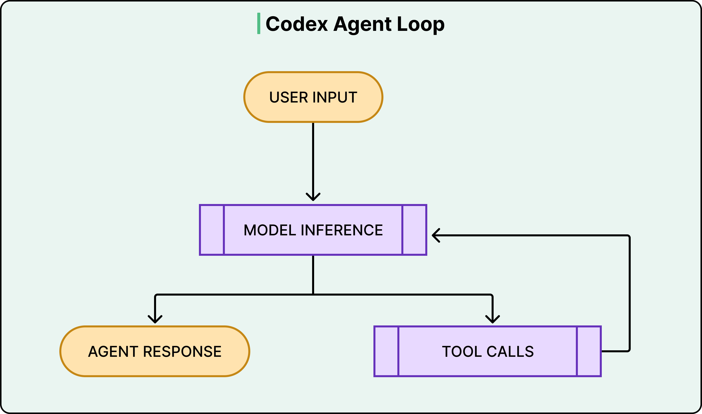
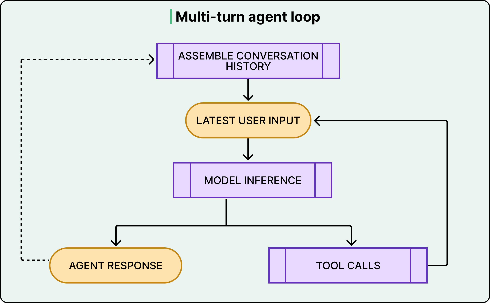
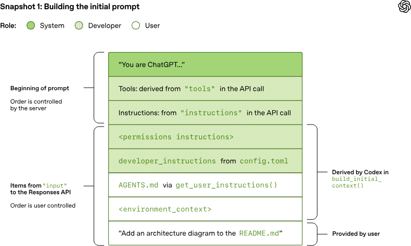
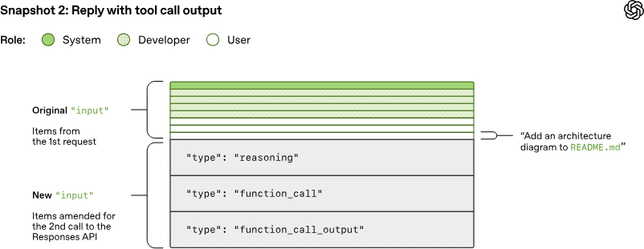
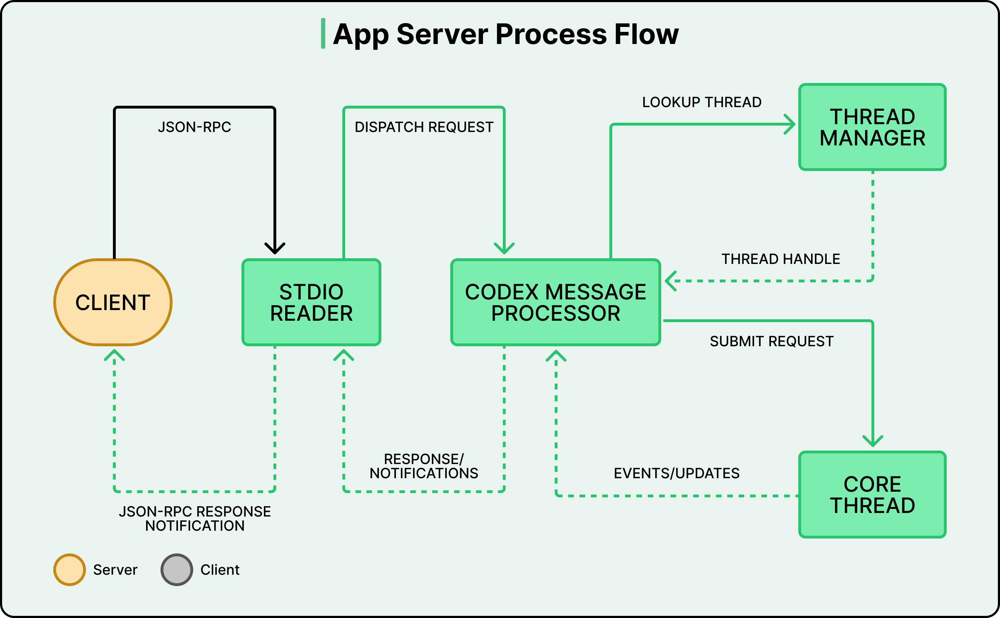
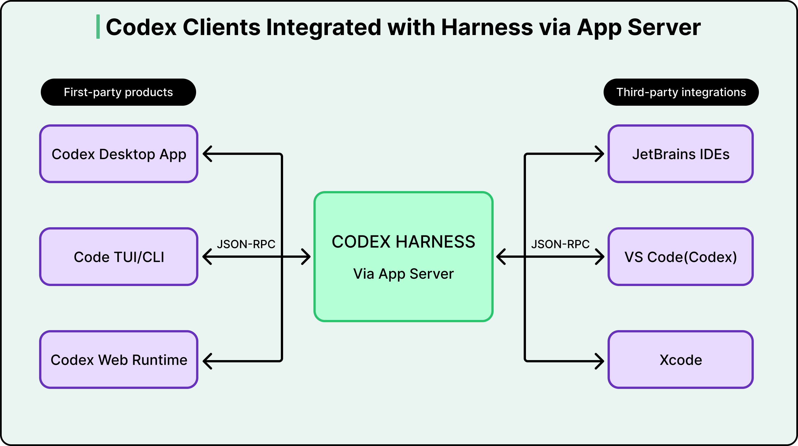

# OpenAI Codex Architecture

How Codex (OpenAI's coding agent) works — the agent loop, context management, AGENTS.md, and the App Server + JSON-RPC architecture that lets one core serve many editor surfaces.

## Key Takeaways

- Codex runs an **agent loop**: model receives input → either returns a final answer or issues a tool call → tool result feeds the next turn → repeat
- **Conversation history grows quadratically** across turns because every request re-sends the full prior history; OpenAI relies on **prompt caching** (preserving the unchanged prefix) to keep this affordable
- **`AGENTS.md`** is Codex's project-context file — same role as Claude Code's `CLAUDE.md`, layered into the prompt alongside system, user, and tool messages
- A single core **App Server** exposes Codex over **JSON-RPC on stdio** — letting VS Code, web, macOS desktop, and third-party IDEs (JetBrains, Xcode) share one codebase
- **Bidirectional protocols** let users approve risky commands mid-task; **context compaction** packs prior state into an encrypted payload when nearing context limits



## What Codex Is

A coding agent: it takes natural-language tasks, navigates a repository, calls tools (read files, run commands, execute tests, edit code), and produces commits/PRs. Available across:

- **VS Code** (extension)
- **Web** (browser interface)
- **macOS desktop** (standalone app)
- **JetBrains IDEs** (extension)
- **Xcode** (integration)

All on top of the same core engine.

## The Agent Loop



The fundamental cycle:

```
input
  ↓
model call
  ↓
response = final answer?  →  yes  →  return to user
  ↓ no
tool call  →  execute  →  result  →  back to model
  (repeat)
```

The same loop powers most modern coding agents (Claude Code, Cursor agent, Stripe Minions). What differs is the orchestration around it, the tool catalog, and the context management.

### Multi-Turn Flow



Each turn appends to the conversation history. The next model call must include everything that came before — system prompt, AGENTS.md, all prior user inputs, model responses, tool calls, tool results, plus the new input.

## Context Management

### Prompt Layering



A Codex prompt is assembled from several layers:

1. **System prompt** — Codex's base instructions
2. **AGENTS.md** — project-specific context (architecture, conventions, commands)
3. **Conversation history** — all prior turns
4. **Tool descriptions** — available tools, schemas
5. **Tool outputs** — return values from executed tools
6. **New user input** — the current request

Same six-context-types pattern described in [context-engineering.md](../concepts/context-engineering.md).

### AGENTS.md

The Codex equivalent of Claude Code's `CLAUDE.md`:

```markdown
# Project: Foo
TypeScript + React, hosted on Vercel.

## Code Style
- Prettier defaults
- Strict TypeScript
- Functional React components

## Commands
- `pnpm dev`
- `pnpm test`
- `pnpm lint`

## Architecture
src/
  components/   — React UI
  lib/          — domain logic
  server/       — API routes

## Rules
- Never commit .env
- Always run tests before committing
```

Codex reads AGENTS.md at the start of every session and inserts it into the system context. Treat it as **versioned institutional knowledge** for the project — update as you discover Codex's misconceptions about the codebase.

OpenAI's own [harness engineering](harness-engineering.md) writeup describes a more elaborate convention: AGENTS.md as a ~100-line table of contents pointing into a structured `docs/` directory.

### Context Growth Problem



Conversation history grows quadratically:

| Turn | History size |
|---|---|
| 1 | 1 message |
| 2 | 1 prior + 1 new = 2, but re-sent in full |
| N | Sum of all prior turns, re-sent every time |

For a 50-turn agent run, this is O(n²) tokens transmitted. Two mitigations:

1. **Prompt caching** — keep the conversation *prefix* identical across turns so the API can cache it. New tokens get appended; cached prefix is reused for free
2. **Context compaction** — when nearing context limits, pack prior state into an encrypted payload and start a "fresh" conversation that references the compacted state

Compaction is the safety valve. Without it, a 6-hour autonomous Codex run would hit the context wall.

## Architecture: App Server + JSON-RPC



The key engineering decision that lets Codex live in 5+ different surfaces with one codebase:

- A **single core "App Server"** holds the agent loop, context, tool dispatch, and model communication
- It exposes itself over **JSON-RPC on stdio**
- Editor surfaces (VS Code extension, web app, macOS desktop, JetBrains plugin, Xcode integration) are **thin clients** that talk to the App Server



Benefits:
- **One codebase for the agent core** — feature updates propagate to every surface
- **Surfaces stay thin** — they handle UI, file diffing, approval prompts; not the agent loop
- **Local-first** — the App Server runs on the user's machine; model calls go out to OpenAI
- **Third-party extensibility** — anyone can build a Codex client by speaking the JSON-RPC protocol

### Bidirectional Protocol

The JSON-RPC channel is bidirectional — the App Server can call back to the client during a task. The main use: **mid-execution approval prompts**. Before running a destructive shell command (rm, force-push, etc.), Codex pauses and asks the user via the client.

This is the protocol-level enforcement of the [permissions](../claude/claude-code-features.md#2-permissions) pattern.

## How Codex Compares to Claude Code

Both implement the same agent loop. The differences are stylistic and architectural:

| | Claude Code | Codex |
|---|---|---|
| Model | Anthropic (Claude) | OpenAI (GPT family) |
| Surfaces | Terminal-first, web | VS Code / web / macOS / JetBrains / Xcode |
| Context file | `CLAUDE.md` | `AGENTS.md` |
| Architecture | Terminal CLI with skills/hooks/plugins | App Server + JSON-RPC for many surfaces |
| Subagents | Native (with Opus 4.6+) | Less prominent in docs |
| MCP support | Native | Native |
| Tool ecosystem | Skills + MCP + hooks | Built-in tools + integrations |

The agent loop and prompt-caching strategy are essentially the same — the differentiation is in deployment surface and ecosystem.

## What This Means for Building Your Own Agent

The Codex architecture suggests a generalizable pattern:

1. **Separate the agent core from the UI surfaces.** Build the loop once; deploy clients many places
2. **Standard protocol between core and clients.** JSON-RPC over stdio is unglamorous and works
3. **Make context layering explicit.** System + project-context-file + history + tools + outputs + user — design the assembler, don't let layers grow ad hoc
4. **Solve context growth before you hit it.** Prompt caching + compaction together let sessions run hours instead of minutes
5. **Build approval into the protocol.** Destructive operations need explicit user consent — bake it into the wire protocol, not the UI

## Related

- [Harness engineering](harness-engineering.md) — OpenAI's own writeup of building an engineering organization around Codex; uses AGENTS.md as a docs-system index, repository as system of record
- [Stripe Minions](stripe-minions.md) — same agent loop, different deployment (unattended one-shot vs interactive)
- [Claude Code architecture](../claude/claude-code-architecture.md) — Claude Code's equivalent internals
- [Claude Code: 12 features](../claude/claude-code-features.md) — the feature surface comparison
- [Context engineering](../concepts/context-engineering.md) — the discipline behind AGENTS.md / CLAUDE.md
- [LLM tool use and MCP](../concepts/llm-tool-use-and-mcp.md) — how Codex talks to tools
- [Agents across SDLC](../agents/agents-across-sdlc.md) — where coding agents like Codex win/lose
- [AI-native engineering](ai-native-engineering.md) — broader workflow patterns around Codex/Claude Code

---

**Source:** https://blog.bytebytego.com/p/how-openai-codex-works
**Date:** 2026-06-05
**Tags:** openai, codex, coding-agents, agent-loop, agents-md, app-server, json-rpc, prompt-caching, context-compaction, agent-architecture
