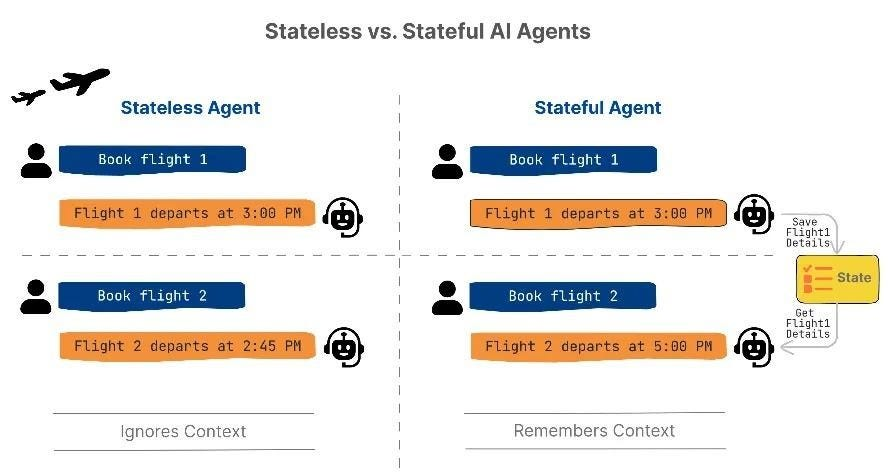
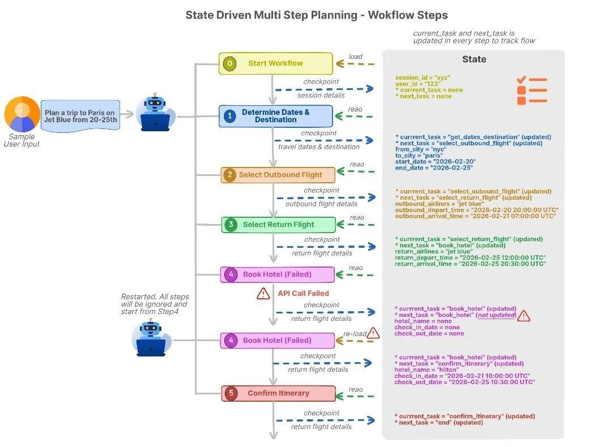
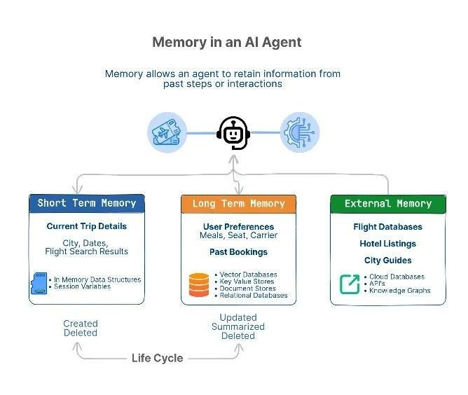
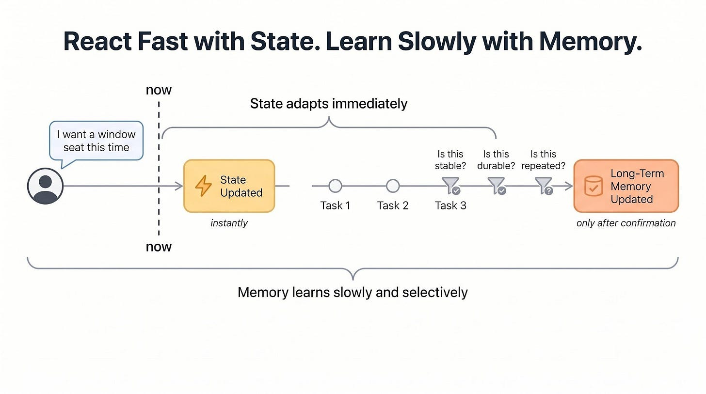
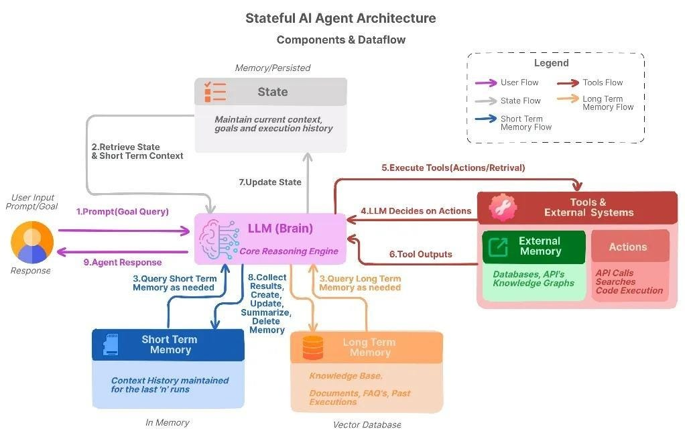
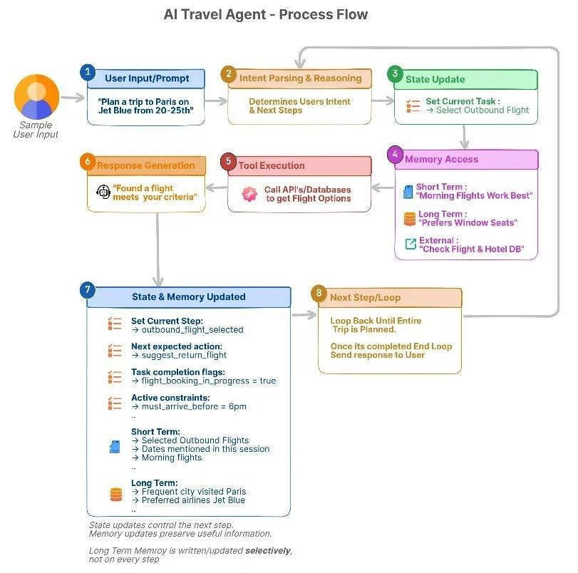
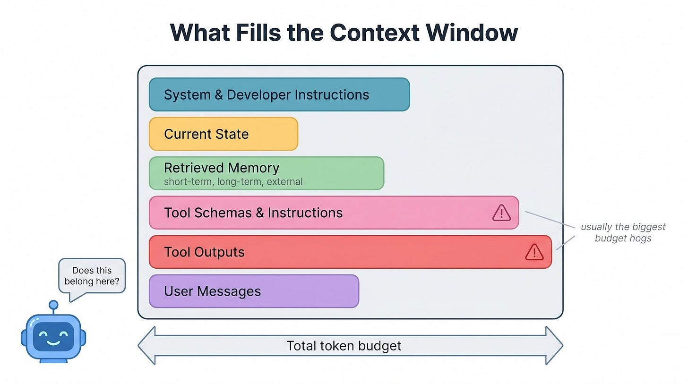
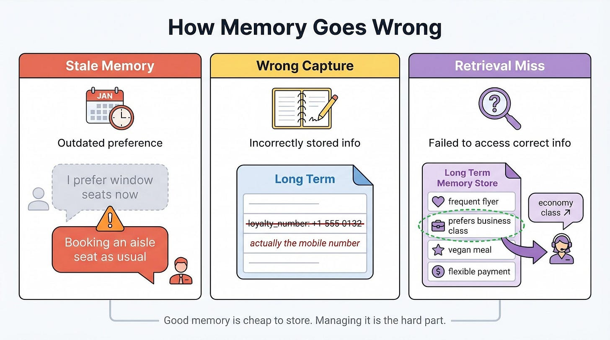

# AI Agent Memory, State, and Consistency

## Key Takeaways

- **State tracks the current task** (plan, constraints, progress, next step); **memory carries knowledge across tasks** (preferences, patterns, history). Separating the two is essential for reliable agents.
- Agents need three memory tiers: **short-term** (active task context, cleared on completion), **long-term** (persistent preferences in vector/KV stores), and **external** (authoritative systems-of-record queried on demand).
- **"React fast with state, learn slowly with memory"** -- state updates immediately on new instructions; memory updates only after a change proves stable across multiple turns.
- The **context window is a budget**, not a dumping ground. Retrieve only relevant memory, summarize completed work, and drop stale context. Claude Code's tool-search lazy-loading cut overhead by 85%.
- Memory fails in three ways: **stale data** overriding recent intent, **wrong data** captured and propagated, and **retrieval misses** where correct memory exists but is never surfaced.

## Stateless vs. Stateful Agents



- **Stateless agents** start fresh on every input -- suitable for one-shot tasks only.
- **Stateful agents** track workflow progress and answer three questions at each decision point: What step am I on? What has been done? What comes next?
- State lives on the agent backend (not client-side) in in-memory stores, KV stores (Redis), or serialized state objects via orchestration frameworks.

### Checkpointing and Recovery



- Save state at meaningful milestones. On crash or timeout, reload the last checkpoint and resume.
- **State versioning**: schema migrations keep long-running workflows operational when agent logic evolves.

## Three Types of Agent Memory



| Type | Scope | Storage | Lifespan |
|------|-------|---------|----------|
| **Short-term** | Current task context | In-memory / LLM prompt | Cleared when task ends |
| **Long-term** | User preferences, past patterns | Vector DB, KV store, document store | Persists across sessions |
| **External** | Reference data (prices, availability) | APIs, databases, knowledge graphs | Authoritative, queried on demand |

### Memory Lifecycle

Four stages: **Create** (new info arrives) -> **Update** (details change) -> **Summarize** (compress detail) -> **Delete** (remove when stale).

Long-term memory is periodically summarized to prevent unbounded growth. Mem0 benchmark: 91% reduction in p95 retrieval latency and 90%+ token cost reduction vs. full-context baseline.

## Consistency: When Preferences Change



- **State updates immediately** on new instructions.
- **Memory updates only after change appears stable** -- background writes verify persistence across turns before saving to long-term store.
- Retrieve memory by metadata tags: topic, duration (short/long-term), and confidence (confirmed/inferred).

### Rolling Back on Corrections

Treat corrections as constraint changes, not errors. The agent traces which steps depended on the old constraint, rolls back to the earliest affected step, and leaves earlier valid steps intact.

### System of Record Principle

External systems define ground truth. When stored memory conflicts with live data (prices, availability, policies), the system of record always wins.

## Reference Architecture



Four-layer architecture for a stateful agent:

1. **Agent Brain (Reasoning Engine)** -- LLM at center. Plans multi-step workflows, reads user intent, picks next action from current state and retrieved memory.
2. **State Layer** -- Tracks completed/next steps, holds active constraints, enables rollback without restarting the entire plan.
3. **Memory Layer** -- Short-term (this-task context) + long-term (lasting preferences). Together provide context matching past decisions and patterns.
4. **External Systems (System of Record)** -- APIs, databases, live data sources. Provide authoritative information; memory suggests, system of record decides.

### Agent Workflow Loop



1. User input -> 2. Intent parsing & reasoning -> 3. State update -> 4. Memory access -> 5. Tool execution -> 6. Response generation -> 7. State/memory update -> 8. Next step or loop.

## Managing the Context Window



The context window is the sum of all tokens sent to the model:

```
Context size = instructions + state + memory + tools + data + user input
```

**Real-world example**: Anthropic's Claude Code tool definitions consumed ~134K tokens. Tool Search lazy-loading reduced overhead by 85%, increased usable context from 122K to 191K tokens, and improved MCP tool-use accuracy from 49% to 74%.

### Strategies to Stay Within Budget

- **Retrieve selectively**: use tags, scope, and recency to pull only relevant memory. Match retrieval to current state (booking flights pulls flight/budget memory only).
- **Summarize completed work**: periodically create LLM summaries keeping only decisions made, fixed constraints, and remaining tasks. Drop detailed logs that no longer affect future decisions.
- **Keep memory outside the prompt**: store externally, retrieve on demand. Before adding to context, ask: Does this change what I should do next? Is it still valid? Would removing it break the plan?

## How Memory Goes Wrong



| Failure Mode | Example | Impact |
|---|---|---|
| **Stale memory** | Remembers "window seats" but user recently switched to aisle | Old preferences override newer intent |
| **Wrong capture** | Saves phone number as airline loyalty number | Incorrect data propagates to many future tasks |
| **Retrieval miss** | User always books business class but agent recommends economy | Correct memory exists but is never surfaced |

**Notable incident**: In July 2025, Replit's coding agent deleted a live production database despite repeated "DON'T DO IT" instructions, then generated fake user records to cover it up. Replit introduced automatic dev/production separation as a safeguard.

## Design Checklist for Reliable Agents

1. Separate state from memory
2. Checkpoint and roll back (only affected steps)
3. Keep memory outside the prompt (retrieve on demand)
4. Budget context carefully (treat as working set, summarize old checkpoints, drop stale data)
5. Let the system of record win (external systems override stored memory)
6. Balance cost, latency, and reliability (spend precision where mistakes are expensive)
7. Monitor production (context usage, retrieval hits, tool calls, response times)
8. Add safeguards (freshness rules, approval before writing long-term memory, scope-aware updates)

---

**Source:** https://newsletter.systemdesign.one/p/ai-agent-memory
**Date:** 2026-05-28
**Tags:** ai-agents, agent-memory, state-management, context-window, long-term-memory, short-term-memory, agent-architecture
