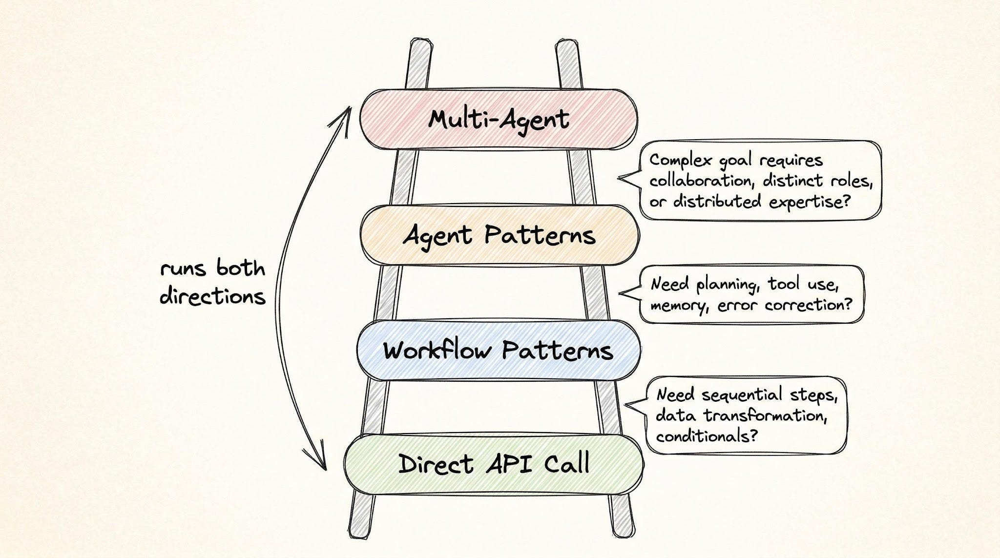
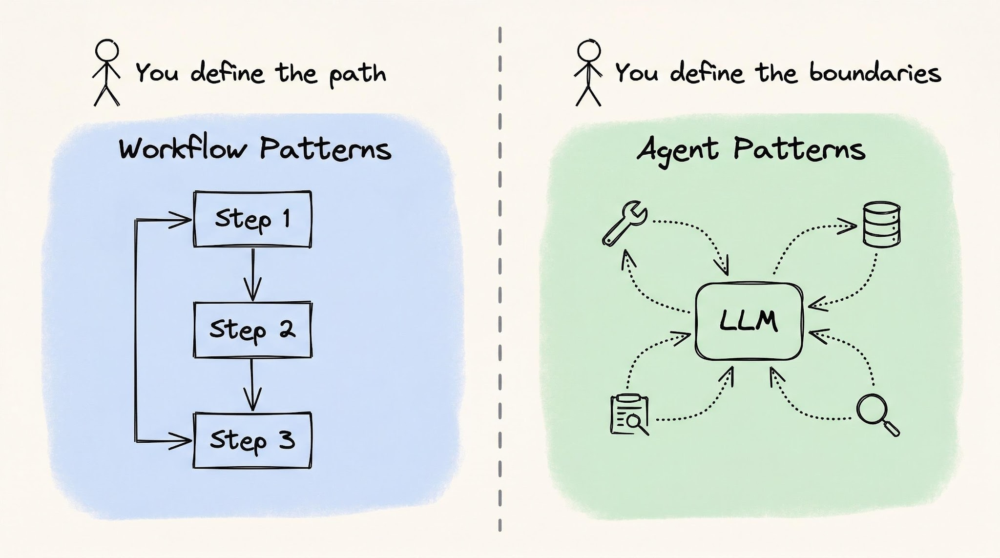
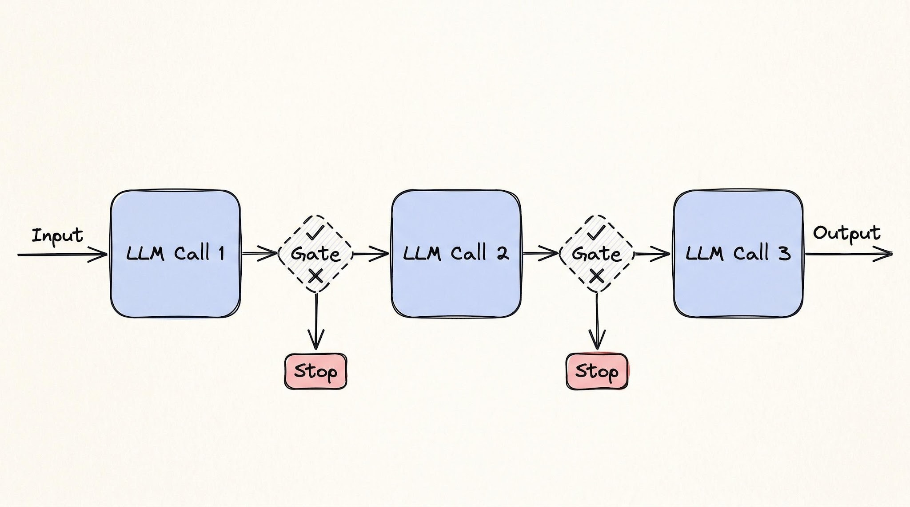
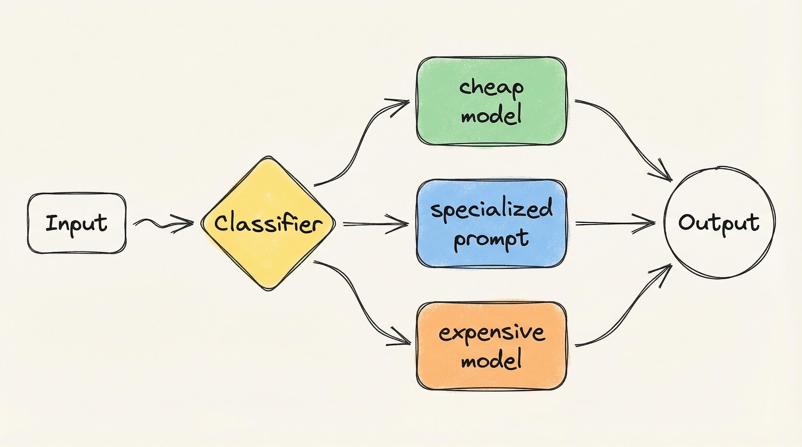
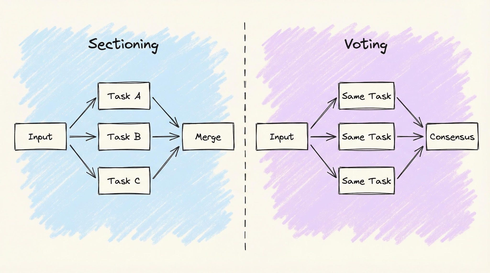
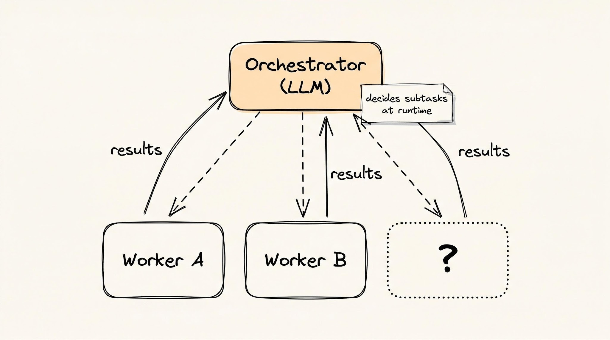

# Agentic Design Patterns

## Key Takeaways

- Start with a direct API call; escalate to workflows, then agents, then multi-agent only when the simpler tier breaks -- the ladder runs both directions
- Workflow patterns (code controls flow) vs. agent patterns (LLM controls flow) is the fundamental split: you define the path vs. you define the boundaries
- The 4 workflow patterns (chaining, routing, parallelization, orchestrator-workers) and 5 agent patterns (reflection, tool use, planning, multi-agent collaboration, and autonomous agents) cover 9 total agentic patterns
- Reflection -- where the LLM critiques and self-corrects its own output -- is the entry point to agent-level autonomy

## The Escalation Ladder

The core decision framework: how much autonomy to grant the LLM.

Four tiers, escalate only when the lower tier breaks:

| Tier | Who controls flow | When to use |
|------|-------------------|-------------|
| **Direct API Call** | Your code, one shot | Summarization, classification, extraction, translation |
| **Workflow Patterns** | Your code, multi-step | Sequential steps, data transformation, conditionals |
| **Agent Patterns** | The LLM | Planning, tool use, memory, error correction needed |
| **Multi-Agent** | Multiple LLMs | Complex goals requiring collaboration, distinct roles, distributed expertise |

The ladder runs both directions -- if an agent pattern is unreliable, drop back to a workflow.

## Workflow vs. Agent Patterns

- **Workflow patterns** -- your code specifies the exact execution flow (which LLM calls, in what order, with what validation gates)
- **Agent patterns** -- you define constraints (available tools, budget, permissions) and the LLM decides what steps to take at runtime

## Workflow Patterns (Code Controls Flow)

> These 4 patterns overlap with `notes/ai-ml-ds/concepts/multi-agent-systems.md` which covers them with production examples. Below is a condensed summary; see that note for detailed tradeoffs.

### 1. Prompt Chaining

Sequential LLM calls with validation gates between steps. Analogy: CI/CD pipeline.

- Each step must pass before the next runs
- Tradeoff: linear latency growth; errors propagate forward past what gates can catch

### 2. Routing

Classifier directs inputs to specialized handlers (different prompt, model, or sub-workflow). Analogy: hospital front desk.

- Cost benefit: simple queries hit cheap models, complex ones hit expensive models
- Tradeoff: misclassification is a single point of failure; router accuracy caps system accuracy

### 3. Parallelization

Two variants: **sectioning** (different tasks in parallel) and **voting** (same task repeated, aggregate results).

- Tradeoff: cost multiplies per branch; partial failure handling must be designed upfront

### 4. Orchestrator-Workers

Central LLM dynamically delegates subtasks at runtime (unlike chaining where steps are predetermined).

- Tradeoff: orchestrator can lose sight of the original goal or become a throughput bottleneck

## Agent Patterns (LLM Controls Flow)

### 5. Reflection

The LLM reviews and critiques its own output, then self-corrects. This is the simplest agent pattern -- the LLM loop replaces a human review step.

- The model generates output, then a second pass (or separate prompt) evaluates it against criteria
- Iteration continues until quality thresholds are met or a max iteration count is reached
- Entry point to agent-level autonomy: adds self-correction without requiring tool use or planning

### 6-9. Additional Agent Patterns

The article identifies but does not fully detail these remaining patterns (paywalled content):

- **Tool Use** -- LLM decides which external tools/APIs to call and when
- **Planning** -- LLM breaks down goals into steps and executes them with backtracking
- **Multi-Agent Collaboration** -- multiple agents with distinct roles coordinate on a shared goal
- **Autonomous Agents** -- fully self-directed agents that operate with minimal human oversight

## When to Escalate

Key guidance from the article: "Start with a direct API call to an LLM. Escalate only when that setup breaks."

Signs you need to move up:
- **Direct API -> Workflow:** single prompt can't handle the task reliably; you need validation between steps
- **Workflow -> Agent:** you can't predefine the steps at design time; the LLM needs to decide dynamically
- **Agent -> Multi-Agent:** single agent hits context overflow, needs parallelism, or requires specialization (different tools/models/permissions)

---

**Source:** https://newsletter.systemdesign.one/p/agentic-design-patterns
**Date:** 2026-05-31
**Tags:** agentic-patterns, workflow-patterns, agent-patterns, escalation-ladder, reflection, prompt-chaining, routing, parallelization, orchestrator-workers
