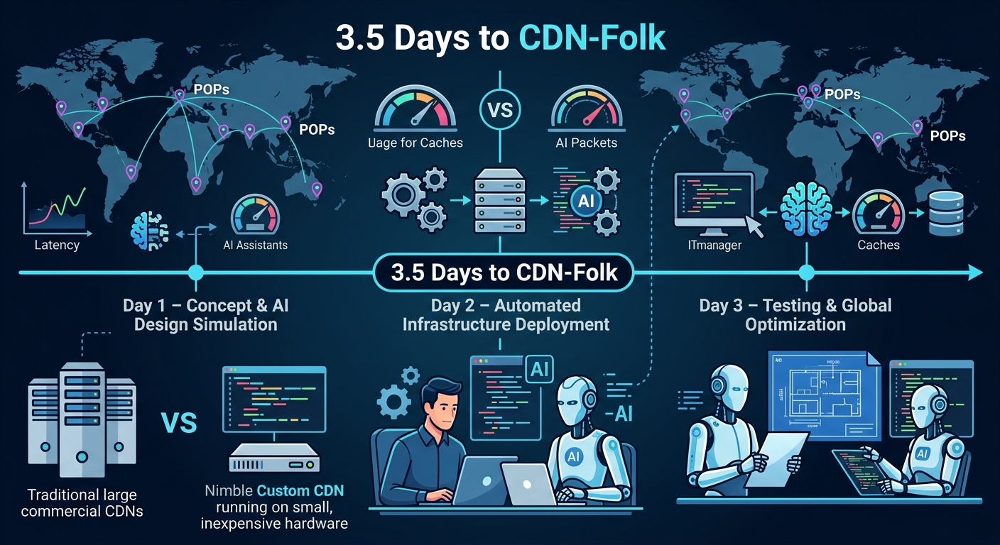
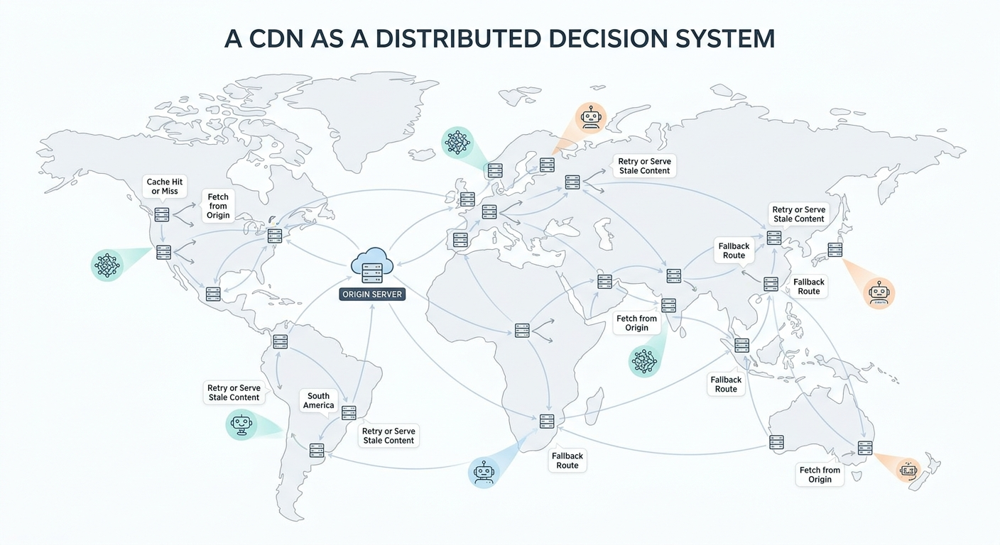
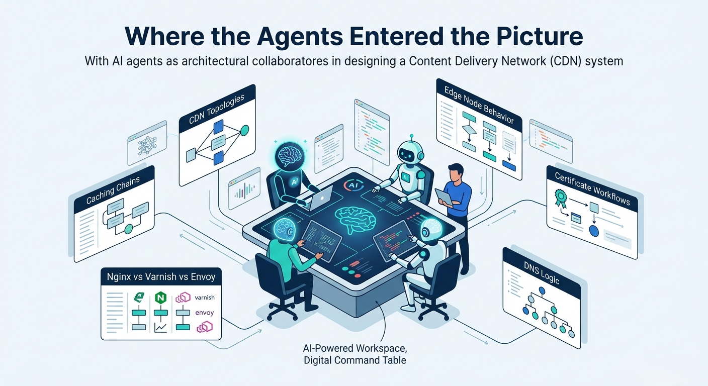
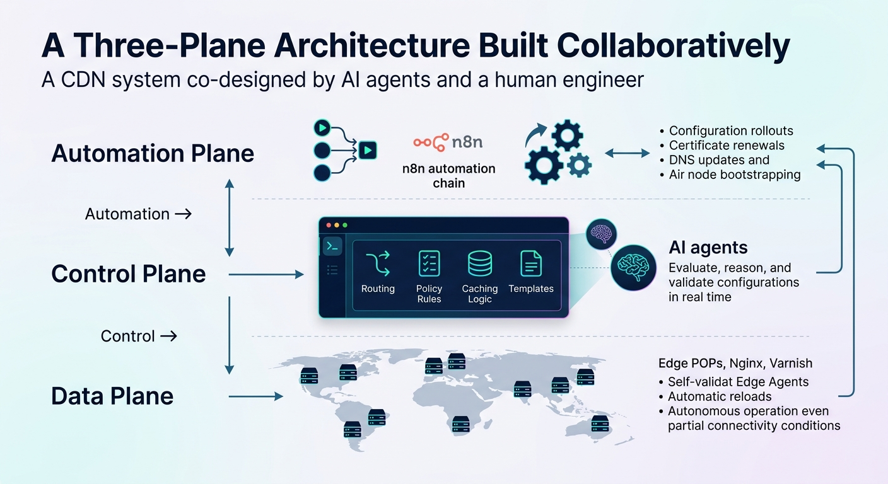
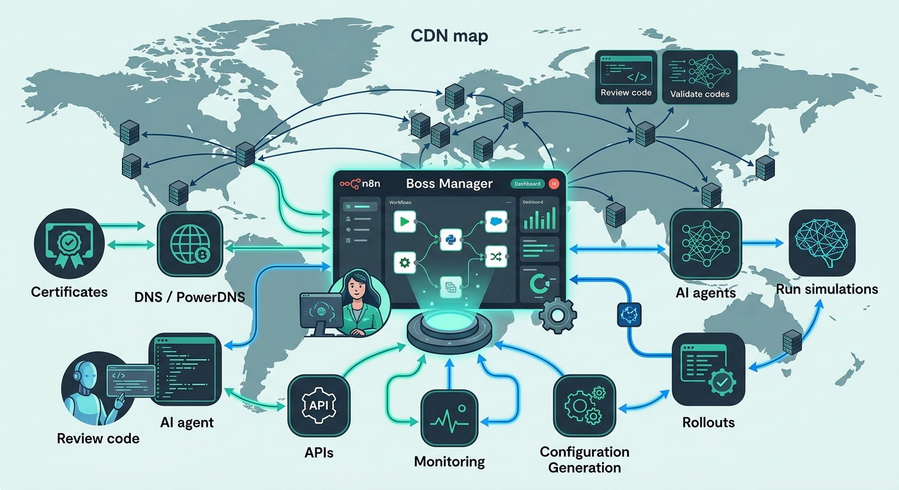

# Agents for Infrastructure Design

## Key Takeaways

- Agent value isn't speed of code generation — it's reducing intellectual bottlenecks before implementation: architecture exploration, design validation, safety modeling
- A CDN that previously took a year was built in 3.5 days by using agents as architectural collaborators, not just coders
- Agents explored dozens of design alternatives simultaneously (CDN topologies, caching chains, Nginx vs Varnish vs Envoy tradeoffs) — replacing weeks of manual scenario testing with one day of agent-driven exploration
- Three-plane architecture (automation + control + data) emerged from agent collaboration, producing a system maintainable by one person via n8n orchestration

## CDN as a Distributed Decision System

A CDN isn't just a storage layer — each node makes thousands of real-time decisions per second: cache validity, origin failover, traffic spikes, certificate validation, network inconsistencies. Agents accelerated this by simulating possible paths and evaluating competing designs.

## Agent Collaboration Workflow

Instead of writing code first, the author queried agents about architectural alternatives. Agents acted as "a very fast, unbiased systems engineer" exploring dozens of possibilities simultaneously. One day to a clean architectural direction — typically a weeks-long process.

## Three-Plane Architecture

- **Automation Plane** — continuous workflows (config rollouts, cert renewals, DNS changes, node bootstrapping) via n8n; standardizes deployments, reduces human error
- **Control Plane** — source of truth generating desired state per POP; defines routing/caching rules, creates config templates, validates with agents in real-time
- **Data Plane** — lightweight edge POPs: Nginx (TLS termination), Varnish (high-speed caching), custom Go Edge Agent; validates configs before applying, auto-reloads, rejects invalid updates, operates safely with intermittent connectivity

## n8n as Orchestration Hub

n8n centralized operational choreography that could have dispersed across scripts and CI pipelines — certificates, PowerDNS, internal APIs, deployment workflows. Agents performed continuous-improvement work within n8n: reviewing code, validating logic, running safety simulations before deployment. Made the system "maintainable by one person."

---

**Source:** https://aiagentssimplified.substack.com/p/how-ai-agents-helped-me-build-a-cdn
**Date:** 2026-05-31
**Tags:** ai-agents, infrastructure, cdn, architecture, n8n, agent-collaboration, distributed-systems
