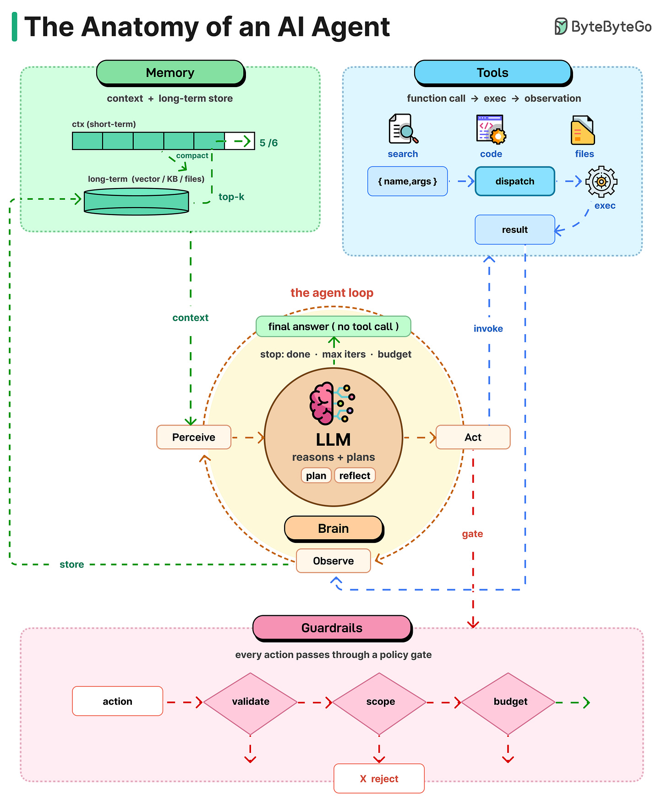
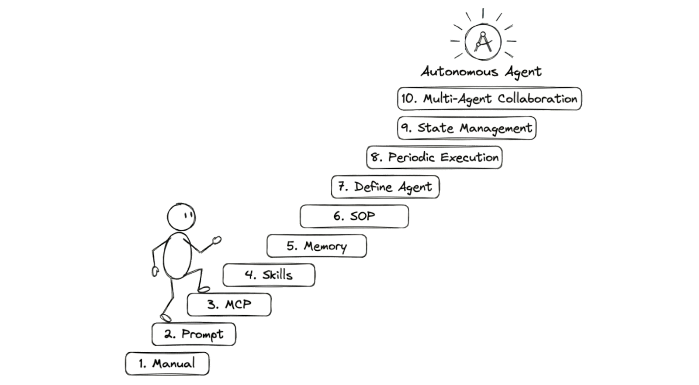
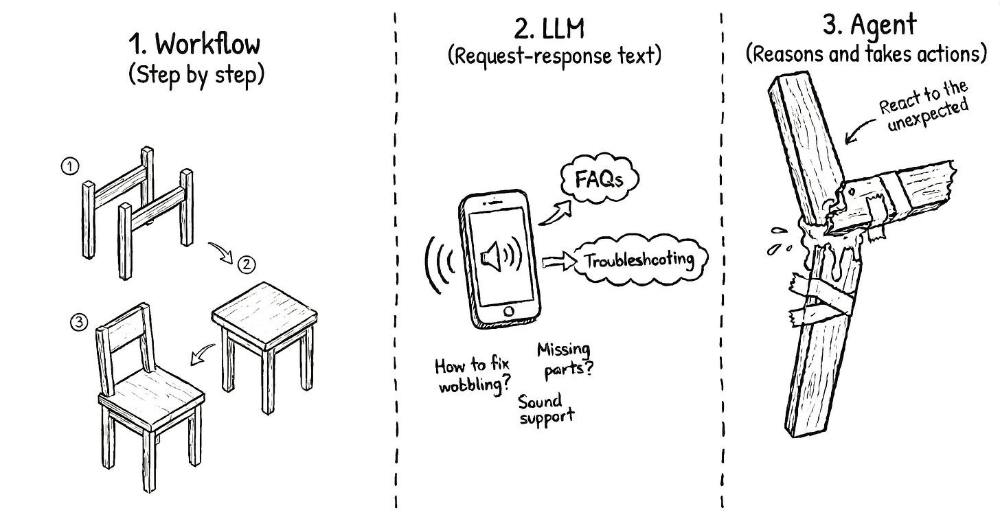
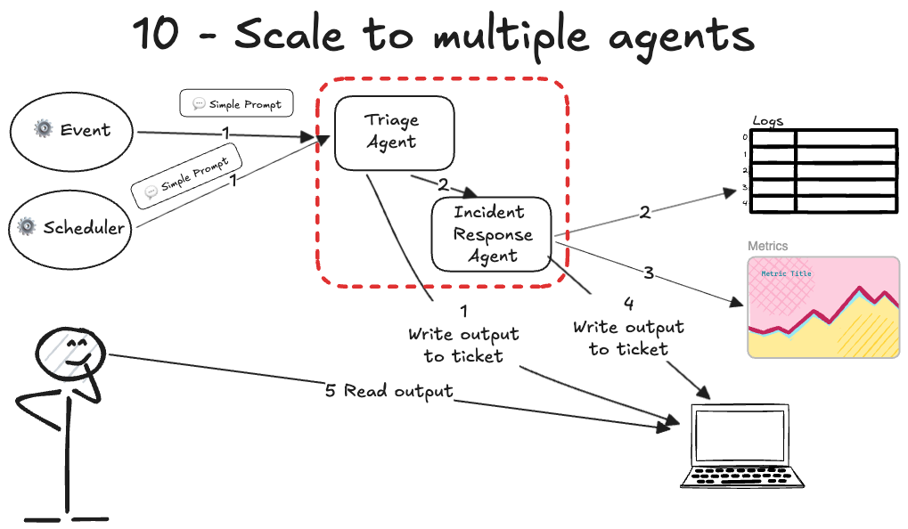
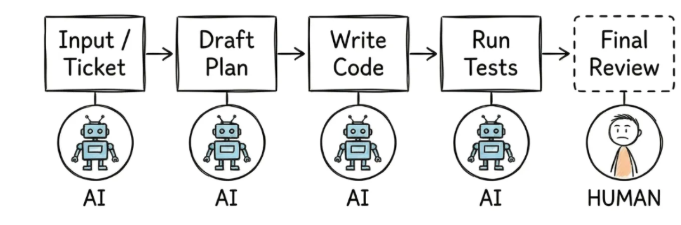

# The Anatomy of an AI Agent

## Key Takeaways

- An AI agent is a while-loop around an LLM — perceive, plan, act, observe, repeat until done or budget exhausted
- Six components define an agent: brain (LLM), planning, tools, memory, the loop, and guardrails
- Memory splits into short-term (context window) and long-term (vector stores, knowledge bases); when the window fills, agents summarize old turns and carry the summary forward
- Tools turn LLMs from text generators into autonomous actors — the model requests a tool, the runtime executes it, the result feeds back into the loop
- Guardrails scale with autonomy: sandboxing, human checks, token budgets, output validation, and scope limits prevent expensive runaway behavior

## Brain (LLM)

The LLM is the core decision-making component. It reads the situation, thinks, and decides what to do next. The fundamental shift from chatbots to agents is that models move from generating text to making autonomous choices about which actions to take.

## Planning

Agents decompose complex tasks into actionable steps using three methodologies:

- **Chain of Thought** — structured step-by-step reasoning through a problem
- **Tree of Thoughts** — explore multiple solution paths in parallel, evaluate and select the optimal one
- **Reflexion** — learn from mistakes by retrying with adjusted approaches based on prior failures

The purpose is converting vague objectives into concrete, executable action sequences.

## Tools

Tools give LLMs the ability to act on the world. The cycle: model requests a tool call (function name + arguments) -> runtime dispatches and executes -> result returns to the model as an observation.

Common tool categories:

- Web search
- Code execution (sandboxed)
- API calls
- File operations (read/write/edit)
- Browser automation

Tools are increasingly standardized via **MCP (Model Context Protocol)** — a common interface for connecting agents to external capabilities.

## Memory

Two categories operate in parallel:

- **Short-term** — the context window itself, holding the current conversation, tool results, and reasoning. Finite and reprocessed from scratch every turn.
- **Long-term** — vector stores, knowledge bases, and files that persist across sessions. Retrieved via top-k similarity search when relevant.

**Overflow strategy:** when the context window fills up, agents compact by summarizing old turns and carrying the summary forward. This trades detail for continuity.

## The Agent Loop

The core execution cycle:

1. **Perceive** — read the current state (user input, tool results, context)
2. **Plan** — reason about what to do next (chain of thought, reflect on past attempts)
3. **Act** — invoke a tool or produce a final answer
4. **Observe** — process the tool's result, update context

**Stop conditions:**

- Task complete (no more tool calls needed — final answer produced)
- Max iterations reached
- Token/cost budget exhausted

The loop terminates when any stop condition triggers. Without proper exit conditions, agents can loop indefinitely — a common production failure mode.

## Guardrails

Every action passes through a policy gate. The more autonomy you grant, the more these matter:

- **Sandboxing** — isolate agent execution to prevent unintended side effects
- **Human-in-the-loop** — require approval for high-risk actions
- **Token/cost budgets** — hard limits on spending per task
- **Output validation** — verify outputs meet format and safety constraints before returning
- **Scope limits** — restrict what tools and data the agent can access

Actions that fail validation are rejected before execution.

## 10-Step Maturity Ladder (From Runbook to Multi-Agent)

The complementary how-to framing: given a manual human runbook, here's how to convert it into an autonomous agent step-by-step. Each step pushes the human "to the right" — less involved in execution, more involved in oversight.

| Step | What | Outcome |
|---|---|---|
| 1 | Manual runbook | Baseline — human does everything |
| 2 | LLM analyzes (read-only) | LLM looks at logs/tickets, suggests; human acts |
| 3 | LLM uses MCP tools | LLM can fetch data via MCP; still suggests, doesn't act |
| 4 | Agent Skills | Reusable instructions for common tasks |
| 5 | Memory | Short-term context + Agents.md long-term facts |
| 6 | SOPs (RFC 2119 style — MUST/SHOULD/MAY) | Procedure encoded as agent-callable command |
| 7 | Packaged agent | Defined as a deployable agent definition |
| 8 | Periodic execution | Cron / tmux loop, runs unattended |
| 9 | Production integration | Webhooks, Lambda, Slack posting, ticket creation |
| 10 | Multi-agent orchestration | Sequential / routing / swarm patterns |

### Building-Block Roles Mapping

Each component maps to a human-role analog:

| Component | Role analog |
|---|---|
| LLM | Brain |
| Tools / MCP | Hands |
| Agent Skills + SOPs | Skills |
| Context window + Agents.md | Memory |
| Orchestrator | Manager |
| Cron / Scheduler | Alarm clock |
| Shared filesystem | Workspace |

### Multi-Agent Patterns (Step 10)

Three coordination styles:
- **Sequential** — agents run in order, output of one is input of next
- **Routing** — manager agent routes tasks to specialized subagents
- **Swarms** — agents collaborate via a shared filesystem / message bus

A manager agent coordinates subagents through a shared workspace (often a filesystem) — this is the deepest production pattern.

### Human-in-the-Loop Spectrum

> "Push the human to the right as much as possible."

The progression: start with the human approving every action; gradually move to the human only approving destructive/prod actions; eventually the human just reviews summaries.

But: **"no one will ask the AI for ownership."** Keep humans accountable even when agents execute — accountability scales differently than execution.

### Six Practical Implementation Lessons

1. Start with **read-only triage** before any write actions
2. Gather **many task examples** before encoding into an agent (you can't generalize from 2 cases)
3. **Iterate per step** — don't try to build all 10 steps at once
4. Monitor live via **tmux + logs** — agents are processes, treat them like processes
5. **Reliability ≠ prompt engineering** — it's testing, examples, observability, error handling
6. Push the human to the right; keep them accountable

## Related Patterns

- [Agentic design patterns](agentic-design-patterns.md) — the escalation ladder (when to use which pattern)
- [Multi-agent systems](../concepts/multi-agent-systems.md) — coordination styles in depth
- [LLM tool use and MCP](../concepts/llm-tool-use-and-mcp.md) — step 3 (MCP tools) in depth
- [Context engineering](../concepts/context-engineering.md) — step 5 (memory) in depth
- [OpenAI data agent](openai-data-agent.md) — production case with all 10 steps active
- [Stripe Minions](stripe-minions.md) — production case at step 10
- [Harness engineering](harness-engineering.md) — production case at step 10 with mechanically-enforced invariants

---

**Source:** https://blog.bytebytego.com/p/ep215-the-anatomy-of-an-ai-agent
**Source:** https://newsletter.systemdesign.one/p/how-do-ai-agents-work
**Date:** 2026-05-28 (initial), 2026-06-05 (enriched with 10-step ladder)
**Tags:** agents, llm, agent-loop, planning, tools, memory, guardrails, mcp, react, runbook, multi-agent, sop, agent-maturity-ladder
