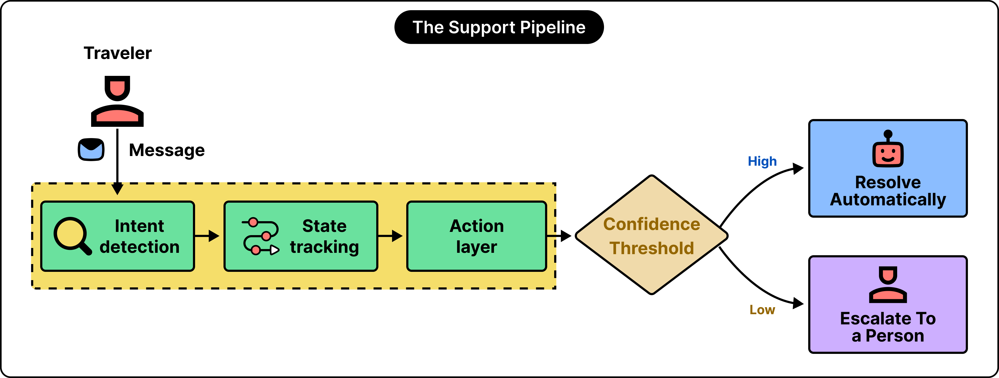
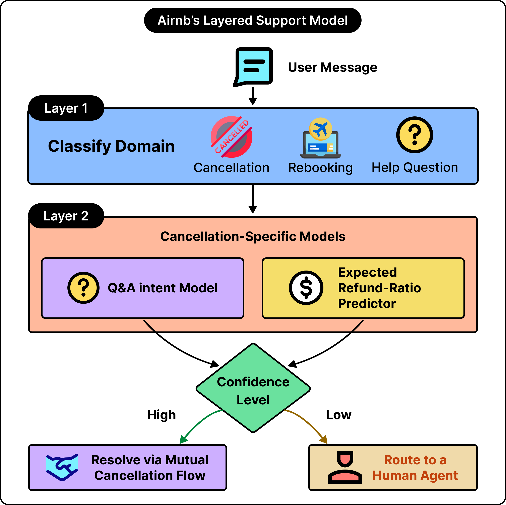
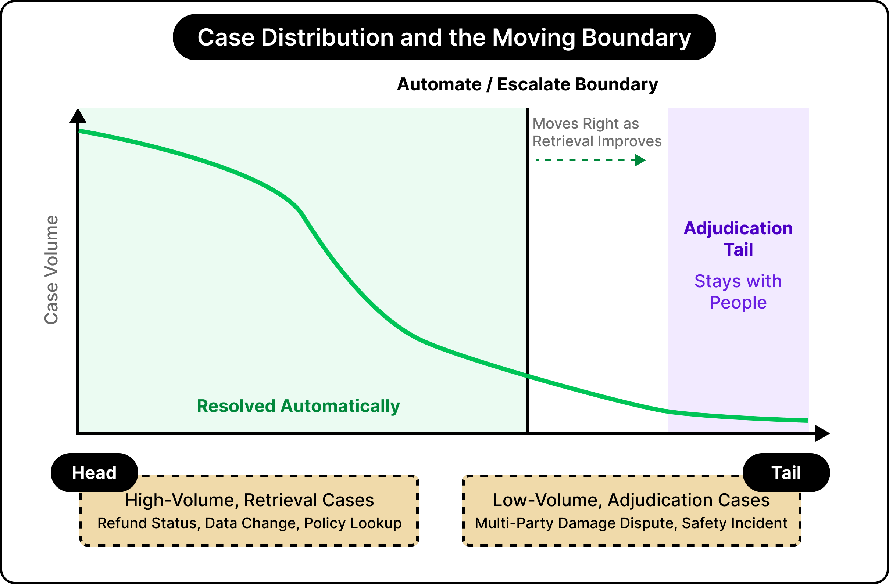
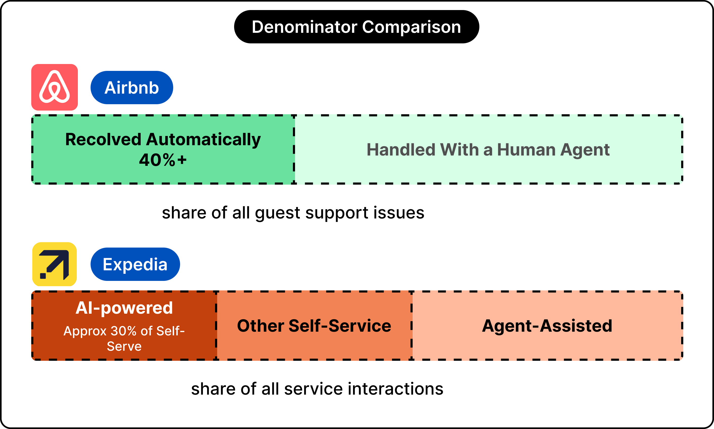
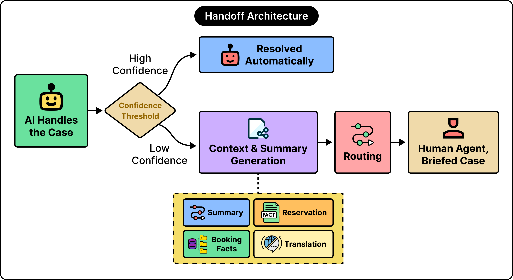
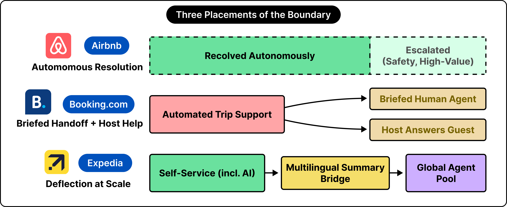
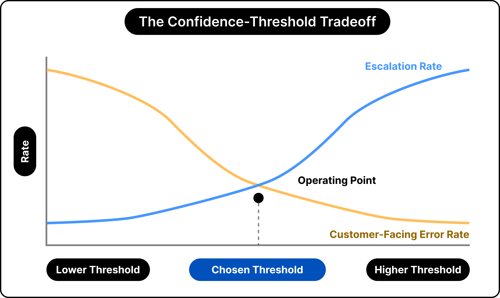

# AI Customer Support at Scale (Travel Industry)

## Key Takeaways

- **The whole system exists to serve one boundary: resolve-or-escalate.** Every component — intent detection, state tracking, action layer — feeds a single decision about whether the AI proceeds autonomously or hands the case to a human. "The pipeline serves the boundary."
- **The confidence threshold is the main tuning knob, and it's a money trade.** Raise it → more escalations, fewer errors, higher human cost. Lower it → more autonomous resolution, lower cost, but more money-related mistakes admitted.
- **The handoff decides the experience.** A case succeeds or fails on the *payload* that travels with it — summary, structured facts, live reservation state, and translation. A weak handoff ("escalated, please assist") forces the traveler to retell their story.
- **Retrieval vs. adjudication is the real automation ceiling.** Cases "answerable by retrieval" (find a fact, apply a rule) automate well; cases requiring **adjudication** (a judgment between parties whose accounts and interests diverge) resist it. This is why resolution rates climb then flatten.
- **Placement encodes a belief.** Airbnb bets adjudication is learnable (autonomous resolution), Booking bets the friction is communication (the handoff), Expedia bets scale dominates (deflection across 30+ languages). The resolution rate reflects a design decision as much as a capability level.

## The Core Question

A travel platform handling hundreds of millions of contacts a year faces the same decision millions of times daily across cancellations, refunds, and lockouts: **when should the system stop and route to a human?** The article compares how three platforms answer it:

| Platform | Primary bet | Where they invested |
|---|---|---|
| **Airbnb** | Adjudication is modelable | Autonomous resolution — settling cancellations/refunds before an agent enters |
| **Booking** | Communication is the friction | The handoff — briefing reps, equipping hosts to answer guests |
| **Expedia** | Scale is the dominant variable | Deflection — summaries carrying context across 30+ languages |

## The Pipeline

Built up from a simple FAQ-matching bot, the production system has four components, all feeding the resolve-or-escalate boundary:

1. **Intent detection** — classifies the message and identifies what the traveler wants.
2. **State tracking** — carries context from earlier messages in the thread.
3. **Action layer** — wired into live systems to issue refunds, move reservations, open mutual-cancellation flows.
4. **Confidence threshold** — each prediction carries a score; the threshold decides proceed vs. escalate. "Where much of the tuning happens."

### Airbnb's Layered Intent Model

Airbnb doesn't use one classifier — it layers them:

- **Layer 1 — Domain classification:** a top-level model sorts the message into a broad category (cancellation, rebooking, help question).
- **Layer 2 — Domain-specific models:** work out the details (e.g. who initiated the cancellation, whether both sides agreed on a refund). Includes a **Q&A intent model** and an **expected refund-ratio predictor** — a separate model trained on years of past agent decisions.
- The combined confidence level then routes: **high →** resolve via the mutual cancellation flow; **low →** route to a human agent.

## Adjudication: The Automation Ceiling

Automated cases are "answerable by retrieval" — finding a fact or applying a rule. What resists automation is **adjudication**: "a judgment between parties whose accounts and interests diverge."

Example: a damage claim where guest and host disagree while the platform holds the deposit — **three parties, three versions, one decision about money.**

During Middle East flight cancellations, automation absorbed routine rebookings and status checks, freeing human agents for the tangled, time-sensitive cases. This is the mechanism behind resolution rates that **climb and then flatten** — the easy, retrieval-shaped volume automates away, leaving the adjudication-shaped residue.

## The Handoff and the Payload

A weak handoff makes agents restart and travelers retell their story. The key is the **payload** — the context that accompanies an escalated case, with four elements:

- A **conversation summary**
- **Structured facts** (booking reference, cancellation reason)
- **Live reservation state**
- A **translation**, where languages differ

Expedia generates summaries across **30+ languages**; these "shortened the time required to bring new agents up to speed by a substantial margin." Booking routes complex questions to pre-briefed representatives and drafts partner replies from property/reservation data.

## Three Divergent Beliefs

- **Airbnb** — adjudication itself can be modeled; bets a large share of disputes follow learnable patterns. **Cost:** heavy, continuous investment in models and labeled data.
- **Booking** — treats communication as the primary friction: "people struggling to reach each other."
- **Expedia** — scale is dominant; with 200M+ interactions/year, modest per-interaction gains compound.

## Tradeoffs and Structural Limits

The confidence threshold makes the trade concrete:

- **Raise it** → more escalations; guards against errors but increases human-agent load and cost.
- **Lower it** → resolves more autonomously; trims cost but admits more money-related mistakes.

A notable structural limit: **the chat interface suits travel poorly** because "a chat thread is built for one person, while a travel dispute often involves several." Regulated cases, high-value claims, and safety-related issues stay with humans **by design**.

## Reported Metrics

> These figures "rest on different bases," so ranking them side-by-side would mislead.

- **Airbnb:** >40% of guest issues resolved without an agent
- **Expedia:** >30% of self-service interactions powered by AI; self-service is >half of all contacts
- **Expedia:** 200M+ interactions per year

## Three Points That Hold Across Platforms

1. **The pipeline serves the boundary** — all components feed the resolve-or-escalate decision.
2. **The handoff decides the experience** — a case succeeds or fails on the context that travels with it.
3. **The placement encodes a belief** — each design reflects a view of where travel support is hardest.

---

**Source:** https://blog.bytebytego.com/p/ai-customer-support-at-scale-the
**Date:** 2026-07-15
**Tags:** ai-agents, customer-support, production-ai, intent-detection, human-in-the-loop, escalation, airbnb, expedia, booking, case-study
