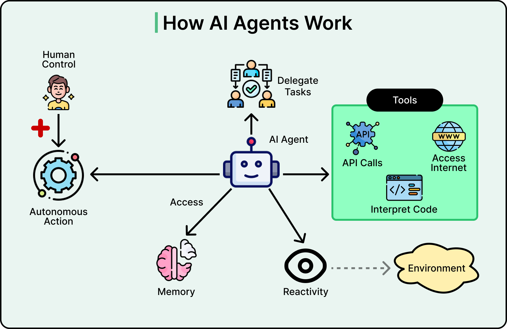
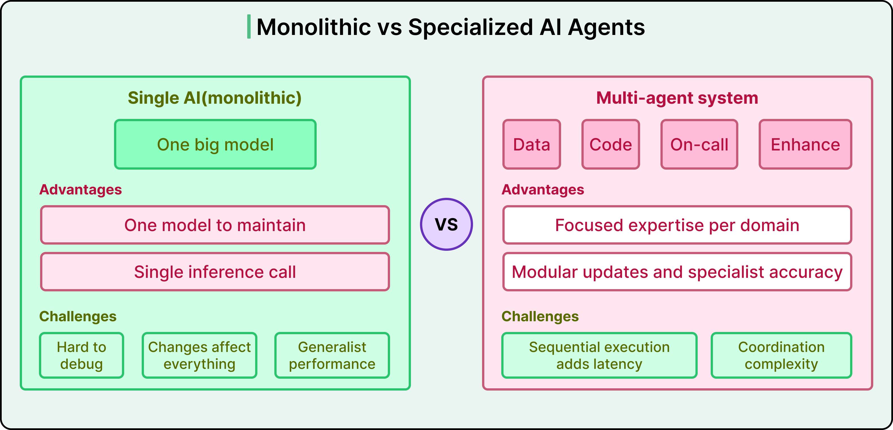
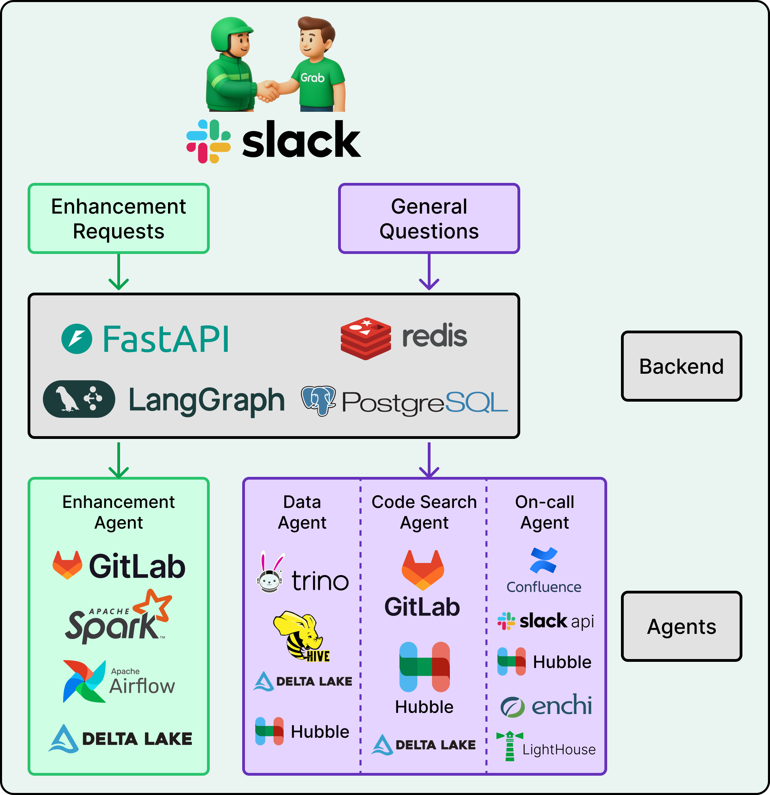
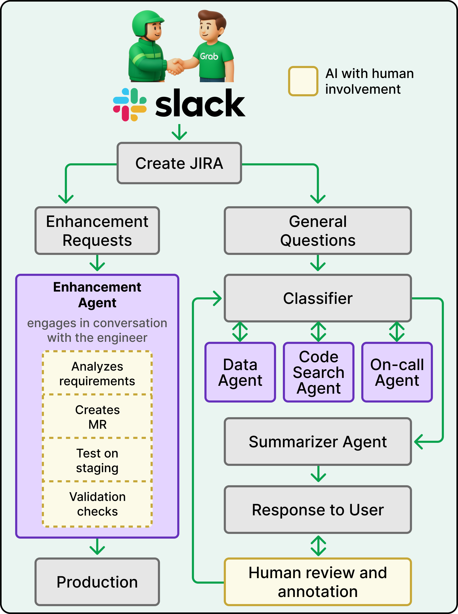
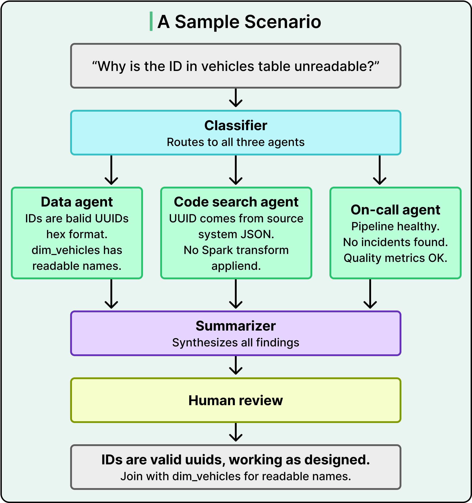
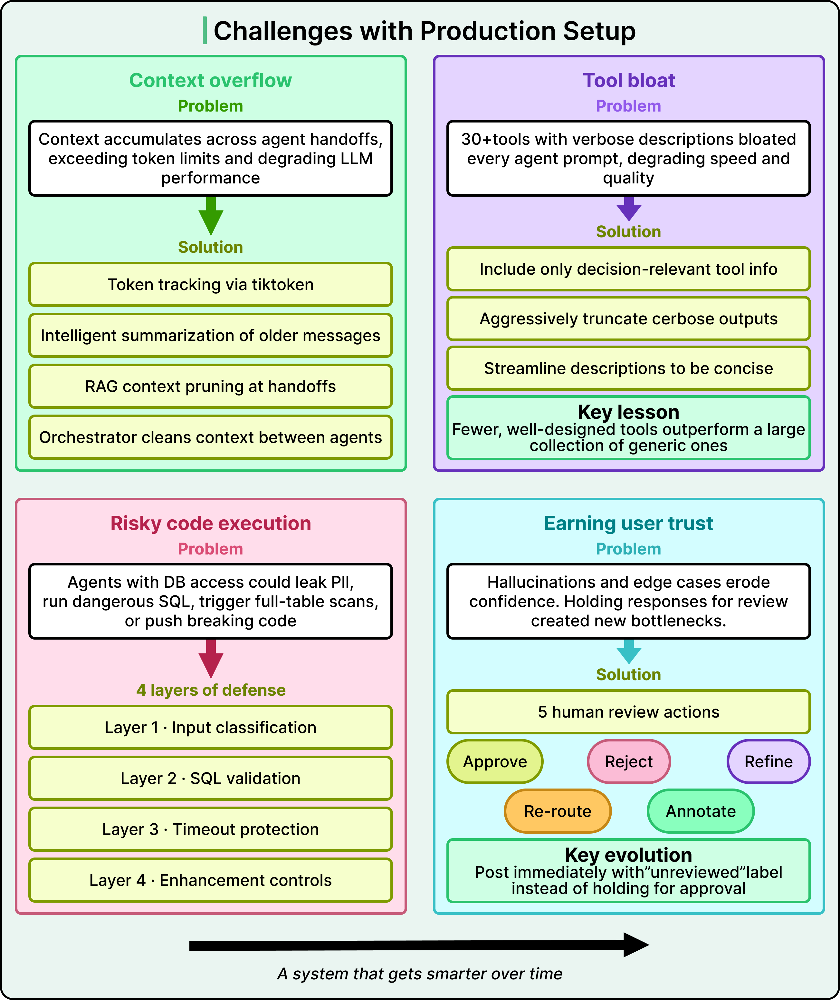

# Grab's Multi-Agent System for Engineering Productivity

## Key Takeaways

- Grab built a multi-agent AI system to free elite data engineers from spending 2 days/week answering repetitive questions about their 15,000-table Analytics Data Warehouse (ADW)
- The core design principle is "separate the brain from the hands" -- LLMs handle reasoning while specialized agents manage concrete tasks like querying, code search, and monitoring
- Two distinct pathways handle read-only investigation (multi-agent collaboration) vs. write operations (single agent with mandatory human review at every stage)
- Production hardening required solving context overflow, tool bloat, code execution safety, and user trust -- fewer well-designed tools outperformed large generic collections
- Human annotations feed an active learning loop that continuously improves routing, prompts, and test coverage

## How AI Agents Work

AI agents combine LLM reasoning with tool access (APIs, code interpretation, internet), memory, reactivity to environment changes, autonomous action, and human control. They can delegate tasks to other agents, forming multi-agent systems.

## The Problem

Grab's Analytics Data Warehouse (ADW) manages over 15,000 tables serving ~1,000 monthly users. Senior data engineers spent two full days per week on reactive support -- answering questions about table schemas, data quality, pipeline health, and transformation logic. This created a "friction tax on engineering" that prevented them from building.

## Architecture: Monolithic vs. Specialized Agents

Grab chose specialized agents over a monolithic approach. Each agent has a focused scope with its own tools, making debugging targeted and improvements isolated.

## System Architecture

**Technology stack:**

- **FastAPI** for request handling
- **LangGraph** for stateful multi-agent workflows
- **Redis** for caching and sessions
- **PostgreSQL** for conversation history
- **Slack** as the user interface

**Internal platforms accessed by agents:**

- **Hubble** -- metadata catalog
- **Genchi** -- data quality monitoring
- **Lighthouse** -- pipeline tracking
- **Trino** -- query engine
- **GitLab** -- code repositories

## Two-Pathway Design

### Investigation Pathway (Read-Only)

Five specialized agents collaborate on read-only queries:

1. **Classifier** -- routes queries, extracts entities, detects guardrail violations
2. **Data Agent** -- executes queries with safeguards, validates schemas
3. **Code Search Agent** -- traces transformations and data lineage through codebases
4. **On-call Agent** -- monitors production health via Slack and observability platforms
5. **Summarizer Agent** -- synthesizes findings from other agents into coherent responses

### Enhancement Pathway (Write Operations)

A single Enhancement Agent handles production changes (code modifications, pipeline updates) with mandatory human review at every stage -- analyzing requirements, creating merge requests, testing on staging, and running validation checks before production deployment.

## Investigation Workflow Example

When a user asks about a vehicle ID column, the Classifier routes the query, the Data Agent checks schemas and runs queries, the Code Search Agent traces transformations, and the Summarizer synthesizes everything into a clear response.

## Production Challenges and Solutions

### Context Overflow

Context accumulates across agent handoffs, exceeding token limits. Solution: real-time token counting via tiktoken, intelligent summarization of older messages, RAG context pruning at handoffs, and orchestrator cleaning context between agents.

### Tool Bloat

30+ verbose tool descriptions bloated every agent prompt. Solution: include only decision-relevant tool info, truncate verbose outputs, streamline descriptions. Key lesson: **fewer well-designed tools outperform a large collection of generic ones**.

### Risky Code Execution

Agents with DB access could leak PII, run dangerous SQL, or push breaking code. Solution: four defensive layers -- input classification, SQL validation, execution timeouts, and enhancement controls (human review gates).

### Earning User Trust

Hallucinations and edge cases eroded confidence, but holding responses for review created bottlenecks. Solution: deploy responses immediately with "unreviewed" labels, allowing engineers to approve, reject, refine, re-route, or annotate. This made the system feel responsive while keeping humans in the loop.

## Continuous Improvement Engine

Human annotations drive active learning:

- Random annotations converted into offline test cases
- Pattern analysis identifies systemic routing and schema issues
- Quality metrics track and detect regressions
- Targeted prompt refinements based on failure data

## Outcomes

- Autonomously handles the majority of standard user inquiries
- Reduced resolution time by an order of magnitude
- Reclaimed several FTEs of engineering capacity previously consumed by reactive support

---

**Source:** https://blog.bytebytego.com/p/how-grab-is-using-ai-agents-to-boost
**Date:** 2026-05-28
**Tags:** ai-agents, multi-agent-systems, langgraph, grab, engineering-productivity, data-engineering
