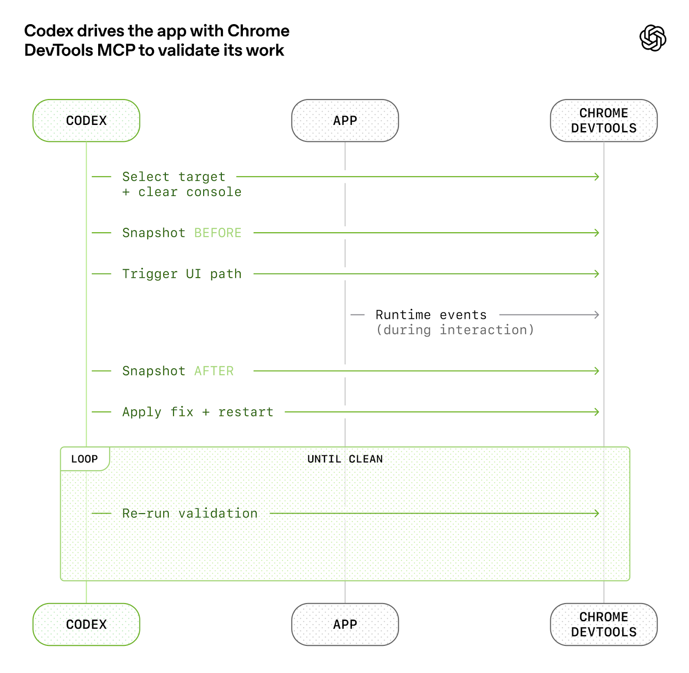
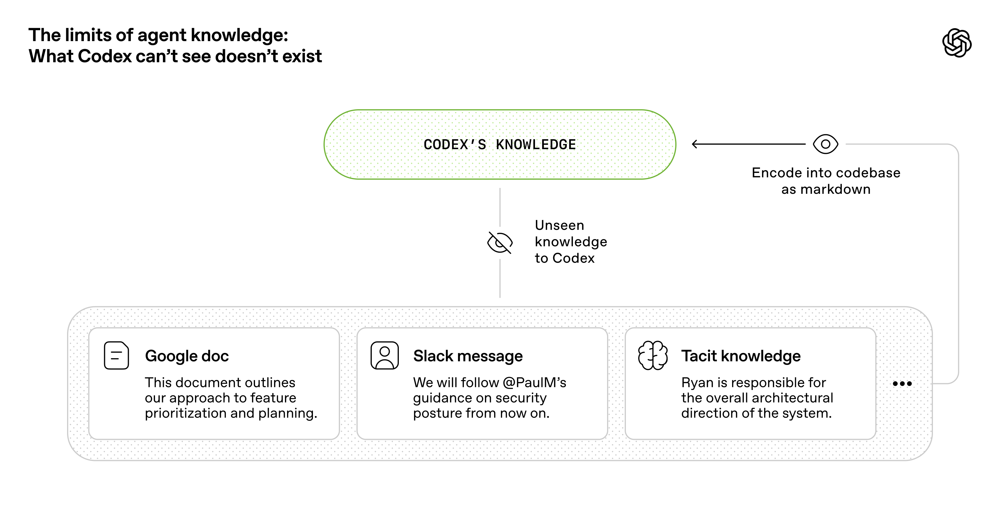
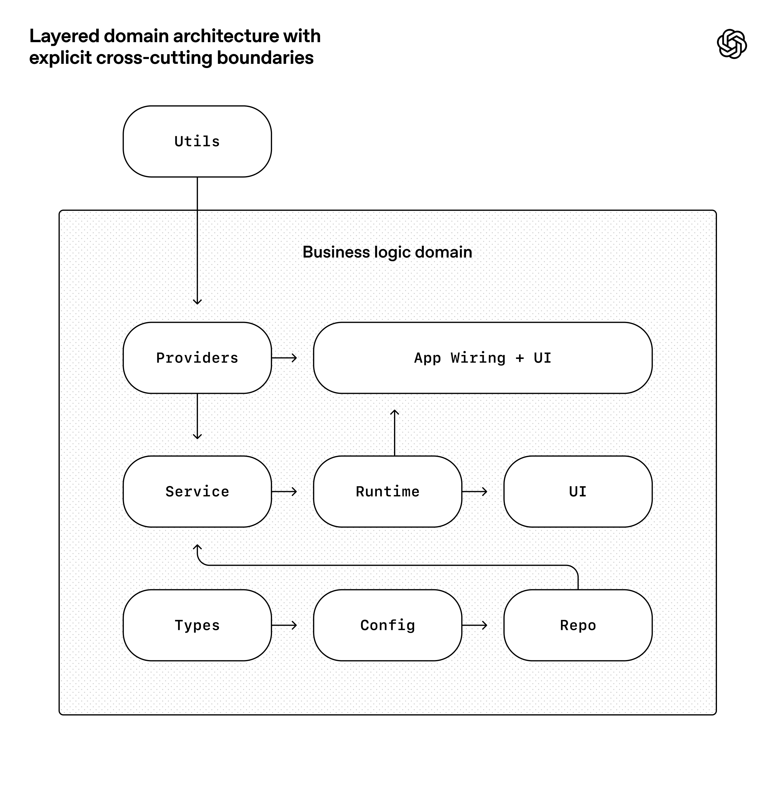

# Harness Engineering

OpenAI's playbook for running coding agents at scale: design the *harness* (environment + observability + invariants), not just the prompts. Output: ~1M lines / ~1,500 PRs across 5 months, fully agent-written, by a 3-7 person team.

## Key Takeaways

- A 3-7 person team shipped ~1M LOC across ~1,500 PRs (avg **3.5 PRs/engineer/day**) in 5 months — entire codebase written by Codex agents, zero human-written code
- Engineering work shifted from writing code to **building the harness**: designing environments, specifying intent, building feedback loops. "Humans steer. Agents execute."
- Context strategy: `AGENTS.md` is a **~100-line table of contents** pointing into a structured `docs/` directory — not a giant instruction file. "Give Codex a map, not a 1,000-page instruction manual"
- **Application legibility for agents was directly engineered**: Chrome DevTools Protocol wired into the agent runtime, per-worktree bootable apps, ephemeral observability stack (Vector + Victoria Logs/Metrics/Traces) so Codex can reproduce bugs and reason about performance targets
- Coherence preserved via **mechanically-enforced architecture**: rigid per-domain layering (Types → Config → Repo → Service → Runtime → UI), custom linters whose error messages embed remediation instructions to inject into agent context

## What Was Built

- Internal product, full codebase
- ~1M lines of code in ~1,500 PRs across 5 months
- Avg 3.5 PRs/engineer/day; throughput grew as team grew from 3 to 7
- **Zero human-written code** — every line generated by Codex agents
- First commit late August 2025; initial scaffold (repo structure, CI, package manager, framework, AGENTS.md) bootstrapped by Codex CLI on GPT-5 from small templates

The team's philosophy: **"no manually-written code."** Humans steer; agents execute.

## Redefining the Engineer's Role

Early progress was slow — not because Codex was incapable, but because the environment was underspecified. The diagnostic question became:

> "What capability is missing, and how do we make it both legible and enforceable for the agent?"

Engineers work **depth-first** to break goals into building blocks. When something fails:
1. Identify the missing capability
2. Make it legible (the agent can perceive it)
3. Make it enforceable (the agent can't avoid it)

### The Ralph Wiggum Loop

PR completion runs an autonomous review cycle:
1. Codex reviews its own changes locally
2. Codex requests additional specific agent reviewers (locally + cloud)
3. Codex responds to feedback, iterates
4. Cycle continues until all agent reviewers are satisfied
5. Human review optional; most review is agent-to-agent

The result: humans review PRs that have already been through multiple specialized agent passes.

## Application Legibility



When the team scaled, **human QA became the bottleneck.** Solution: make the application itself legible to Codex.

### Per-Worktree Bootable App

Every git worktree boots its own app instance. Codex can run one instance per task in isolation.

### Chrome DevTools Protocol in Agent Runtime

Skills for DOM snapshots, screenshots, navigation. Codex can:
- Open the app
- Click through user flows
- Inspect the DOM
- Capture screenshots
- Iterate based on what it sees

### Ephemeral Local Observability Stack


Per-worktree observability:
- **Vector** ingests logs/metrics/traces
- **Victoria Logs / Metrics / Traces** as the storage backend
- **LogQL / PromQL / TraceQL** queries Codex can run

This means prompts like:
- "Ensure service startup completes in under 800ms"
- "No span in these four critical user journeys exceeds two seconds"

...become **tractable** because Codex can actually measure what's happening, not just guess.

Single Codex runs work on a task for **upwards of six hours**, often overnight, with this observability feeding back into the agent loop.

## Repository as System of Record



> "From the agent's point of view, anything it can't access in-context while running effectively doesn't exist."

Slack threads, Google Docs, tribal knowledge — **invisible to the agent**. So push everything into the repo as versioned markdown / schemas / executable plans.

### Why a Single Big AGENTS.md Fails

The naive approach: cram everything into one giant `AGENTS.md`. Four failure modes:

1. **Context is scarce** — giant files crowd out task/code/docs
2. **"Too much guidance becomes non-guidance"** — the agent can't extract signal from the bulk
3. **It rots instantly** — a graveyard of stale rules
4. **Hard to verify mechanically** — no enforcement on whether rules are followed

### Map, Not Manual

`AGENTS.md` shrinks to a **~100-line table of contents** pointing into a structured docs directory:

```
AGENTS.md            (~100 lines — table of contents)
ARCHITECTURE.md
DESIGN.md
FRONTEND.md
PLANS.md
PRODUCT_SENSE.md
QUALITY_SCORE.md
RELIABILITY.md
SECURITY.md
docs/
  design-docs/
  exec-plans/
    active/
    completed/
  generated/
  product-specs/
  references/
```

**Progressive disclosure**: Codex follows the index to the specific doc it needs, instead of carrying everything at once.

### Plans as First-Class Artifacts

- Small tasks: lightweight inline plans
- Complex tasks: dedicated **execution plans** with progress logs and decision logs in `docs/exec-plans/active/`
- On completion: move to `docs/exec-plans/completed/`

### Doc-Gardening Agent

A recurring agent opens fix-up PRs for stale docs. Doc rot becomes the agent's problem, not the humans'.

## Agent Legibility Drives Tech Choices

The codebase is optimized first for **Codex's legibility**, not human ergonomics.

Consequences:
- **Favor "boring" technologies** — composable, API-stable, well-represented in training data
- **Selective re-implementation** — rather than pull in a generic concurrency-limiting package, the team had Codex implement an in-house map-with-concurrency helper that's "tightly integrated with our OpenTelemetry instrumentation, has 100% test coverage, and behaves exactly the way our runtime expects"

The trade-off accepted: agent legibility > human stylistic preference. The bar is correctness, maintainability, and future-agent legibility.

## Mechanically-Enforced Architecture



> "Enforce invariants, not micromanage implementations."

### Layered Domain Architecture

Per business domain:

```
UI
   ↑
Runtime
   ↑
Service
   ↑
Repo / Providers ← cross-cutting concerns enter only through Providers
   ↑
Config
   ↑
Types
```

Cross-cutting concerns (auth, connectors, telemetry, feature flags) enter **only through a single Providers interface**. Everything else stays in its layer.

### Custom Linters with Embedded Remediation

The team uses custom (Codex-generated) linters and structural tests to enforce:
- Layering boundaries
- Statically-enforced structured logging
- Naming conventions
- File size limits
- Platform reliability requirements

The killer detail: **lint error messages embed remediation instructions to inject into agent context**. When Codex hits a lint error, the error itself tells Codex what to do about it.

Example (paraphrased):
```
ERROR: Cross-layer import from Service to Runtime is not allowed.
REMEDY: Move the dependency to the Providers interface. See docs/design-docs/layering.md.
```

The agent reads the error → reads the referenced doc → applies the fix. Mechanical enforcement that **teaches** instead of just blocking.

### The Generalizable Principle

> "In a human-first workflow, these rules might feel pedantic or constraining. With agents, they become multipliers: once encoded, they apply everywhere at once."

Constraints that humans find pedantic become **leverage** for agents — because the agent applies them perfectly everywhere, every time.

## Where the Investment Goes

The shift from human-first to agent-first engineering changes what's worth building:

| Traditional priority | Agent-first priority |
|---|---|
| Documentation for humans | Documentation parsed by agents |
| Test suite for confidence | Test suite as agent feedback loop |
| Linting for style | Linting as remediation-instruction injection |
| Architecture review meetings | Mechanically-enforced architecture |
| QA team | Per-worktree bootable app + observability stack |
| Tribal knowledge in Slack | Versioned markdown in repo |

The investments aren't optional — they're the *prerequisite* for letting agents operate at velocity without architectural drift.

## Lessons in Five Lines

1. **The harness is the product.** Spend on env, observability, invariants — model quality is downstream
2. **Map, not manual.** `AGENTS.md` is an index; depth lives in structured `docs/`
3. **Legibility beats taste.** Optimize for what the agent can perceive, not human ergonomics
4. **Encode invariants mechanically.** Lints with embedded remediation > written conventions
5. **Repo = system of record.** Off-repo knowledge is invisible to the agent

## Related

- [OpenAI Codex](openai-codex.md) — the agent that the harness runs; covers the agent loop, App Server, AGENTS.md basics
- [Stripe Minions](stripe-minions.md) — same harness-first philosophy in a different deployment shape (unattended one-shot vs interactive)
- [AI-native engineering](ai-native-engineering.md) — broader pattern of orchestrating agents; complements this with the 40%-context/20%-generation/40%-review breakdown
- [Agents across SDLC](agents-across-sdlc.md) — where coding agents win/lose across the dev lifecycle
- [Claude Code: 12 features](../claude/claude-code-features.md) — parallel feature surface in the Anthropic ecosystem
- [Context engineering](../concepts/context-engineering.md) — the discipline behind progressive context disclosure
- [Distributed system failure modes](../../system-design/distributed-system-failure-modes.md) — observability matters for agents for the same reasons it matters for humans

---

**Source:** https://openai.com/index/harness-engineering/
**Date:** 2026-06-05
**Tags:** openai, codex, harness-engineering, agents-md, agent-infrastructure, observability, mechanical-invariants, agent-legibility, agentic-coding, ralph-wiggum-loop
