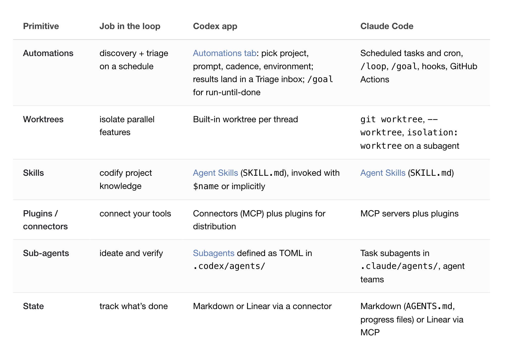

# Loop Engineering

The leverage point in AI-assisted coding has moved from **prompting agents** to **designing the loops that prompt them**. You stop being the prompter and start being the systems engineer of an unattended recursive goal-seeker.

> "You shouldn't be prompting coding agents anymore. You should be designing loops that prompt your agents." — Peter Steinberger
>
> "I don't prompt Claude anymore. I have loops running that prompt Claude." — Boris Cherny

## Key Takeaways

- A loop is a **recursive goal**: you define the purpose and the agent iterates until done. The engineer's job is architecting that loop, not crafting individual prompts
- A complete loop is built from **six primitives**: automations (heartbeat), worktrees (parallel isolation), skills (reusable knowledge), plugins/MCP connectors (real-world integration), sub-agents (maker/checker separation), and external memory (the on-disk spine)
- **Codex and Claude Code now share near-identical primitives** — different surface, same conceptual model. Picking one is a workflow preference, not a capability ceiling
- **Loops amplify whatever you bring.** Deep understanding compounds; avoidance accelerates degradation. "A loop running unattended is also a loop making mistakes unattended"
- Three risks loops don't eliminate: **verification burden** (a human still has to grade output), **comprehension debt** (you understand the code less as it accelerates away from you), **cognitive surrender** (the temptation to stop having opinions)

## The Six Primitives

| Primitive | Job in the loop | Codex | Claude Code |
|---|---|---|---|
| **Automations** | Discovery + triage on a schedule | Automations tab — pick project, prompt, cadence, environment; results land in Triage inbox; `/goal` for run-until-done | Scheduled tasks and cron, `/loop`, `/goal`, hooks, GitHub Actions |
| **Worktrees** | Isolate parallel features | Built-in worktree per thread | `git worktree`, `--worktree`, `isolation: worktree` on a subagent |
| **Skills** | Codify project knowledge | Agent Skills (`SKILL.md`), invoked with `$name` or implicitly | Agent Skills (`SKILL.md`) |
| **Plugins / connectors** | Connect your tools | Connectors (MCP) plus plugins for distribution | MCP servers plus plugins |
| **Sub-agents** | Ideate and verify (maker/checker) | Subagents defined as TOML in `.codex/agents/` | Task subagents in `.claude/agents/`, agent teams |
| **State** | Track what's done across runs | Markdown or Linear via a connector | Markdown (`AGENTS.md`, progress files) or Linear via MCP |

## The Maker / Checker Separation

The single most important architectural move: **never let the same agent grade its own homework**. A typical loop runs:

- **Explorer** — surveys the problem, reads the codebase, writes a plan to disk
- **Implementer** — executes the plan
- **Verifier** — reads the result against the original spec + skills + tests, flags drift

These can run at different model tiers (cheap explorer, expensive implementer, mid-tier verifier). It burns extra tokens, but it's the difference between a loop you trust unattended and one you babysit.

## A Concrete Morning Workflow

A typical loop a senior engineer might set up to run before they open the laptop:

1. **Daily automation fires** at 7am
2. **Triage skill** reads CI failures, Linear issues, recent commits
3. Writes findings to a markdown/Linear scratchpad
4. **Spawns a worktree per actionable item**
5. **Implementer sub-agent** drafts the fix
6. **Verifier sub-agent** reviews against skills + tests
7. **Connectors** open a PR, update the ticket, ping a Slack channel
8. **Unresolved items** land in the human triage inbox for your morning review
9. **State file** persists everything so any of the loops can resume after a crash

The model forgets everything between runs — the **memory has to be on disk**.

## Advisory → Autonomous: What Connectors Unlock

The Plugins/MCP layer is what converts an agent from advisory (*"here's the fix"*) to autonomous (*opens the PR, links the ticket, pings the channel*). Without connectors you have a chatbot. With them you have a teammate.

## What Loops Don't Eliminate

- **Verification burden stays human.** Generation accelerates 10×; review doesn't. The reviewer becomes the bottleneck (see [code-review-capacity-budgeting.md](../../leadership/code-review-capacity-budgeting.md))
- **Comprehension debt widens.** You shipped it; you don't fully understand it. Compounds across months
- **Cognitive surrender.** The temptation to stop having opinions and let the loop decide. Two engineers can build the same loop and get opposite results — one accelerates work they understand deeply, the other avoids understanding the work at all

## See Also

- [coding-agents-overview.md](coding-agents-overview.md) — the broader Claude Code / Cursor / Codex / Stripe Minions landscape
- [ai-native-engineering.md](ai-native-engineering.md) — 40/20/40 (context/generation/review) time allocation maps directly to maker/checker
- [harness-engineering.md](harness-engineering.md) — how OpenAI built the agent harness for Codex (AGENTS.md, mechanical invariants)
- [agents-across-sdlc.md](agents-across-sdlc.md) — where agents win and lose across the development lifecycle

---

**Source:** https://addyo.substack.com/p/loop-engineering
**Date:** 2026-06-12
**Tags:** ai-engineering, coding-agents, claude-code, codex, agent-orchestration, mcp, automation, sub-agents, maker-checker, loop-engineering, worktrees, agent-skills
