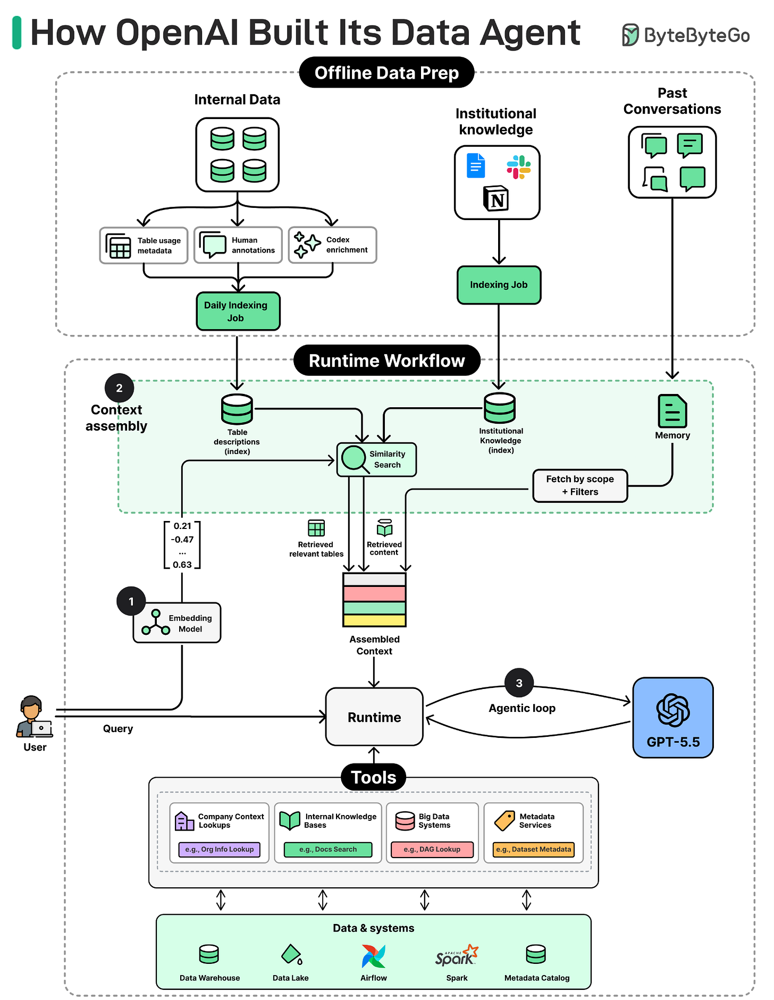
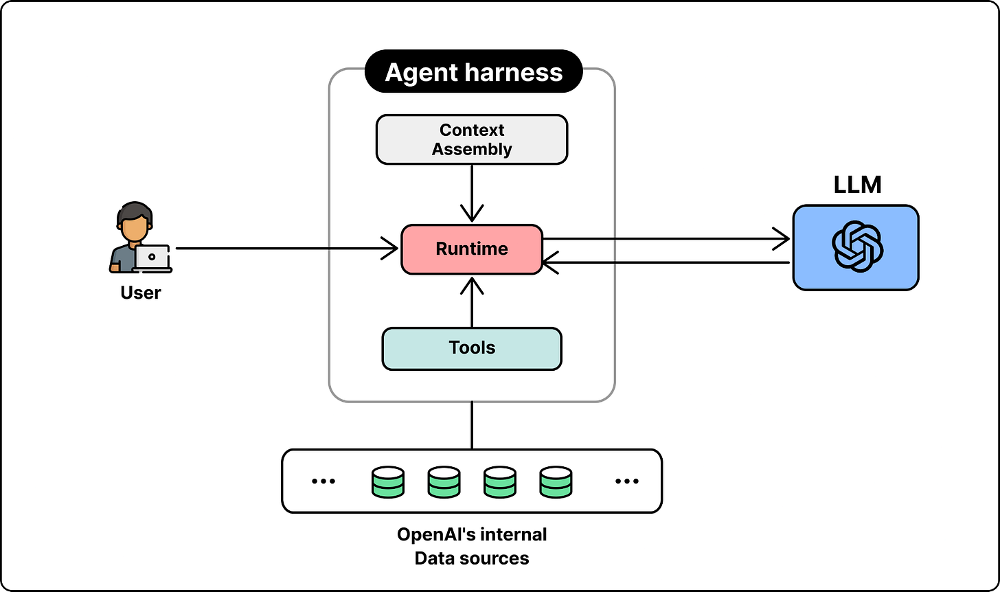
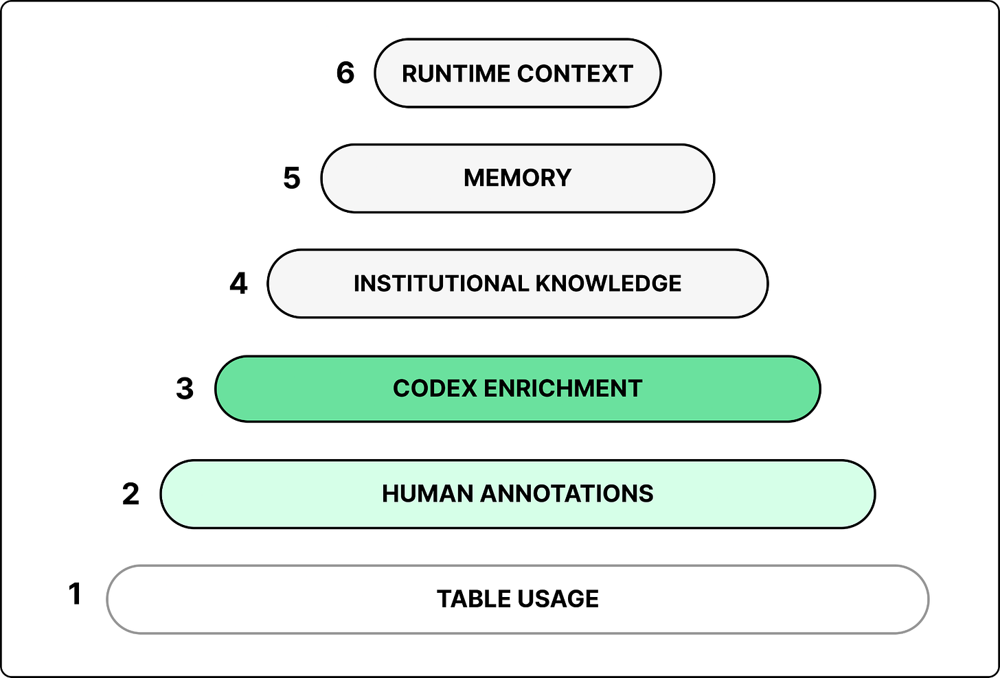
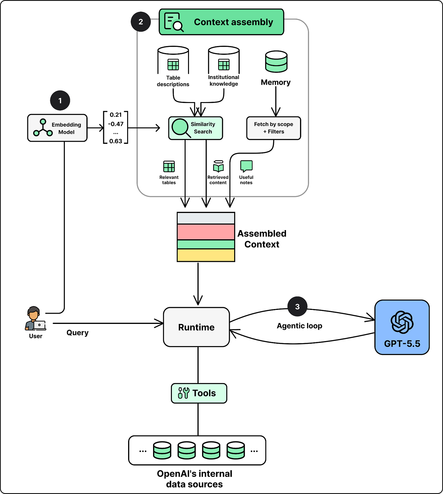
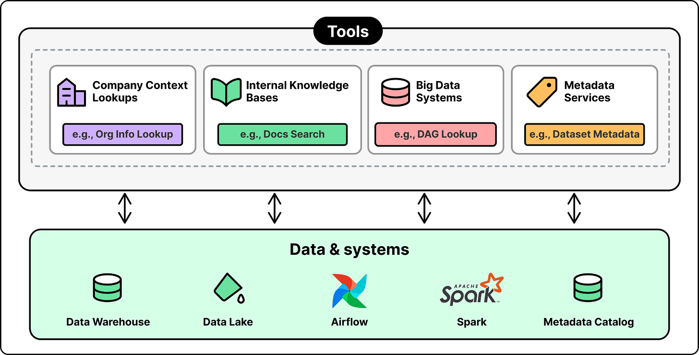
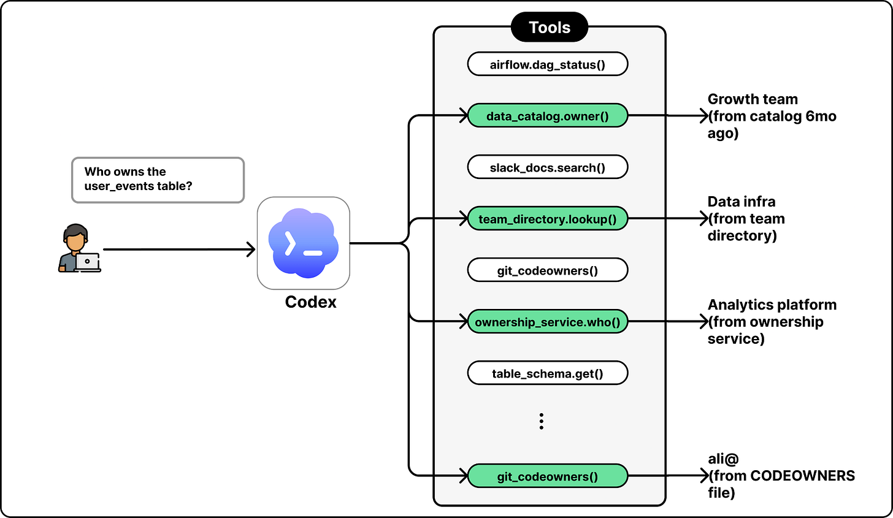

# OpenAI's Internal Data Agent

## Key Takeaways

- OpenAI's data platform serves ~4,000 internal users across 1.5 exabytes and 90,000 datasets — the agent's real job is finding the right table and understanding semantic usage, not writing SQL
- Architecture is deliberately simple: one model (GPT-5.5, no routing, no fine-tuning), a runtime orchestrator, a context-assembly layer, and ~13 carefully curated tools
- The hard work lives in **context assembly** — six layers (table usage, human annotations, Codex enrichment, institutional knowledge, memory, runtime context) ranked by trustworthiness
- "Fewer non-overlapping tools" is the central reliability lesson: dropping from 40+ to 13 tools fixed most failures — model confusion from near-duplicate tool functions was the primary failure mode
- The data foundation matters more than the agent architecture — unified infra, monorepo, naming conventions, and strong annotations are what make retrieval actually work
- Codex-style agentic work compounds: migrated 600 PB / 90,000 tables across clouds in ~2 months; supports 12+ internal OSS forks unattended for 3-4 months; engineers dispatch ~100 fixes/day

Related case study: [Grab's internal data agent](grab-ai-agents-engineering-productivity.md) — strikingly similar lessons (fewer tools, annotations matter, separate read from write).

## The Problem They're Solving

OpenAI's data platform (as of May 2026):
- **1.5 exabytes** across **90,000 datasets**
- **~4,000 internal users** with widely varying SQL ability
- Primary challenge isn't query syntax — it's **finding the right table** and **understanding its semantic usage**

The agent is built to answer "which table do I use, and what does this column actually mean here?" — not "write me SQL."

## High-Level Architecture

Four components, deliberately minimal:

| # | Component | What it does |
|---|---|---|
| 1 | **Single LLM** | GPT-5.5 for every request. No routing, no fine-tuning, no post-training. |
| 2 | **Runtime orchestrator** | Parses model output, dispatches tool calls, feeds results back. Reason → act → observe → act loop. |
| 3 | **Context assembly layer** | Where almost all the engineering effort lives. Six context layers (see below). |
| 4 | **Tool set** | ~13 non-overlapping tools. Curated down from 40+. |

The team explicitly avoids complexity. Reliability comes from the foundation, not from architectural sophistication.

## The Six Context Layers

This is the heart of the system.

| # | Layer | What it contains |
|---|---|---|
| 1 | **Table usage metadata** | Schema, lineage, query history — **ranked by trustworthiness** (dashboard queries ranked highest, exploratory one-offs lowest) |
| 2 | **Human annotations** | Business descriptions, ownership, criticality, known caveats |
| 3 | **Codex enrichment** | Nightly pipeline analyzes pipeline code in batches of 100-200 tables (5-10 min each) — reveals actual table contents, derivation logic, freshness, real usage patterns |
| 4 | **Institutional knowledge** | Slack threads, Google Docs, Notion pages — embedded separately, access-controlled |
| 5 | **Memory** | Corrections and learnings from prior conversations (global or per-user scope) |
| 6 | **Runtime context** | Live warehouse queries and platform system data (Airflow, Spark) — used when offline context is missing or stale |

The ranking matters: **embedding only trusted queries** (vs. all queries) was a major quality lever. Retrieval output quality reflects input quality.

## Request Flow

**Step 1 — Embed question:** convert user query to vector using the same embedding model used for offline table descriptions.

**Step 2 — Assemble context:** semantic + exact-text match against vector store, retrieve institutional knowledge via access-controlled service, layer in relevant memory.

**Step 3 — Agent loop:** send assembled context to GPT-5.5, iterate: write SQL → execute → inspect results → refine until verified.

## Tools — Curated to ~13

Four categories of tools, ~13 total:
- **Company context lookups** (e.g., Org Info Lookup)
- **Internal knowledge bases** (e.g., Docs Search)
- **Big data systems** (e.g., DAG Lookup — Airflow, Spark)
- **Metadata services** (e.g., Dataset Metadata)

### Why "fewer non-overlapping tools" is the central lesson

The team started with 40+ tools. Results were poor because the model couldn't reliably pick the right one when functionality overlapped. Dropping to ~13 non-overlapping tools fixed most failure modes.

The pattern: **model confusion from near-duplicate tools is a more common failure than missing capability**. Coverage is easy; disambiguation is hard.

## Codex Use Cases (Outside the Data Agent)

The article also covers three case studies of agentic engineering work — separate from the data agent but illustrating the same "let the model do it, give it good context and few tools" philosophy.

### 1. Cross-Cloud Migration

- **Scale:** 10,000 DAGs, 90,000 tables, 600 petabytes
- **Challenge:** dependency-graph ordering, data consistency during cutover
- **How:** Codex generated hundreds of thousands of PRs; Skills handled testing/validation
- **Outcome:** ~2 months total (vs. multi-year at comparable companies)

### 2. Open-Source Patch Releases

- **Scope:** 12+ internal forks of Spark, Kafka, Flink, etc.
- **Before:** engineers babysitting multi-day test suites for each patch
- **Codex:** automated validation, failure diagnosis, production rollout, alerting
- **Outcome:** 3-4 months unattended operation, zero incidents

### 3. Support Triage

- **Input:** 5,500 internal users generating steady support volume
- **How:** bot handles common issues; Codex investigates complex ones
- **Outcome:** engineers dispatch ~100 fixes/day (previously hours per ticket)

## Five Key Lessons

1. **Data foundation > agent architecture.** Unified compute / orchestration / metadata / storage; single-source monorepo; enforced naming; strong annotations. The agent only works because the substrate is clean.
2. **Fewer non-overlapping tools.** ~13 beats 40+. Tool disambiguation, not coverage, is the bottleneck.
3. **Rank query quality.** Embed trusted queries (dashboards) and weight them above ad-hoc ones. Garbage retrieval comes from garbage input.
4. **Guide goals, not paths.** High-level objectives outperform step-by-step instructions. Models reason better with context + autonomy than with prescription.
5. **Embrace aggressive timelines.** Year-long projects become quarter-long. Old estimates are stale.

## Future Roadmap (Per the Article)

- **Custom apps per question:** generate React apps tailored to each query, instead of fixed widget sets
- **Platform-side agents:** validate AI-generated code before execution; absorb the velocity from AI-amplified users; address the "I don't know how Flink works, it's vibe-coded" failure mode

## Key Metrics

| Metric | Value |
|---|---|
| Data scale | 1.5 EB, 90,000 datasets |
| Users | ~4,000 internal |
| Codex enrichment cadence | 100-200 tables / batch, 5-10 min each, nightly |
| Tools (current) | ~13 |
| Tools (initial attempt) | 40+ |
| Cross-cloud migration | 600 PB, 90,000 tables, ~2 months |
| Support throughput | ~100 fixes/day per engineer |

---

**Source:** https://blog.bytebytego.com/p/how-openai-built-its-data-agent
**Date:** 2026-06-03
**Tags:** ai-agents, llm-tool-use, context-engineering, data-platform, openai, case-study, codex, rag
