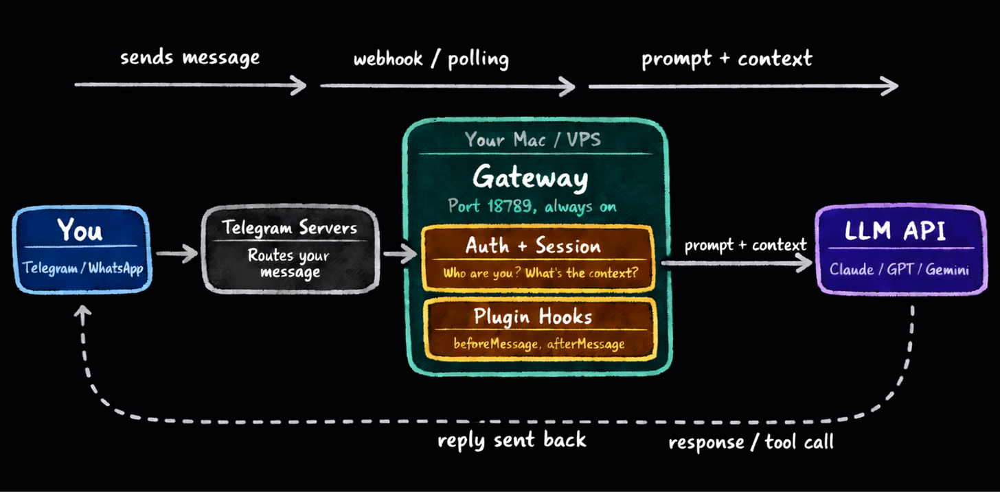
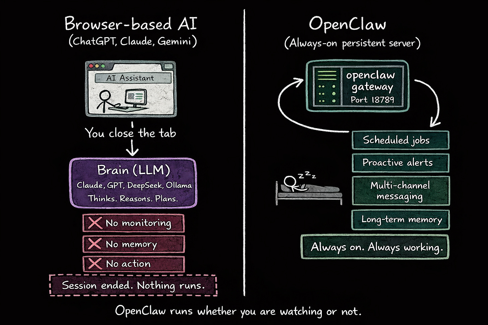
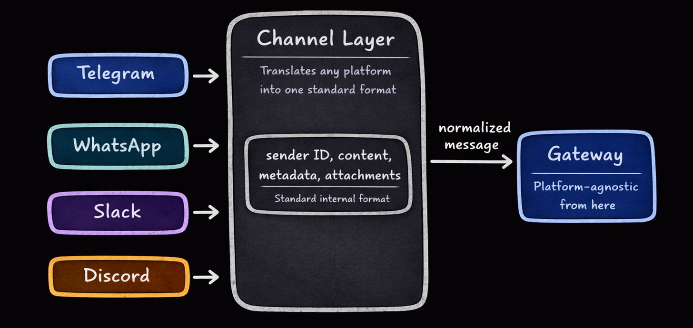
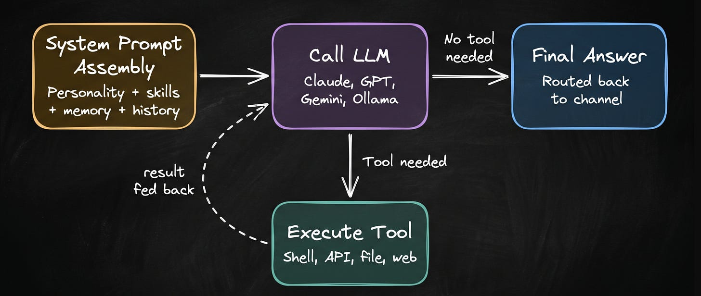
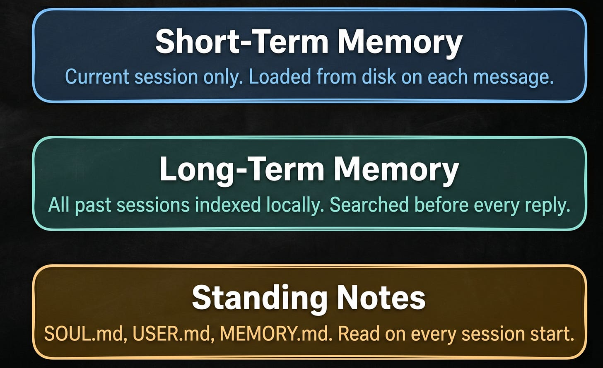
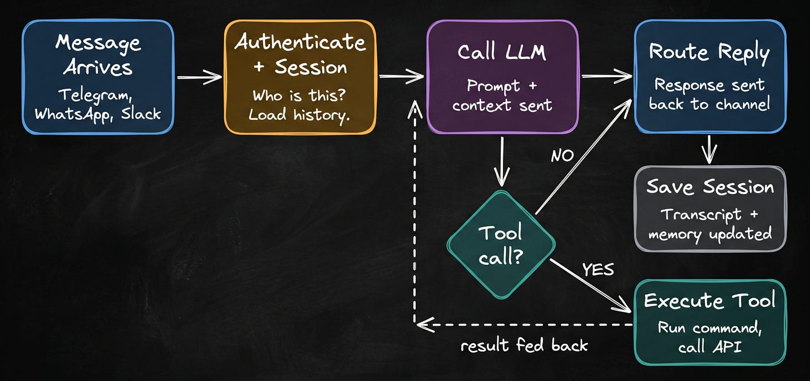
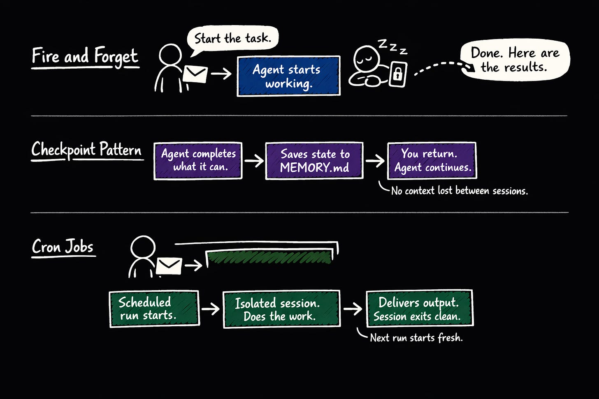
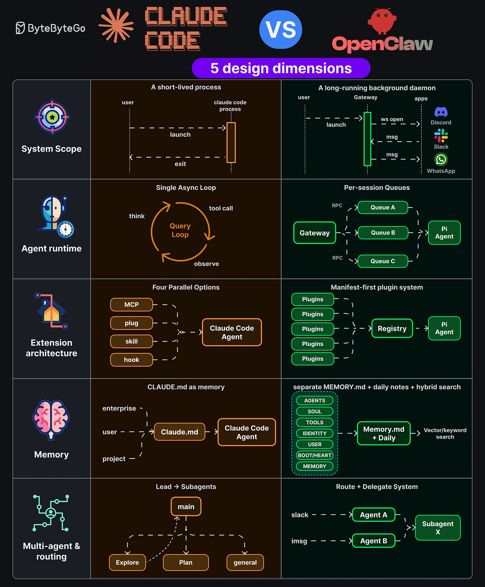

# OpenClaw Architecture

## Key Takeaways

- OpenClaw is an always-on Node.js daemon (port 18789) that bridges LLM reasoning ("the brain") and real-world execution ("the hand") — connecting to messaging apps and doing the work itself instead of requiring copy-paste
- Five architectural layers: Gateway (control + auth + approval), Channel adapters (Telegram/WhatsApp/Slack/Discord normalized to one format), LLM layer ("brain socket" — you bring the API key), Plugin system (almost everything is a plugin), and a 3-layer Memory system
- Memory splits into short-term (current session on disk), long-term (all past sessions indexed locally for search), and standing notes (user-written Markdown files in `~/.openclaw/workspace/memory/`)
- Long-running tasks use three patterns: fire-and-forget with async completion, checkpoint-to-`MEMORY.md` for pause/resume, and isolated cron sessions that start fresh each run to avoid context staleness
- Architectural contrast with Claude Code: long-running daemon vs short-lived process, per-session queues vs single async loop, manifest-first plugins via central registry vs four parallel extension mechanisms, and route-and-delegate channel agents vs lead-to-subagent pattern

## System Overview

OpenClaw splits the autonomous-agent stack into two halves:

- **The Brain** — an LLM (Claude, GPT, DeepSeek, Gemini, Grok, or local via Ollama) provides reasoning and planning
- **The Hand** — OpenClaw executes decisions across files, messaging apps, shell commands, and APIs

The result is an agent that runs whether you're watching or not — scheduled jobs, proactive alerts, multi-channel messaging, and long-term memory keep working in the background.

## Gateway: Control Center

The Gateway is the orchestrator. It:

- Authenticates senders and manages sessions
- Assembles full context from memory and conversation history
- Routes messages between channels and LLM
- Intercepts sensitive commands (e.g., shell operations) and requests user approval via the messaging interface before executing
- Serves a Control UI at `localhost:18789` with real-time visibility into tool calls, model responses, and pending approvals
- Supports hot configuration reloads — change enabled plugins, model selection, or channel credentials without restarting

Pairing it with Tailscale gives browser access to the Control UI from any device without requiring local-network presence.

## Channel Layer: Platform Abstraction

Each messaging platform sits behind a dedicated plugin adapter:

- **Telegram** — bot token, polling or webhook
- **WhatsApp** — reverse-engineered web protocol, QR-code authentication
- **Slack** — Socket Mode, dual tokens (app + bot)
- **Discord** — gateway WebSocket with heartbeat

All channels normalize to a single internal format: `{ identity_key, content, metadata, attachments }`. From the Gateway onward, the rest of the system is platform-agnostic. Security policies (allowlists, pairing workflows, mention-gating) apply uniformly across all channels.

## LLM Layer: Reasoning Engine

OpenClaw treats the LLM as a "brain socket" — you supply intelligence via an API key. On each message:

1. **System prompt assembly** — combine agent personality, available skills, relevant memory, and conversation history
2. **Model invocation** — full context sent to Claude/GPT/Gemini/Ollama
3. **Tool execution loop** — model signals tool calls; runtime dispatches them; results fed back; loop continues until no further actions are needed
4. **Automatic compaction** — when the context limit approaches, conversation history is summarized to preserve continuity while freeing tokens

## Plugin System

Nearly all functionality outside the core engine runs as plugins: Telegram integration, GitHub access, memory itself, and any custom extension. Plugins hook into lifecycle events:

- **Before/after tool calls** — audit logging, approval workflows, rate limiting
- **Message boundaries** — pre/post processing
- **Session lifecycle** — setup and teardown

This means audit, throttling, and approval flows can be added without modifying the core engine.

## Memory System (Three Layers)

| Layer | Storage | Lifecycle | Purpose |
|---|---|---|---|
| **Short-term** | Disk file per session | Only recent turns loaded into context per request | Working memory for the current conversation |
| **Long-term** | Local database, indexed | Searched before every reply across days/weeks of history | Recall past conversations and outcomes |
| **Standing notes** | Markdown files in `~/.openclaw/workspace/memory/` (e.g., `SOUL.md`, `USER.md`, `MEMORY.md`) | Read on every session start | Permanent briefing — preferences, projects, identity, context |

Standing notes are user-owned and editable — the user controls what the agent permanently knows.

## Message Processing Flow

Example: *"Check my open PRs and let me know if anything needs a response tonight"* arriving via Telegram.

1. Telegram adapter receives message, normalizes to standard format
2. Gateway creates/retrieves session, assembles context (recent conversation + relevant long-term memory + standing notes)
3. Context sent to LLM with system prompt
4. Model decides to call GitHub API tool
5. Gateway intercepts; may request user approval depending on sensitivity
6. Tool executes; output feeds back to model
7. Model reads results, decides on more tools or final response
8. Response routed back through Telegram channel
9. Session state saved to disk (transcript + memory updated)

Multi-step workflows, multi-day continuity, and remembered user preferences (e.g., "auth-related reviews go to me personally") all fall out of this loop.

## Long-Running Task Handling

For tasks that take hours (web scraping, test suites, large datasets):

- **Fire and forget** — agent acknowledges, starts work, sends a completion message asynchronously. User can disconnect; the Gateway keeps running.
- **Checkpoint pattern** — task state written to `MEMORY.md` so the agent can pause and resume mid-session without losing context.
- **Cron jobs** — run in isolated session mode: fresh start each run avoids accumulated context staleness that would otherwise drift over time.
- **Batched long tool calls** — long operations are broken into batches with progress reporting to avoid Gateway timeouts.

## Security Architecture

- **Command approval** — shell operations intercepted; user approves via the messaging interface before execution
- **Uniform channel policies** — allowlists, pairing workflows, and mention-gating apply identically across Telegram, WhatsApp, Slack, Discord
- **Plugin isolation** — each plugin runs within defined boundaries; core engine isolation prevents cascading failures

## Differentiation from Other Tools

| Tool | Model | Interface | Extensibility | Persistence |
|---|---|---|---|---|
| ChatGPT / Claude / Gemini (web) | Web tab only | Single prompt/response | None | None — closing the tab loses state |
| Siri / Google Assistant | Proprietary | Voice | Closed ecosystem | N/A |
| LangChain / CrewAI / AutoGen | Developer framework | Requires custom Python | High but manual | Session-based |
| Claude Code / Codex CLI | Terminal tool | Command-line | Limited | Session-based, coding-focused |
| **OpenClaw** | **24/7 daemon** | **Multi-channel messaging** | **Plugin architecture** | **Persistent disk + DB** |

## Capabilities Summary

- **Always-on Gateway** — Node.js server on port 18789 (Mac/Linux), coordinates everything
- **Multi-channel messaging** — unified interface across Telegram, WhatsApp, Slack, Discord with shared context
- **Modular skill platform** — 5,400+ capabilities via Markdown skill files on ClawHub
- **Persistent memory** — knowledge stored as editable Markdown files the user owns
- **Proactive scheduling** — heartbeat + cron support for autonomous task execution without prompting
- **Model agnostic** — Claude, GPT, DeepSeek, Gemini, Grok, or local via Ollama
- **MyClaw** — commercial managed-hosting option

## Claude Code vs OpenClaw — 5 Design Dimensions

A side-by-side comparison of how OpenClaw's architecture differs from Claude Code along five axes.

### 1. System Scope

| | Claude Code | OpenClaw |
|---|---|---|
| **Model** | Short-lived process | Long-running background daemon |
| **Lifecycle** | Launch, run, exit | Always on |
| **Connectivity** | Direct CLI / IDE / SDK | Gateway manages WebSocket connections to Discord, Slack, WhatsApp |

### 2. Agent Runtime

| | Claude Code | OpenClaw |
|---|---|---|
| **Loop** | Single async query loop | Per-session queues |
| **Cycle** | Think → tool call → observe → repeat | Gateway routes RPCs into separate queues per session |
| **Concurrency** | Single-threaded agent loop | Multiple queues feeding into a Pi Agent |

### 3. Extension Architecture

| | Claude Code | OpenClaw |
|---|---|---|
| **Approach** | Four parallel options integrated into the agent | Manifest-first plugin system |
| **Mechanisms** | MCP, plug, skill, hook | Plugins register through a central registry |
| **Integration** | Extensions plug directly into the Claude Code Agent | Registry mediates between plugins and the Pi Agent |

### 4. Memory

| | Claude Code | OpenClaw |
|---|---|---|
| **Storage** | CLAUDE.md files at three levels (enterprise, user, project) | Separate `MEMORY.md` + daily notes |
| **Retrieval** | Loaded into context at session start | Hybrid vector/keyword search |
| **Structure** | Hierarchical markdown files | Structured sections (agents, soul, tools, identity, user, boot/heart, memory) |

### 5. Multi-Agent and Routing

| | Claude Code | OpenClaw |
|---|---|---|
| **Pattern** | Lead → subagents | Route and delegate |
| **Structure** | Main agent spawns Explore, Plan, and general subagents | Dedicated agents per channel (Slack → Agent A, iMsg → Agent B) |
| **Delegation** | Subagents report back to main | Agents can further delegate to Subagent X |

### Architectural Tradeoff

Long-running daemons like OpenClaw accumulate stale context, drift, and gradually-incorrect assumptions — creating silent failures. The short-lived process model of Claude Code avoids this by starting fresh each session, at the cost of needing to rebuild context every time. OpenClaw's isolated-session cron mode is a deliberate response: when correctness matters more than continuity, run fresh.

## Related Notes

- [The Anatomy of an AI Agent](ai-agent-anatomy.md) — generic agent architecture (brain, loop, tools, memory, guardrails)
- [Agentic design patterns](agentic-design-patterns.md) — when to escalate from single-call to full agent
- [Claude Code workflow](../claude/claude-code-workflow.md) — how Claude Code's loop and extensions actually work
- [Claude Code features](../claude/claude-code-features.md) — MCP, plugs, skills, hooks
- [Agent memory and state consistency](agent-memory-state-consistency.md) — pitfalls of long-running agent memory

---

**Source:** https://newsletter.systemdesign.one/p/openclaw-architecture
**Source:** https://blog.bytebytego.com/p/ep214-claude-code-vs-openclaw-5-design
**Date:** 2026-05-28 (comparison), 2026-06-08 (architecture deep-dive)
**Tags:** openclaw, claude-code, agent-architecture, autonomous-agents, gateway, plugin-system, agent-memory, multi-channel, design-comparison
