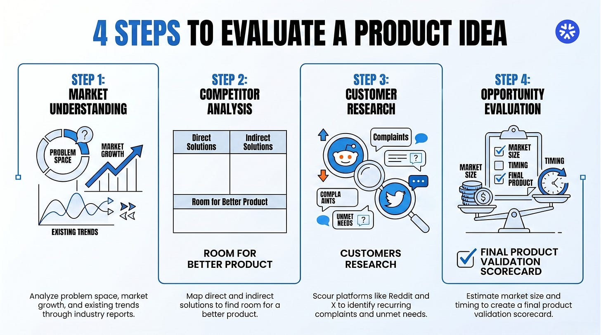
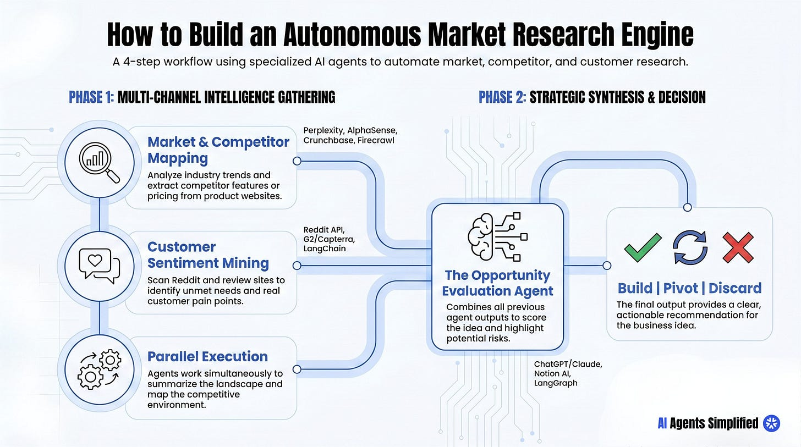

# Product Validation with AI Agents

## Key Takeaways

- Most product failures stem from building the wrong thing, not inability to execute -- validate ideas before committing engineering resources
- Four evaluation dimensions: market understanding, competitor analysis, customer research, and opportunity evaluation -- each maps to a specialized AI agent
- Parallel agent execution compresses days of manual research into hours by scanning hundreds of sources simultaneously
- The Opportunity Evaluation Agent synthesizes all findings into a Build / Pivot / Discard recommendation using a scoring framework
- Disciplined prompting on the evaluation agent is critical -- without it, LLMs produce "confident-sounding garbage"

## The Core Mindset Shift

Instead of asking "Can we build this?", answer "Should we build this?" One of the most expensive mistakes in product development is building before validating. Early validation reduces product risk, avoids wasting engineering time, discovers real customer problems, and improves chances of product-market fit.

## Four Areas of Evaluation



### 1. Market Understanding

Examine the problem space: who has the problem, how severe it is, what current solutions exist, and what market growth indicators suggest. Involves trend analysis and industry report scanning.

### 2. Competitor Analysis

Map direct competitors, indirect competitors, and substitute tools. Evaluate features, pricing, positioning, and user feedback. Key question: "Is there still room for a better product here?"

### 3. Customer Research

Analyze discussions across Reddit, X, forums, and review sites (G2, Capterra) to identify recurring complaints and unmet needs from real users.

### 4. Opportunity Evaluation

Synthesis stage combining all findings into a validation scorecard: market size estimates, differentiation potential, timing assessment, and viability evaluation.

## AI Agent Implementation



The workflow uses four specialized agents running in parallel, each focused on a specific validation task.

### Market Research Agent

- Explores market landscape, summarizes industry trends, estimates market size
- **Tools:** Perplexity Deep Research, ChatGPT Deep Research, AlphaSense, LangGraph / CrewAI

### Competitor Intelligence Agent

- Maps competitive landscape, breaks down features and pricing, evaluates positioning
- **Tools:** Perplexity, SimilarWeb, Crunchbase / PitchBook, Firecrawl / Browserbase, CrewAI / AutoGen

### Customer Insight Agent

- Scans Reddit, X, and communities for complaints, feature requests, and unmet needs
- **Tools:** Reddit API, Firecrawl, G2 / Capterra, Common Room, LangChain

### Opportunity Evaluation Agent

- Synthesizes all findings, scores the idea, identifies risks, suggests differentiation strategies
- **Output:** Build / Pivot / Discard recommendation
- **Tools:** ChatGPT / Claude, Notion AI / Airtable AI, LangGraph, OpenAI Assistants / AutoGen

## The Manual Process Problem

Without agents, product managers face a bottleneck: hours of competitor research, reading dozens of sources, scanning discussions across multiple platforms, and synthesizing large amounts of information. Teams either spend days researching or skip the process entirely -- both are costly.

## Results

- Days of research compressed into hours
- Decisions grounded in evidence from hundreds of sources rather than intuition
- Repeatable validation process across multiple product ideas
- Future direction: humans define the questions, AI agents conduct the research, teams make informed decisions

## Hands-On Implementation: n8n Workflow Example

A minimal version of the four-agent framework can be built in a day with **n8n + GPT** instead of LangGraph/CrewAI. The implementation simplifies to **two parallel agents** (Lean Canvas + Market Research) but adds a **forced clarification stage** before research begins.

### Pipeline

```
1. Idea Intake (n8n Form)
   ↓
2. Forced Clarification (5 GPT-generated questions, gated)
   ↓
3. Parallel Analysis
   ├── Lean Canvas Agent
   └── Market Research Agent (3-5 competitors, 10-domain feature matrix)
   ↓
4. Structured Outputs (Lean Canvas + comparison matrix + CSV)
```

### The Forced Clarification Stage

Before any research runs, GPT auto-generates 5 sharpening questions covering:

1. **Customer** — who specifically is this for?
2. **Problem** — what real pain are you solving?
3. **Differentiation** — why is this better than existing alternatives?
4. **Pricing** — what's the model and at what price?
5. **Alternatives** — what do customers do today instead?

The questions are surfaced via a second n8n Form node so the founder must answer before the pipeline proceeds. This prevents agents from inventing answers to unspecified assumptions.

### Why Two Agents Instead of Four

The full 4-agent framework (Market, Competitor, Customer, Opportunity) is more thorough. The 2-agent simplification trades depth for shipping speed — useful when you have many ideas to triage quickly. Once an idea passes the 2-agent screen, route it through the full 4-agent flow.

### Honest Counterpoint: Bias Laundering

> A commenter argued the automation might "launder confirmation bias into a clean-looking lean canvas" rather than objectively eliminating weak ideas.

The author surfaced this rather than burying it. **Automation doesn't remove founder bias unless the prompts actively challenge the idea.** Practical guard: include adversarial prompts that ask the agents to argue *against* the idea, then check whether the negative case is taken seriously or hand-waved.

### Tool Choice Tradeoffs

| Stack | Strengths | Weaknesses |
|---|---|---|
| **n8n + GPT** | Visual, no-code, fast to modify | Less control over agent state, weaker for long-horizon planning |
| **LangGraph / CrewAI** | Programmatic, better for complex flows | Harder to iterate, requires code deploys |

---

**Source:** https://aiagentssimplified.substack.com/p/stop-building-blind-how-i-validate
**Source:** https://aiagentssimplified.substack.com/p/i-built-an-ai-system-that-thinks
**Date:** 2026-05-28
**Tags:** agents, product-validation, market-research, competitor-analysis, multi-agent, crewai, langgraph, n8n, lean-canvas, forced-clarification
