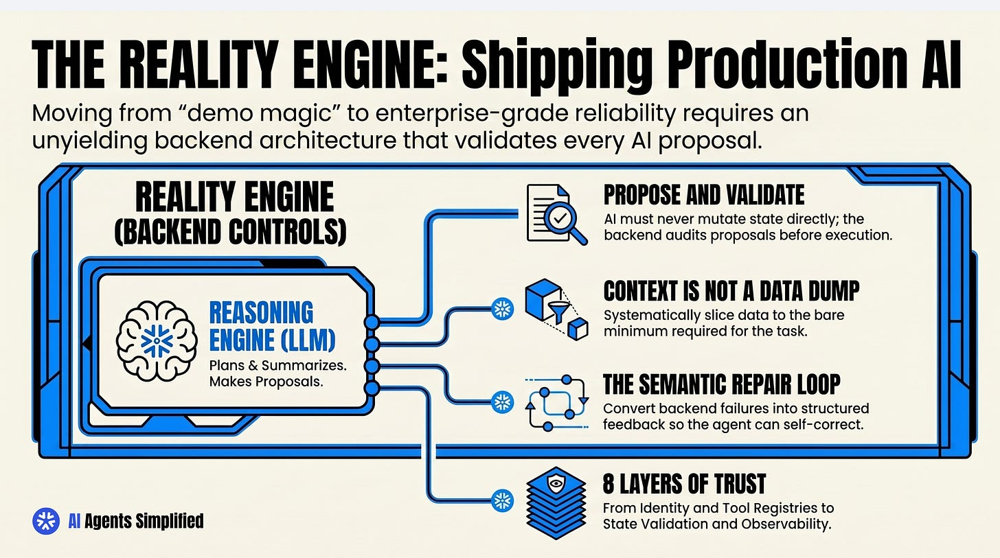

# Production Agent Architecture

## Key Takeaways

- The LLM is the **reasoning engine**; the backend is the **reality engine** — a more capable model cannot compensate for an undisciplined backend
- The golden rule: **Propose and Validate** — the model proposes actions, the backend validates, only approved actions execute. The model must never directly mutate business state
- Eight operational layers sit between user and execution: identity → context builder → tool registry → policy engine → state validator → execution → feedback loop → observability
- **Context is not a data dump** — the context builder curates the minimum relevant, secure slice of data for each task; shoving everything in generates expensive, complex errors
- **The semantic repair loop** converts backend failures into structured feedback so the agent can self-correct rather than silently failing or hallucinating a fix
- Separate low-risk operations (draft, summarize) from high-risk mutations (delete, bill) — human approval for the latter builds organizational trust incrementally
- **Monolithic agents fail at scale** — forcing a single agent to handle intent parsing, planning, tool execution, and self-correction simultaneously overwhelms its context window; accumulated tool responses degrade the signal-to-noise ratio until the agent loses its original goal
- Multi-agent Router → Worker → Critic split is the structural fix: each agent does one job with a minimal, focused toolset; conflict resolution requires formal arbitration, not infinite rejection loops



## Reasoning Engine vs. Reality Engine

The common mistake: treating a more capable model as the solution to production failures. A stronger model inside an undisciplined context window generates more expensive, more complex errors.

The split:
- **Reasoning Engine (LLM)** — plans, summarizes, and makes proposals
- **Reality Engine (backend)** — validates proposals, controls execution, enforces policy

The backend is not a passive relay. It enforces the rules the model cannot be trusted to self-enforce.

## The Propose and Validate Pattern

The execution pipeline decouples tool calling from direct execution:

```
Model → Proposed Action → Validator → Executor → Result → Feedback → Response
```

**Example (CRM agent following up with demo contacts):**
1. Model proposes: "Send follow-up email to demo contacts from last week"
2. Validator audits: check ownership, opt-out status, user authorization
3. Executor sends only if all checks pass
4. Result is translated into model-readable feedback

The model never writes to a database, sends an email, or calls an API directly. Every mutation goes through the validation pipeline.

## Eight Operational Layers

| Layer | Role |
|---|---|
| **1. Identity** | Authenticate users, establish workspace boundaries, enforce RBAC, limit data visibility |
| **2. Context Builder** | Curate selective, relevant, secure information for the model's reasoning window |
| **3. Tool Registry** | Maintain valid schemas, input expectations, descriptions, pre-calculated risk profiles |
| **4. Policy & Permission Engine** | Segregate operations by risk level — determine what runs autonomously vs. requires approval |
| **5. State Validator** | Audit proposals against current business data for compliance before execution |
| **6. Execution Layer** | Heavily logged, predictable system communicating with APIs and databases |
| **7. Feedback Loop** | Translate execution outcomes into model-readable inputs for re-planning |
| **8. Observability** | End-to-end traces: prompts, injected context, model decisions, validation logs |

## Memory Architecture

Agent memory is not a cache or an infinite store. Structure:

- **Source of truth**: relational database — immutable, authoritative
- **Agent working memory**: short-term task context, cleared on completion
- **High-level summaries**: preserved across turns for continuity

Agents should query backends explicitly for static facts (permissions, invoice status, account state) rather than assuming the model retains them. Context windows hold reasoning state, not data.

## Semantic Repair Loop

When backends safely block an invalid action, the failure is not the end — it is input for the next iteration:

1. Execution fails (invalid operation, policy violation, data conflict)
2. Failure is translated into structured semantic feedback
3. Model receives explanation, dynamically adjusts parameters or requests clarification
4. Loop continues until resolved or escalated

This replaces silent failures (agent gives up) and hallucinated fixes (agent pretends it succeeded).

## Human Approval Workflows

Separate the autonomy spectrum by risk:

| Risk Level | Examples | Handling |
|---|---|---|
| Low | Draft, summarize, read | Fully autonomous |
| Medium | Update, notify, schedule | Autonomous with logging |
| High | Delete, billing mutation, external send | Human approval required |

Incrementally expanding autonomy as trust builds is safer than starting with full autonomy and adding restrictions after incidents.

## Why 90% of AI Agents Fail: The Monolithic Agent Problem

### The Root Cause: Cognitive Overload

The typical failure pattern: developers build a single agent responsible for intent parsing, planning, tool execution, and self-correction all at once. Each tool response, error message, and intermediate thought accumulates in the context window. As the signal-to-noise ratio degrades, the agent loses track of its original goal — what worked in a local prototype becomes brittle against real-world, messy data.

The failure is architectural, not a model capability problem. Upgrading to a more powerful model inside an overloaded context generates more expensive, more complex errors.

### The Fix: Router → Worker → Critic

Distribute responsibilities across three specialized agents, each with a minimal toolset:

| Agent | Role | Tools |
|---|---|---|
| **Router** | Classifies user intent only | None (no external tool access) |
| **Worker** | Executes specific tasks | Minimal, task-focused toolset |
| **Critic** | Validates output against original constraints | Read-only verification |

The Router makes no API calls — it cannot be distracted by data. The Worker executes with a small, focused context. The Critic validates output *against the original intent* before it reaches the user, catching drift before it ships.

### Distributed State Management

Moving to multi-agent systems requires treating state as a first-class design problem:

- **Formal communication protocols** between agents — no implicit shared state; payloads must be explicit
- **Short-term working memory** (context window) vs. **long-term semantic memory** (vector databases) — separate them by design
- Context passing without context loss: each agent receives only what it needs, not the full session history

### Consensus and Conflict Resolution

When agents disagree (e.g., compliance agent rejects what research agent approved), the system needs structured arbitration — not an infinite rejection loop:

1. **Orchestrator-mediated refinement** — the orchestrator rewrites the rejected output against the critic's constraints and resubmits
2. **Human-in-the-loop checkpoints** — for conflicts that automated arbitration cannot resolve
3. **Fallback paths** — predetermined exits that prevent runaway loops (max rejection count triggers escalation)

The failure mode to avoid: agents locked in a back-and-forth where neither yields and no human is ever notified.

---

**Source:** https://aiagentssimplified.substack.com/p/rule-1-of-production-ready-agents
**Source:** https://aiagentssimplified.substack.com/p/why-90-of-ai-agents-fail-in-production
**Date:** 2026-06-18 (initial), 2026-06-23 (multi-agent failure patterns)
**Tags:** agents, production, validation, backend-architecture, tool-use, safety, observability, multi-agent, router-worker-critic, context-overload, conflict-resolution, distributed-state
