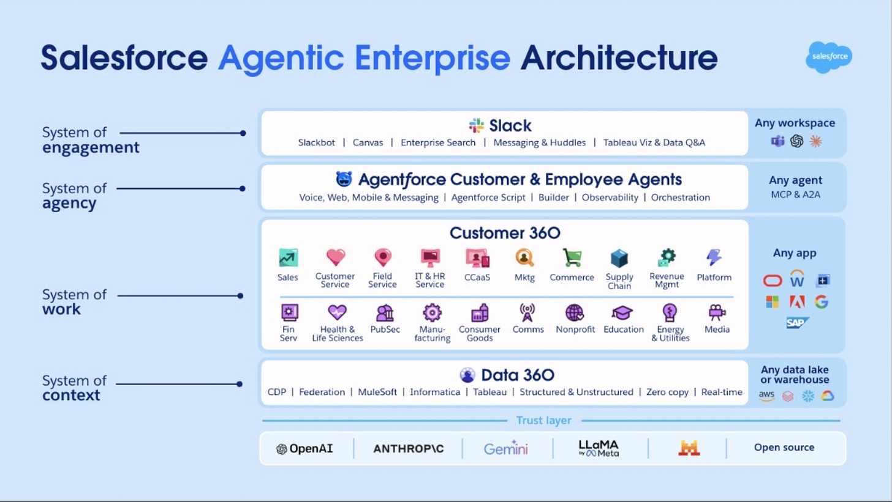
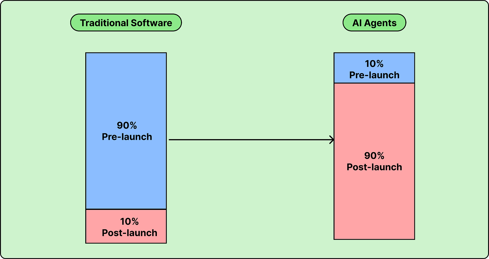
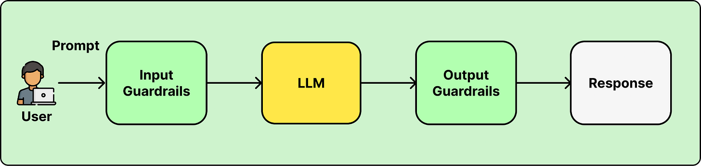
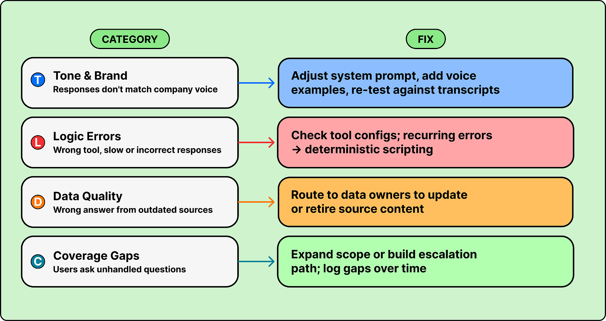
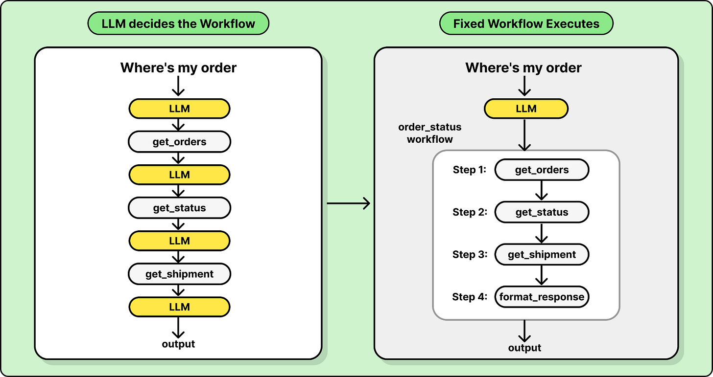
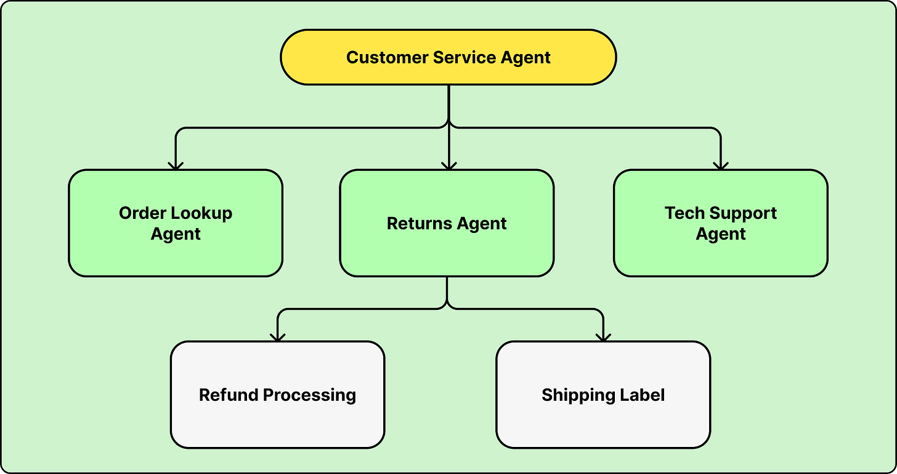

# Salesforce Agentforce: Lessons from 20,000 Enterprise Deployments

## Key Takeaways

- **The 90/10 effort split inverts for agents.** Traditional software: 90% pre-launch, 10% post. Agents: 10% pre-launch, **90% post-launch** — managing, improving, and tightening feedback loops is the actual work. Most failures come from teams treating launch as completion.
- **Pin every agent to one KPI.** Salesforce uses **Agentic Work Units (AWUs)** as the unit of measurement; their support agent's KPI is **containment rate** (cases resolved with no human follow-up). No KPI → no drift detection → no path to scale.
- **Three production anti-patterns** keep recurring: (1) using LLM reasoning for deterministic flowcharts, (2) "prompting harder" instead of encoding policies in code, (3) dumping raw API responses into context. The article's central pivot: "**If you can write the logic as a flowchart, it should probably be code, not a prompt.**"
- **Guardrails are two-sided.** Input guardrails (zero data retention, controlled retrieval, careful masking) + output guardrails (tool validation, grounding checks, content filtering). One side alone is insufficient at enterprise scale.
- **Feedback loop categorization is the operating discipline.** Every production failure sorts into Tone/Brand, Logic, Data Quality, or Coverage Gap — each with its own owner and fix path. Loop speed determines whether you exit pilot purgatory.

## Scale

- **20,000** enterprise customers running Agentforce in production
- **3M+** conversations handled by Salesforce's own support agent
- **135,000** help articles grounding that agent
- **100K → 2K tokens** context reduction in one e-commerce example (50x)

## The Salesforce Agentic Enterprise Architecture

Four layers + a cross-cutting trust layer:

| Layer | Purpose | Salesforce surface |
|---|---|---|
| **System of Engagement** | User interaction (Slack, chat, messaging) | Slackbot, Canvas, Messaging & Huddles |
| **System of Agency** | AI reasoning, decision-making, orchestration | Agentforce (Voice, Web, Mobile, Builder, Observability) |
| **System of Work** | Business apps the agent acts on | Customer 360 (Sales, Service, Commerce, etc.) |
| **System of Context** | Data & metadata grounding actions | Data 360 (CDP, Federation, MuleSoft, Tableau) |
| **Trust layer** | Spans all four — multi-LLM support, guardrails, policies | OpenAI / Anthropic / Gemini / Llama / open source |

## The Headline Insight: Effort Distribution Flips

> "In the typical software world, 90% of the work is getting to go live. Whereas in the typical AI agent, 90% of the work is after you go live to manage and improve the agent."

Teams that treat launch as the finish line stall. Teams that staff for **post-launch iteration** scale.

## Pre-Launch: The 10% Foundations

### 1. Start Small, Don't Boil the Ocean

High-value but achievable use cases. Two reasons:
- Agent capabilities evolve fast — overcommitting to complex multi-step flows risks total rebuild
- Teams need production reps reviewing transcripts, diagnosing failures, iterating on instructions and data sources

### 2. Tie the Agent to a KPI

**Agentic Work Units (AWUs)** — discrete units of meaningful work completed by an agent. A standardized "task completion" metric.

Salesforce's support agent KPI: **containment rate** — percentage of cases fully resolved without human follow-up. Concrete, measurable, drift-detectable.

Without a KPI, there's no way to tell whether the agent is improving or regressing.

### 3. Guardrails — Input AND Output

| Side | What it does |
|---|---|
| **Input Guardrails** | Secure data retrieval via controlled access; zero-data-retention agreements with LLM providers; keep sensitive workloads inside trusted boundaries (data never crosses public internet); data masking *cautiously* — it can strip context the model needs to reason |
| **Output Guardrails** | Tool/sub-agent validation to block hallucinated actions; grounding checks (responses cite authorized sources only); content filters for toxicity |

Neither side alone suffices.

## Post-Launch: Where the 90% Lives

### Categorized Feedback Loop

Production reveals failure modes demos don't. Every failure should drop into one of four buckets, each with a clear owner and fix:

| Category | Symptom | Fix |
|---|---|---|
| **Tone & Brand** | Responses don't match company voice | System prompt + voice examples + re-test against transcripts |
| **Logic Errors** | Wrong tool, slow, incorrect responses | Check tool configs; **recurring errors → deterministic scripting** |
| **Data Quality** | Wrong answer from outdated sources | Route to data owners to update or retire content |
| **Coverage Gaps** | Users ask questions the agent can't handle | Expand scope or build an escalation path; **log gaps over time** |

Loop speed determines scaling. Fast loops → KPI confidence → expansion approval. Slow loops → pilot purgatory.

## Three Anti-Patterns to Avoid

### Anti-Pattern 1: LLM Reasoning for Deterministic Flows

"Where's my order?" doesn't need reasoning. It needs: lookup order → get status → get shipment → format response. Sending each step through an LLM adds latency, cost, and error opportunities.

**Solution: Agent Script** — TypeScript-based framework defining deterministic control flow alongside LLM reasoning. If intent matches X, skip reasoning and execute the predefined tool sequence. Reserve LLM flexibility for genuinely ambiguous requests.

> "If you can write the logic as a flowchart, it should probably be code, not a prompt."

### Anti-Pattern 2: Prompting Harder Instead of Encoding Policies

LLMs don't respond to textual emphasis the way humans do. ALL CAPS, "CRITICAL", "NEVER" — none of it is enforceable. Business rules belong in code.

If a financial-services agent can't serve Hawaii customers, the right implementation is a check at the boundary, not a stern paragraph in the system prompt.

### Anti-Pattern 3: Poor Context Engineering

Passing unfiltered API responses into the context window slows responses and lowers accuracy. An e-commerce `get_orders` call returning 100K tokens drowns the relevant signal.

**Solution: right-size context.** The e-commerce example trimmed responses **100K → 2K tokens** by returning only order ID, status, expected delivery, and tracking number. An insurance company retrieved only relevant policy sections instead of full documents. Result: faster, more accurate.

See also [Context engineering](../concepts/context-engineering.md) — Write/Select/Compress/Isolate is the cross-cutting discipline.

## What's Next

### 1. Multi-Agent Orchestration

The architectural shift: decompose a problem into **specialized agents with narrower scopes, simpler instructions, fewer tools, and smaller context windows**. Salesforce is building three-level-deep orchestration (parent → sub-agent → sub-sub-agent).

### 2. Agents Beyond the Chat Window

- Multi-session tasks that span days (tier-2 support, returns workflows)
- Background agents with no user-facing interface
- Cross-channel: phone (Agentforce Voice), email, web, Slack — identical agent logic

Key principle: **decouple agent logic, tools, and policies from the chat interface.**

### 3. Rapid Model Evolution — but Stable Disciplines

Capabilities shift in months, but the core engineering disciplines persist:

- Start small
- Measure what matters
- Build tight feedback loops
- Encode policies in code, not prompts
- Keep context lean

## Production Examples

- **Agibank** — FAQ agent pulling real-time answers from a knowledge base while maintaining human tone
- **Telepass** — when device troubleshooting needs a human, Agentforce escalates with full conversation context; post-chat surveys feed the roadmap

## Related Notes

- [Agentic design patterns](agentic-design-patterns.md) — when (and when not) to escalate to an agent
- [Context engineering](../concepts/context-engineering.md) — anti-pattern 3 in depth
- [Stripe Minions](stripe-minions.md) — production agent case at large scale
- [Harness engineering](harness-engineering.md) — production agents with mechanically-enforced invariants
- [Grab AI agents for engineering productivity](grab-ai-agents-engineering-productivity.md) — another enterprise rollout case
- [LLM cost and model routing](../concepts/llm-cost-and-routing.md) — the cost discipline that complements Salesforce's quality discipline

---

**Source:** https://blog.bytebytego.com/p/what-salesforce-learned-from-20000
**Date:** 2026-06-09
**Tags:** salesforce, agentforce, production-agents, enterprise-ai, agent-ops, kpis, guardrails, feedback-loop, context-engineering, multi-agent, agent-script, anti-patterns, case-study
