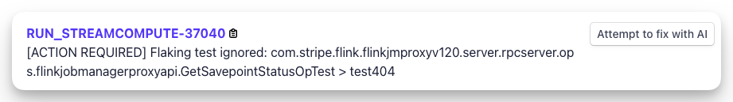
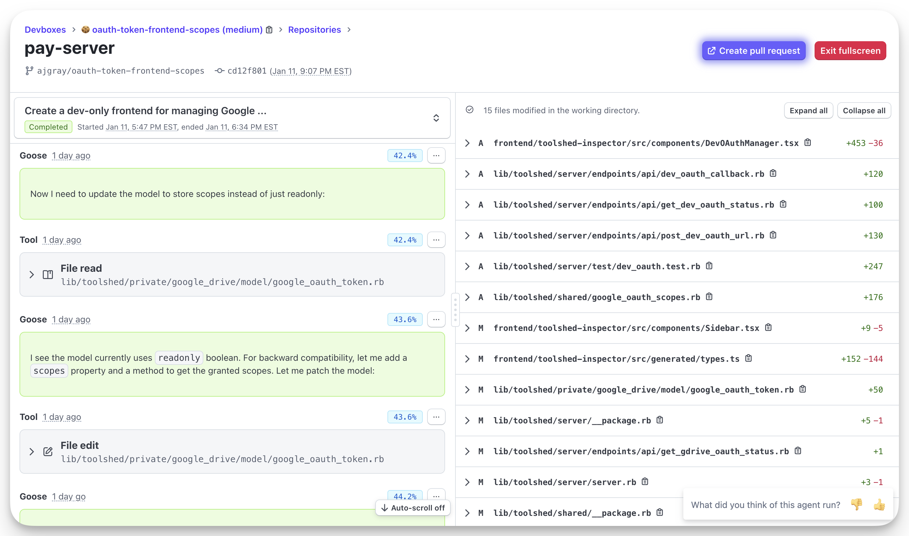
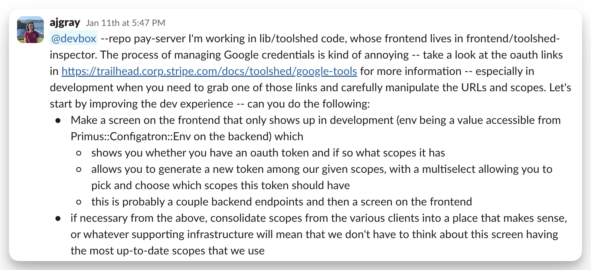
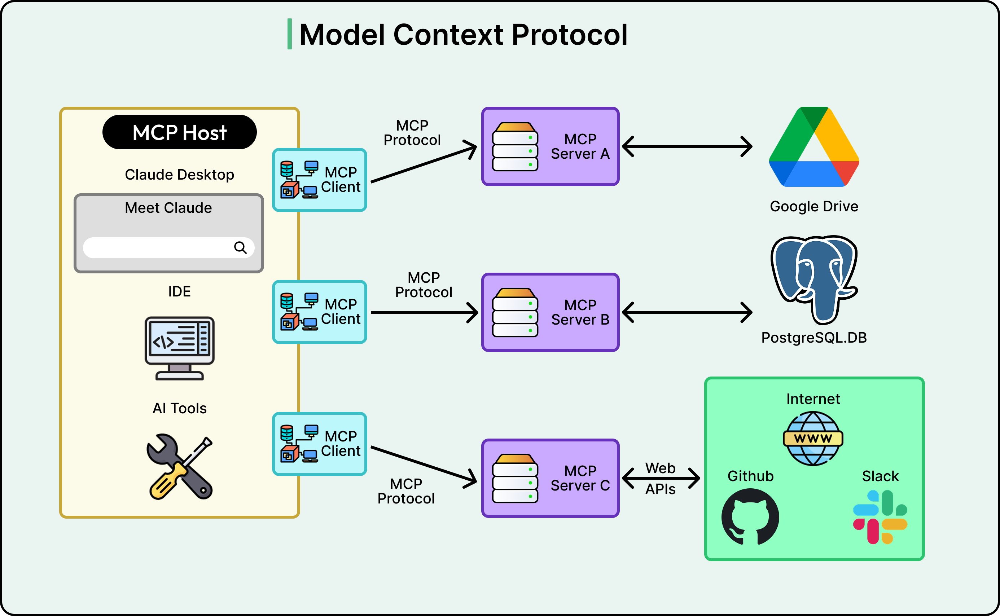
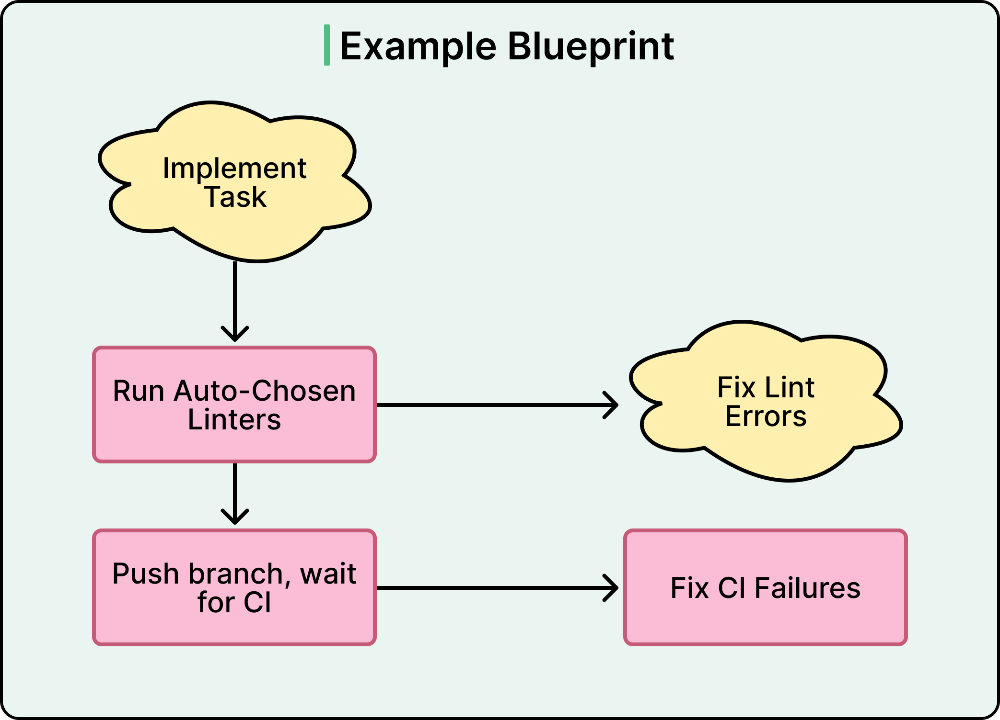
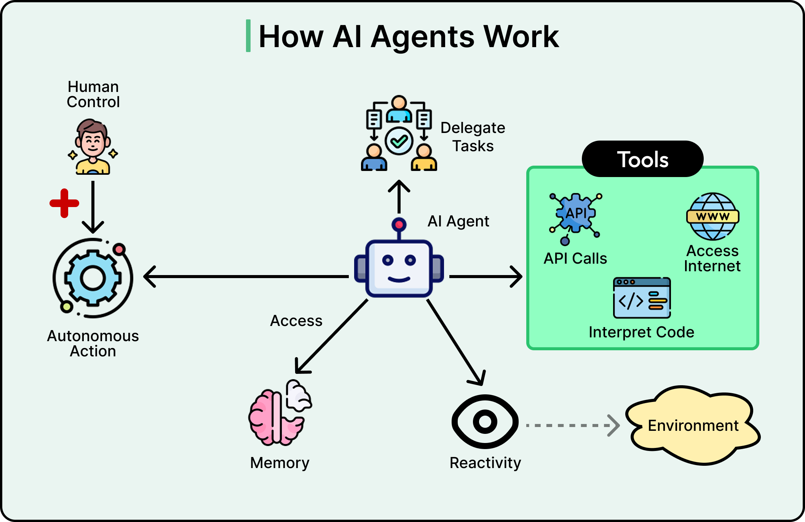

# Stripe Minions: One-Shot End-to-End Coding Agents

How Stripe ships 1,300+ fully agent-written PRs per week into a mature financial-services codebase by investing in infrastructure rather than chasing a smarter model.

## Key Takeaways

- **1,000-1,300 PRs merged per week** are fully Minion-produced (zero human-written code, human-reviewed) across hundreds of millions of lines of Ruby/Sorbet processing $1T+/year
- The win **isn't model quality** — it's infrastructure: 10-second devboxes, 3M+ tests, ~500 MCP tools in Toolshed, plus a "Blueprint" orchestration that mixes deterministic steps with agentic loops
- Same tooling humans use ("if it's good for humans, it's good for LLMs") — same IDE/git/lint/test surfaces, no agent-specific shortcuts; same Cursor/Claude Code rule-file format
- **Hard stops matter**: max 2 CI rounds before human review. LLMs show diminishing returns on retries — a partial PR an engineer polishes in 20 min counts as a win
- Minions excel at **isolated tickets, bug fixes, and parallel-stackable tasks**; attended tools (Cursor, Claude Code) still win for interactive, judgment-heavy work


## What Minions Are

Minions are **one-shot, unattended coding agents**. A typical run:

```
Slack message  →  Minion spins up  →  ... runs unattended for minutes/hours ...  →  PR opened, CI passing, ready for review
```

No human interaction between the input message and the PR. The human's job: approve and merge (or kick back).

Built on Block's open-source [goose](https://github.com/block/goose) agent, then heavily customized with Stripe-specific orchestration.

## Why Build It vs Buy?

LLM agents excel at greenfield code with few constraints. Stripe's codebase is the opposite:
- Homegrown libraries with no public documentation
- Mature mature monorepo (Ruby/Sorbet, hundreds of millions of LOC)
- Regulatory obligations ($1T+/year payment volume)
- Financial-system stakes — bugs have customer impact

Off-the-shelf agents (Cursor, Devin, etc.) work great in greenfield but underperform in this environment. Stripe needed an opinionated agent that knew the codebase's conventions, conventions, and constraints.

## What It's Like to Use



Entry points:
- **Slack message** invoking a minion run
- **Flaky-test tickets** auto-generated by CI with a "start minion" button
- **Web UI** for managing runs



Critically, **runs are parallel and unattended.** An engineer on-call can kick off 5-10 Minions in parallel during the day and review the PRs as they land.

## Infrastructure as the Moat

> "The primary reason the Minions work has almost nothing to do with the AI model powering them. It has everything to do with the infrastructure that Stripe built for human engineers, years before LLMs existed."

### Pre-warmed Devboxes



- **~10 second spin-up** with Stripe code and services preloaded
- Isolated per Minion run — no shared state
- Pool of warm devboxes means parallelism is free

Without pre-warmed envs, every Minion run pays a 5-minute cold-start tax. With them, you can run 10 in parallel without thinking about it.

### Toolshed: The Central MCP Server



- **~500 internal tools** exposed via [MCP](../concepts/llm-tool-use-and-mcp.md)
- Tools cover repo navigation, DB inspection, service calls, deploy operations, monitoring
- **Per-task curated subsets** — not all 500 are loaded into every Minion's context (would blow the context window)

### Same Rule Format as Humans

Minions use the same `.cursor/rules/` / `CLAUDE.md`-style format that human developers use with their IDE-embedded assistants. Rules are auto-loaded by subdirectory/file pattern.

The principle: **"if it's good for humans, it's good for LLMs."** No agent-specific shortcuts — Minions navigate the codebase exactly like an onboarding engineer would.

## Blueprint: Hybrid Orchestration



Minions don't freestyle. Each task type has a **Blueprint** — a hybrid workflow that alternates:

- **Deterministic nodes** — lint, format, branch, push, fill PR template
- **Agentic loops** — implement, fix CI, respond to review

```
Deterministic: clone repo, install deps, set up env
   ↓
Agentic loop: implement the change
   ↓
Deterministic: lint, format, run tests locally
   ↓
Agentic loop: fix any failures
   ↓
Deterministic: push branch, open PR with template
```

The deterministic rails reduce tokens (no LLM call for boilerplate) and eliminate error surface (the agent can't forget to run the linter).

## Fast Feedback, Hard Limits

A tiered feedback approach:

| Tier | Speed | What |
|---|---|---|
| **Local linting** | ~5s | Heuristic-selected lints, daemon pre-computed |
| **Selective CI** | minutes | Subset of 3M+ tests, picked by affected files |
| **One retry** | minutes | Re-run after fix attempt |
| **Hard stop** | — | Max 2 CI rounds, then human review |

The 2-round cap matters: LLMs show **diminishing returns on retries**. After 2 attempts that didn't fix the issue, an engineer can usually finish in 20 minutes. Pushing the agent to try a third time wastes tokens and often produces worse code.

> "A partially correct PR that an engineer can polish in twenty minutes is still a significant win."

## Attended vs Unattended



Stripe runs both:

| Attended (Cursor, Claude Code) | Unattended (Minions) |
|---|---|
| Interactive, multi-turn | One-shot, fire-and-forget |
| Engineer-in-the-loop | Slack → PR with no interaction |
| Judgment-heavy work | Parallel-stackable tickets |
| Architecture, design, exploration | Bug fixes, flaky tests, routine refactors |
| Inner-loop development | Outer-loop ticket throughput |

Both have their place. The mistake is using one for the other's job.

## What Works as a Minion Target

Strong fit:
- Single-ticket bug fixes
- Flaky test repairs (often with auto-suggested fixes already)
- Routine refactors (renames, library upgrades)
- Test additions to under-covered code
- Code review nits
- Doc updates

Bad fit:
- Cross-cutting architecture changes
- Novel feature design
- Performance optimization requiring deep judgment
- Anything where the spec itself is ambiguous

## The Five Generalizable Lessons

1. **Infrastructure beats model.** Years of investment in fast devboxes + good tests + tool catalogs are what make Minions work — not Claude or GPT being better than last year
2. **Use human tooling.** Same IDE, git, lint, test, rule files — agents inherit decades of engineering work for free
3. **Deterministic rails for boring steps.** Boilerplate doesn't need an LLM. Use code for what code is good at; save LLM calls for genuine reasoning
4. **Tight feedback loops + hard limits.** Diminishing returns on retries — cap iteration and let humans finish
5. **Right tool for the job.** Unattended for parallel-stackable work; attended for interactive judgment

## What This Costs to Build

Not stated directly, but implied:
- Custom MCP server (Toolshed) — significant Stripe-eng investment
- Devbox pooling infrastructure — pre-warmed instances cost money
- Blueprint orchestration — bespoke per-task-type design
- Rule curation — ongoing per-team effort to write/maintain
- Observability — debugging unattended agents requires it

The build only makes sense at Stripe's scale (10,000+ engineers, monorepo at 100M+ LOC). Smaller orgs are better served by off-the-shelf attended tools.

## Related

- [OpenAI Codex](openai-codex.md) — Codex is the attended/conversational counterpart; similar agent loop, different deployment model
- [Harness engineering](harness-engineering.md) — OpenAI's writeup of building the *harness* (env + observability + invariants) for agentic coding at scale; same philosophy as Stripe Minions
- [AI-native engineering](ai-native-engineering.md) — broader pattern of orchestrating fleets of agents
- [Agents across SDLC](agents-across-sdlc.md) — where agents win vs lose in the dev lifecycle
- [LLM tool use and MCP](../concepts/llm-tool-use-and-mcp.md) — the protocol Toolshed implements
- [OpenAI data agent](openai-data-agent.md) — same "fewer non-overlapping tools" lesson at OpenAI's data platform

---

**Source:** https://stripe.dev/blog/minions-stripes-one-shot-end-to-end-coding-agents
**Source:** https://blog.bytebytego.com/p/how-stripes-minions-ship-1300-prs
**Date:** 2026-06-05
**Tags:** stripe, minions, coding-agents, agent-infrastructure, mcp, toolshed, devboxes, ci-cd, unattended-agents, blueprint, llm-engineering
