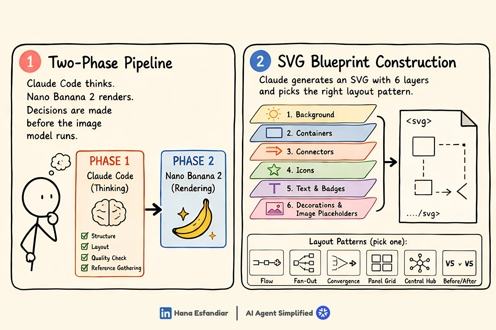
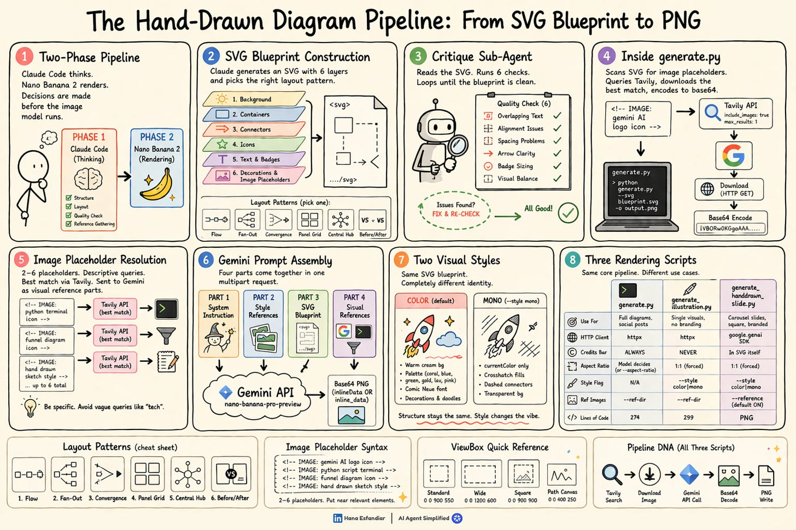
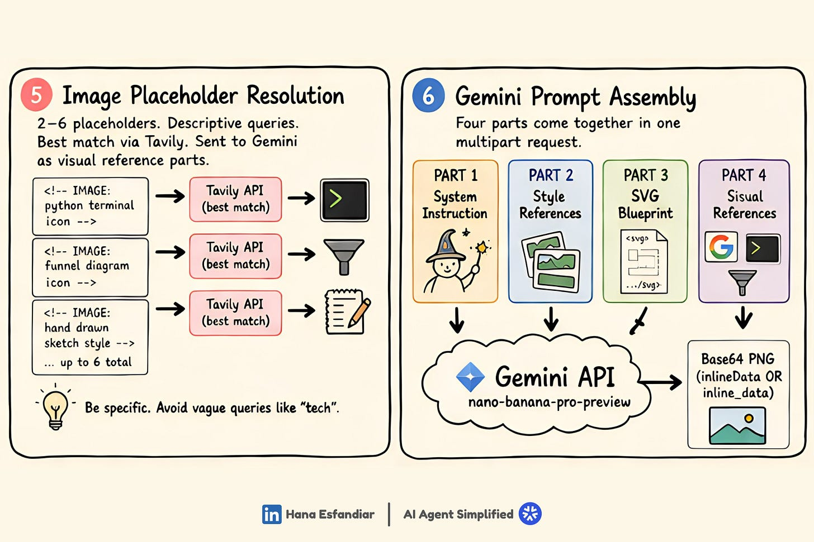
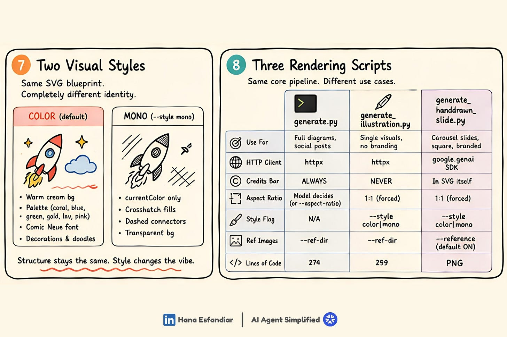
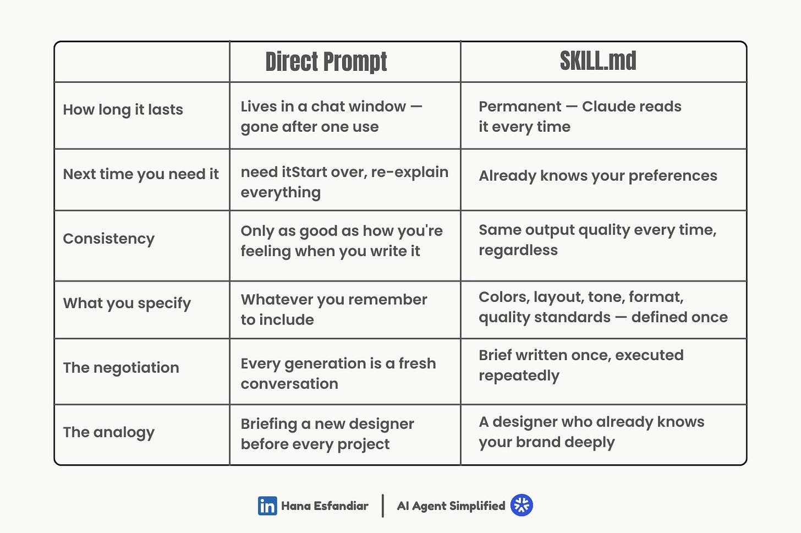
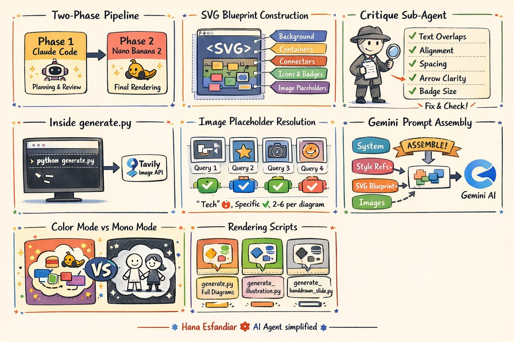
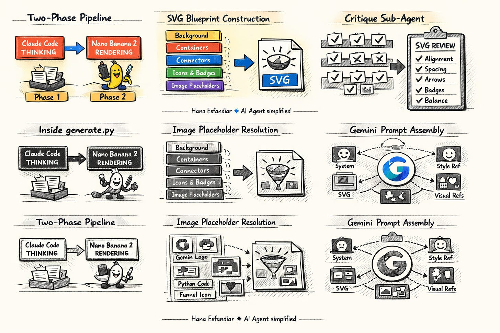

# Trusting AI-Generated Visuals

## Key Takeaways

- AI image generators make opaque creative decisions; adding a structured orchestration layer (Claude Code + SKILL.md) separates thinking from rendering and keeps the human in control of brand and layout choices.
- A two-phase pipeline -- Claude Code for planning/quality-checking, Nano Banana 2 (Gemini) for rendering -- produces visuals that are intentional rather than generic.
- Direct prompts to image models yield wildly inconsistent outputs across runs; a SKILL.md-driven workflow maintains visual identity across dozens of outputs over time.
- The seven-step workflow includes blueprint creation, automated quality review, reference image gathering, prompt assembly, style application, and multi-format output -- all before the image model renders anything.
- The core question is not whether to use AI for visuals, but whether you understand who is making the creative decisions and whether you are okay with that.

## The Trust Problem

When people see AI-generated visuals, there is an instinctive suspicion about the content behind them. The unease comes from not knowing what creative decisions the model made, why it chose certain elements, and what it left out. Without visibility into the process, the output feels arbitrary even when it looks polished.

## Two-Phase Architecture

The workflow splits into two distinct phases:

1. **Phase 1 -- Claude Code (Thinking):** Handles structure, layout, quality checking, and reference gathering. All creative decisions happen here, guided by a SKILL.md file that encodes brand preferences.
2. **Phase 2 -- Nano Banana 2 (Rendering):** Executes a fully specified brief. By the time content reaches the image model, the design is already decided.

## The Seven-Step Workflow

### Step 1: Building the Blueprint

Claude generates a structured SVG layout with six layers (background, containers, connectors, icons, text/badges, decorations/image placeholders) and selects from layout patterns like flow, fan-out, convergence, panel grid, central hub, or before/after.

### Step 2: Critique Sub-Agent

A second review process reads the SVG blueprint, runs six quality checks (text overlaps, alignment, spacing, arrow clarity, badge sizing, visual balance), fixes problems, and re-checks until the blueprint is clean.

### Step 3: Scanning for Image Placeholders

A script (`generate.py`) scans the SVG for image placeholder markers, queries the Tavily API for matching visuals, downloads the best matches, and encodes them to base64 for inclusion.

### Step 4: Image Placeholder Resolution

Each placeholder becomes a real image pulled from the web via descriptive queries. The system handles 2-6 placeholders per diagram, uses specific queries (avoiding vague terms like "tech"), and selects the best match from Tavily results.

### Step 5: Assembling the Prompt

What gets sent to Nano Banana 2 is not a single sentence but a structured multipart request containing four parts: system instructions, style references, the SVG blueprint, and visual references -- all assembled together.

### Step 6: Style Application

The same SVG blueprint can produce completely different visual outputs depending on style settings. A "color" mode uses warm cream backgrounds, coral/blue/green palettes, and Comic Neue font with decorations. A "mono" mode uses transparent backgrounds, crosshatch fills, and dashed connectors.

### Step 7: Multiple Output Formats

Three rendering scripts serve different use cases from the same core pipeline:
- `generate.py` -- full diagrams for social posts
- `generate_illustration.py` -- single visuals, no branding
- `generate_handdrawn_slide.py` -- carousel slides, square format, branded

## SKILL.md vs. Direct Prompting

The critical comparison: identical detailed prompts sent directly to an image generation model produce dramatically different results each time. The same prompt generates outputs with different layouts, color schemes, and visual hierarchies across runs.

A SKILL.md file differs from a direct prompt in several dimensions:

| Dimension | Direct Prompt | SKILL.md |
|---|---|---|
| Persistence | Gone after one use | Permanent -- Claude reads it every time |
| Reuse | Start over, re-explain everything | Already knows your preferences |
| Consistency | Depends on how you write it each time | Same output quality every time |
| Specification | Whatever you remember to include | Colors, layout, tone, format -- defined once |
| Negotiation | Every generation is a fresh conversation | Brief written once, executed repeatedly |

The following images illustrate the consistency gap. The first shows a coherent set of diagrams from the SKILL.md workflow; the second shows the same content rendered via direct prompting with visible inconsistencies across panels:

## The Real Question

The article argues that every piece of content signals effort, intention, and identity. The question is not whether to use AI for visuals, but what relationship you have with the tool: are you using it to move faster while staying true to your voice, or reaching for it because it generates something that looks good in under a minute? A SKILL.md-based workflow keeps the human as the creative decision-maker while leveraging AI for execution speed.

---

**Source:** https://aiagentssimplified.substack.com/p/can-you-really-trust-an-ai-generated
**Date:** 2026-05-07
**Tags:** ai-visuals, claude-code, skill-md, nano-banana-2, image-generation, brand-consistency, ai-workflow
