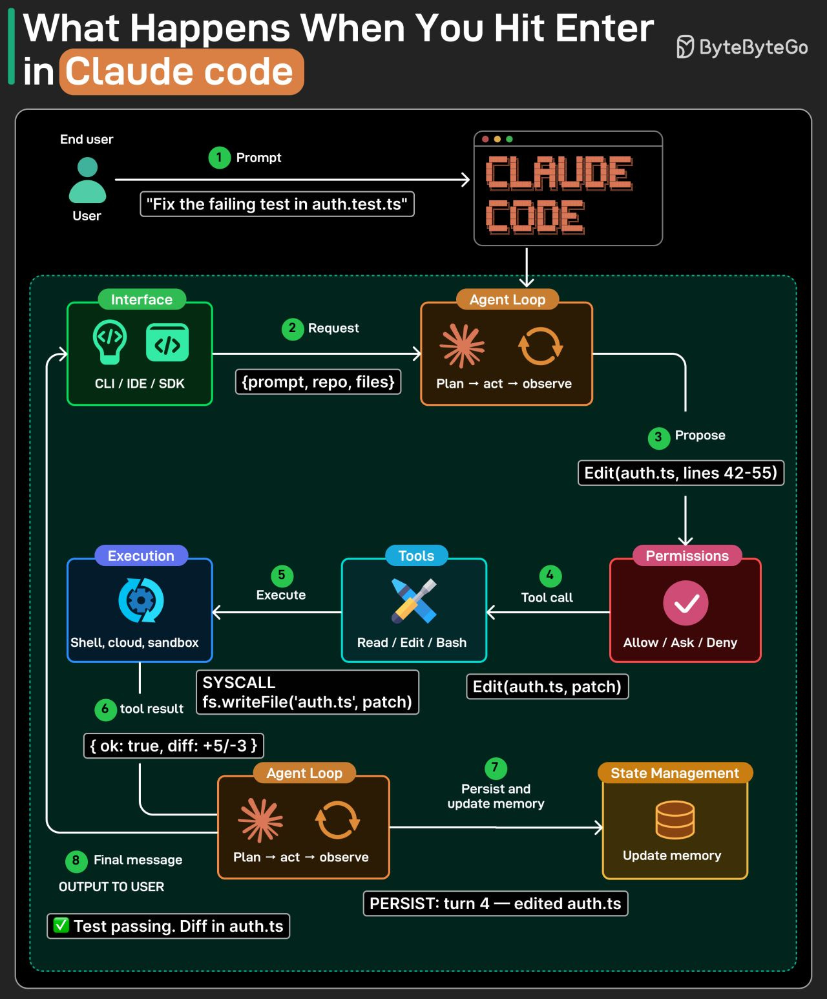

# Claude Code Architecture

## Key Takeaways

- A user prompt goes through an 8-step pipeline: submit → wrap context → plan → check permissions → dispatch tool → execute → persist state → stream response
- The core is a Plan-Act-Observe agent loop (ReAct pattern) that repeats until the task is complete
- Every tool action passes through a permission gate (Allow/Ask/Deny) before execution
- Context management uses 5 strategies in "lazy degradation" order — least disruptive first, summarization as last resort

## Request Flow

1. **User Submission** — User sends a prompt via CLI, IDE, or SDK
2. **Context Wrapping** — Interface wraps prompt with repo and file context, hands to agent loop
3. **Agent Planning** — Agent analyzes task and proposes an action (e.g., edit auth.ts lines 42-55)
4. **Permission Verification** — Permission system checks proposed action against rules (Allow / Ask / Deny)
5. **Tool Dispatch** — Approved action becomes a tool call sent to the appropriate tool (Read / Edit / Bash)
6. **Execution** — Tool runs in execution environment as a real syscall; returns result
7. **State Persistence** — Agent persists the turn to state and updates memory
8. **Streaming Response** — Agent streams the final message to the user

The system repeats the Plan-Act-Observe loop iteratively until the model completes the task and stops requesting tools.

## Context Management

Applied in order of least to most disruptive:

1. **Budget Reduction** — Individual tool outputs capped in size; oversized results replaced by content references
2. **Snip** — Removes oldest history segments, marks the boundary where trimming occurred
3. **Microcompact** — Tool turns pruned by `tool_use_id`, maintaining prompt cache compatibility
4. **Context Collapse** — Read-time projection across full conversation history to compress information
5. **Auto-compact** — Final fallback: model generates comprehensive summary of previous turns

---

**Source:** https://blog.bytebytego.com/i/198874402/how-does-a-request-actually-travel-through-claude-code
**Source:** https://blog.bytebytego.com/i/198874402/how-does-claude-code-keep-long-sessions-from-running-out-of-context
**Date:** 2026-05-23
**Tags:** claude-code, architecture, agent-loop, context-window
