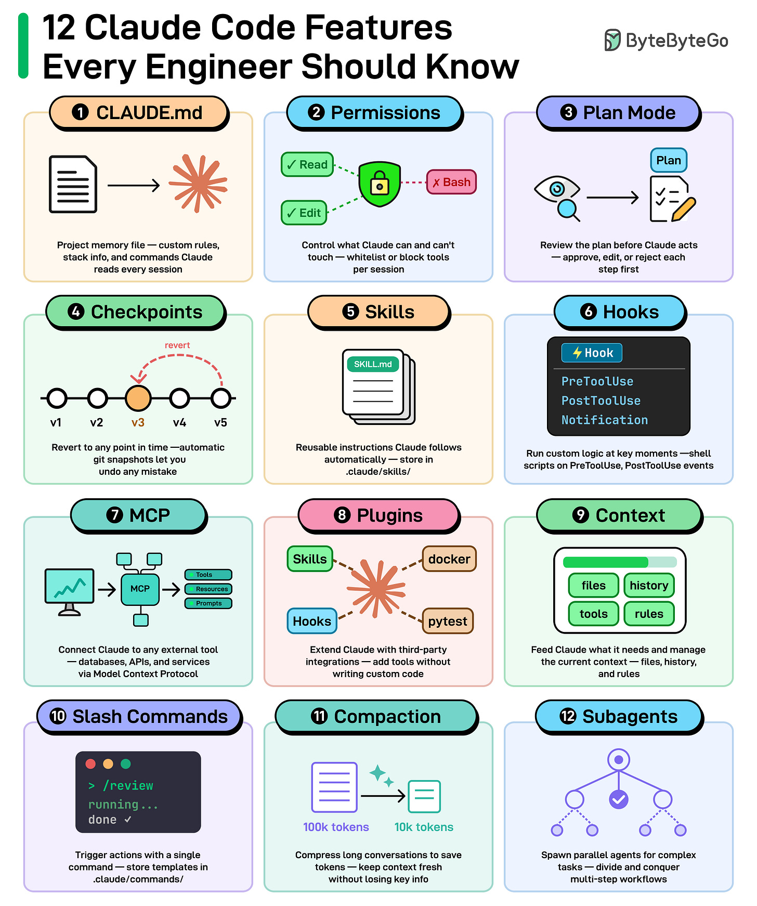
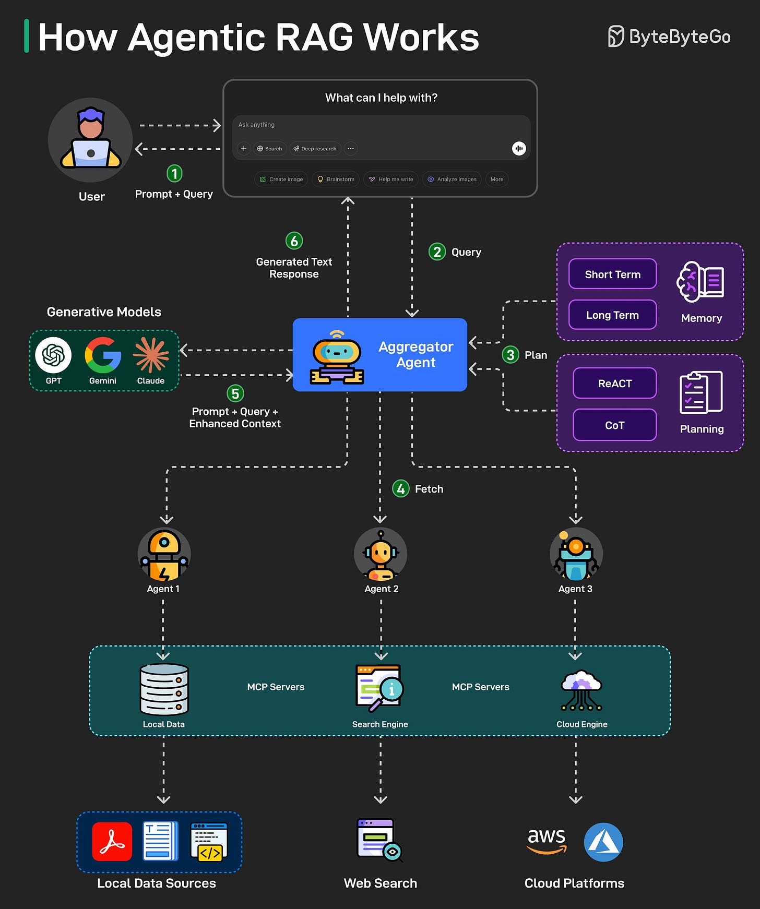

# Claude Code: 12 Features Reference

A reference of the 12 features that turn Claude Code from a chat REPL into a production coding harness.

## Key Takeaways

- Claude Code's value isn't any single feature — it's how 12 interlocking primitives let you safely run an agent on real engineering work
- The 12 cluster into **three layers**: configuration & safety (CLAUDE.md, Permissions, Plan Mode, Checkpoints), extensibility (Skills, Hooks, MCP, Plugins), and runtime workflow (Context, Slash Commands, Compaction, Subagents)
- Project-anchored config (`CLAUDE.md` + Permissions + Slash Commands) is the foundation — set this up before adopting extensibility surfaces
- Plan Mode + Checkpoints is the safety net for any non-trivial multi-file change
- For complex multi-step workflows, **Subagents** parallelize and **Compaction** keeps token cost bounded — both are how long sessions stay viable

## Layer 1: Configuration & Safety

### 1. CLAUDE.md
A per-project memory file Claude reads at the start of every session. Codify per-repo coding standards, architecture, and workflows so behavior stays consistent across sessions. Generate with `/init`; keep under ~150 lines.

### 2. Permissions
Control which tools Claude can and can't use. Lock down destructive shells, network calls, or production-touching tools while allowing safe read tools by default. Prefer `.claude/settings.json` over `--dangerously-skip-permissions`.

### 3. Plan Mode
Claude plans before it acts so you can review the plan *before* any code changes. Enter via Shift+Tab. Use for risky or multi-file changes — review and approve an approach before edits land.

### 4. Checkpoints
Automatic snapshots of your project that you can revert to if something goes wrong. Roll back an unwanted agent edit without manual git surgery.

## Layer 2: Extensibility

### 5. Skills
Reusable instruction files Claude follows automatically. Encapsulate recurring task recipes (security review, refactor pattern, blog ingestion) so Claude applies them on demand.

### 6. Hooks
Run custom shell scripts on lifecycle events (`PreToolUse`, `PostToolUse`). Auto-run linters/formatters/tests after edits, or block disallowed commands before execution.

### 7. MCP (Model Context Protocol)
Connect Claude to external tools — databases, ticketing systems, internal APIs — via MCP servers. Standardizes the N×M integration problem (N agents talking to M backends) into N+M.

### 8. Plugins
Bundles of skills + MCPs + hooks distributed as a single unit. Install a community/vendor bundle to drop in capabilities without per-piece wiring.

## Layer 3: Runtime Workflow & Context

### 9. Context
The runtime context window — what Claude actually sees this turn. Inspect with `/context`; curate during long sessions to avoid waste or pollution.

### 10. Slash Commands
Create shortcuts for repeated workflows. Type `/` and pick from saved commands. Live in `.claude/commands/`. Examples: `/add-blog`, `/course-notes`, `/commit-push-pr`.

### 11. Compaction
Compress long conversations to save tokens. Automatic at ~95% capacity in Claude Code; can also be triggered manually with `/compact`. Keeps extended sessions within model context limits.

### 12. Subagents
Spawn parallel agents for complex tasks. Divide large multi-step workflows and run them simultaneously, then consolidate results. Foundational for fan-out work like ingesting many blogs concurrently or reviewing a large PR from multiple angles.

## How They Fit Together

The three layers compose:
- Set **configuration** to anchor behavior
- Use **extensibility** to integrate your environment
- Use **runtime control** to operate long sessions safely

A typical session uses ~6 of the 12 at once: CLAUDE.md (1) sets context, Permissions (2) bound tool use, Plan Mode (3) drives the approach, Slash Commands (10) trigger the workflow, MCP (7) reaches external systems, Compaction (11) keeps the context window healthy.

## Related

- [Claude Code architecture](claude-code-architecture.md) — what's happening under the hood when these features run
- [Claude Code workflow tips](claude-code-workflow.md) — how to actually use these in daily work
- [Claude Code vs OpenClaw](claude-code-vs-openclaw.md) — architectural comparison to an alternative
- [LLM tool use and MCP](../concepts/llm-tool-use-and-mcp.md) — deeper on the MCP feature
- [MCP vs agent skills](../concepts/mcp-vs-agent-skills.md) — when to use Skills vs MCP

---

**Source:** https://blog.bytebytego.com/p/ep209-12-claude-code-features-every
**Date:** 2026-06-05
**Tags:** claude-code, anthropic, ai-coding, mcp, hooks, skills, plugins, subagents, slash-commands, plan-mode, checkpoints
