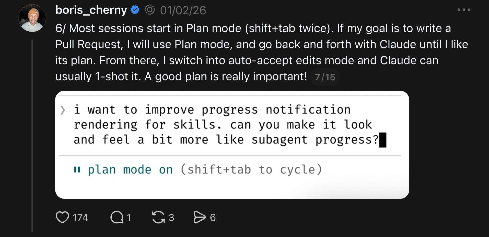
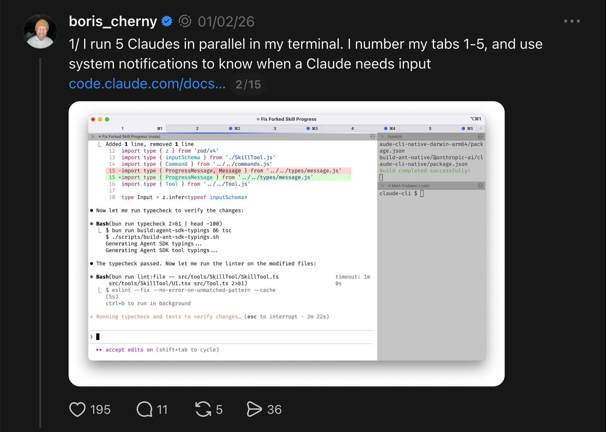
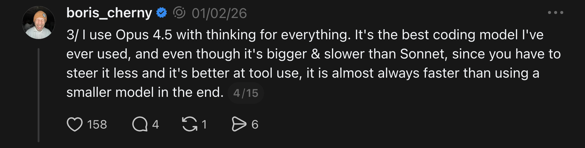
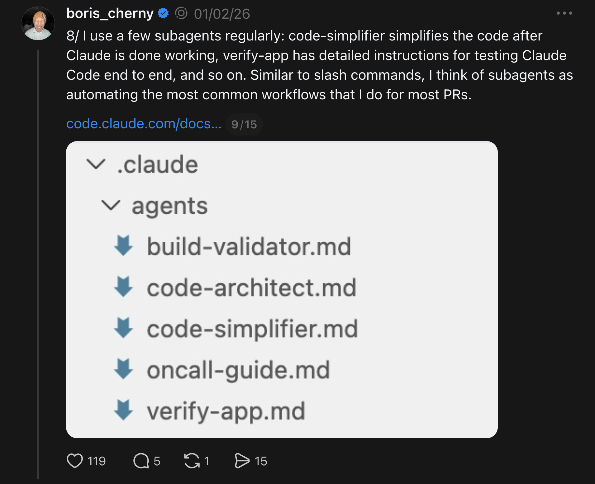
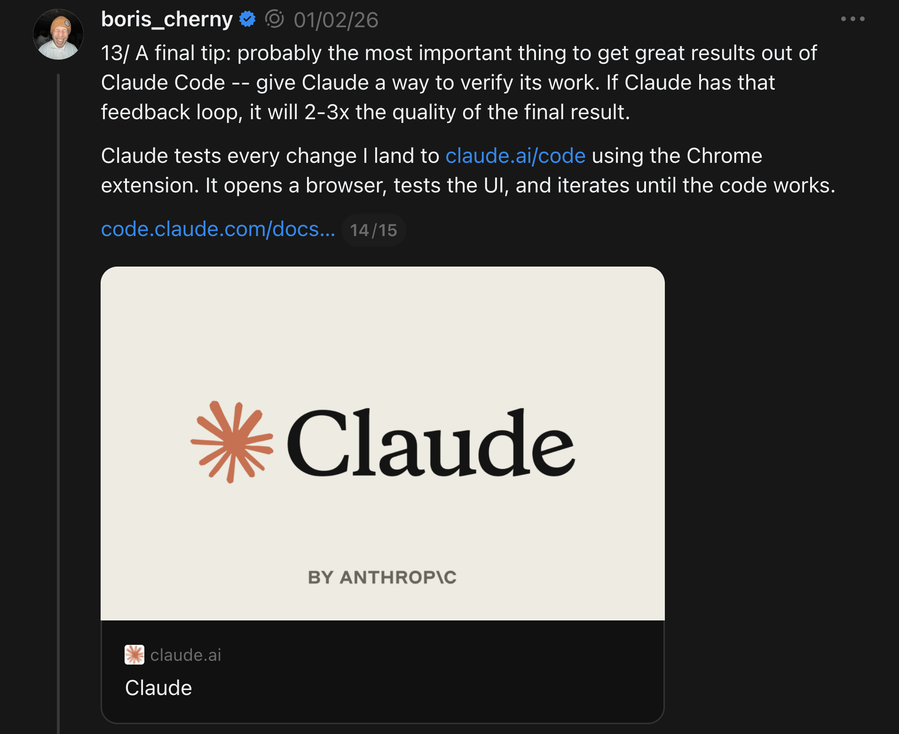

# Claude Code: Workflow Tips

How to actually use Claude Code in daily work — from beginner setup through how Claude Code's own creator runs his fleet of agents.

## Key Takeaways

- **Treat Claude Code as a fleet, not a tool.** Boris (the creator) runs 5 terminal Claudes + 5-10 web Claudes in parallel — context-switching, not coding speed, is the bottleneck
- The core workflow loop is **Explore → Plan → Execute → Verify** — skip it and you'll waste a session debugging Claude's confidently-wrong code
- **CLAUDE.md is institutional knowledge that compounds.** Commit it to Git, update it multiple times a week, and have Claude itself review PRs and propose updates to it
- **Default to Opus with thinking.** Slower per call, but you steer less, so it's faster end-to-end on multi-step work
- The single highest-leverage tip: give Claude a **deterministic way to verify its own work** (browser test loop, agent-stop hooks). Claimed to 2-3x output quality

## Setup

Install via the one-liner for your OS:

```bash
# macOS / Linux
curl -fsSL https://claude.ai/install.sh | bash

# Homebrew
brew install --cask claude-code

# Windows PowerShell
irm https://claude.ai/install.ps1 | iex

# WinGet
winget install Anthropic.ClaudeCode
```

Requirements: macOS 13+, Win10 1809+ (or WSL), Ubuntu 20.04+, 4GB RAM.

Run `claude` in any project folder; auth via browser. First action: `/init` to generate a starter `CLAUDE.md`.

## The Core Loop: Explore → Plan → Execute → Verify



```
1. EXPLORE  (read-only)   — "map this directory, explain the data flow"
2. PLAN     (Shift+Tab)   — Plan Mode, no edits, produce a plan.md, review/edit
3. EXECUTE  (on a branch) — phased implementation, Esc to interrupt anytime
4. VERIFY                  — run tests, have Claude fix failures, review diffs
```

The four steps map to the four big risks:
- Skipping **Explore** → wrong assumptions about the codebase
- Skipping **Plan** → multi-file edits you didn't authorize
- Skipping **branch isolation in Execute** → can't unstick if it goes sideways
- Skipping **Verify** → "looks right" code that breaks at runtime

## CLAUDE.md — The Onboarding File

Generate with `/init`. Keep under ~150 lines. Sections that work in practice:

```markdown
# Project
One-paragraph description.

## Code Style
- Language, framework, conventions
- Lint/format rules

## Commands
- `pnpm dev` — start dev server
- `pnpm test` — run tests
- `pnpm lint` — lint

## Architecture
- Folder layout
- Major modules
- Data flow

## Rules
- NEVER commit `.env`
- Always use pnpm (not npm)
- Run tests before commits
```

Anthropic reports engineers onboard **80% faster** to new codebases with a solid CLAUDE.md.

### Update CLAUDE.md continuously

Every time Claude makes a mistake you have to correct, the correction belongs in CLAUDE.md. Treat the file as an evolving institutional record, not a one-time setup artifact.

**Compounding Engineering pattern** (Dan Shipper / Boris's team): tag `@claude` on PRs via the Claude Code GitHub Action. On review, ask Claude to propose CLAUDE.md updates based on what went wrong. Every PR becomes an opportunity to make the agent smarter for next time.

## Boris's Fleet: Running Claude in Parallel



The creator of Claude Code runs:
- **5 local Claudes** in numbered terminal tabs (tabs 1-5), system notifications signal when input is needed
- **5-10 web Claudes** at claude.ai/code, used in parallel with local

The mental model: context-switching is the bottleneck, not coding speed. You're "playing StarCraft with your codebase" — orchestrating multiple parallel workers and supervising their handoffs.

The "teleport" feature pushes a local session to web — useful for resuming work from a different device or the iOS app.

## Use Opus with Thinking



Boris's default: Opus with extended thinking for everything.

> "Even though it's bigger and slower than Sonnet, you have to steer it less."

Per-session it's slower; end-to-end it's faster because you spend less time correcting wrong assumptions. Particularly true for tool-heavy work (multi-file edits, code review, debugging).

## Prompt Engineering for Claude Code

The formula that works:

```
ACTION + TARGET FILE + TECH STACK + CONSTRAINTS + REFERENCE PATTERN
```

**Bad:** "Add a contact form."

**Good:** "Add a contact form in React with Zod validation in `src/components/ContactForm.tsx`, using strict TypeScript and Tailwind CSS, following the patterns in `src/components/LoginForm.tsx`."

Other principles:
- **One prompt, one task** — don't pile multiple unrelated changes into a single prompt
- **Reference existing patterns** — Claude is much better at matching than inventing
- **For complex tasks, ask Claude to ask you clarifying questions first** — the back-and-forth costs less than a wrong implementation

## Context Management

Symptoms of context decay:
- Claude ignores rules from CLAUDE.md
- Re-asks questions already answered
- Produces code that contradicts earlier code in the same session

Commands:

| Command | When | Effect |
|---|---|---|
| `/context` | Periodically during long sessions | Inspect what's currently in-window |
| `/compact` | After ~30 exchanges | Compresses history to ~60-70% of size |
| `/clear` | Switching tasks | Reset entirely |

**Cap MCP servers at 3-4.** Each MCP server adds ~20K tokens to the system prompt just from tool descriptions. Adding seven Slack-Jira-DB-CI-monitoring-search-docs MCPs eats your context window before the session starts.

**One objective per session.** When you switch tasks, `/clear`. Resist the temptation to "while we're here, also fix..."

## Slash Commands

Store in `.claude/commands/`. Type `/` to invoke. Examples that pay off:

- `/commit-push-pr` — full ship sequence in one keystroke
- `/add-blog` — repository-specific workflow
- `/review` — your team's PR review checklist as a workflow

Slash commands can include inline bash, file references, and parameterized arguments. Check them into Git so the whole team gets them.

## Custom Subagents



Define specialized agents in `.claude/agents/` for repeated patterns:
- **Code Simplifier** — reviews diffs for over-engineering
- **Verify App** — runs the app and tests UI flows with browser tools
- **Security Reviewer** — known vulnerability patterns
- **Test Generator** — produces unit/integration tests from code

With **Agent Teams** (Opus 4.6+), define role-based agents that can call each other for complex workflows.

## Permissions over Dangerous-Skip

Use `/permissions` and check `.claude/settings.json` into Git rather than `--dangerously-skip-permissions`. Pre-allow common, safe bash commands; require explicit approval for risky ones.

Sharing permissions in Git means the team operates with the same safety boundaries.

## MCP for Tools

Connect Slack, BigQuery, Sentry, GitHub, internal APIs via MCP servers. Configs go in Git so they're shared.

Two warnings:
- **MCPs eat context.** Each server's tool descriptions live in the system prompt. Aggressive cap: 3-4 servers active per session.
- **Prompt injection risk.** MCP responses become Claude's context. A malicious response can issue instructions. Apply least-privilege per MCP and review return values when bridging external systems. See [agent identity and auth](../concepts/agent-identity-and-auth.md) for the broader trust model.

## Verification Loops — The Highest-Leverage Tip



> "Give Claude a way to verify its own work" — claimed to 2-3x final output quality.

Concrete patterns:
- **Chrome extension / Playwright** — Claude opens the browser, exercises the UI, sees errors, iterates
- **Agent-stop hooks** — deterministic check runs on every agent stop (lint, type-check, smoke test)
- **Custom Verify-App subagent** — kicks off the app and tests it after major edits
- **Background validation agent** — long-running tasks finish with verification before declaring success

The pattern: any feedback loop that's **deterministic** beats any prompt instructing Claude to "verify your work."

## Primary Use Cases (Ranked by Value)

1. **Debugging** — paste raw errors, full stack traces, last 3 commit diffs. Most bugs resolve in <3 exchanges. Highest ROI use case.
2. **Onboarding to unfamiliar codebases** — 80% faster with solid CLAUDE.md. Have Claude explain modules instead of reading docs cold.
3. **Refactoring at scale** — Builder.io refactored an 18,000-line React component with cross-import renames. IDE tools can't compete at this scale.
4. **Test writing** — Claude matches your existing framework and patterns.

## Compared to Cursor and Copilot

| | Copilot | Cursor | Claude Code |
|---|---|---|---|
| **Context window** | ~8K | ~70-120K | **1M (Opus 4.6)** |
| **Mode** | Inline autocomplete | IDE-embedded chat + edits | Terminal agent |
| **Best for** | Typing assistance | Multi-file IDE edits | Complex multi-file agentic work |
| **Quality vs Cursor** | n/a | baseline | ~30% less rework reported |

Many devs run both: Claude Code for complex multi-file/agentic work, Copilot or Cursor for inline-while-typing help.

## Pricing (as of 2026)

| Plan | Price | Sufficient for |
|---|---|---|
| Free | $0 | Web chat only, no Claude Code |
| Pro | $20/mo | Daily individual use, ~10-45 prompts per 5-hour window |
| Max 5× | $100/mo | Heavy users, 1M-token Opus 4.6 |
| Max 20× | $200/mo | Highest priority, 20× capacity |

API users typically spend ~$6/day for heavy use; Max plans are often better value.

## Related

- [Claude Code architecture](claude-code-architecture.md) — internals
- [Claude Code: 12 features](claude-code-features.md) — feature reference
- [Claude Code vs OpenClaw](claude-code-vs-openclaw.md) — architectural comparison
- [AI-native engineering](../agents/ai-native-engineering.md) — broader pattern of orchestrating AI agents
- [Context engineering](../concepts/context-engineering.md) — the discipline behind CLAUDE.md and `/compact`

---

## Optimize the CLI Environment, Not Just the Prompts

A useful framing: **treat Claude Code like a new engineer joining your team**. New engineers need optimized environments — good shell tooling, fast lookups, clear errors. Same for Claude Code. Pre-installing the right CLI tools makes its work materially better.

When asked to audit its own environment, Claude Code consistently flags these tools as missing-but-wanted:

| Tool | Why Claude Code wants it |
|---|---|
| **ripgrep (`rg`)** | Modern grep replacement; faster, respects `.gitignore` — what Claude wants to use for code search |
| **fd** | Modern `find` replacement; same speed/`.gitignore` benefits |
| **fzf** | Interactive filtering in pipes (`<some_cmd> \| fzf`) |
| **DuckDB** | Direct SQL on CSV / Parquet / JSON files without Python wrapping |
| **git-delta** | Structured, line-numbered diffs that Claude parses much better than raw `git diff` |
| **xh** | Structured-output HTTP client; cleaner than curl for inspection |
| **watchexec** | File-change monitoring — Claude can react to edits without manual prompting |
| **just** | Task runner Claude prefers over Makefiles (simpler grammar) |
| **semgrep** | Deterministic static analysis; lets Claude check for patterns rather than guess |

The author's framing: **"Claude doesn't actually have preferences"** — these recommendations emerge from what Claude's analysis features depend on. Installing them isn't just about making Claude happier; it's about giving its built-in tools the substrate they're optimized for.

The general principle: **invest in dev-environment ergonomics as a multiplier on Claude Code output**. The cost of `brew install` is small; the cumulative effect over a year of agentic coding sessions is large.

---

**Source:** https://ainative.to/p/how-to-use-claude-code-beginners-guide
**Source:** https://getpushtoprod.substack.com/p/how-the-creator-of-claude-code-actually
**Source:** https://sderosiaux.substack.com/p/claude-code-told-me-what-tools-it
**Date:** 2026-06-05 (initial + CLI-tools-for-Claude addition same day)
**Tags:** claude-code, workflow, plan-mode, claude-md, mcp, slash-commands, subagents, parallel-agents, compounding-engineering, opus, verification-loops, cli-tools, ripgrep, duckdb, environment
