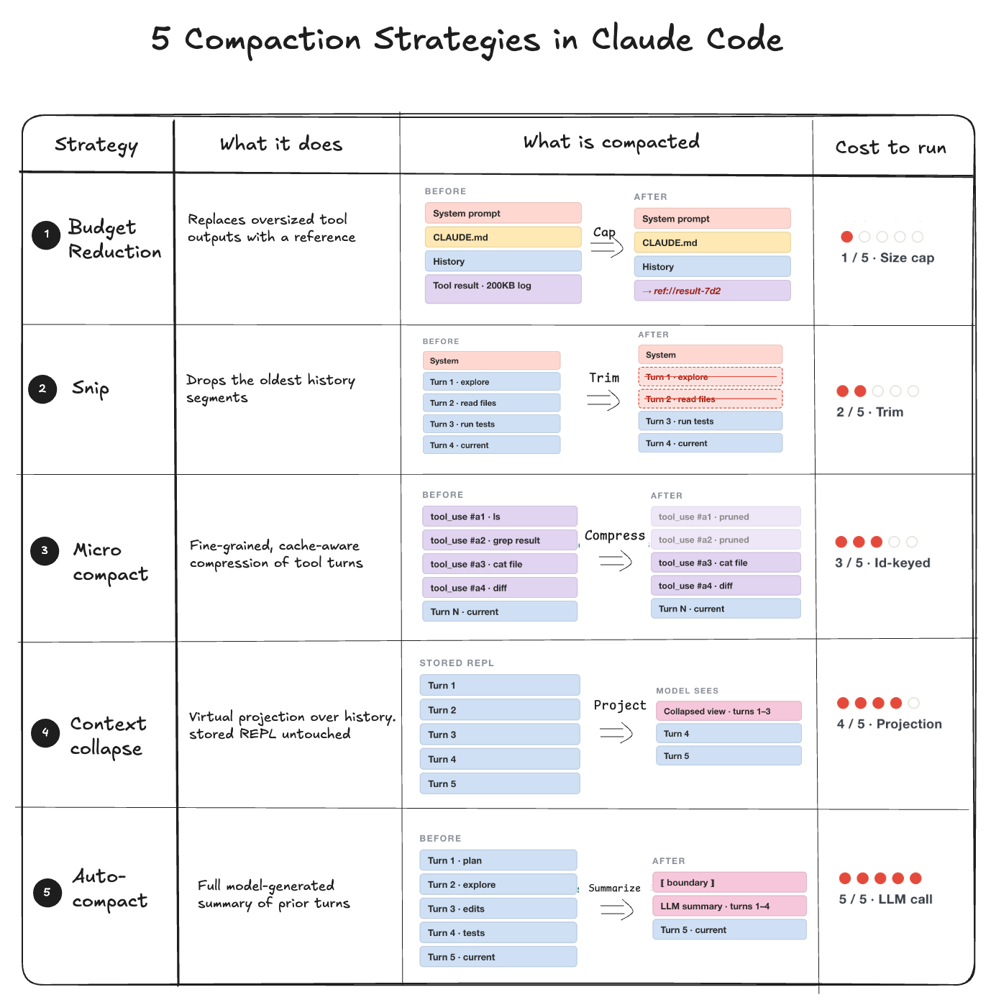

# How Does Claude Code Keep Long Sessions From Running Out of Context

## Key Takeaways

- Claude Code uses 5 strategies run in sequence before every model call to prevent context overflow
- Follows a "lazy degradation" pattern — least disruptive shaper first, escalate only when cheaper layers prove insufficient
- Summarization is the last resort, not the first

## The Five Strategies

Applied in order of least to most disruptive:

1. **Budget Reduction** — Individual tool outputs are capped in size. Oversized results are replaced by content references rather than full text.

2. **Snip** — Removes the oldest history segments and marks the boundary where trimming occurred.

3. **Microcompact** — Tool turns are pruned by their `tool_use_id` identifier, maintaining compatibility with the prompt cache for better performance.

4. **Context Collapse** — A read-time projection mechanism operates across the full conversation history to compress information.

5. **Auto-compact** — Final fallback. The model generates a comprehensive summary of previous conversation turns.

## Core Philosophy

The architecture follows a "lazy degradation" pattern: apply the least disruptive shaper first, escalate only when cheaper layers prove insufficient. This preserves context quality for as long as possible before resorting to summaries.

---

**Source:** https://blog.bytebytego.com/i/198874402/how-does-claude-code-keep-long-sessions-from-running-out-of-context
**Date:** 2026-05-23
**Tags:** claude-code, context-window, llm, architecture
