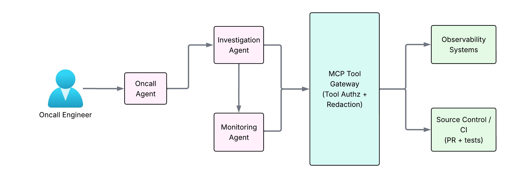
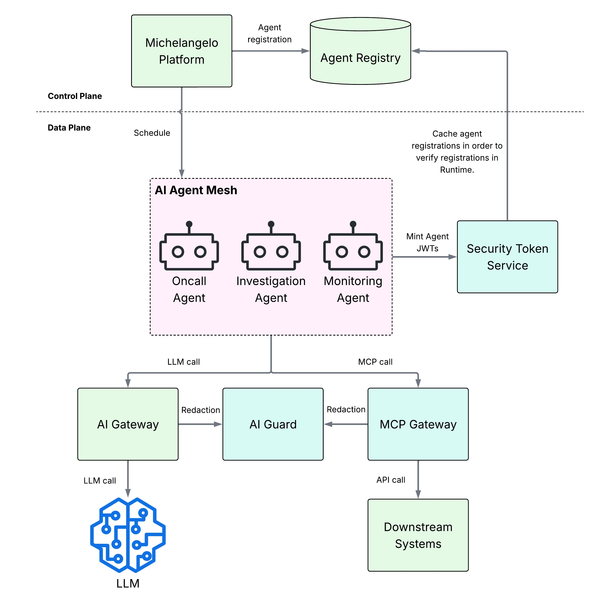
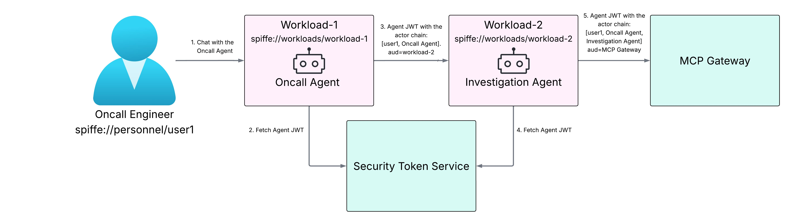
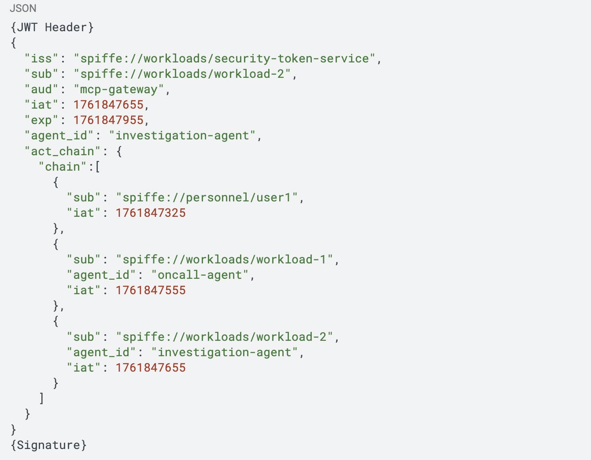

# Agent Identity and Authentication

## Key Takeaways

- AI agents need a new identity model — they're neither humans nor traditional workloads; they act *on behalf of* others through chains of delegation
- Core problem: execution context (originating user, intermediate agents) drops across agent hops, breaking audit trails and access policy enforcement
- Uber's solution: single-hop, short-lived JWT tokens with an `act_chain` carrying the full delegation lineage through every hop
- Based on OAuth 2.0 Token Exchange (RFC 8693), customized for agent provenance; P99 latency <40ms at thousands-of-agents scale
- Identity propagation belongs in the **application layer** (SDK), not just a proxy — Uber abandoned an external `agentgateway` for SDK-embedded token exchange
- Three-layer roadmap: Identity & Trust Foundation → Dynamic Access Control → Unified Enforcement Plane

## Uber Agent Identity Architecture

**Five core components:**

- **Agent Registry** — source of truth for agent-to-workload mappings
- **AI Agent Mesh** — data plane for agent communication (like service mesh)
- **Security Token Service (STS)** — dynamic trust broker issuing short-lived, scoped JWTs per hop
- **MCP Gateway** — central policy enforcement for agent-to-system calls (tool authz + redaction)
- **AI Gateway** — mediates calls to external LLM providers with guardrails (prompt injection, PII redaction)

## Identity Provisioning Flow

1. Workload fetches cryptographically signed SVID from SPIRE
2. SDK requests JWT from STS, authenticated with workload SVID
3. STS verifies agent registration in Agent Registry
4. STS returns scoped JWT for specific destination audience

## Multi-Hop Token Exchange

Each hop mints a new JWT carrying the full chain. The `act_chain` grows with every delegation:

**Design features:**

- Single-hop tokens with minutes-long TTL — no long-lived credentials
- Full contextual attribution via `act_chain`
- Standardized A2A Client automates token exchange, making the secure path the easiest path

## Why Agents Are Different From Traditional Automation

- Delegation is the default mode
- Workflows are compositional (agents calling agents)
- Behavior is dynamic (plans evolve based on results)
- Must answer: "who did what, when and why" across the full chain

## Developer Experience (Michelangelo Platform)

Two paths to author an agent, both deploy to the same Kubernetes infra and pick up identity automatically:

- **Code** — Python SDK, orchestration-framework agnostic, supports planning loops / tool use / state / memory with standardized middleware, observability, and evals
- **No-code** — UI-based authoring; opens agent building to non-engineers

The SDK is the standardized A2A client — STS token exchange and `act_chain` propagation happen inside it, so the secure path is the default path. A phased migration brings legacy agent-to-agent calls onto the standard client without disrupting functionality.

## Design Decision: SDK vs. Proxy

Uber initially considered building/adopting `agentgateway` as a proxy between agents. They abandoned it because:

1. The agentic ecosystem had standardized heavily on the SDK, making SDK integration cheaper
2. Fully solving the provenance problem requires the **application layer** — where execution context is created — not just an external proxy

Lesson: identity propagation is an application-layer concern as much as a network-layer one.

## Future Direction — Three Layers

Uber's framing for where agentic IAM is headed:

| # | Layer | What it covers |
|---|---|---|
| 1 | **Identity & Trust Foundation** | Verifiable cryptographic agent identity + delegation chain preservation (this note's focus) |
| 2 | **Dynamic Access Control** | Context-based permissions, adaptive access, human-in-the-loop, workflow authorization |
| 3 | **Unified Enforcement Plane** | Centralized policy decisions, observability, audit, governance across tools/sessions/protocols |

The premise: static human-managed permissions and fragmented enforcement don't scale in an agent-driven world.

## Standards to Watch

- **IETF WIMSE working group** drafts — workload identity in multi-system environments
- **`draft-klrc-aiagent-auth-01`** — "AI Agent Authentication and Authorization" individual draft
- **OAuth 2.0 Token Exchange (RFC 8693)** — the basis for Uber's per-hop token exchange

---

**Source:** https://www.uber.com/us/en/blog/solving-the-agent-identity-crisis/
**Date:** 2026-05-27 (initial), 2026-06-04 (enriched)
**Tags:** agents, identity, authentication, mcp, jwt, zero-trust, uber, a2a-protocol, michelangelo, spire, oauth, wimse
