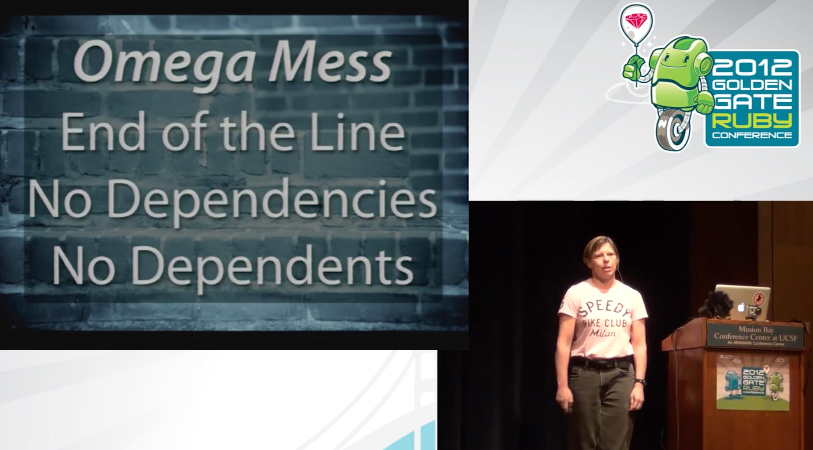
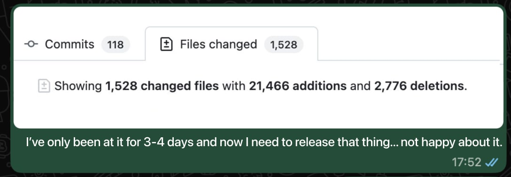

# AI-Assisted Code Review

## Key Takeaways

- LLMs are not just "slop cannons" for high-velocity, low-quality PRs — they can also be used deliberately to raise code quality
- Agent-driven code review excels at surfacing latent bugs and vulnerabilities when applied repeatedly and systematically
- Running multiple models independently and cross-comparing findings reduces false positives
- Severity ranking (critical / high / medium / low) plus human triage keeps the workflow tractable
- The slower, review-focused approach often uncovers pre-existing defects and yields deeper architectural understanding rather than just faster PR throughput

## Core Argument

The dominant framing of AI coding tools as engines for rapid, low-oversight PR generation is a misuse of the technology. Used deliberately as code-review agents, the same LLMs can identify subtle bugs and improve quality — trading raw speed for compounding gains in code health and developer understanding.

## Practical Techniques

- **Multi-model validation** — run several LLM agents (e.g., Claude, Codex) over the same codebase independently and compare findings to filter false positives
- **Repeated passes** — throw agents at a codebase enough times; bugs surface that single passes miss
- **Severity triage** — bucket findings into critical / high / medium / low and have a human validate before acting
- **Selective fixing** — deploy agents to fix critical/high items; explicitly skip fixes where effort exceeds benefit
- **Abandon-the-PR heuristic** — when review reveals a fundamentally flawed approach, abandon the PR rather than patch it
- **Comprehension tooling** — use LLMs for documentation and explanation passes to deepen architectural understanding
- **Accept tangential fixes** — expect quality-focused workflows to uncover pre-existing defects that need fixing alongside the current work

## The Inversion

The default AI-coding workflow optimizes for *output velocity*: more PRs, faster. The review-oriented workflow optimizes for *defect discovery and codebase understanding*: fewer PRs, deeper insight, compounding quality gains.

> "LLM agents are really good at finding bugs. Throw them at a codebase enough times, and they will find so many bugs..."

## When to Use Which Mode

| Mode | When to Use |
|------|-------------|
| Velocity (generate code) | Greenfield work, prototypes, low-stakes changes |
| Review (find bugs) | Production code paths, security-sensitive surfaces, legacy modules of unknown quality |
| Comprehension | New-to-codebase onboarding, architectural review, refactor planning |

## Practitioner Discipline: Don't Lose Your Skills

A complementary discipline from a working engineer's daily workflow: AI as force-multiplier, not replacement. The risk it addresses is the same pattern aviation faced when autopilot eroded pilot skills ("Children of the Magenta") — and earlier abstractions like ORMs and garbage collectors before that.

### The Hybrid Discipline

- **Vibe-code throwaway/personal tools freely** — small scripts, dev utilities, one-shot prototypes
- **For production code: review 100%, hand-write ~50%** — preserve the muscle that lets you vet AI output
- **Plan manually first, then use Claude's planning mode for comparative feedback** — keeps architectural thinking sharp
- **5x speed gains shift the bottleneck from typing to thinking** — deliberate pondering and breaks matter more than shipping cadence
- **Use AI agents on well-isolated "Omega Messes"** (Sandi Metz: code with no dependencies, no dependents) where blast radius is contained

### The Volume Problem

When AI is left unchecked on production code, output volume becomes the failure mode. A 1.5k-file diff in 3–4 days is not progress — it's debt accumulated faster than any reviewer can absorb. The discipline above (vibe-code only what's disposable; hand-write half of production) is the guard against this.

### Practical Pattern: Hybrid Workflow for a Production Feature

1. Hand-draft the plan
2. Ask Claude for an alternative plan; compare and pick the better idea (from either)
3. Hand-write the core architecture and public API
4. Let Claude Code generate isolated modules (Omega Messes only)
5. Review 100% of generated code; rewrite anything you don't understand
6. Add a custom Claude skill for pre-release checks (lint, test, soak)
7. Multi-day soak test before shipping

### Tools Mentioned

| Tool | Use |
|---|---|
| **Claude Code** | Isolated modules only (Omega Messes) |
| **Claude planning mode** | Compare AI plan against your own |
| **Claude Skills** | Custom `/prepare_release` for pre-ship checks |
| **LLM as Stack Overflow replacement** | Reference / lookup pattern |
| **Vibe coding** | Personal tools and throwaways only |

### Why This Matters

The "review-mode" discipline at the top of this note assumes the reviewer still has the skills to catch what AI missed. The practitioner discipline preserves those skills by **not delegating the core thinking** — only the boilerplate around it.

> *"We appear to be locked into a cycle in which automation begets the erosion of skills..."* — William Langewiesche (quoted in the source article)

---

**Source:** https://nolanlawson.com/2026/05/25/using-ai-to-write-better-code-more-slowly/
**Source:** https://marcgg.com/blog/2026/04/15/my-current-ai-workflow
**Date:** 2026-06-01
**Tags:** ai-assisted-coding, code-review, llm-agents, developer-practices, code-quality, claude, codex, claude-code, vibe-coding, skill-retention, omega-mess
