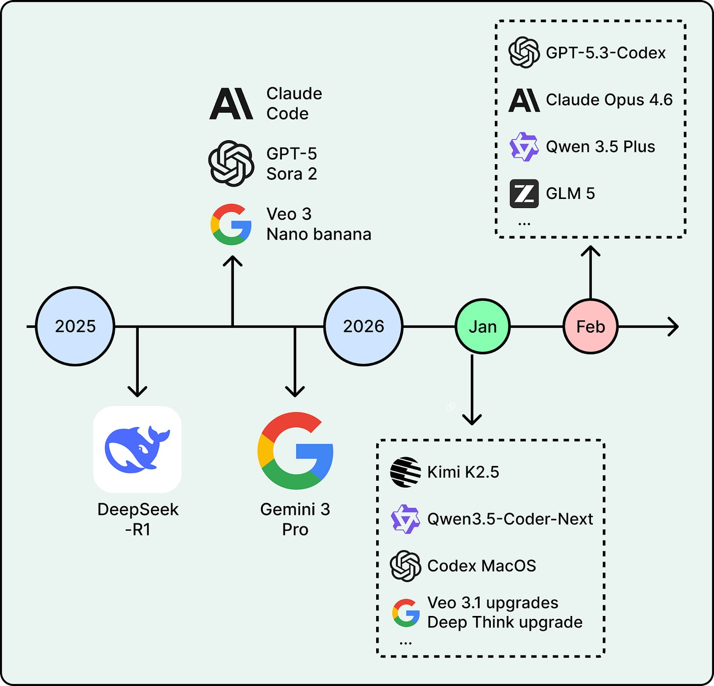
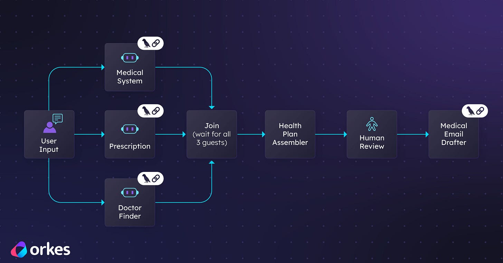
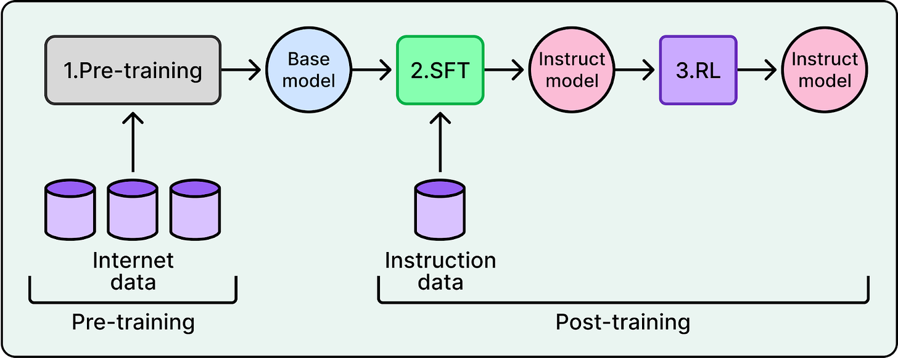
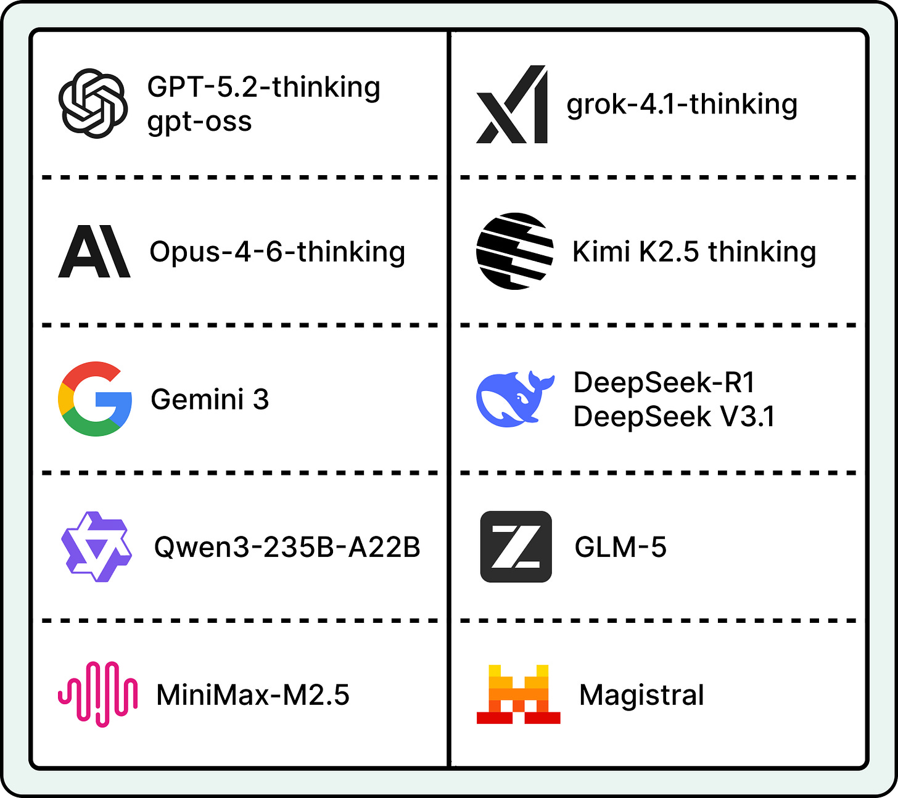
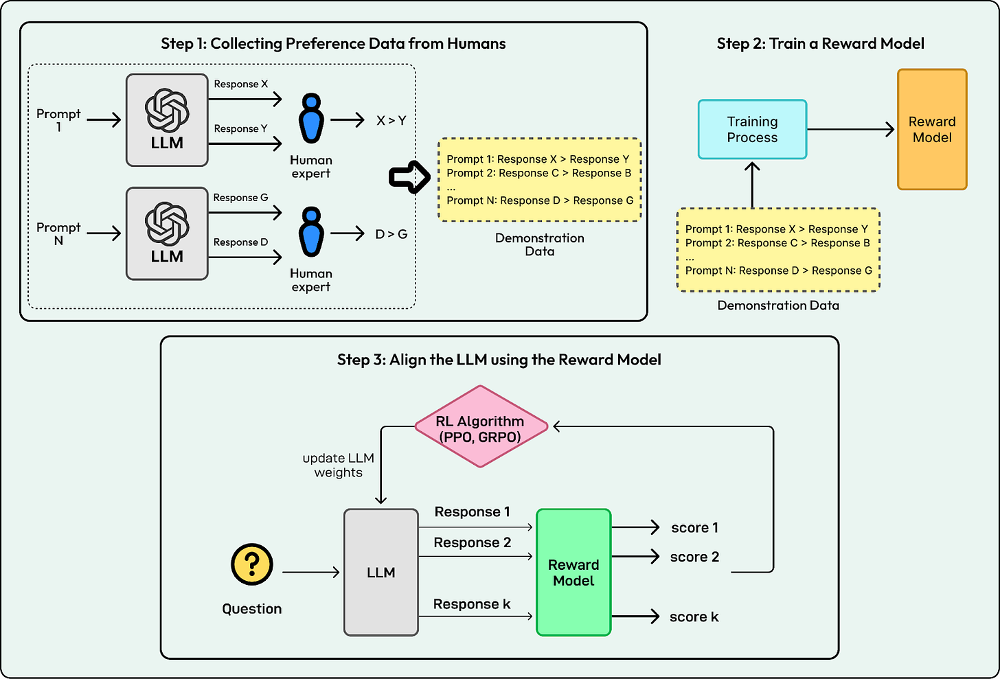
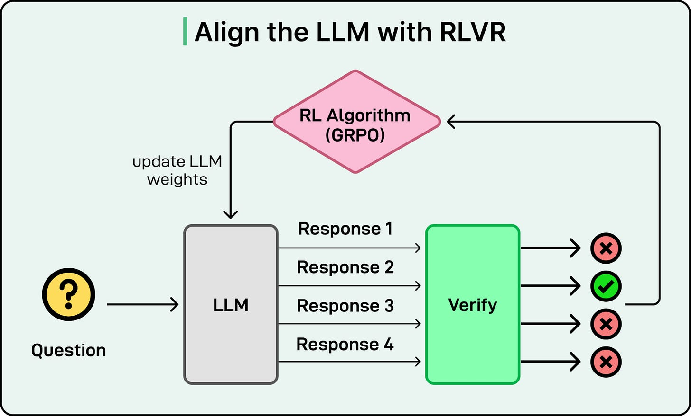
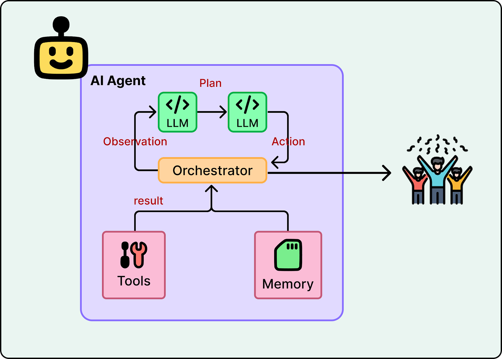
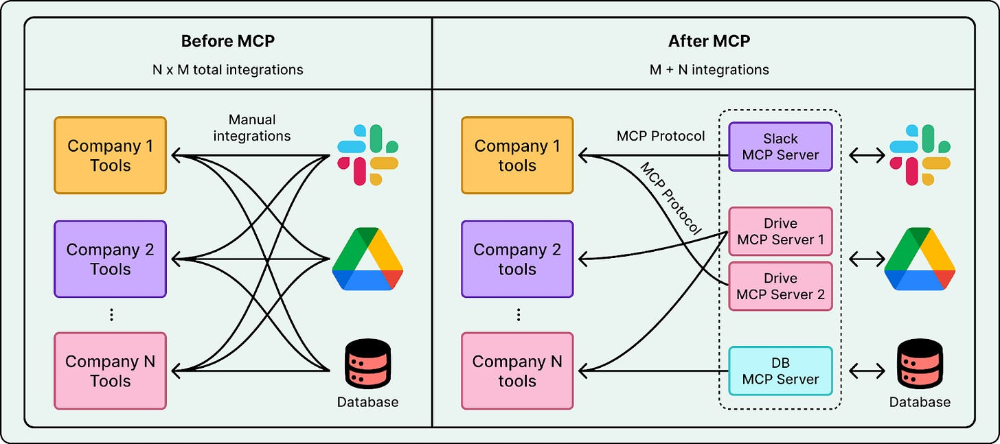
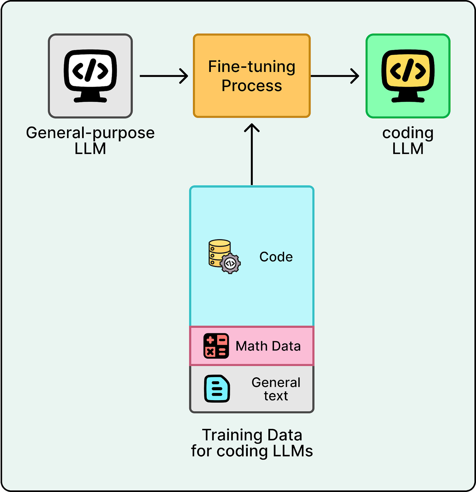
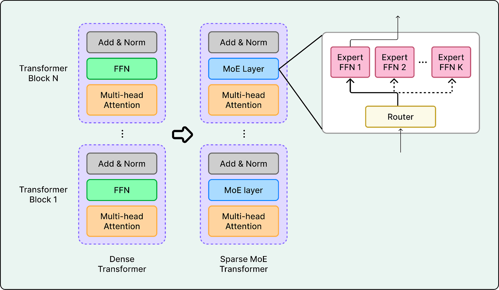

# AI Trends to Watch in 2026

Five capabilities that crossed practicality thresholds in 2025 and now reinforce each other: reasoning, agents, coding, open-weight models, multimodality.

## Key Takeaways

- 2026 isn't defined by any one breakthrough — it's the **synergy** between five mature trends. Reasoning powers better agents, agents drive coding, open weights democratize, multimodal unlocks physical AI
- **RLVR (Reinforcement Learning with Verifiable Rewards)** replaces human-preference labeling with automatic correctness checks, unblocking reasoning at scale (o1, DeepSeek-R1, Gemini 3 thinking modes)
- **DeepSeek moment** (Jan 2025) closed the open-vs-proprietary gap; 2026 emphasis shifts from raw scale to **efficiency** (sparse MoE, long context, agent-ready outputs)
- Multimodal is bifurcating into **Physical AI** (humanoid robots: Atlas + Gemini Robotics, Optimus) and **World Models** (Genie 3, NVIDIA Cosmos, LeCun's AMI Labs at €500M)
- The frontier shifts from "bigger models" to **integration, efficiency, and embodiment**



## Trend 1: Reasoning and RLVR



Models that **spend compute "thinking"** before answering — generating intermediate steps instead of jumping to the final token.

### RLVR: Reinforcement Learning with Verifiable Rewards



The pre-2025 bottleneck for reasoning training was RLHF — human preference labeling doesn't scale and is noisy on technical reasoning tasks.

**RLVR replaces human-preference labeling with automatic correctness checks.**

- Math problems → verifier checks the final answer
- Code → verifier runs the tests
- Logic puzzles → verifier checks the constraint satisfaction

Reward signal is now machine-generated, unblocking massive-scale RL.

### Evidence

| Model | Contribution |
|---|---|
| **OpenAI o1** | Pioneered chain-of-thought as a first-class capability |
| **DeepSeek-R1** | Showed frontier reasoning at scale via open weights |
| **Gemini 3** | Configurable thinking levels (compute-vs-quality dial) |

### 2026 Focus

**Adaptive reasoning** — scale thinking effort to problem difficulty for practical cost/speed. Don't think for 30 seconds when 0.1s would do; don't rush a 30-second problem.



## Trend 2: Agents and Tool Use



LLM + tools in a loop: plan, act, observe, iterate. See [ai-agent-anatomy.md](../agents/ai-agent-anatomy.md) for the canonical structure.

### Three Enablers Stacking

1. **Reasoning enables multi-step plans** — without reasoning, agents fail at anything past simple tool selection
2. **MCP standardizes tool integration** — Anthropic's Model Context Protocol turns N×M (N agents × M backends) into N+M
3. **Frameworks lower the bar** — LangChain, LlamaIndex, agent SDKs



### Evidence

- **ChatGPT Agent** — autonomous browsing
- **Claude with tool use + code execution** — composable tool workflows
- **OpenClaw** — persistent agent process
- **Custom enterprise agents** — proliferating across orgs (see [agents/](../agents/))

### 2026 Focus

**Persistent, always-on local agents** with access to personal files and apps, plus the reliability/security/error-recovery to actually trust them.

## Trend 3: Coding



From inline autocomplete (Copilot 2021) → IDE-embedded chat (Cursor 2023) → agentic coding (Claude Code, Codex 2024-2025) → fully autonomous unattended agents (Stripe Minions, Codex web 2026).

### Standard Coding-Agent Toolkit



A canonical set of tools has emerged across all coding agents:
- `read_file`
- `search_codebase`
- `edit_file`
- `run_terminal_command`
- `execute_tests`

Plus increasingly: browser control (verification), MCP-based access to internal systems.

### Evidence

- **Claude Code** ([architecture](../claude/claude-code-architecture.md), [features](../claude/claude-code-features.md), [workflow](../claude/claude-code-workflow.md))
- **OpenAI Codex** ([architecture](../agent-teams-harness-eng/openai-codex.md), [harness engineering](../agent-teams-harness-eng/harness-engineering.md))
- **Alibaba Qwen3-Coder-Next** (80B, runs on consumer hardware)
- **Stripe Minions** ([writeup](../agent-teams-harness-eng/stripe-minions.md)) — 1,300+ fully agent-written PRs/week
- **Replit, Lovable** — platforms built on top of these agents

### 2026 Focus

- Deeper repo-level understanding
- Built-in security scanning + automated test generation
- Faster multi-file changes
- Better legibility for unattended runs (see [harness-engineering.md](../agent-teams-harness-eng/harness-engineering.md))

## Trend 4: Open-Weight Models



### The DeepSeek Moment

January 2025: **DeepSeek-R1 matched closed-competitor reasoning while publishing weights, code, and methodology.**

This was the inflection point — frontier reasoning capability was no longer gatekept by proprietary APIs. The gap between closed and open models was suddenly small enough to matter.

### The Cascade

| Provider | Model | Notes |
|---|---|---|
| **Moonshot** | Kimi K2.5 | Trillion-param multimodal |
| **Alibaba** | Qwen family | Comprehensive open releases |
| **Z.ai** | GLM | Strong Chinese-market open model |
| **OpenAI** | gpt-oss (120B + 20B) | Apache 2.0, Aug 2025 |
| **Mistral, Meta, Allen Institute** | Various | Continued open releases |

### 2026 Focus

- **Efficiency** — sparse MoE (activate only relevant experts), long context, agent-ready output formats
- **Agent-ready models** with native tool use baked into training
- **Easier deployment** — new inference formats (GGUF, ONNX, MLX), direct hardware-vendor support

Open weights changed the competitive landscape; the 2026 contest is who runs efficiently in production.

## Trend 5: Multi-Modal Models



Chatbots became **natively multimodal** — text + image + video in one architecture. Generation moved from research demos to production.

### Evidence — Understanding

- **Gemini 3** — native multimodal
- **ChatGPT-5** — native multimodal
- **Open: Qwen2.5-VL** — strong open multimodal

### Evidence — Generation

- **Sora 2, Veo 3.1** (Oct 2025 / Jan 2026) — video generation
- **Nano Banana Pro / Gemini 3 Pro Image** (Nov 2025) — image generation

### The Bifurcation: Physical AI and World Models

The 2026 multimodal frontier splits into two converging directions:

### Physical AI

Humanoid robots driven by vision-language-action models:

- **Boston Dynamics electric Atlas + Google DeepMind Gemini Robotics**
- **Tesla Optimus** ramp
- CES 2026 humanoid showcases — multiple competitors

### World Models

Real-time interactive 3D environment generation — for robotics simulation, AR/VR, autonomous driving:

| | Project | Notes |
|---|---|---|
| **Yann LeCun's AMI Labs** | World models lab | Raised €500M for this thesis |
| **Google DeepMind Genie 3** | Real-time interactive 3D environments | Generated from a prompt |
| **NVIDIA Cosmos Predict 2.5** | Robot/AV simulation | Trained on 200M curated clips |

The convergence is logical: a humanoid robot needs both vision-language understanding (to follow instructions) and a world model (to predict what its actions will do).

## How the Five Trends Stack

```
Reasoning (RLVR)
   ↓ enables
Agents (LLM + tools in a loop)
   ↓ specializes into
Coding agents (Codex, Claude Code, Minions)
   ↓ democratized by
Open-weight models (DeepSeek-R1 onward)
   ↓ extended by
Multi-modal models (Physical AI + World Models)
```

Each trend reinforces the next. The compound effect is what makes 2026 feel like a phase change — not any single capability.

## What This Means for Builders

1. **Default to reasoning models** for hard problems; cost/latency overhead is decreasing
2. **Build agentic, not chat-bot** — use MCP for tool integration; design for multi-step workflows
3. **Match coding-agent surface to use case** — Codex/Claude Code for interactive, Minions-style for unattended
4. **Open-weight is a serious option** — for cost, control, privacy, and reproducibility
5. **Multi-modal isn't a future capability** — it's a current default. Plan for it
6. **The frontier is integration** — not raw model capability

## Related

- [AI engineering fundamentals](ai-engineering-fundamentals.md) — broader engineering framing
- [LLM tool use and MCP](llm-tool-use-and-mcp.md) — trend 2 in depth
- [Claude Code architecture](../claude/claude-code-architecture.md) — trend 3 evidence
- [OpenAI Codex](../agent-teams-harness-eng/openai-codex.md) — trend 3 evidence
- [Stripe Minions](../agent-teams-harness-eng/stripe-minions.md) — trend 3 evidence
- [Harness engineering](../agent-teams-harness-eng/harness-engineering.md) — trend 3 production patterns
- [Transformer architecture](transformer-architecture.md) — trend 4 (efficiency variants underpin open-weight competitiveness)
- [AI glossary](ai-glossary.md) — quick definitions for terms above

---

**Source:** https://blog.bytebytego.com/p/whats-next-in-ai-five-trends-to-watch
**Date:** 2026-06-05
**Tags:** ai-trends, 2026, reasoning, rlvr, agents, mcp, coding-agents, open-weight-models, multimodal, world-models, physical-ai, deepseek, gemini, claude, codex
