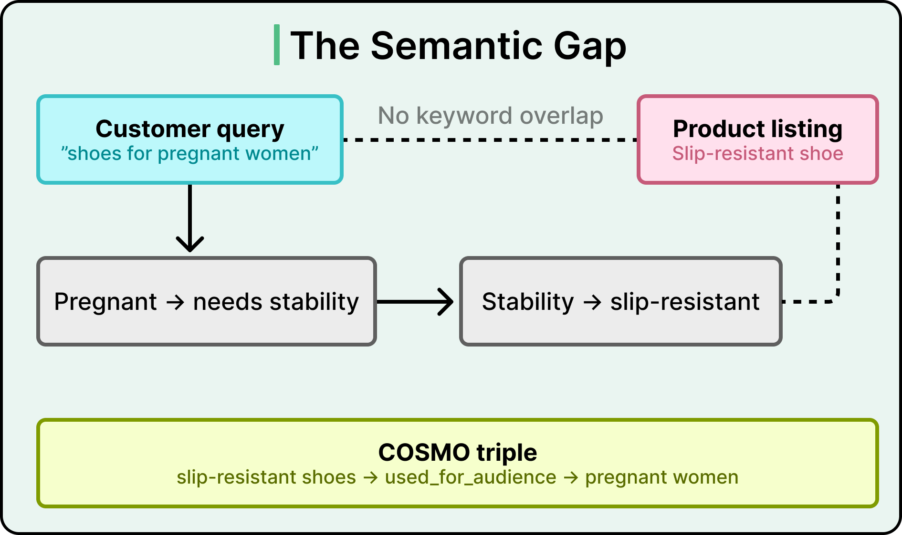
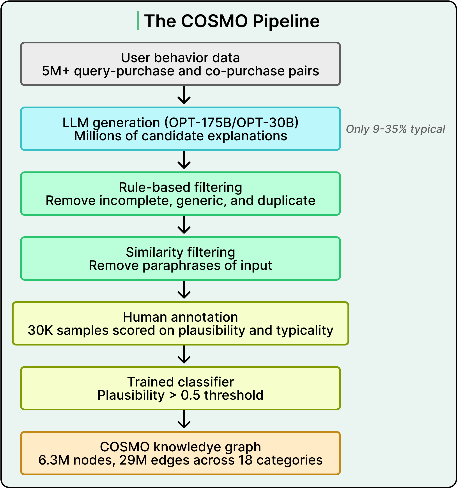
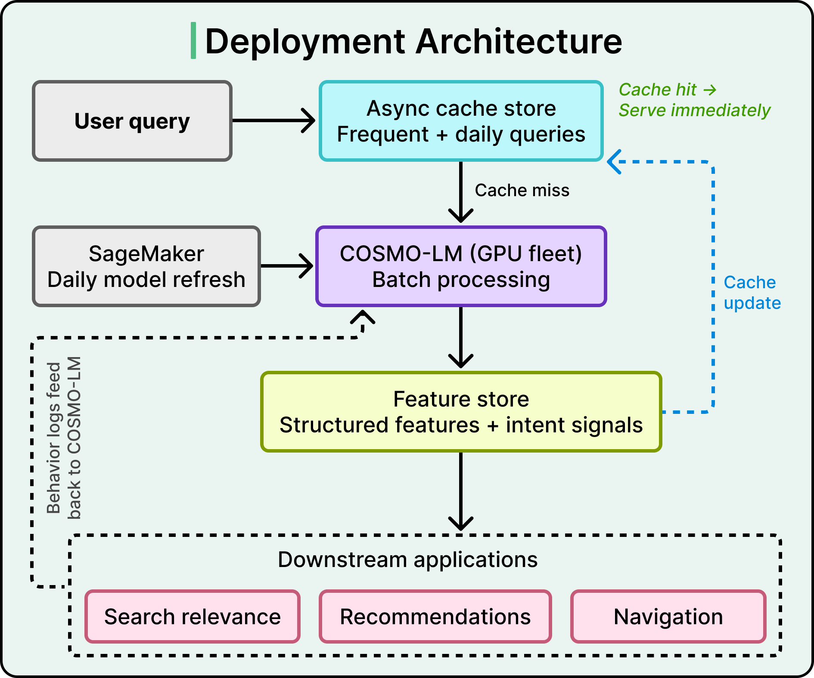
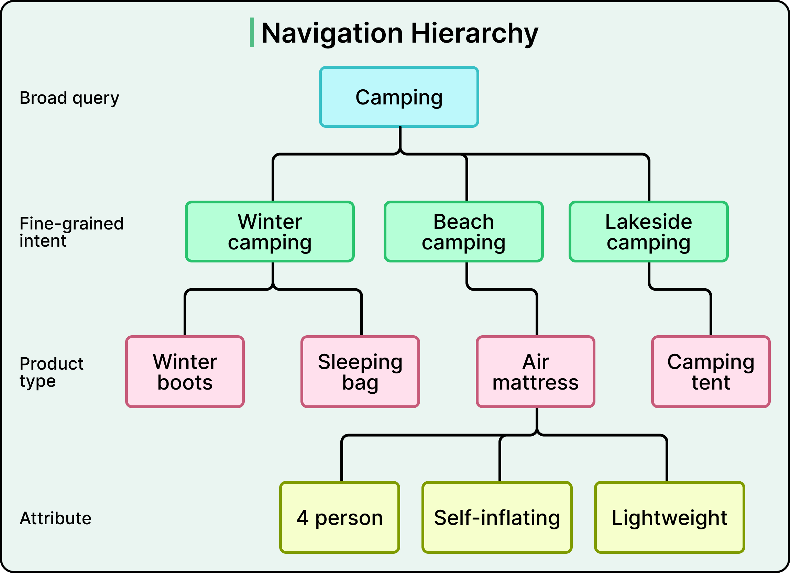

# Amazon COSMO — LLM-Generated Knowledge Graphs for Product Recommendations

## Key Takeaways

- Amazon built COSMO, a commonsense knowledge graph with 29M edges across 18 product categories, using LLMs to generate reasoning that bridges semantic gaps between search queries and products (e.g., "shoes for pregnant women" maps to slip-resistant shoes)
- Raw LLM outputs are unreliable -- only 9-35% of generated explanations met quality bars -- so Amazon treats LLMs as "noisy ore mines" requiring a multi-stage filtering pipeline with human annotation and trained classifiers
- Production serving uses a fine-tuned LLaMA 7B/13B (COSMO-LM) behind a two-tier async cache, replacing the expensive OPT-175B generation pipeline
- A/B testing showed 0.7% increase in product sales and 8% increase in navigation engagement, translating to hundreds of millions in additional annual revenue

## The Semantic Gap Problem

Traditional recommendation systems rely on keyword matching and purchase history. They fail when customer intent requires commonsense reasoning -- there is zero keyword overlap between "shoes for pregnant women" and "slip-resistant shoes," yet the connection is obvious to humans.

COSMO solves this by generating structured knowledge triples like `slip-resistant shoes -> used_for_audience -> pregnant women` that encode the commonsense reasoning search engines lack.

## The COSMO Pipeline

### LLM Generation Phase

Amazon fed 5M+ user behavior pairs (3.14M co-purchase pairs, 1.87M query-purchase pairs) into OPT-175B and OPT-30B across 18 product categories. Results were noisy: only 35% of search-buy explanations and 9% of co-purchase explanations met quality bars. LLMs produce circular rationales like "customers bought them together because they like them."

### Multi-Stage Filtering

1. **Rule-based filtering** -- removes incomplete sentences, generic statements, and duplicates
2. **Similarity filtering** -- eliminates paraphrases of original queries using embedding comparisons
3. **Human annotation** -- 30K samples scored on plausibility and typicality
4. **Trained classifier** -- DeBERTa-large predicts quality scores (plausibility > 0.5 threshold)

This pipeline transformed 30K human judgments into 6.3M nodes and 29M knowledge graph edges.

### Relation Types

Fifteen relation types emerged from LLM-generated patterns:

- `used_for_function`, `used_for_event`, `used_for_audience`, `used_in_location`
- Person-centric: `xIs_a`, `xWant`

## Deployment Architecture

### COSMO-LM

Amazon fine-tuned LLaMA 7B and 13B via instruction tuning for production serving, replacing the expensive OPT-175B pipeline. Daily model refresh via SageMaker.

### Two-Tier Caching

- **Tier 1:** Pre-loads responses for yearly frequent searches (cache hits served immediately)
- **Tier 2:** Batch processes daily for newer queries

On cache miss, COSMO-LM generates on-demand and updates the cache. Behavior logs feed back into COSMO-LM for continuous improvement.

### Downstream Applications

The Feature Store transforms raw outputs into structured features for three consumers: Search Relevance, Recommendations, and Navigation.

## Business Impact

| Application | Metric | Result |
|---|---|---|
| Search Relevance | Macro F1 / Micro F1 | 73.48% / 90.78% (surpassed leaderboard) |
| Recommendations | Hits@10 (electronics) | +5.82% via COSMO-GNN |
| Navigation (prod) | Product sales | +0.7% relative increase |
| Navigation (prod) | Engagement | +8% increase |

Navigation results alone translate to hundreds of millions in additional annual revenue. Amazon projects extending COSMO could yield billions in gains.

### Navigation Hierarchy

COSMO enables hierarchical search refinement: a broad "camping" query branches into intents (winter/beach/lakeside camping), then product types (boots, sleeping bags, tents), then attributes (4-person, self-inflating, lightweight).

## Limitations

- **Latency:** Daily refresh cycle cannot accommodate real-time events like flash sales
- **Coverage:** Aggressive filtering creates gaps for long-tail products
- **Precision over recall:** Amazon intentionally prioritized precision to avoid unreliable knowledge in production

---

**Source:** https://blog.bytebytego.com/p/how-amazon-uses-llms-to-recommend
**Date:** 2026-05-28
**Tags:** amazon, llm, knowledge-graph, recommendation-systems, cosmo, search-relevance, personalization, sagemaker
