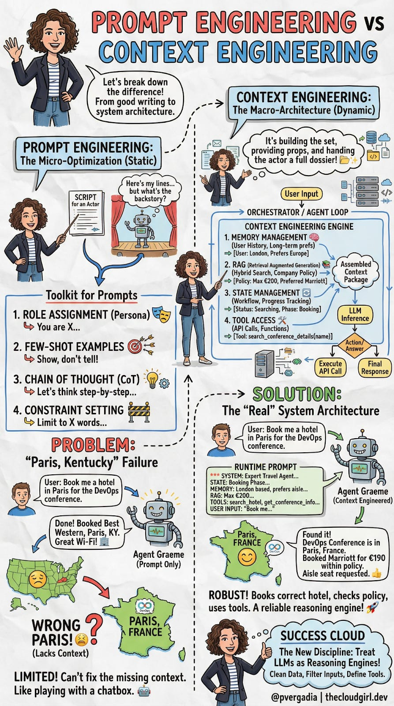
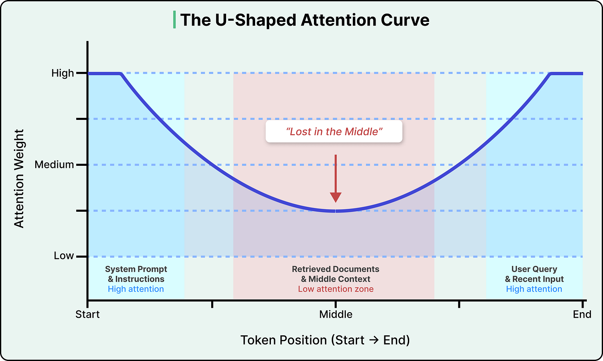
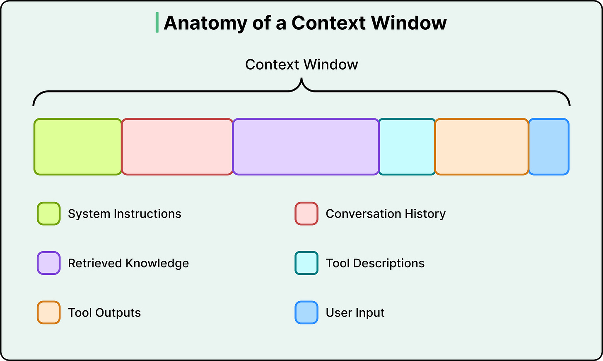
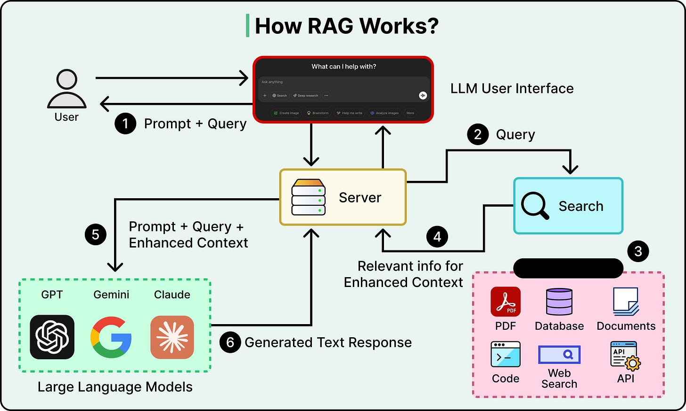
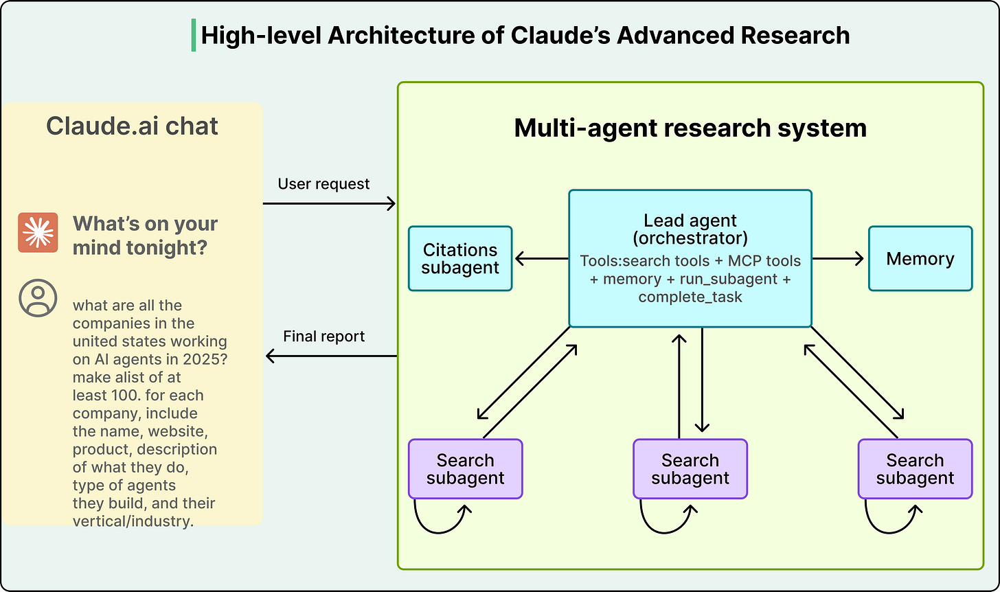
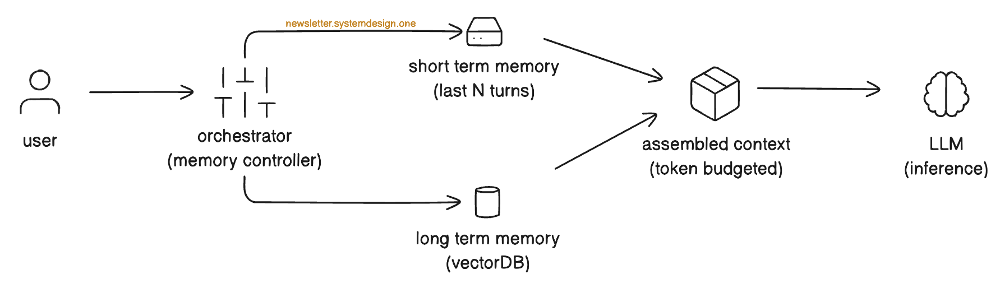
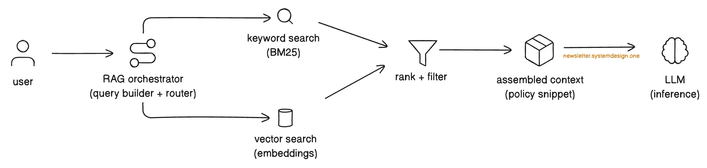
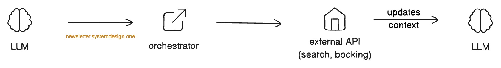
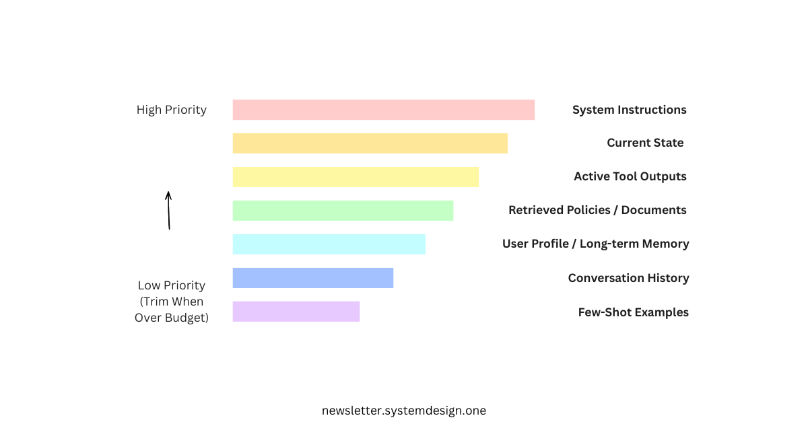

# Context Engineering

The discipline of designing, assembling, and managing the entire information environment an LLM sees at runtime — not just how you phrase a prompt.

## Key Takeaways

- **Context engineering ≠ prompt engineering.** Prompt engineering optimizes static text you send; context engineering architects the dynamic runtime assembly (memory + RAG + state + tools + user input + history)
- The diagnostic question: "Is the failure about *wording* or about *what the model can see*?" Most production "bad LLM output" is misdiagnosed as a prompting problem when it's a missing-context problem
- **More context is not free.** Attention is quadratic, models attend unevenly across the window ("lost in the middle"), and context can degrade output — a 2025 Chroma study of 18 frontier models found every one degrades with longer input, sometimes from 95% → 60% accuracy
- The four canonical strategies are **Write, Select, Compress, Isolate** (LangChain framing) — offload state, pull only relevant chunks, summarize/trim, split across specialized agents
- Anthropic's multi-agent research system reportedly achieved **90.2% improvement** over a single Opus 4 agent using identical models — purely from context management (isolation)



## Prompt Engineering vs Context Engineering

| | Prompt Engineering | Context Engineering |
|---|---|---|
| **What you optimize** | The static text of the prompt | The runtime assembly the model receives |
| **When you optimize** | Before inference (in the system prompt or template) | At every turn, dynamically |
| **Tools** | Role assignment, few-shot examples, chain of thought, output constraints | Memory stores, retrievers, state machines, tool orchestrators |
| **Analogy** | The script the actor reads | Building the entire stage, set, and props |
| **Scope** | A string concern | A systems concern |

Both matter. Prompt engineering tunes within a single call; context engineering decides what each call sees.

> "Prompt engineering is the script you hand them before the curtain rises. Context engineering is building the entire stage, providing the props, dressing the set."

## The "Paris, Kentucky" Failure

A user asks an agent: *"Book me a hotel in Paris for the DevOps conference next month."*

The agent books a Best Western in **Paris, Kentucky.** The DevOps conference is in **Paris, France.**

Diagnosis:
- The prompt was fine.
- The wording was clear.
- The model is capable.

What was missing:
- User's home location (San Francisco — distance signal)
- Conference location (Paris, France)
- Corporate travel policy (preferred hotel tier)
- User's prior bookings (always business class on this carrier)

**This isn't a prompting failure. It's an architecture failure.** No amount of re-wording fixes missing information.

## Why More Context Is Not Free

### Attention is quadratic and uneven

Doubling tokens roughly 4× the attention compute. And models don't attend uniformly:



The **"lost in the middle"** effect: accuracy drops by 30%+ when key information sits mid-context vs. at the start or end. This is partly driven by Rotary Position Embedding (RoPE) decay (see [transformer-architecture.md § Positional Encoding](transformer-architecture.md#positional-encoding)).

### Context rot

A 2025 Chroma study tested 18 frontier models on long-context tasks:
- **Every model degraded** as input grew
- Some fell from **95% → 60% accuracy** at unpredictable cliff points
- Effective context length is smaller than advertised — "1M tokens" doesn't mean usable across all 1M

Causes:
- Finite attention budget gets spread thin
- Irrelevant content buries important content
- Confusing/tangential text obscures relevance to the actual query
- Statelessness across calls (each turn re-encodes everything)

### Cost and latency

Every token = more API cost + more TTFT (time to first token). Users disengage after ~3s wait. Cost considerations alone justify aggressive context pruning.

## The Six Context Types



Every call has up to six context types competing for window space:

1. **System instructions** — role, format, constraints (always on)
2. **User input** — the actual current query
3. **Conversation history** — prior turns
4. **Retrieved knowledge** — RAG output, document chunks
5. **Tool descriptions** — schemas of callable tools
6. **Tool outputs** — return values from tool calls

Engineering the mix is the work.

## The Four Strategies (LangChain Framing)

### 1. Write — Offload to External Stores

Don't pile everything into the context window. Externalize state:

- **Scratchpads** — Anthropic's multi-agent research system uses dedicated note-taking
- **Long-term memory** — ChatGPT preferences, Cursor patterns, Claude Code's `CLAUDE.md`
- **Per-user fact stores** — extract and persist key facts after each session

The model still has to read these back in when needed — but on-demand, not always.

### 2. Select — Pull Only What's Relevant



- **RAG** for knowledge — retrieve chunks instead of stuffing whole docs
- **Tool description selection** — load only the relevant tools (not all 50)
- **Memory selection** — retrieve relevant past facts via embedding similarity, not raw history dump

Selection precision matters more than recall: imprecise RAG pushes important content into low-attention zones.

### 3. Compress — Summarize and Trim

- **Auto-compact** — Claude Code triggers compression at ~95% capacity
- **Dedicated summarization models** — Cognition uses specialized models for agent-to-agent handoff
- **Tool-output compression** — large API responses summarized before re-injection
- **History trimming** — keep last N turns at full fidelity; summarize older

Compression risks losing detail. Pair with the ability to drill back to source if needed.

### 4. Isolate — Split Across Specialized Agents



Give each agent a clean, focused context. Anthropic's multi-agent research system reported **90.2% improvement** over a single Opus 4 agent — same model, just better context allocation per sub-agent.

See [multi-agent systems](../agents/multi-agent-systems.md) for the broader pattern; [openai-data-agent.md](../agents/openai-data-agent.md) for a production six-layer context assembly case.

## Four Pillars of Production Context (Practical Framing)

For building agentic applications, the alternative framing is **four pillars**:

### Memory


- **Short-term** — rolling window of last N exchanges
- **Long-term** — semantically retrieved facts about the user (preferences, history, profile)
- **Don't dump full history** — extract key facts → store → retrieve relevant ones per turn

### RAG


Hybrid keyword (BM25) + semantic vector search, with smart filtering. See [rag.md](rag.md).

### State Management
Track workflow phase explicitly. Booking example: Discovery → Search → Selection → Booking → Confirmation. State context tells the agent what it can and can't do at each phase.

### Tool Access


Function schemas + orchestrator + graceful failure handling. See [llm-tool-use-and-mcp.md](llm-tool-use-and-mcp.md).

## Runtime Prompt Anatomy

A concrete production runtime prompt layers context in priority order (top-to-bottom):

```
[System instructions]
   ↓
[Current state]                 e.g., "Workflow phase: BOOKING. Tool calls allowed: book_hotel, lookup_policy"
   ↓
[Memory / user profile]         e.g., "User: SF-based; prefers business class; loyalty program X"
   ↓
[Retrieved policies (RAG)]      e.g., "Corporate hotel policy chunks for SF→Paris travel"
   ↓
[Tool outputs from this turn]   e.g., "search_hotels result for Paris, France"
   ↓
[User input]                    "Book me a hotel in Paris for the DevOps conference"
```

## Prioritization When Context Overflows



When assembled context exceeds the budget, drop in this order (drop first → drop last):

| Drop order | Layer | Reasoning |
|---|---|---|
| 1st | Few-shot examples | Minor format drift is better than missing state or policies |
| 2nd | Older conversation history | Recent state matters more than old context |
| 3rd | User profile / long-term memory | Better to lose preferences than to forget the workflow phase |
| 4th | Retrieved policies / tool outputs / current state | Cutting these breaks correctness |
| Never | System instructions | The model needs these to function |

## Tradeoffs

| Tension | Levers |
|---|---|
| **Compression vs info loss** | Better summarization models, drill-down on demand |
| **Single agent vs multi-agent** | Stability/cost vs complexity (see isolation strategy) |
| **Retrieval precision vs noise** | Hybrid ranking, reranker stages |
| **Token cost vs richness** | Cap context budgets per layer; profile $/request |
| **Format constraints vs reasoning quality** | Tam et al. 2024 — format constraints degrade reasoning; consider [multi-pass pipelines](llm-multi-pass-pipelines.md) |

## When to Use Which Discipline

| Problem | Prompt engineering | Context engineering |
|---|---|---|
| Output format drift | ✅ — adjust instructions, add few-shot | usually no |
| Inconsistent tone | ✅ — role assignment, tone examples | no |
| Wrong answers despite correct prompts | sometimes — try chain of thought | ✅ — add RAG, profile, state |
| Forgets earlier conversation | no | ✅ — memory architecture |
| Can't do multi-step tasks | sometimes | ✅ — state + tool access |
| Hallucinates facts | partial — add "say I don't know" | ✅ — grounding via RAG + grounded prompting |

## MVC: Minimum Viable Context

Start with the smallest plausible context. Add components only when failure analysis demands it. Over-engineering up front creates:
- Higher latency
- Higher cost
- Larger debugging surface
- Worse outputs (more noise to filter through)

The iterative cycle:
1. Build the simplest pipeline
2. Run on real queries, log failures
3. Diagnose: is the failure missing context, wrong context, or wrong prompt?
4. Add the smallest fix
5. Repeat

## Related

- [AI engineering fundamentals](ai-engineering-fundamentals.md) — broader framing
- [Agent memory and state consistency](../agents/agent-memory-state-consistency.md) — memory pillar in depth
- [RAG](rag.md) — the Select strategy in detail
- [LLM tool use and MCP](llm-tool-use-and-mcp.md) — the tool-access pillar
- [Multi-agent systems](../agents/multi-agent-systems.md) — the Isolate strategy in detail
- [OpenAI data agent](../agents/openai-data-agent.md) — six-layer production context assembly case study
- [Transformer architecture § attention](transformer-architecture.md#1-causal-multi-head-self-attention) — why attention is uneven across the window
- [LLM multi-pass pipelines](llm-multi-pass-pipelines.md) — Vimeo's split-brain pattern: separate creative work from structural work to avoid the format-vs-reasoning trade-off
- [AI glossary § context window](ai-glossary.md#3-context-window) — quick reference

---

**Source:** https://blog.bytebytego.com/p/a-guide-to-context-engineering-for
**Source:** https://newsletter.systemdesign.one/p/context-engineering-vs-prompt-engineering
**Date:** 2026-06-05
**Tags:** context-engineering, prompt-engineering, llm, rag, agents, attention, lost-in-the-middle, context-rot, memory, langchain, mcp
