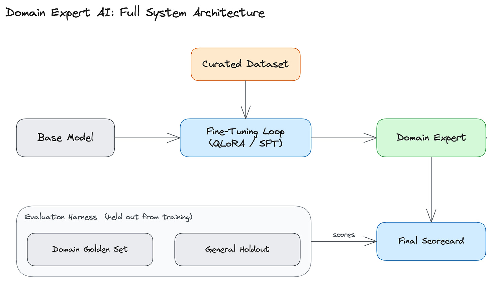
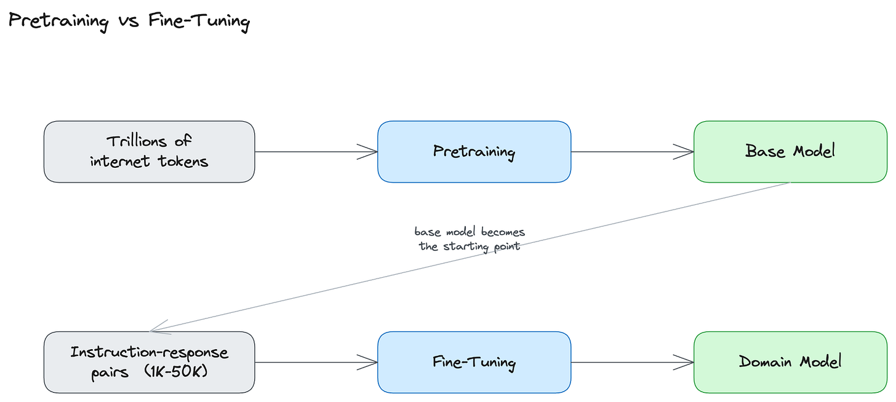
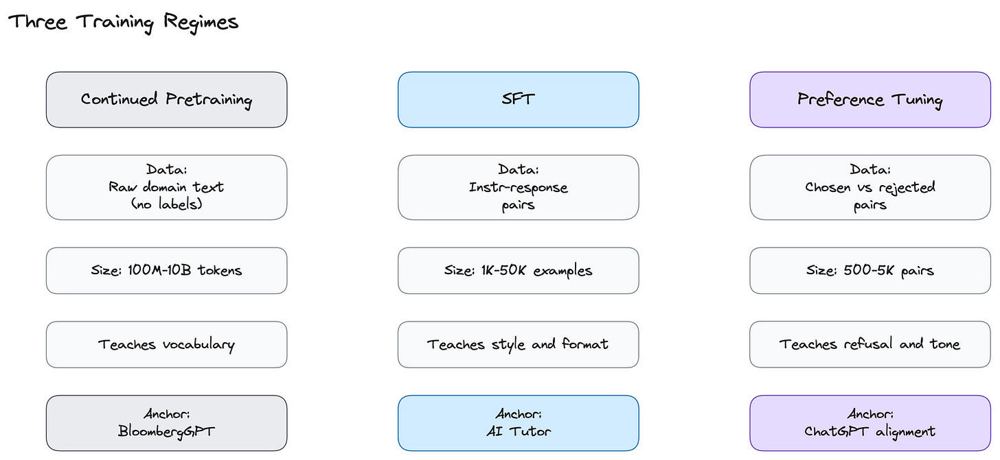
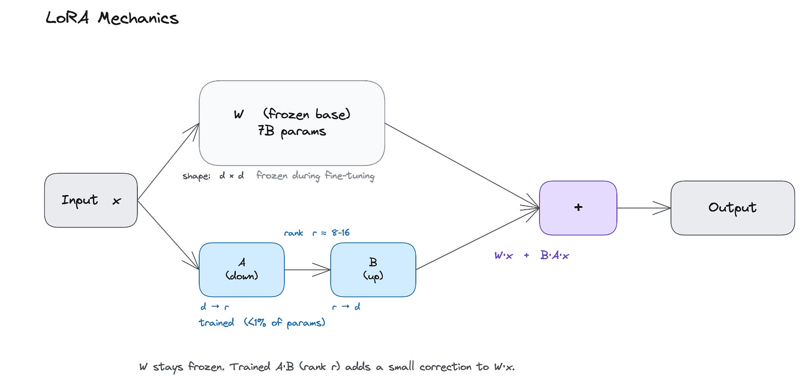

# Fine-Tuning AI Models

How to turn a general-purpose LLM into a domain expert by training patterns directly into its weights. Part 4 of the same "Generative AI Masterclass" as [genai-system-design.md](genai-system-design.md) — the deep dive on the "fine-tune for behavior, retrieve for knowledge" split.

## Key Takeaways

- **Fine-tune for behavior, retrieve for knowledge.** Patterns repeated across thousands of examples stick in the weights; a fact appearing once or twice will not. Facts belong in a retrieval layer ([rag.md](rag.md)), not in fine-tuning data
- A foundation model **knows the domain vocabulary but not the domain conventions** — it can write correct medicine in prose, but not in the compressed abbreviation-heavy format a clinician actually uses. Fine-tuning makes the target format the default instead of something you prompt for on every call
- **Confirm prompting and RAG fail your quality bar first.** The common mistake is fine-tuning because "prompting felt inconvenient." Real reasons: baked-in vocabulary/reasoning, style consistency, latency (<300ms TTFT on a 7B model), cost at scale (>~few hundred K queries/month), and data privacy (HIPAA, GDPR, SOC 2 inside your own VPC)
- **Start with SFT (supervised fine-tuning) on 1K–50K instruction-response pairs** — the right entry point for nearly every project. Ship, find remaining problem behaviors, then add preference tuning (DPO/RLHF). Continued pretraining only if SFT plateaus and vocabulary is genuinely missing
- **Use LoRA, not full fine-tuning, by default** — trains <1% of parameters, recovers 90–95% of quality, drops GPU memory by an order of magnitude (a 7B run fits on a single 16GB GPU for ~$10). Reach for full fine-tuning only after LoRA plateaus
- **Ship gates:** general capability regresses <5% on MMLU-Pro / MT-Bench, and inference cost lands ≥50% below the foundation-model baseline

## The Core Problem

A general-purpose model knows domain vocabulary but not domain conventions. Ask a foundation model about a patient's chest pain and it writes a full prose paragraph; a real clinician writes a compressed chart entry — "y/o M," "h/o HTN, HLD," "c/o substernal CP." Same medical content, entirely different format. The model *"knows the medicine; it doesn't know how clinicians write it down."*

Fine-tuning trains these patterns directly into the model's weights so they become defaults, rather than prompting for style on every call.

**Production examples:** Harvey (writes like junior associates at large law firms), Glass Health (clinical notes in clinician format), BloombergGPT (reasons over financial data as analysts expect), GitHub Copilot (fast enough to feel like autocomplete).

## Why Build a Domain Expert (5 reasons)

1. **Domain vocabulary and reasoning** — bakes specialized patterns (e.g. applying the NIH Stroke Scale) into weights
2. **Tone and style consistency** — prompting drifts back to the model's default voice within a few turns
3. **Latency and model size** — a fine-tuned 7B model can hit Time-To-First-Token (TTFT) under 300ms on a single GPU
4. **Cost at scale** — above a few hundred thousand queries/month, self-hosting beats API calls
5. **Data privacy** — for HIPAA, attorney-client privilege, GDPR, or SOC 2 data; keeps the model and its traffic inside your own VPC

**Caveat:** Confirm prompting and RAG don't meet your quality bar first. Don't fine-tune just because "prompting felt inconvenient."

## System Architecture

Four components:

- **Base model** — the pretrained LLM the pipeline starts from
- **Dataset** — instruction-response pairs capturing the target behavior
- **Fine-tuning pipeline** — shifts base behavior toward the domain
- **API endpoint** — serves the model, optionally paired with a retrieval layer

**Deployment paths:**
- **Open-weight** — Llama, Qwen, or Mistral with LoRA adapters served on vLLM
- **Hosted** — OpenAI fine-tuning API (exposes GPT-4.1 and GPT-4.1-mini)

**Model selection criteria:**
1. Run a **20-question domain probe** — if the base can't answer ~half, fine-tuning won't recover it
2. Confirm fine-tuning support
3. Check license fit (Llama community license, Apache 2.0, OpenAI ToS)
4. Start in the **7B–8B parameter range**, scale up only if needed

## Part 1: How Fine-Tuning Changes a Model

**Pretraining** runs next-token prediction over trillions of tokens to build a broad base model. **Fine-tuning** repeats that exact process on a smaller dataset (typically a few thousand examples) — *same loss function, different scale, different purpose*. Patterns repeated across thousands of examples stick; a fact appearing once or twice will not.

### Memory Cost (7B model)

| Stage | Memory |
|---|---|
| 7B parameters (7 billion numbers on the GPU) | ~14 GB |
| Training doubles it to track changes | ~28 GB |
| Optimizer bookkeeping | **60–80 GB total** |
| Consumer GPUs have only | 16–24 GB |
| Parameter-efficient methods (LoRA) | fits a single 16 GB GPU, **~$10/run** |

### Three Training Regimes

| Regime | Data | Size | Teaches | Anchor example |
|---|---|---|---|---|
| **Continued pretraining** | Raw domain text, no labels | 100M–10B tokens | Vocabulary | BloombergGPT, Med-PaLM |
| **Supervised Fine-Tuning (SFT)** | Instruction-response pairs | 1K–50K examples | Style and format | AI tutor |
| **Preference tuning (RLHF / DPO)** | Chosen vs rejected pairs | 500–5K pairs | Refusal and tone | ChatGPT alignment |

- **Continued pretraining** — teaches vocabulary; only when the base barely understands the domain
- **SFT** — the right starting point for almost every project
- **Preference tuning** — corrects calibrated refusals, tone, and format

**Practical order:** Start with SFT → ship → identify remaining problem behaviors → add DPO. Continued pretraining only if SFT plateaus and vocabulary is missing.

## Parameter-Efficient Fine-Tuning (PEFT) & LoRA

**LoRA (Low-Rank Adaptation)** freezes the base model's weights (`W`, shape d×d) and trains a small side network of two matrices — `A` (down, d→r) and `B` (up, r→d) — whose output is added to the frozen model at inference: `output = W·x + B·A·x`. Capacity is controlled by **rank** `r`, typically 8 or 16.

- Trains **fewer than 1%** of parameters
- Recovers **90–95%** of quality on most tasks
- GPU memory drops an order of magnitude; low risk to the base model

**LoRA trade-offs vs. full fine-tuning:**
1. On hard tasks, full fine-tuning is a few percentage points stronger
2. Fixed capacity ceiling from rank — large domain shifts (dense medical/legal reasoning) can hit the limit

**Full fine-tuning** has no ceiling but the highest GPU cost and greatest risk of forgetting general capabilities. Consider only after LoRA plateaus.

**QLoRA (Quantized Low-Rank Adaptation)** — quantizes the frozen base to further cut memory; the article's coverage is paywalled.

## Production Ship Gates

- General capability should regress by **<5%** on MMLU-Pro or MT-Bench (guards against catastrophic forgetting)
- Inference cost at least **50% below** the foundation-model baseline

---

> The article is Part 4 of a paid series. This summary captures the publicly-accessible content; sections from QLoRA onward (the hands-on clinical SOAP-note comparison and full decision framework) are paywalled.

---

**Source:** https://newsletter.systemdesign.one/p/fine-tuning-ai-models
**Date:** 2026-07-17
**Tags:** fine-tuning, lora, peft, sft, rlhf, dpo, llm, domain-adaptation, model-training
