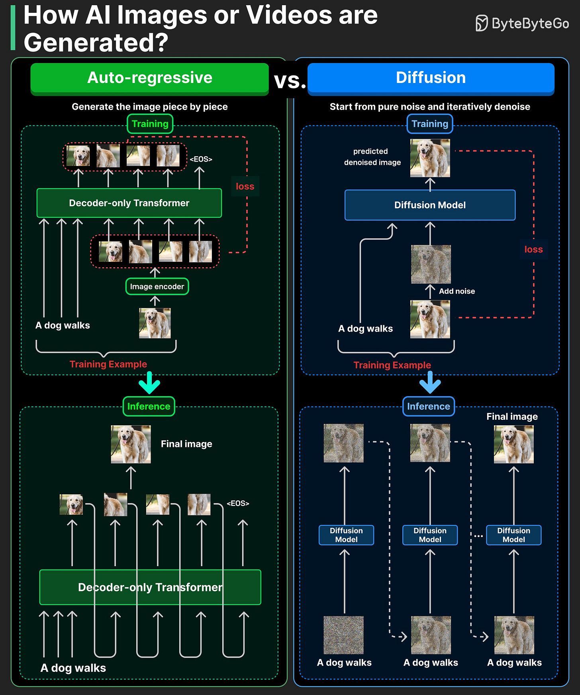

# AI Image Generation: Autoregressive vs Diffusion

The two paradigms behind modern AI image generation — and how each maps to a different training/inference model.

## Key Takeaways

- Modern AI image generation splits into **two dominant paradigms**: autoregressive models and diffusion models
- **Autoregressive models** tokenize images and predict tokens sequentially, mirroring the next-token training objective used in text LLMs
- **Diffusion models** start from pure random noise and iteratively denoise it; during training they learn to predict the noise that was added to real images
- Intuition: autoregressive generation is like **drawing stroke-by-stroke**; diffusion is like **starting from a rough sketch and progressively refining detail**
- The choice affects latency, controllability, and what kind of conditioning works best — autoregressive composes well with text LLMs, diffusion produces higher visual fidelity



## Two Paradigms

### Autoregressive Image Models

The same approach as text LLMs, applied to images:

```
Training:    image → tokenize → next-token prediction loss
Inference:   predict tokens sequentially → de-tokenize back to image
```

Images become discrete tokens (via something like VQ-VAE — a learned tokenizer that maps image patches to a codebook). The model then learns to predict the next token given prior tokens, exactly like GPT predicts the next word.

**Intuition:** drawing a dog stroke-by-stroke. Each token builds on what came before.

Examples: OpenAI's Image-GPT, Parti, GPT-4o image generation (autoregressive component).

### Diffusion Models

A fundamentally different mechanism — start from noise, learn to clean it up:

```
Training:  real image  →  add noise progressively  →  learn to predict the noise that was added
Inference: random noise →  iteratively subtract predicted noise (20-50 steps) →  clean image
```

The model never sees a real image at inference time — it starts from random noise and progressively denoises toward something coherent. The training task is "what noise was added to this image?" — once learned well, inference reverses the process.

**Intuition:** starting with a rough sketch (coarse shapes), then progressively adding detail and cleaning up the picture.

Examples: Stable Diffusion, Midjourney, DALL-E (recent versions), Imagen, FLUX.

## Comparison

| | Autoregressive | Diffusion |
|---|---|---|
| **Training task** | Predict next image token | Predict noise that was added |
| **Inference** | Sequential token prediction | Iterative denoising (20-50 steps) |
| **Output quality** | Has been catching up but still trails | Generally higher visual fidelity |
| **Latency** | Linear with output size | Fixed per step, ~5-30s per image |
| **Conditioning** | Composes naturally with text LLMs (same model can do both) | Conditioned via CLIP/text encoders |
| **Controllability** | Easier — can edit token by token | Harder — requires techniques like ControlNet, attention manipulation |
| **Memory** | Lower per-image | Higher (needs to hold full image latent through steps) |
| **Multimodal integration** | Strong — unified token space with text | Weaker — separate model for each modality |

## Why Both Exist

Each paradigm wins at different things:

**Autoregressive wins when:**
- You want a unified text+image model (e.g., GPT-4o doing image-out-and-in)
- Streaming generation matters (start showing pixels as they generate)
- You need fine-grained editing in token space

**Diffusion wins when:**
- Visual fidelity is the primary goal
- You're generating fixed-size art / photography
- You need precise control over composition (ControlNet, IP-Adapter)

## What This Article Doesn't Cover

This was a short overview. Deeper topics worth investigating elsewhere:
- **Noise schedules** (linear, cosine, sigmoid) and their effect on quality
- **CLIP / text conditioning** — how diffusion models accept text prompts
- **Latent diffusion** (Stable Diffusion) — operating in compressed latent space vs raw pixels
- **Video generation** — extending both paradigms to time (Sora, Veo)
- **Specific architectures** — U-Net vs DiT (Diffusion Transformers)

## Related

- [Transformer architecture](transformer-architecture.md) — autoregressive image models reuse the same decoder-only structure
- [GenAI system design](genai-system-design.md) — image gen is one of five output types covered there; cost is ~10-100× a chat response per image
- [AI trends 2026](ai-trends-2026.md) — Sora 2, Veo 3.1, Nano Banana Pro are listed as 2026 multimodal frontier
- [Trusting AI-generated visuals](../agents/trusting-ai-generated-visuals.md) — orchestration pattern for high-quality visual output (Claude Code plans, image model renders)

---

**Source:** https://blog.bytebytego.com/i/190810886/how-ai-actually-generates-images
**Date:** 2026-06-05
**Tags:** image-generation, diffusion-models, autoregressive-models, generative-ai, stable-diffusion, midjourney, dall-e, sora, vqvae
