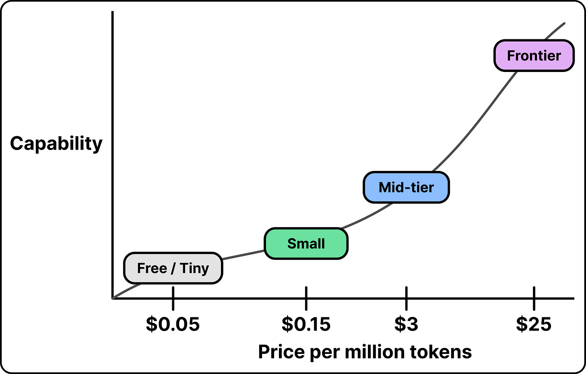
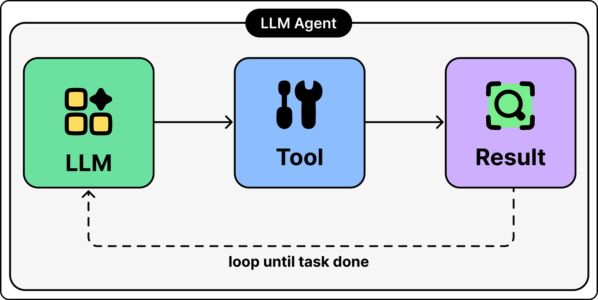
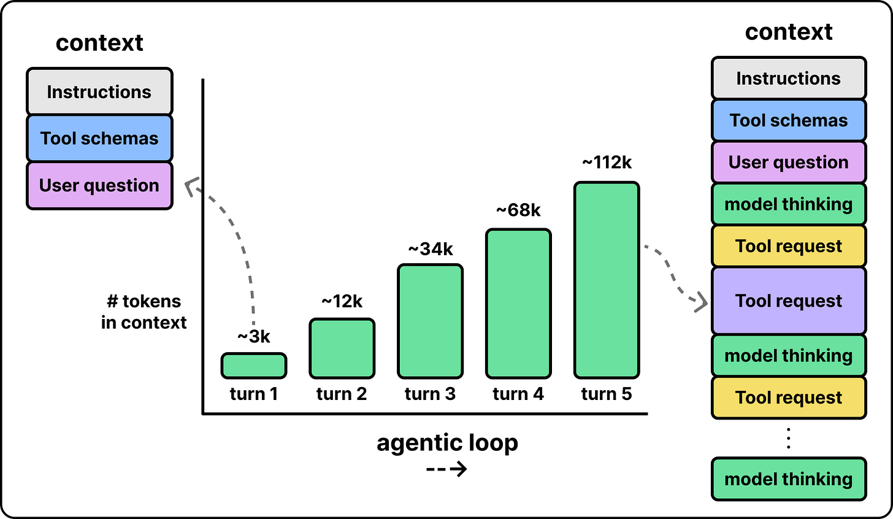
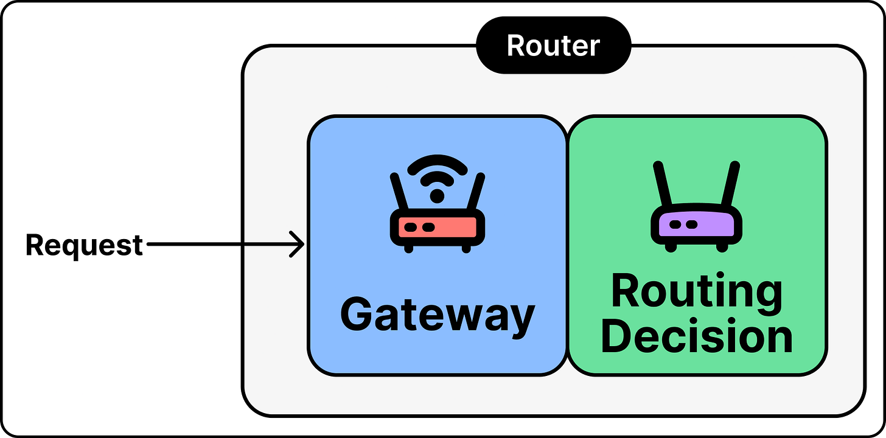
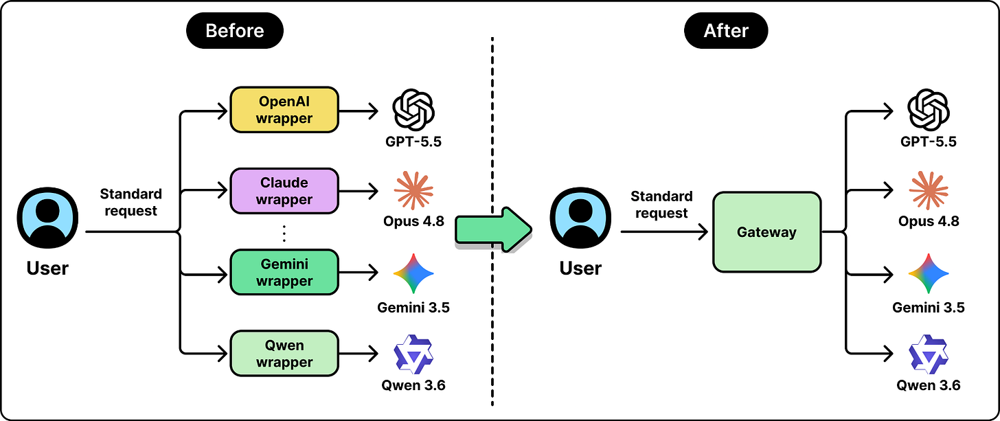
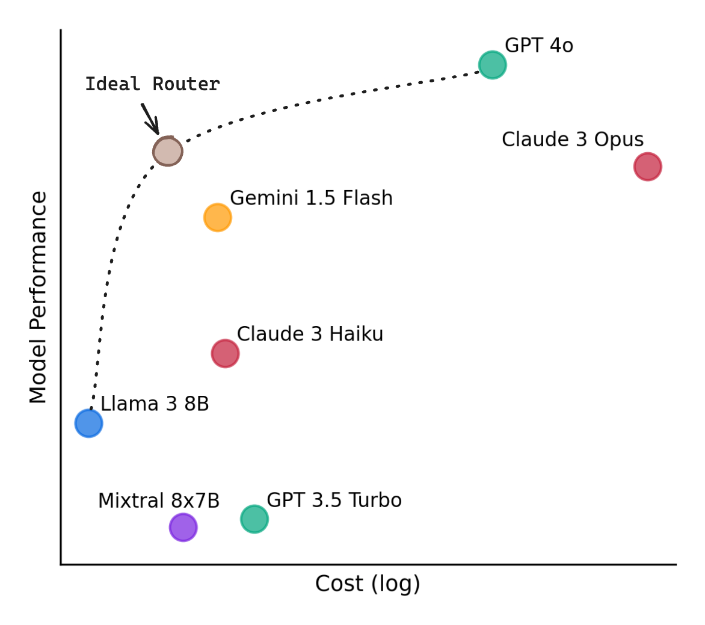
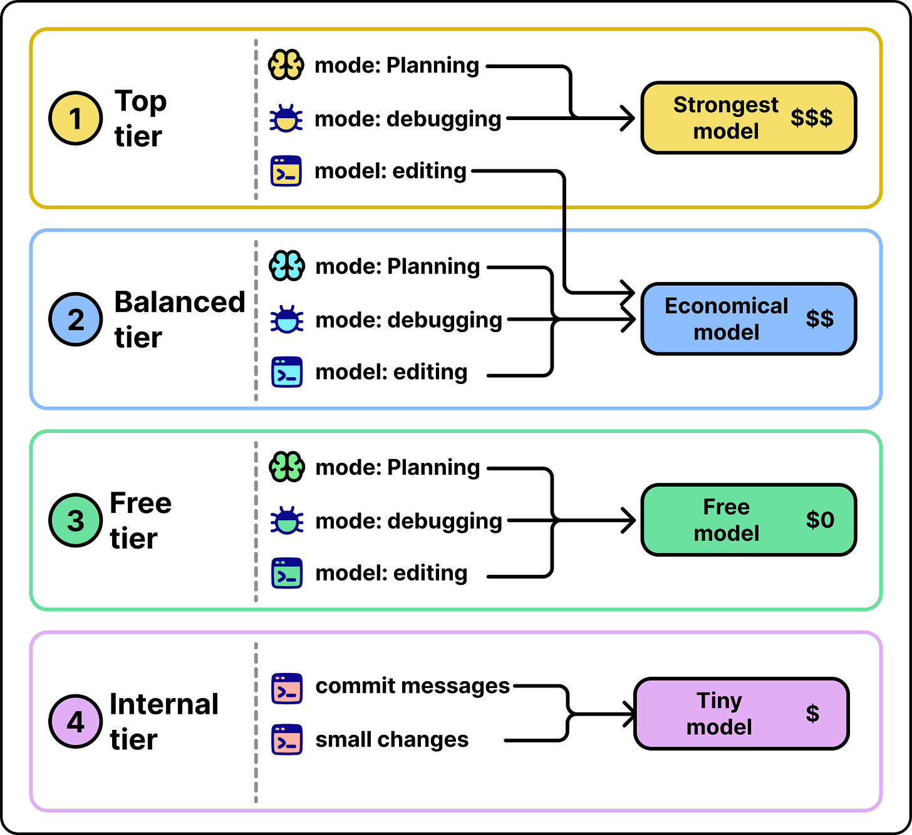

# LLM Cost and Model Routing

## Key Takeaways

- Two forces blow up agent token spend: **frontier models cost 10x+ more per token than small models**, and **the agent loop re-sends the entire conversation every turn** — context can grow from ~3K to 100K+ tokens within a single task
- **Model routing** sends each request to the cheapest model capable of handling it. UC Berkeley / Anyscale showed ~50% cost reduction at 95% of frontier quality; field results commonly land at **40–70% savings** because **80–90% of requests don't actually need frontier models**
- A router is two pieces: a **unified gateway** (one request format, swap model in one line) and a **decision layer** that either reads a known signal (cheap, deterministic) or predicts difficulty from request content (general, needs a maintained classifier)
- Kilo's production data: auto-routing cut cost-per-request by ~⅓ vs. manual selection; their **balanced tier costs >10x less per request than top tier** for identical work; estimated ~$87K quarterly savings vs. forcing everything to top tier
- Caching and routing solve **different** parts of the cost problem — Kilo sees >80% cache reuse and *still* needed routing, because non-cacheable context and request volume drive the rest. The two stack

## Why Agent Token Spend Explodes

### 1. The Model Cost Ladder

Capability and per-token price scale roughly together. Using a frontier model for every call means paying frontier rates for trivial work — variable renaming, commit messages, file summaries. The spread is consequential: top-tier models routinely cost **10x+** what small models charge for the equivalent task.

### 2. The Agent Loop Multiplies Every Call

Agents don't answer in one shot. They iterate: read instructions, call a tool, observe results, decide next step, repeat. Because LLMs have no persistent memory, every iteration re-sends the full context — instructions, original query, tool schemas, all prior tool calls and results, and the model's intermediate reasoning.

A single task often progresses from ~3K tokens at turn 1 to **100K+ tokens** by turn 5. Cost per call grows with it.

Agents also lack the natural braking that humans provide. Where a person reads slowly and pauses to think, agents fire requests as fast as the runtime allows — continuous consumption with no pauses.

## Model Routing

Routing solves the first problem (model spread) by directing each request to the cheapest capable model. In a coding agent, "design this module" needs a frontier model; "rename this variable" doesn't.

### Anatomy of a Router

A router has two components:

**1. Gateway (unified interface)** — one standardized request format, abstracting per-provider quirks. Swap models with a one-line config change.

**2. Decision layer (model selection)** — picks which model handles this request. Two methods:

| Method | How it works | Cost | When to use |
|---|---|---|---|
| **Route on known signals** | The system already knows the task type (mode = planning/coding/debugging) → static lookup → model | Nearly free | Whenever a trustworthy signal exists |
| **Predict from request content** | Trained classifier reads the prompt, predicts difficulty, picks cheapest model likely to succeed | Cheap at inference, costly to maintain | When no prior signal exists; risk: wrong predictions ship hard tasks to weak models |

Most production systems run **gateway + one decision method** — and prefer known signals when available because they're deterministic and debuggable.

### How Much Routing Saves

- **UC Berkeley / Anyscale:** ~50% cost reduction at 95% of frontier quality
- **Field results:** 40–70% savings with minimal degradation on complex tasks
- **Distribution:** 80–90% of requests don't need frontier models

The ceiling is set by model spread × task-complexity distribution. The wider the spread and the more workloads skew simple, the more routing returns.

## Case Study: Kilo Gateway

Kilo is an open-source AI coding agent. Its production routing system illustrates the pattern at scale.

**Components:**
- Unified interface supporting 500+ models
- Mode-based routing (planning, writing, debugging, editing, etc.)
- Tiered offerings, each with a distinct routing policy

| Tier | Routing Policy | Cost profile |
|---|---|---|
| **Top** | Demanding modes (planning, debugging) → strongest model; routine modes (editing) → cheaper-but-capable | $$$ |
| **Balanced** | All work → economical models | $$ |
| **Free** | Maps to no-cost models | $0 |
| **Internal** | Background tasks (commit messages, small changes) → tiny models | $ (fractions of a cent) |

**Critical design choice:** model-to-mode mappings are **served from infrastructure and refreshed regularly**, not hardcoded. This lets Kilo swap models as pricing and capabilities shift while keeping tier experiences consistent.

### Production Numbers (Q1 2026)

- Auto-routing cut cost per request **~⅓** vs. manual user model selection
- **80–90%** of requests don't need frontier models
- Balanced tier: **>10x cheaper per request than top tier** for identical work
- Background tasks: fractions of a cent per request
- Estimated quarterly savings vs. forcing everything to top tier: **~$87,000**

### Caching ≠ Routing

Despite **>80% cache reuse** on many features, total spend stayed high — driven by request volume and non-cacheable context. Caching reduces redundant work; routing changes *which model does the work*. They attack different parts of the bill, so production teams use both.

## Production Tradeoffs

- **Family switching cost** — when a router crosses model families mid-task, the intermediate reasoning produced by one model isn't legible to another. Kilo discards this context before the next call, producing a small quality dip on the next step.
- **Cheaper models can inflate the bill** — lower per-token rates typically increase usage. The total can climb even as the per-token cost falls. Treat AI spend as a fixed monthly ceiling, then optimize useful work within it.

## Operating Lessons

1. **Set fixed budgets** — cap monthly spend, then optimize useful output. Per-token optimization alone tends to get spent on more volume.
2. **Measure token distribution, not request counts** — two "same" requests can carry 1K vs. 100K tokens. Log token counts; tag by task type and feature; optimize the groups that dominate total tokens, not the ones with the most requests.
3. **Route on the strongest available signal** — known task type → static lookup (cheap, debuggable). Content-based difficulty prediction only when no signal exists.
4. **Maintain model range** — routing works only when there's a genuine cheaper option. Keep frontier-to-tiny diversity in your model catalog.

## Future Direction

Today's routing requires manual setup — defining tiers, choosing signals, judging task safety. Next-generation routers automate this:

- Read the request, judge difficulty automatically
- Pick the model **per step**, not per task
- Operate like a load balancer — users set budgets and quality targets, the system handles selection

> "Routing is no longer a cost optimization. It is becoming part of what makes ambitious agents possible."

As agents grow longer-running and more autonomous, routing moves from a savings lever to a feasibility requirement — without it, the per-task bill outruns the business value.

## Related Notes

- [Context engineering](context-engineering.md) — context size is the *other* lever on per-call cost (Write/Select/Compress/Isolate)
- [LLM tool use and MCP](llm-tool-use-and-mcp.md) — tool calls are what drive the agent loop's iteration count
- [Agent memory and state consistency](../agents/agent-memory-state-consistency.md) — why context re-sending is unavoidable today

---

**Source:** https://blog.bytebytego.com/p/token-spend-out-of-control-the-case
**Date:** 2026-06-09
**Tags:** llm-cost, model-routing, agent-economics, cost-optimization, llm-gateway, kilo, semantic-caching, prompt-caching, agent-loop, production-llm
