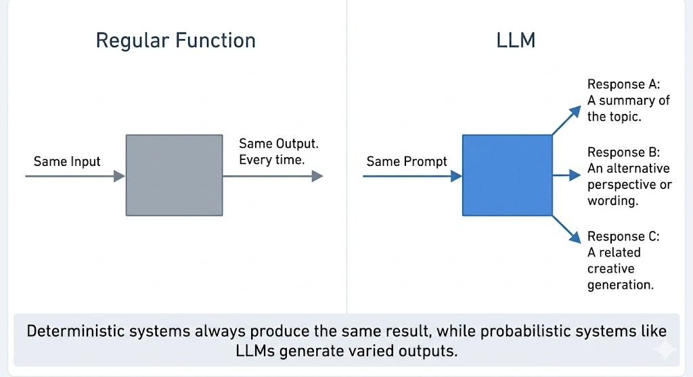
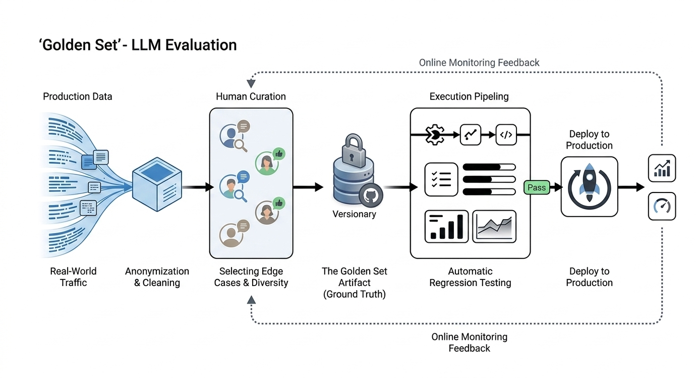
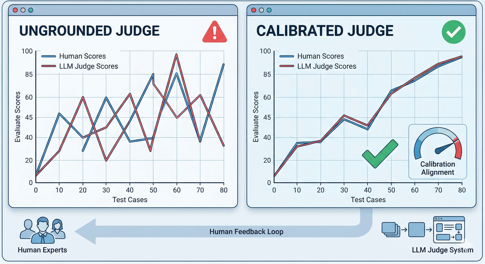
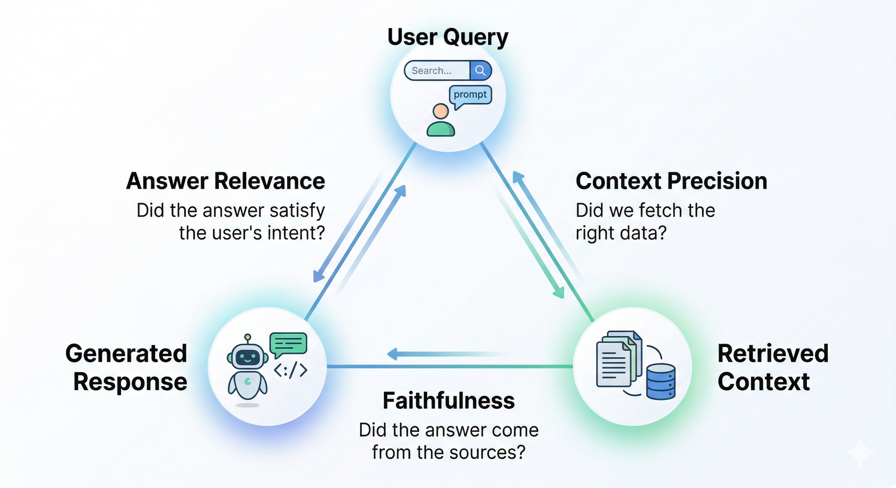
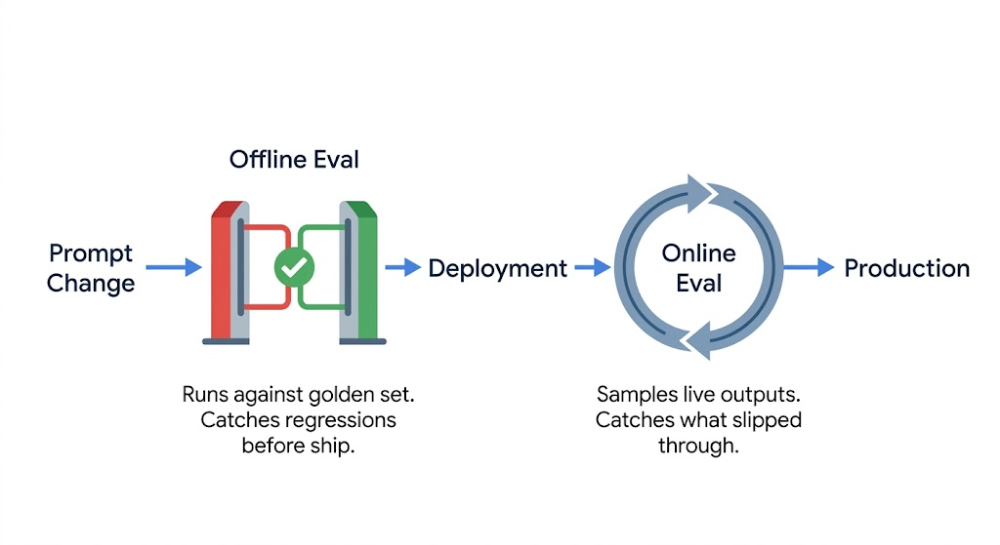
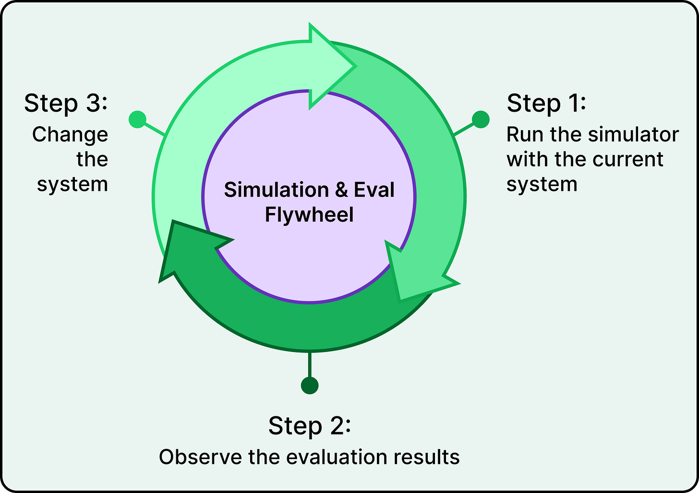
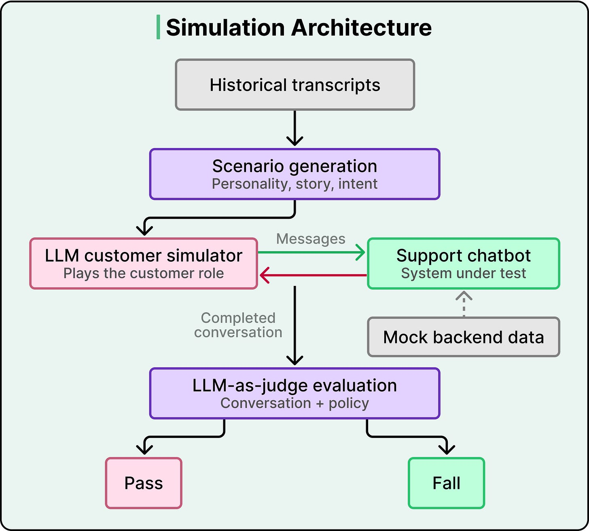
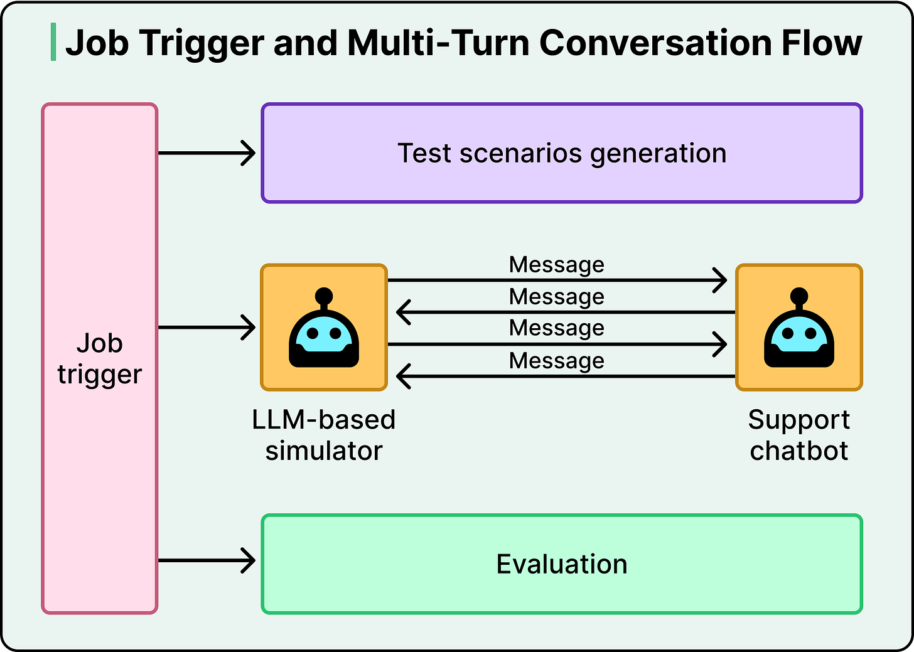
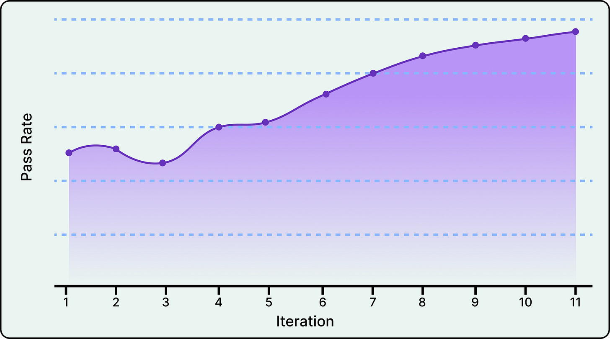

# LLM Evals

## Key Takeaways

- LLMs break traditional testing: non-deterministic outputs, fuzzy correctness, and silent regressions mean assert-based tests are insufficient
- LLM-as-judge is the scalable scoring method — use a capable model to apply rubrics, but calibrate against human judgment before trusting it
- Golden sets must be sampled from real production traffic, not just anticipated scenarios — coverage gap between "examples you wrote" and "real traffic" is where failures hide
- RAG systems need the triad eval: faithfulness (grounded in context?), answer relevance (addresses the question?), context precision (retrieval quality?)
- Stack your eval layers: heuristics → semantic similarity → LLM-as-judge (offline) → LLM-as-judge (online) → human spot checks
- For multi-turn agents, use an **LLM customer simulator** seeded from real transcripts — static scripts can't capture the messiness of real users
- **Context curation beats context expansion** — DoorDash's "case state" abstraction (synthesizing raw tool histories into structured intermediate state) cut hallucinations 90%

## Why LLMs Break Traditional Testing

- **Non-determinism** — same prompt produces different outputs across runs; breaks "same input → same output" testing assumption
- **Fuzzy correctness** — rarely one correct answer; instead a range of acceptable responses across multiple quality dimensions
- **Silent regression** — without systematic eval, prompt changes are blind bets

## Evaluation Primitives

- **Criteria** — product-level dimensions defining "good" for your use case
- **Rubric** — operationalized criteria creating specific, scorable questions for reproducible evaluation
- **Test cases** — input/output pairs; ideally sampled from production traffic
- **Golden set** — curated high-quality test cases representing real user behavior
- **Pass/fail threshold** — score boundary converting continuous ratings into deploy/no-deploy decisions

**Eval coverage** — how well your golden set reflects actual user inputs. Low coverage = optimistically misleading results.

## Scoring Methods

| Method | Speed | Cost | Catches |
|---|---|---|---|
| Heuristic/code-based | Fast | Cheap | Format, length, banned phrases |
| Semantic similarity | Fast | Cheap | Meaning drift from reference |
| Task-specific (BLEU, ROUGE) | Fast | Cheap | Surface-level translation/summary quality |
| LLM-as-judge | Medium | Medium | Quality dimensions via rubric at scale |
| Human evaluation | Slow | Expensive | Gold standard; use for calibration and debugging |

**Pointwise vs pairwise** — pointwise scores individual outputs; pairwise compares two. Pairwise is more reliable but costlier.

**Judge calibration** — validate that LLM judges match human judgment through agreement analysis before deploying them.

## RAG Evaluation

Three failure dimensions:

- **Faithfulness** — is the answer grounded in retrieved context?
- **Answer relevance** — does it address the user's question?
- **Context precision** — did retrieval fetch the right documents?

Failure patterns: irrelevant retrieval, model ignoring retrieved context, or grounded-but-unhelpful answers.

## Offline vs Online Eval

- **Offline** — pre-deployment testing using best judge models on golden datasets; acts as CI pipeline for LLMs
- **Online** — production monitoring using cheaper heuristics and smaller models on live outputs
- **Prompt versioning** — track prompt changes via version control; run regression tests per version

## Anti-Patterns

- Vibe-based evaluation through informal spot-checking
- Single-sample evaluation ignoring nondeterminism
- Goodhart's Law: optimizing metrics until they stop measuring quality
- Golden set misaligned with real user behavior
- Ignoring tail failures in favor of averages

## MVP Eval Stack

1. Build 50-example golden set mixing real queries, edge cases, and adversarial inputs
2. Add one deterministic heuristic for the most critical structural requirement
3. Create one LLM judge prompt targeting a key quality dimension

## Case Study: DoorDash Customer Support Chatbot

DoorDash's LLM-powered support chatbot was hallucinating — citing fake refund policies and misreading delivery-status fields *even though correct data was in context*. Manual human review was the only quality signal and took weeks per iteration. They built a closed-loop **simulation and evaluation flywheel** to fix it.

### The Flywheel

1. Run the simulator against the current system
2. Observe evaluation results
3. Change the system (prompts, context, case-state schema) — and repeat

200+ simulated conversations run in <5 minutes, compressing iteration cycles from weeks to hours.

### Simulation Architecture

- **Historical transcripts** → mined for behavioral profiles (personality, story, intent)
- **Scenario generation** seeds the simulator with realistic customer setups
- **LLM customer simulator** plays the customer role, dynamically deciding next messages based on: (a) whether the issue feels resolved, (b) information gaps, (c) detection of circular/looping conversations
- **Support chatbot** (system under test) responds against mock backend data
- **LLM-as-judge** scores the completed conversation against policy → Pass / Fail

### The Case State Abstraction (Biggest Win)

Root cause of hallucinations was *not* missing data — it was **too much unstructured data**. Raw tool-call histories and event logs overwhelmed the model's reasoning even when the correct facts were present.

**Solution:** introduce an intermediate **case state** layer — a structured synthesis of what the tools returned (clean decision-ready facts: order status, refund eligibility, etc.) instead of verbose event logs.

> **Context curation beats context expansion.**

Across 11 optimization iterations using the eval framework, this cut the hallucination rate by ~90%, validated in production.

### Generator-Verifier Gap

Why LLM-as-judge works despite using an LLM to evaluate an LLM: **verifying compliance with specific behaviors is meaningfully easier than generating a complete response from scratch**. Calibration loop:

1. Human experts label sample conversations
2. LLM evaluator is scored against those labels
3. Mismatches analyzed, rubric/prompts refined
4. Repeat until human-LLM agreement is high

### Results & Limits

| Metric | Result |
|---|---|
| Hallucination rate | ~90% reduction across 11 iterations |
| Active evaluations | 50+ across hallucination, tone, classification |
| Iteration cycle | Days/weeks → hours |
| Simulation runtime | 200+ conversations in <5 min |

**Inherent limits:**

- Evals are blind to failure modes they don't explicitly cover — novel hallucination patterns can still ship
- Simulator fidelity is bounded — LLM-simulated customers don't fully match real human variability
- Humans must seed every new improvement loop — automation amplifies humans, doesn't replace them

---

**Source:** https://newsletter.systemdesign.one/p/llm-evals
**Source:** https://blog.bytebytego.com/p/how-doordash-built-a-testing-system
**Date:** 2026-05-28
**Tags:** evals, llm-as-judge, golden-set, rag, benchmarks, testing, non-determinism, simulation, hallucination, doordash, case-state, context-curation
