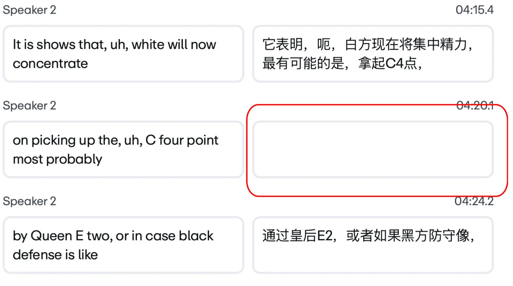
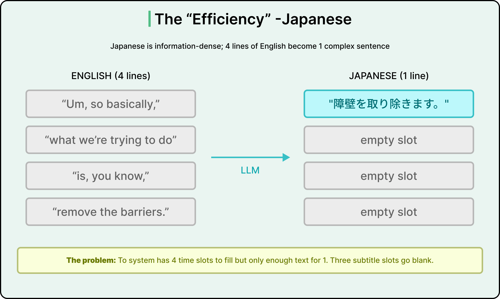
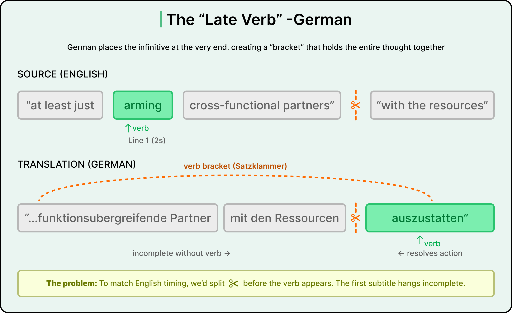
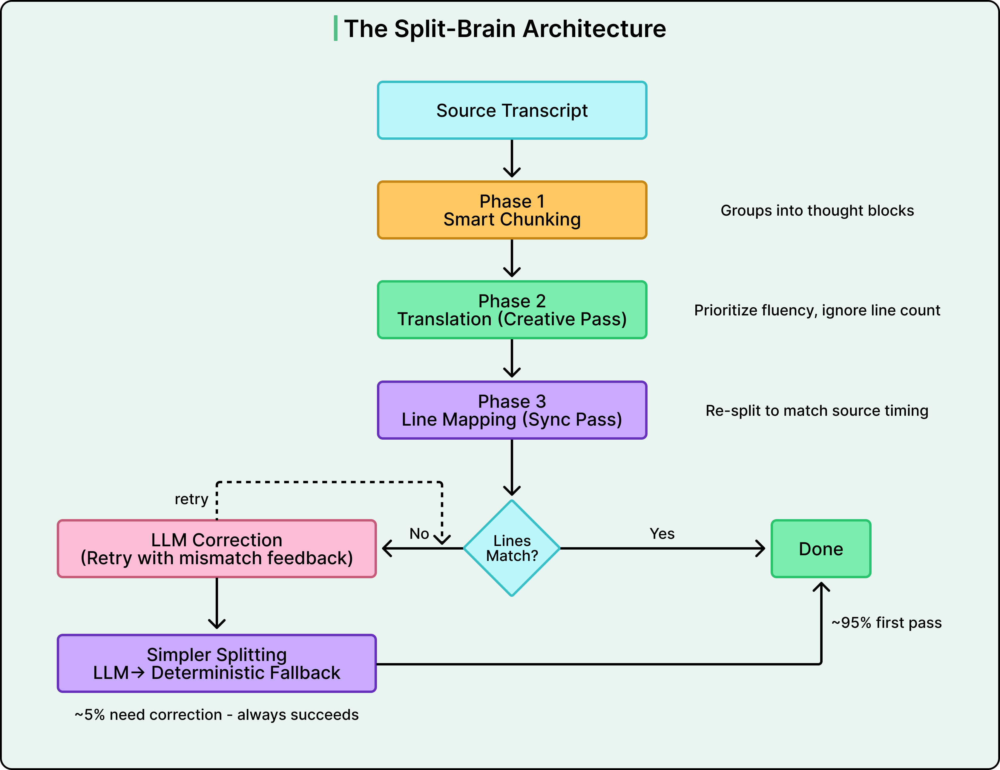

# LLM Multi-Pass Pipelines: Split Creative From Structural Work

How Vimeo fixed AI-translated subtitles by stopping a single LLM call from doing two competing jobs at once. A generalizable pattern for any production LLM system where format and reasoning collide.

## Key Takeaways

- Asking one LLM call to be both **fluent and structurally obedient** optimizes for competing goals — 2024 research (Tam et al.) shows format constraints degrade reasoning quality
- The fix: **split the job into independent passes** — one optimizes meaning, another enforces structure
- Vimeo's pipeline: **Smart Chunking → Creative Translation → Line Mapping** — three LLM calls instead of one, ~95% first-pass success, +4-8% latency / +6-10% tokens
- **Build fallback chains before happy paths.** When the LLM correction loop fails, a deterministic rule-based splitter guarantees output (repeated phrases beat blank screens)
- Most production LLM engineering is **the scaffolding around the model call**, not the call itself — the "infrastructure tax of intelligence"



## The Problem: Subtitles Are a Timing Grid

Vimeo auto-translated subtitles into 9 languages. The user-visible bug: **blank screens** in the middle of translations.

A subtitle file (SRT/VTT) is a grid of timed slots. Each slot has a start time, end time, and text. The grid must align with the source video's speech.

LLMs naturally collapse messy speech into clean prose. Four fragmented English lines:

```
[t=10.0s] "Um, so basically,"
[t=10.5s] "what we're trying to do"
[t=11.0s] "is, you know,"
[t=11.5s] "remove the barriers."
```

Become one clean Japanese line:

```
[t=10.0s] "障壁を取り除こうとしています。"  ← all 4 slots collapse here
[t=10.5s] (blank)
[t=11.0s] (blank)
[t=11.5s] (blank)
```

The translation is **linguistically correct**. The timing grid is broken.

## The Geometry of Language



Different languages have different "geometry" — failure modes differ:

### Japanese: Information Density

Japanese is information-dense. Four English filler lines collapse to one Japanese line because Japanese encodes the same meaning more compactly. Result: 3 of 4 subtitle slots empty.

### German: Late Verb (Satzklammer)



German uses **verb-bracket syntax (Satzklammer)** — the infinitive verb arrives at the end of the clause. If you split the translation before the verb, the first subtitle is **structurally incomplete** — it has no main action.

> "The LLM is doing the right thing linguistically. Four lines of English filler genuinely are one thought in Japanese. But the subtitle system now has four time slots and enough text for one."

### Other Language Pairs

- **English → Chinese**: similar density collapse to Japanese
- **English → French/Spanish**: usually expands (more lines than source)
- **English → Russian**: agglutinative morphology produces uneven line lengths
- **Anything → English**: word-order shifts that break mid-clause splits

Each pair has its own structural-vs-meaning trade-off.

## The Single-Call Failure

The naive approach is one LLM call: "Translate this subtitle file from English to Japanese, preserving the line structure."

This asks the model to optimize two competing objectives at once:
1. **Meaning** — faithful translation (creative work)
2. **Structure** — match the original line count and timing (structural work)

2024 research (Tam et al.) shows **format constraints degrade reasoning quality**. The model trades fluency for structure or structure for fluency — never both well.

## The Split-Brain Fix



Three phases, each with one job:

### Phase 1: Smart Chunking

Group **3-5 source lines** into thought blocks. Not too few (no context), not too many (information overload, risk of hallucination).

```
[t=10.0s] "Um, so basically,"
[t=10.5s] "what we're trying to do"      ← chunked together
[t=11.0s] "is, you know,"
[t=11.5s] "remove the barriers."
```

Output: a chunk of 4 source lines belonging to one semantic thought.

### Phase 2: Creative Translation

Translate the chunk **for meaning**. No structural constraints. Just produce the best possible translation of the thought.

```
Input chunk:  "Um, so basically, what we're trying to do is, you know, remove the barriers."
Output:       "障壁を取り除こうとしています。"
```

This is the LLM doing what it's best at: fluent translation with full context.

### Phase 3: Line Mapping

A **separate LLM call** takes the translated text + the original line count + the original timing, and re-splits the translation into the target line count.

```
Translated text:  "障壁を取り除こうとしています。"
Target slots:     4
Output:           [slot 1 fragment] [slot 2 fragment] [slot 3 fragment] [slot 4 fragment]
```

The split may produce awkward repetition or mid-phrase breaks — but the slots are filled.

This is the LLM doing the *structural* job, with no creative responsibility competing for attention.

## Fallback Chain — Design for the 5%

Phase 3 succeeds ~95% of the time. The remaining 5% gets a fallback chain:

```
[line-count check]
       ↓ fail
[LLM Correction]              ← retry with mismatch feedback
       ↓ resolves 32% of failures
   still fail
       ↓
[deterministic splitter]      ← rule-based; always succeeds
       ↓
   may produce repeated phrases, but no blank screens
```

### Why a Deterministic Fallback Matters

The deterministic splitter uses simple rules (split on punctuation, balance character counts, etc.). It might produce:

- Repeated phrases
- Awkward mid-clause splits
- Stilted output

But it **always produces text in every slot.** The product decision was explicit:

> "Repeated phrases beat blank screens."

The user-visible failure mode is the worst case to avoid. The fallback's job is to never let that happen.

## Cost-Benefit

| | Single-call translation | Split-brain pipeline |
|---|---|---|
| LLM calls per chunk | 1 | 3 (chunking + translation + line mapping) |
| Latency | baseline | +4-8% |
| Tokens | baseline | +6-10% |
| First-pass success | ~70% with blank screens | ~95% |
| With fallback chain | n/a | ~99.5% acceptable output |
| Manual QA hours per 1,000 videos | ~20 hours | near zero |

The pipeline costs more per call but eliminates the manual QA bottleneck.

## The Three Generalizable Principles

The Vimeo case study makes a broader point about LLM systems:

### 1. Separate Creative From Structural Work

When one prompt asks for both fluent output *and* strict format adherence, you're optimizing competing goals. The model degrades on both.

The fix: separate calls. One does the creative work freely; another enforces the structure on the creative output.

This applies to:
- **Code generation + linting** — generate freely, then format/restructure
- **Report generation + citation insertion** — write the report, then add citations as a second pass
- **Translation + length constraints** — translate freely, then trim/expand
- **Email drafting + tone/format** — draft, then re-shape

### 2. Build Fallback Chains Before Happy Paths

> "The question isn't how to prevent failures. It's what your system does when they happen."

Layered fallbacks:
- Try LLM (best output, may fail)
- If failed: retry with error feedback
- If still failed: deterministic algorithm
- Always: guarantee *something* the user can use

The deterministic floor matters most for high-stakes outputs.

### 3. Most LLM Engineering Is Scaffolding

> "Most engineering is scaffolding around the model call — the 'infrastructure tax of intelligence.'"

For Vimeo's subtitle system, the AI is one component. The engineering work is:
- Chunking algorithm
- Multi-phase orchestration
- Validation between phases
- LLM correction loop with feedback
- Deterministic splitter
- Failure detection and routing
- Observability for which phase failed where

The model is ~10% of the system. The other 90% is the scaffolding that makes the model useful.

## When to Apply This Pattern

Strong fit:
- Format constraints + creative output competing
- Structured output (JSON, code, subtitles, tables) where shape errors break downstream
- High-volume production where manual QA isn't scalable
- User-visible failures are worse than degraded output

Bad fit:
- Single-purpose tasks with no format-vs-meaning tension
- Low-volume work where manual review is cheap
- Cases where there's no good deterministic fallback (open-ended creative work)

## Related

- [Context engineering](context-engineering.md) — the broader discipline; multi-pass is one tactic
- [Claude internals: interpretability § format vs reasoning](../claude/claude-internals-interpretability.md) — research on why constrained generation degrades reasoning
- [LLM evals](llm-evals.md) — measuring multi-phase pipeline quality across phases
- [Distributed system failure modes § graceful degradation](../../system-design/distributed-system-failure-modes.md) — fallback chains as a general system-design pattern
- [OpenAI Codex § agent loop](../agents/openai-codex.md) — similar pattern at agent level (alternating deterministic and agentic steps)

---

**Source:** https://blog.bytebytego.com/p/how-vimeo-implemented-ai-powered
**Date:** 2026-06-05
**Tags:** llm-engineering, vimeo, multi-pass-pipelines, split-brain, fallback-design, format-vs-reasoning, translation, production-llm, scaffolding
