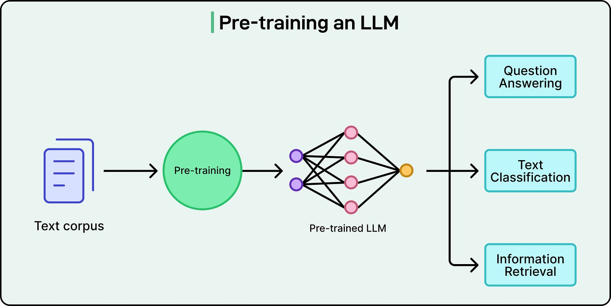
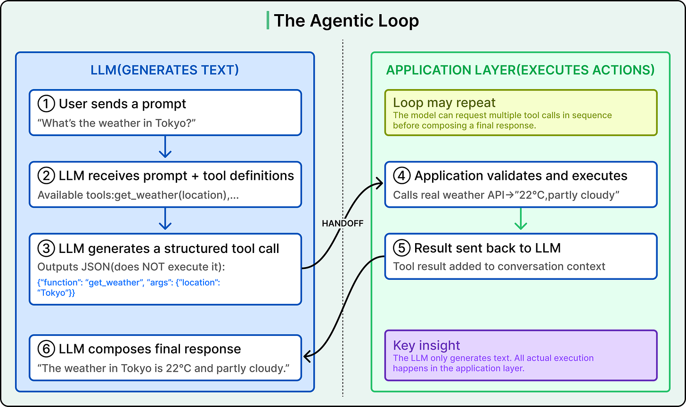
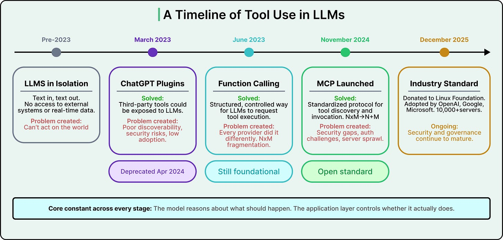
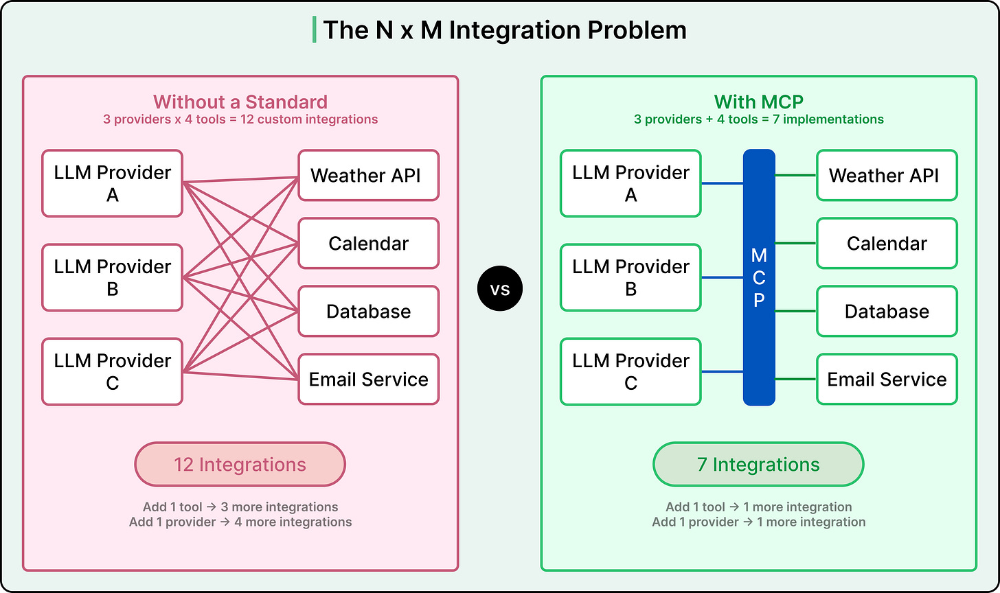
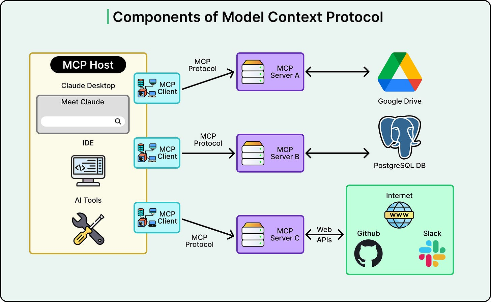
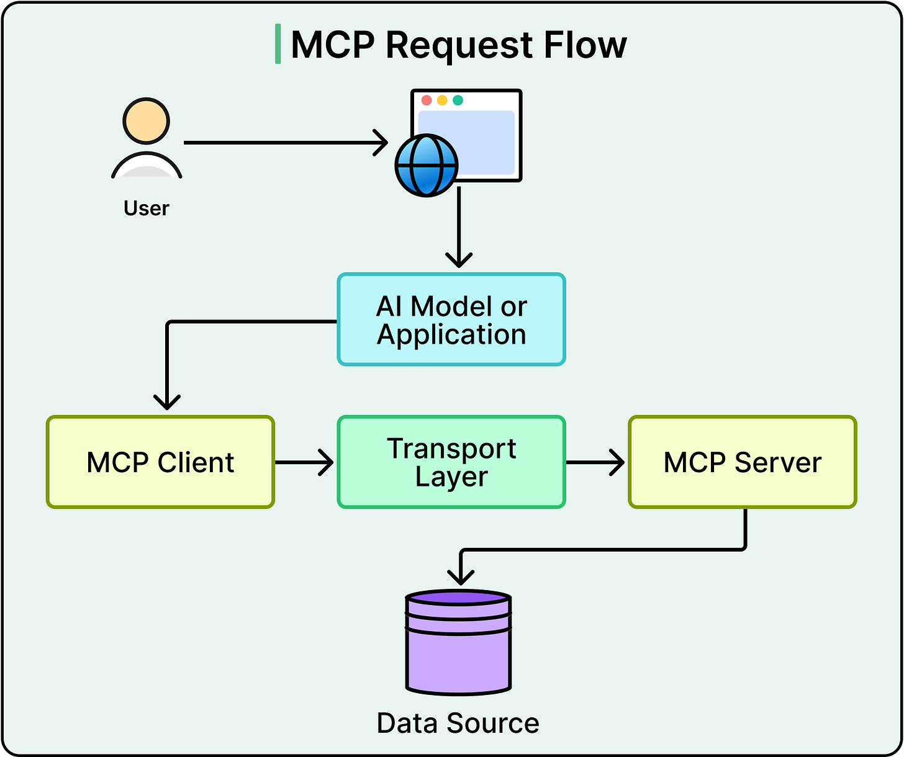
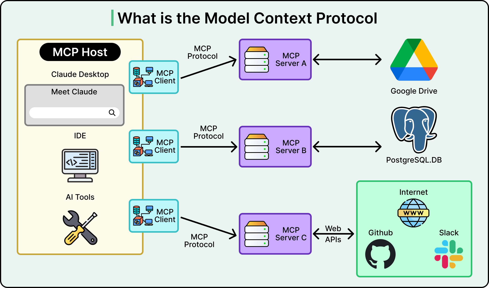
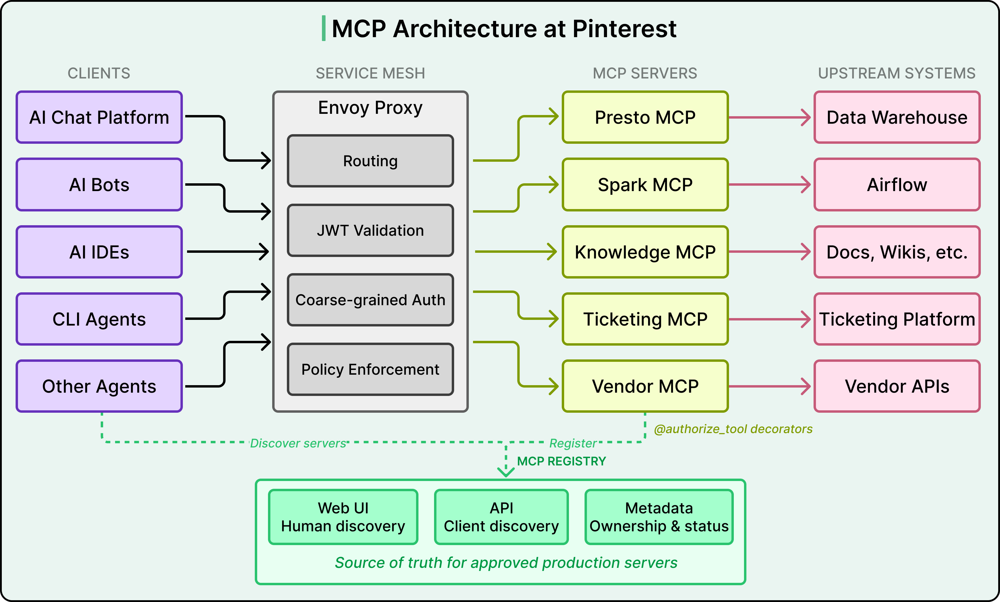
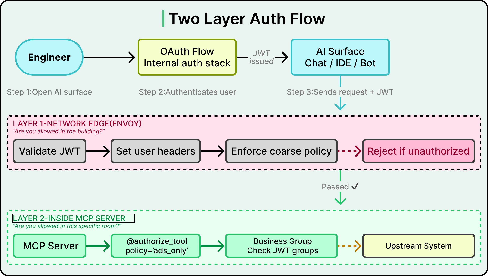
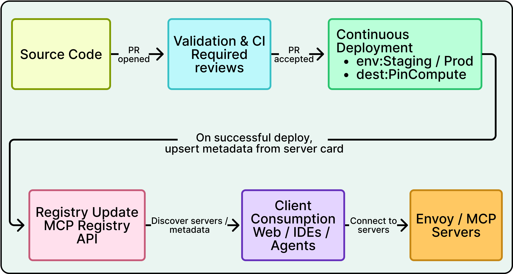

# LLM Tool Use, Function Calling, and MCP

## Key Takeaways

- LLMs are text-prediction engines with no built-in ability to call APIs, query databases, or act in the real world -- tool use bridges this gap by letting the model reason about what should happen while the application layer controls execution
- Function calling follows a strict separation: the model outputs structured JSON describing a tool call, the application validates and executes it, and the result feeds back into the model for synthesis (the "agentic loop")
- MCP (Model Context Protocol) reduces integration complexity from N x M (providers x tools) to N + M by standardizing how tools are described, discovered, and invoked across any model
- MCP architecture has three layers: Host (user-facing app), Client (communication handler), and Server (lightweight wrapper around tools/APIs) -- all communicating via a standard protocol
- Tool use introduces real costs: tool definitions consume context window tokens, models can hallucinate function names or malform arguments, and multi-turn loops add latency
- Pinterest's production MCP deployment (66K monthly invocations, 7K hours/month saved) shows that implementing the protocol is the easy part -- registry, auth, deployment pipeline, and observability are the real engineering challenges

## Why LLMs Cannot Act Alone

LLMs have no mechanism to reach beyond their context window. They cannot call an API, query a database, send an email, or perform any action in the real world. They generate text -- nothing more. Tool use is the architectural pattern that gives them the ability to trigger real-world actions.

## How Function Calling Works

The model and application layer have clearly separated responsibilities:

**Model's role:**
1. Receives the user prompt alongside a menu of available functions (with JSON schema definitions)
2. Decides whether a tool is needed and which one
3. Outputs a structured JSON request -- e.g., `{"function": "get_weather", "arguments": {"location": "Tokyo"}}`
4. Does NOT execute anything

**Application layer's role:**
1. Receives the structured output from the model
2. Validates the function name and arguments
3. Executes the actual function (calling a real API)
4. Returns the result back to the model
5. Can restrict available functions, validate arguments, and require human approval for high-stakes operations

## The Agentic Loop

The agentic loop is the multi-turn cycle that makes complex tool-assisted tasks possible:

1. User sends a prompt
2. Model receives prompt + tool definitions
3. Model generates a structured tool call (JSON, does NOT execute it)
4. Application validates and executes the tool, calling real APIs
5. Result is sent back to the model and added to conversation context
6. Model composes final response -- or determines more tools are needed and loops back to step 3

The loop may repeat multiple times. For example, "find me flights to Tokyo and check the weather there" triggers a flight search call first, then a weather call, with the model synthesizing both results into a final response.

The key insight: the LLM only generates text. Actual execution always happens in the application layer.

## Evolution of LLM Tool Integration

| Date | Event |
|---|---|
| Mid-2023 | OpenAI formalizes function calling as a first-class API feature |
| Earlier 2023 | ChatGPT Plugins launch -- third-party developers expose arbitrary APIs, but suffer from discovery difficulties, inconsistent quality, and immature security |
| April 2024 | OpenAI deprecates plugins entirely, moves toward controlled function-calling approach |
| Late 2024 | Anthropic introduces MCP as an open-source protocol |
| 2025 | OpenAI announces MCP support; Google DeepMind confirms Gemini support |
| Late 2025 | 10,000+ publicly available MCP servers listed in directories |
| End of 2025 | Anthropic donates MCP to the Agentic AI Foundation (Linux Foundation), co-founded by Anthropic, Block, and OpenAI; supported by AWS, Google, Microsoft, Cloudflare, Bloomberg |

What started as an open-source experiment became an industry standard in roughly one year.

## Model Context Protocol (MCP)

### The N x M Problem

Without a standard protocol, each LLM provider implements function calling differently. With 3 providers and 5 tools, you need 15 custom integrations. Adding a sixth tool means 3 more integrations; adding a fourth provider means 5 more.

MCP reduces this to N + M: each LLM client implements MCP once, each tool server implements MCP once. 3 providers + 5 tools = 8 implementations instead of 15. The savings compound as the ecosystem grows.

### Architecture

MCP has three core components:

- **MCP Host** -- the user-facing AI application (e.g., Claude Desktop, AI-powered IDEs)
- **MCP Client** -- lives inside the host, handles communication with external tool providers
- **MCP Server** -- lightweight program that wraps an existing tool, database, or API and exposes it in MCP's standard format

At startup, the client connects to available MCP servers and asks each to describe its capabilities. Those descriptions are fed to the model, triggering the standard function calling mechanism.

### MCP Primitives

MCP servers can surface three types of capabilities:

- **Tools** -- callable functions with defined parameters (the primary driver of adoption)
- **Resources** -- data the model can read (files, database records)
- **Prompt Templates** -- reusable instruction patterns

**Diagnostic for Tools vs Resources:** *if a "tool" mostly returns data with no real side effect, it's probably a resource in disguise.* Misclassifying inflates the tool catalog and crowds the context window with things that should have been read passively.

### Session Lifecycle (Capability Handshake)

Every MCP connection begins with a handshake that establishes:

- Protocol version compatibility
- The exact set of capabilities the server will expose for *this session*

> "After that, all interactions are constrained by what was agreed upfront. **No hidden features. No assumptions.**"

This handshake is what makes the protocol auditable — at any later point a client can prove what the server claimed to support when the session opened, and the server can refuse calls that weren't in the agreed capability set. It's the structural reason MCP composes safely across providers.

### Request Flow

The same tool works with any model that speaks the protocol -- this is MCP's core value proposition.

## Security Risks

### The Postmark Supply Chain Attack (September 2025)

A malicious npm package mimicked a legitimate Postmark email integration for MCP. Hundreds of developers installed it unknowingly. The hidden code silently forwarded copies of every outgoing email to the attacker. This was the first documented supply chain attack targeting MCP servers.

### Broader Concerns

- Every tool exposed to an LLM expands the system's attack surface
- The protocol initially prioritized adoption over robust security; authentication specifications underwent multiple revisions
- Community continues addressing authentication, server identity, and governance gaps
- Pattern follows typical protocol evolution: interoperability and adoption first, security matures with time

Production systems require validation, error handling, approval steps, and sandboxing for untrusted tools.

## Pinterest — Production MCP at Scale

Pinterest deployed a production MCP ecosystem across the company, reaching 66,000 monthly invocations across 844 active users and saving approximately 7,000 hours/month as of January 2025.

### N+M in Practice

Rather than building 50 custom integrations (5 AI surfaces x 10 tools), Pinterest implemented 15 components (5 clients + 10 servers). Each AI surface connects to MCP servers through a unified interface.

### Three Architectural Bets

1. **Cloud-hosted servers** — all MCP servers run centrally in the cloud, not locally. This enables consistent auth, logging, and monitoring across every server, at the cost of network latency.
2. **Domain-specific servers** — separate servers per domain (Presto for data queries, Spark for job debugging, Knowledge for documentation). Different tools need different access controls, and tool descriptions consume context window tokens, so scoping servers keeps token budgets manageable.
3. **Unified deployment pipeline** — a centralized framework eliminates boilerplate, letting domain experts focus on business logic. This made the "many small servers" strategy operationally viable.

### MCP Registry

A central catalog acts as the governance backbone:

- Approved servers for production use
- Ownership information and support channels
- Live status monitoring
- Web UI for human browsing + API for programmatic discovery

### Two-Layer Authorization

**Layer 1 — Network edge (Envoy proxy):** Validates JWT tokens and enforces coarse-grained access policies before requests reach MCP servers. Example: "production chat may access Presto, but experimental dev servers are blocked."

**Layer 2 — Tool level:** Individual MCP servers apply fine-grained authorization using `@authorize_tool` decorators. Presto gates access by business group even if the server is broadly reachable.

Pinterest bypassed the MCP spec's per-server OAuth flows. Instead, a single OAuth session is established when users open any AI surface. Service-to-service calls use SPIFFE-based authentication for low-risk, read-only scenarios.

### Integration Surfaces

MCP tools embed into existing engineer workflows:

- **Internal AI chat** — primary interface, automatically scopes tools to user permissions
- **Communication platform bots** — context-aware tool availability per channel
- **AI-enabled IDEs** — Presto MCP for in-editor data access
- **CLI agents** — terminal-based tool invocation

### Governance and Observability

- Human-in-the-loop approval for sensitive/expensive automated actions
- Elicitation for dangerous tasks (explicit user confirmation)
- Shared library provides input/output logging, invocation counts, and exception tracing
- Impact measured by server owners providing "minutes saved per invocation" estimates, multiplied by invocation counts

### Key Insight

"Implementing the protocol turned out to be the easy part." The registry, auth layers, deployment pipeline, and observability infrastructure proved more critical than the MCP specification itself. The platform engineering around MCP is what enabled adoption at scale.

## Costs and Tradeoffs of Tool Use

**Token consumption:** Tool definitions (names, descriptions, parameter schemas) occupy space in the finite context window. A handful of tools creates negligible overhead, but dozens or hundreds start crowding out the room the model needs to reason. Each additional tool slightly degrades the model's ability to focus.

**Hallucinated calls:** Tool use does not make LLMs deterministic. Models can hallucinate function names, pass malformed arguments, or chain tools in unexpected ways. Validation and human-in-the-loop approval are essential in production.

**Latency:** The multi-turn agentic loop adds latency compared to direct computation, though this tradeoff enables grounding responses in real-time data.

**Core principle:** The model reasons about what should happen, and the application layer controls whether it actually does. That boundary is where security, reliability, and control are designed in.

## What MCP Does *Not* Solve

MCP standardizes the **integration surface**, but it doesn't replace any of the discipline that surrounds it:

- **Model selection strategy** — which LLM to call for which workload (see [llm-cost-and-routing.md](llm-cost-and-routing.md))
- **Context ranking logic** — which tools, resources, and memory items to surface in a given turn
- **Tool conflict resolution** — what happens when two tools could fulfill the same request, or when their effects collide
- **Workflow orchestration** — sequencing multi-step plans, retries, parallelism, failure handling (see [../agent-teams-harness-eng/loop-engineering.md](../agent-teams-harness-eng/loop-engineering.md))
- **Security discipline** — MCP defines the channel; the app must still validate inputs, sandbox outputs, apply rate limits, and require approvals for high-stakes actions

If you adopt MCP and your reliability or quality doesn't improve, the work was never in the protocol — it's in the layer *above* MCP.

## When MCP Is Overkill

MCP shines when you need to **connect multiple services, compose tool workflows, evolve over time, or support agent-like behavior**. It's overkill for:

- A single model talking to a single tool (just call the API directly)
- Throwaway scripts and prototypes where the integration surface won't grow
- One-shot batch jobs with a fixed, known toolset

The structural cost of MCP — capability handshake, server lifecycle, registry — only pays back when the integration surface itself is growing.

---

**Source:** https://blog.bytebytego.com/p/connecting-llms-to-the-real-world
**Source:** https://blog.bytebytego.com/p/how-pinterest-built-a-production
**Source:** https://blog.levelupcoding.com/p/mcp-clearly-explained
**Date:** 2026-05-04, updated 2026-06-15
**Tags:** llm, tool-use, function-calling, mcp, agentic-loop, security, model-context-protocol, pinterest, enterprise-mcp, developer-productivity, capability-handshake, when-not-to-use-mcp
