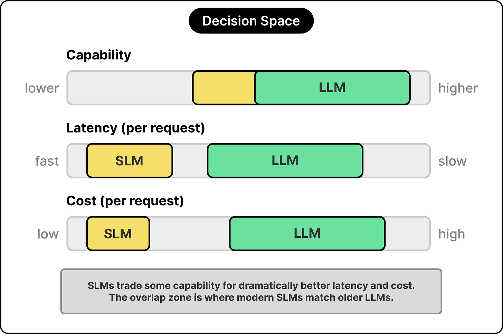
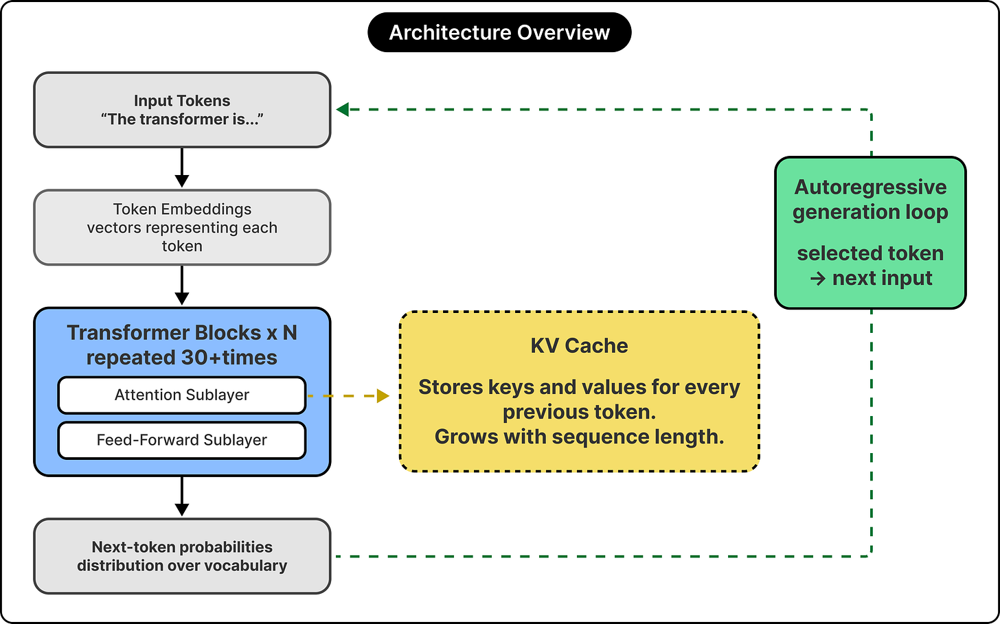
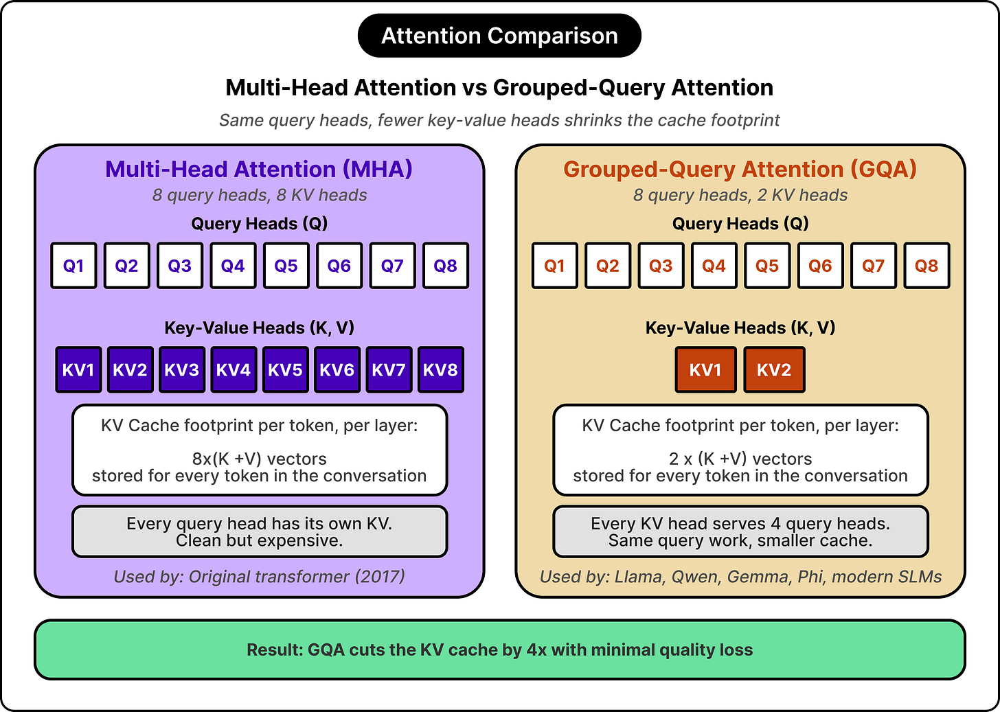
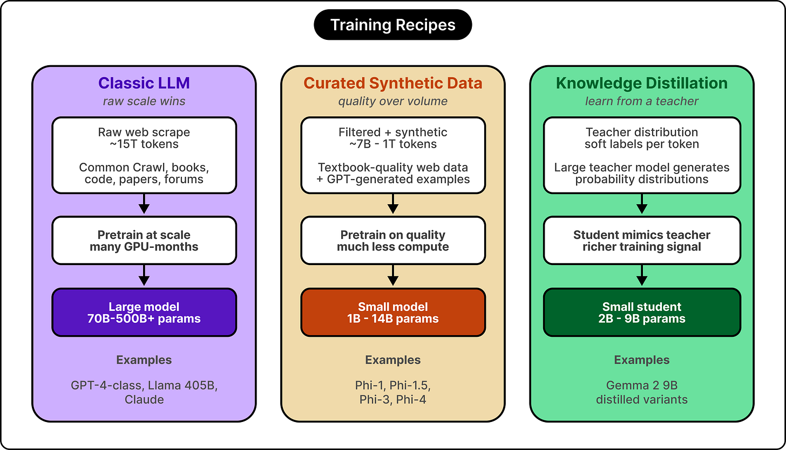
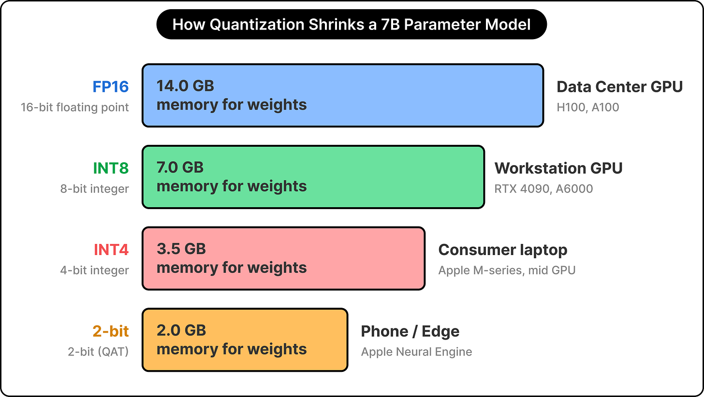
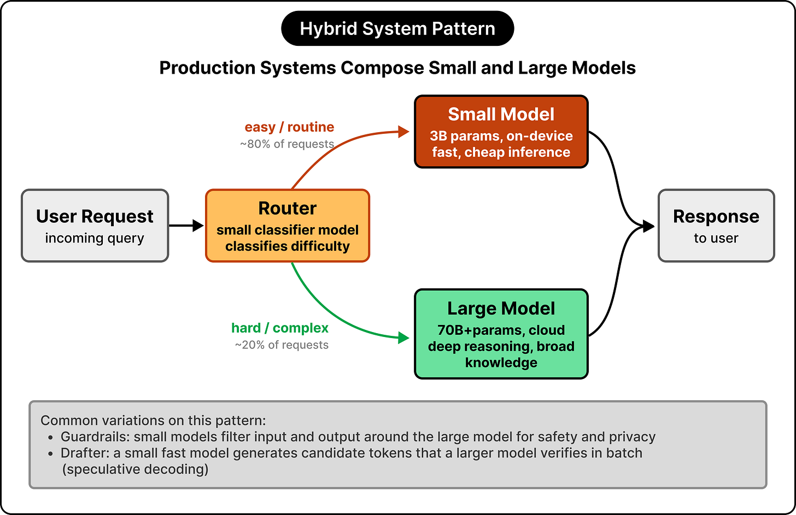

# LLM vs. SLM: Design Tradeoffs

## Key Takeaways

- LLMs and SLMs share identical transformer-based decoder architecture — the difference is parameter count (SLMs: 500M–14B; LLMs: tens to hundreds of billions) and the constraints they optimize around
- Three forces drive model design choices: deployment target (memory/latency budget), inference economics (serving cost scales with every request, not training), and training budget (smaller budgets demand data quality and distillation over raw compute)
- SLMs close the gap through targeted architectural optimizations (grouped-query attention, sliding-window attention, KV cache sharing) and training techniques (data curation, knowledge distillation, overtraining)
- SLMs carry three persistent performance gaps vs. LLMs: generalization gap (brittle outside training distribution), reasoning gap (multi-step chains favor more parameters), and knowledge ceiling (parameters function as compressed memory)
- Production AI systems achieve optimal cost and capability by composing both: routing (SLM handles easy, escalates hard), guardrails (SLM filters around LLM), and speculative decoding (SLM drafts, LLM verifies)

## Three-Constraint Design Framework

Model size is a downstream consequence of three constraints — not a starting point:

| Constraint | What it sets | Example |
|---|---|---|
| **Deployment target** | Memory, battery, latency ceiling | Phone model: "memory budget measured in single gigabytes" |
| **Inference economics** | Cost per request | Training costs once; serving costs scale with every request |
| **Training budget** | Data quality vs. compute tradeoffs | Smaller budget → distillation over scale |

**SLM selection heuristics:**
- Use SLM when: latency is hard-constrained, privacy requires on-device, cost per request matters more than peak quality
- Use LLM when: multi-step reasoning, open-ended generation, or broad generalization is required
- Use hybrid always: routing and guardrails have no strong reason not to use SLMs

## Shared Architecture Foundation

Both model classes use identical transformer-based decoder architecture: stacked layers with attention and feed-forward computations, pretrained then fine-tuned with SFT and RL.

Parameter counts:
- **SLMs:** 500M–14B parameters
- **LLMs:** tens to hundreds of billions

## SLM Architectural Optimizations

SLMs optimize the KV cache bottleneck that dominates token generation time:

| Technique | What it does |
|---|---|
| **Grouped-query attention (GQA)** | Multiple query heads share key-value pairs — reduces KV cache memory |
| **Sliding-window attention** | Restricts some layers to recent tokens only — reduces compute per step |
| **KV cache sharing** | Reuses cached state across decoder layers (Apple's approach) — aggressive cache compression |

## SLM Training Techniques

Three techniques compensate for reduced scale — often combined:

**Data curation:** Synthetic, filtered training data punches above its size. "Textbooks Are All You Need" — a 1.3B parameter coding model trained on 7B carefully filtered tokens matched models many times larger.

**Knowledge distillation:** Student model learns soft targets from a larger teacher model rather than raw labels alone.

**Overtraining:** Running far beyond compute-optimal token ratios (Chinchilla-optimal) improves final quality at fixed parameter counts. Trade training cost for inference quality.

## Deployment: Quantization and Hardware Mapping

**Quantization** compresses parameter storage from 16/32-bit to 8-bit or 4-bit at inference time. Quality loss is manageable at 8-bit; 4-bit introduces more degradation but enables edge deployment.

**Hardware mapping** — architectural choices are hardware-specific, not universal:
- Apple Neural Engine → tight integration with on-device memory
- Nvidia Jetson → edge inference with GPU acceleration
- H100 (data center) → throughput-optimized serving

## SLM Performance Gaps vs. LLMs

Three persistent gaps that won't close with optimization alone:

| Gap | Root cause |
|---|---|
| **Generalization gap** | Brittle outside training distribution; smaller models overfit to their data mix |
| **Reasoning gap** | Multi-step chains of thought favor more parameters — compression reduces working memory |
| **Knowledge ceiling** | Parameters function as compressed factual memory; less capacity = harder cutoff |

## Hybrid System Patterns (Production)

The most interesting engineering work in production lives in the composition layer, not model architecture:

**Routing:** SLM classifies request difficulty; handles common cases directly, escalates hard requests to LLM. Cuts cost 40–70% on typical workloads.

**Guardrails:** SLM runs on input and output around an LLM call to filter unsafe or off-topic content cheaply. Small model overhead, significant safety gain.

**Speculative decoding (drafting):** SLM generates N token candidates per step; LLM verifies all N in a single forward pass (parallel), accepting up to the first mismatch. Net speedup without quality loss.

> "Designing a system around multiple model classes is the right frame, and the interesting design work lives in the composition layer."

> "Training costs once; serving costs scale with every request" — framing inference economics as the dominant recurring cost.

---

**Source:** https://blog.bytebytego.com/p/large-language-models-vs-small-language
**Date:** 2026-06-24
**Tags:** LLM, SLM, transformer, architecture, knowledge-distillation, quantization, KV-cache, model-deployment, hybrid-systems, inference-optimization, speculative-decoding, grouped-query-attention
