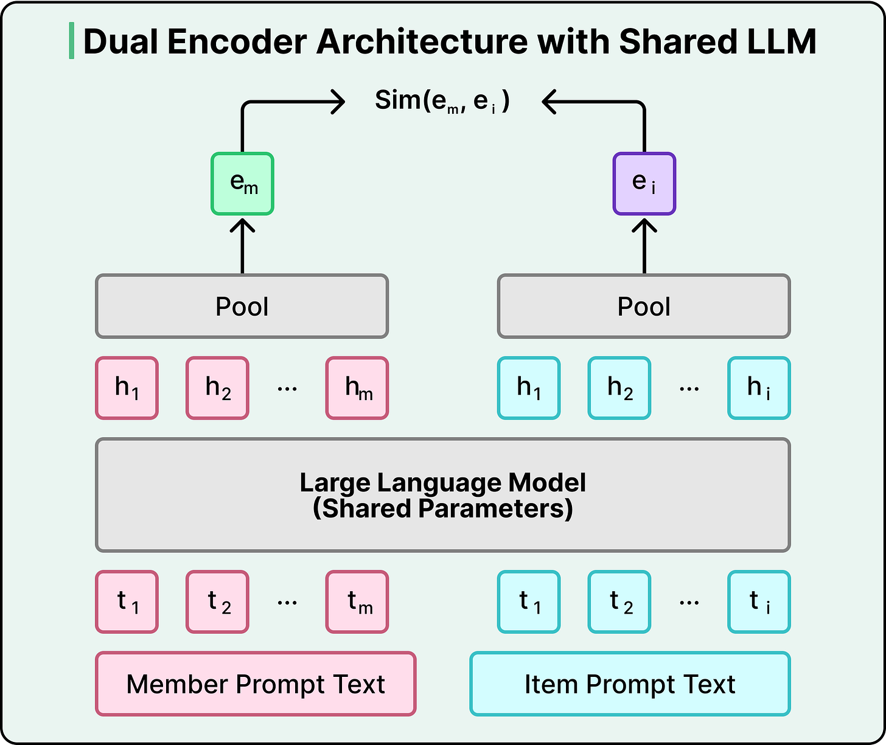
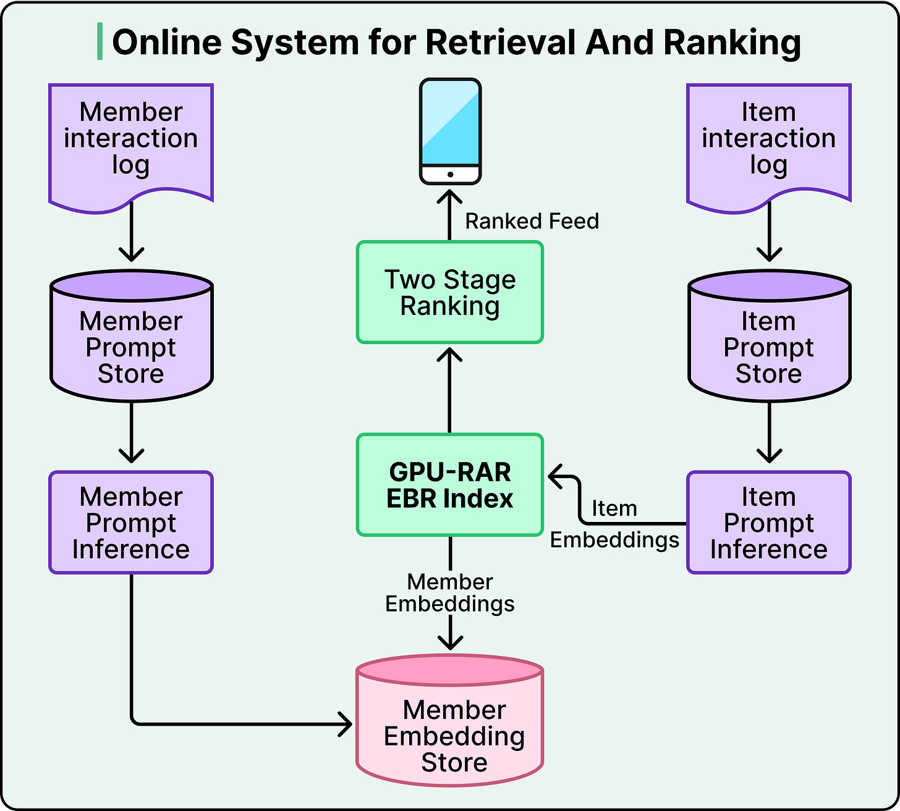
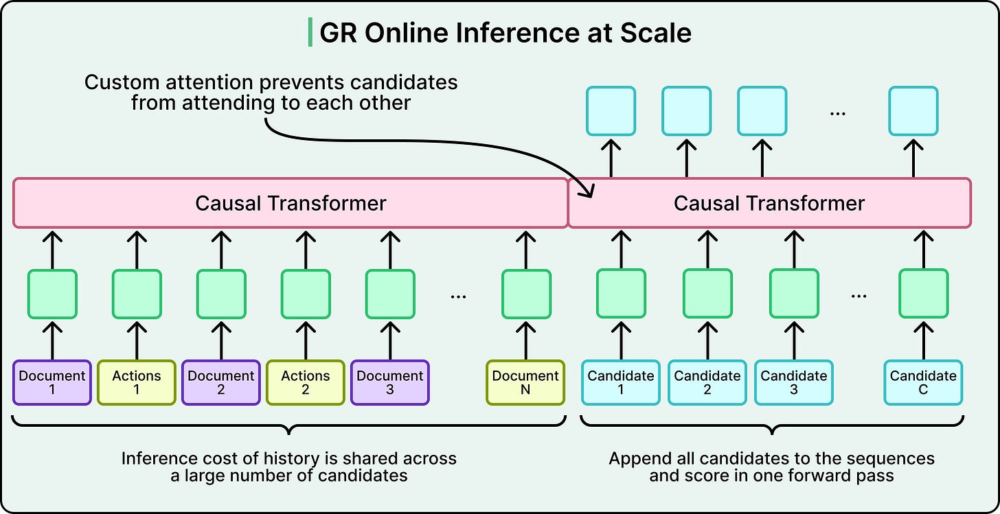
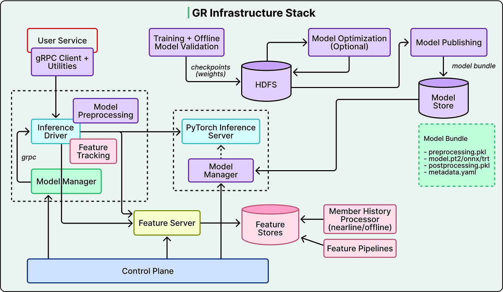

# LLMs in Production Ranking Systems

## Key Takeaways

- LinkedIn replaced 5 separate retrieval systems with a unified LLM-based dual encoder — eliminates optimization conflicts where improving one system degraded others
- LLM embeddings capture semantic relationships keyword systems miss: a profile mentioning "electrical engineering" connects with posts about "small modular reactors" via pretrained world knowledge
- Critical trick for structured data: converting raw engagement counts to percentile buckets in special tokens produced 30x correlation improvement and 15% recall@10 gains
- Training only on positively-engaged posts (not all shown posts) gave 37% memory reduction, 40% more sequences/batch, and 2.6x faster training

## LinkedIn Feed: Dual Encoder Retrieval

Shared LLM encodes members and posts into vectors in the same space. Training pushes member-post representations together for genuine engagement, apart otherwise. Retrieval executes nearest-neighbor search in <50ms.

### Structured Data as Text

A "prompt library" converts structured features into templated text. Raw engagement counts showed nearly zero correlation (-0.004) with embedding similarity. Solution: percentile buckets in special tokens (`<view_percentile>71</view_percentile>`).

### Training Optimizations

- Filter to positively-engaged posts only (counter-intuitive — more data hurt performance)
- Dual negative sampling: easy negatives (random unseen) + hard negatives (shown but unengaged)
- Adding 2 hard negatives per member improved recall by 3.6%

## LinkedIn Feed: Generative Recommender (GR)

Processes 1,000+ historical interactions as sequences using causal attention, capturing temporal patterns and long-term interest trajectories.

**Late fusion:** concatenates count features and affinity signals *after* transformer processing — avoids quadratic attention costs on independently strong signals.

**Inference:** shared context batching computes user history once, then scores all candidates in parallel. MMoE (Multi-gate Mixture-of-Experts) routes different engagement predictions through specialized gates.

### Infrastructure

- Disaggregated architecture: CPU-bound feature processing separated from GPU inference
- Custom Flash Attention variant (GRMIS): 2x speedup over standard implementations
- Three continuously running freshness pipelines update embeddings within minutes

### Tradeoffs

| Decision | Benefit | Cost |
|---|---|---|
| Consolidate 5 systems → 1 | No optimization conflicts | Less resilience |
| LLM embeddings | Richer semantic understanding | Higher compute |
| Positive-only training | Faster, more efficient | Discards data |

---

**Source:** https://blog.bytebytego.com/p/how-linkedin-feed-uses-llms-to-serve
**Date:** 2026-05-25
**Tags:** llm, recommendation-systems, embeddings, feed-ranking, linkedin, transformers
