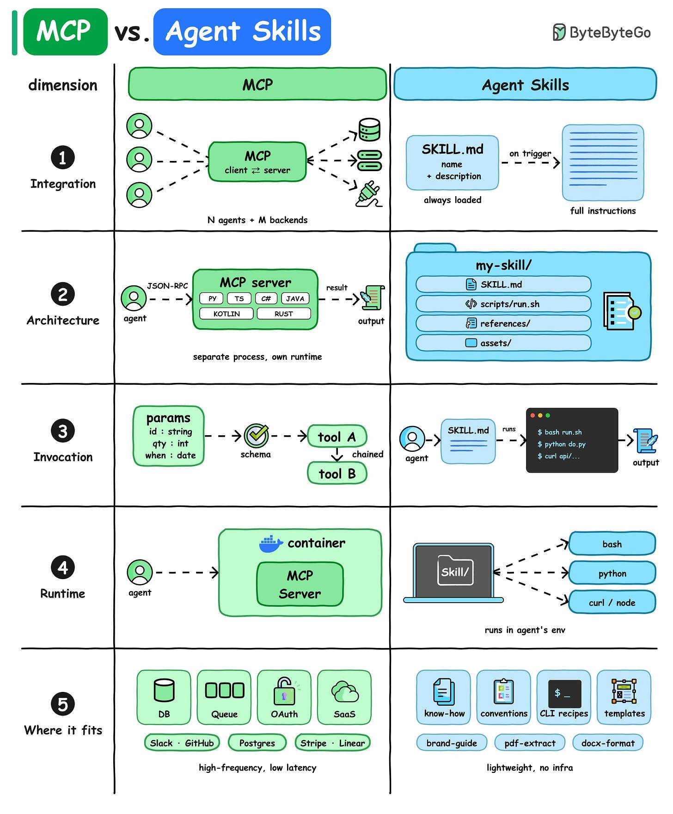

# MCP vs Agent Skills

## Key Takeaways

- MCP is a client-server protocol (JSON-RPC) connecting N agents to M backends; Skills are folders with a SKILL.md the agent loads on trigger
- MCP runs as a separate process/container with its own runtime; Skills run in the agent's own environment with no extra infra
- MCP tools are called with typed, schema-validated parameters and can be chained; Skills are invoked by the agent reading SKILL.md and running described commands
- Use MCP for connecting agents to live systems and data (DB, queues, OAuth, SaaS); use Skills for reusable know-how, conventions, and CLI recipes

## Five Dimensions

| Dimension | MCP | Agent Skills |
|---|---|---|
| Integration | Client-server protocol, N agents to M backends | SKILL.md folder, loaded on trigger |
| Architecture | Separate process, own runtime (JSON-RPC) | Directory: SKILL.md + scripts + references + assets |
| Invocation | Typed params validated against schema, chainable | Agent reads SKILL.md, runs bash/python/curl |
| Runtime | Own container or service | Runs in agent's environment, no extra infra |
| Where it fits | Live systems and data (Slack, GitHub, Postgres, Stripe) | Know-how, conventions, CLI recipes, templates |

---

**Date:** 2026-05-28
**Tags:** mcp, agent-skills, llm-tooling, architecture
