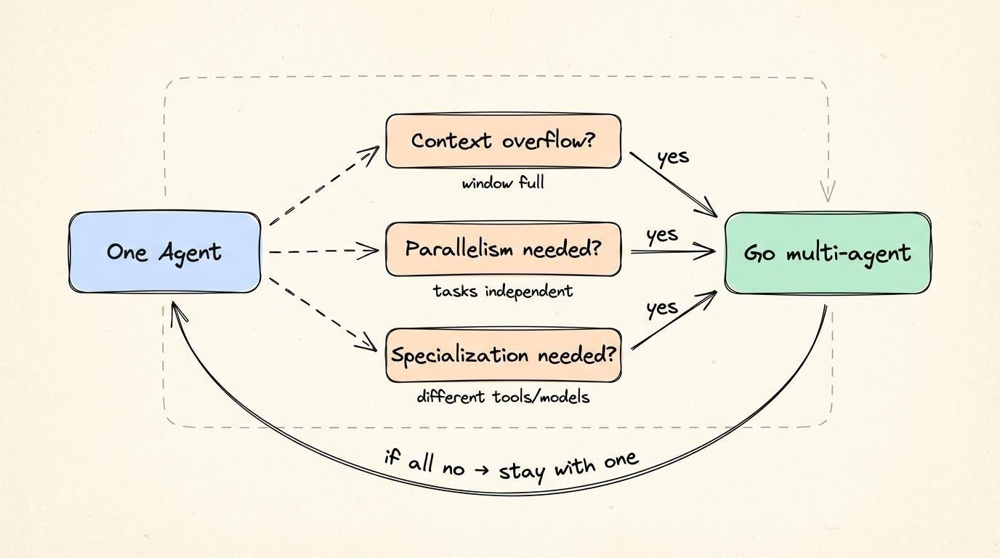
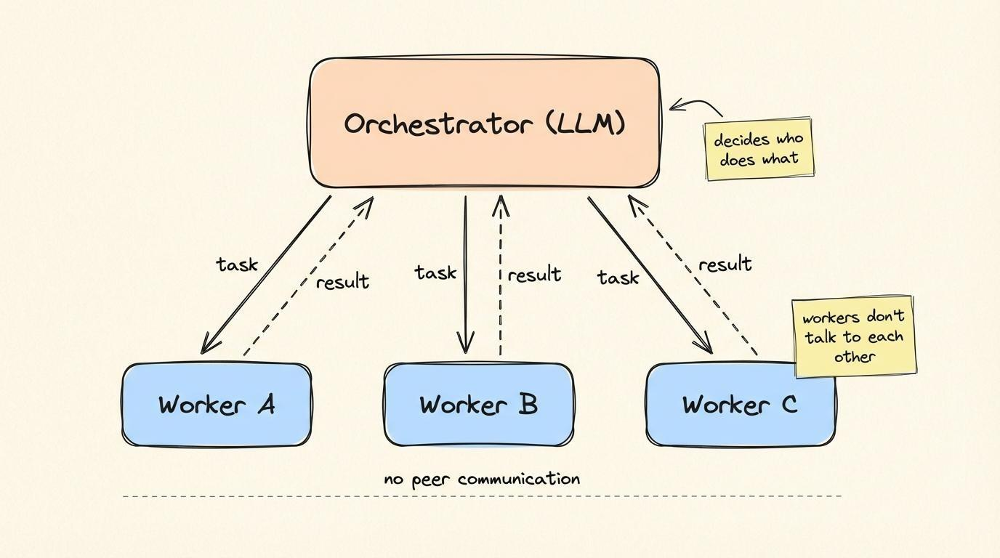
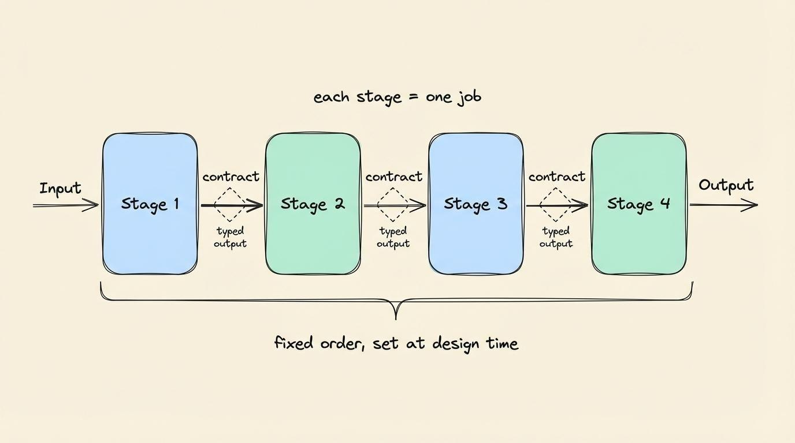
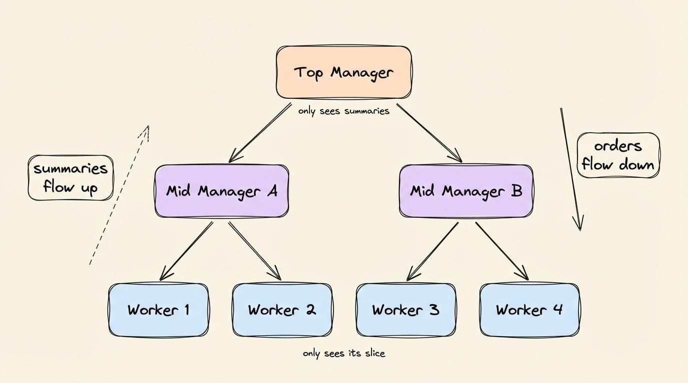
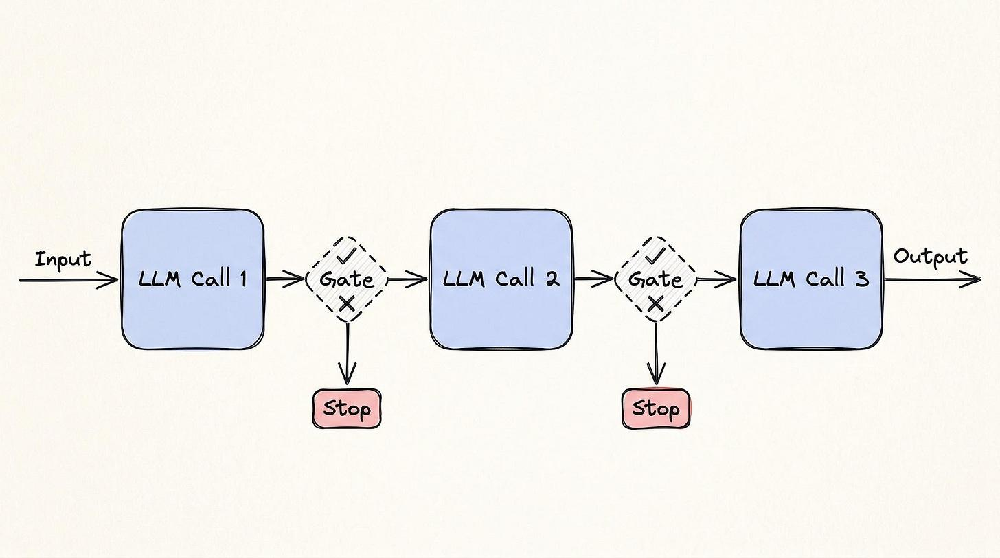
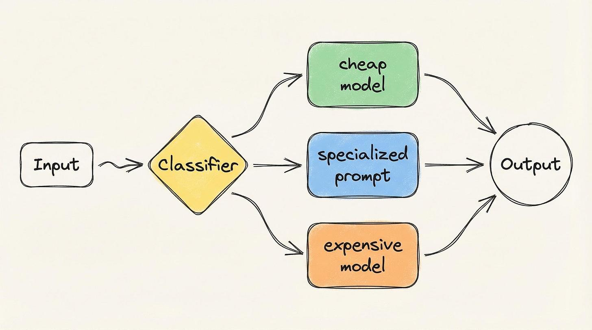
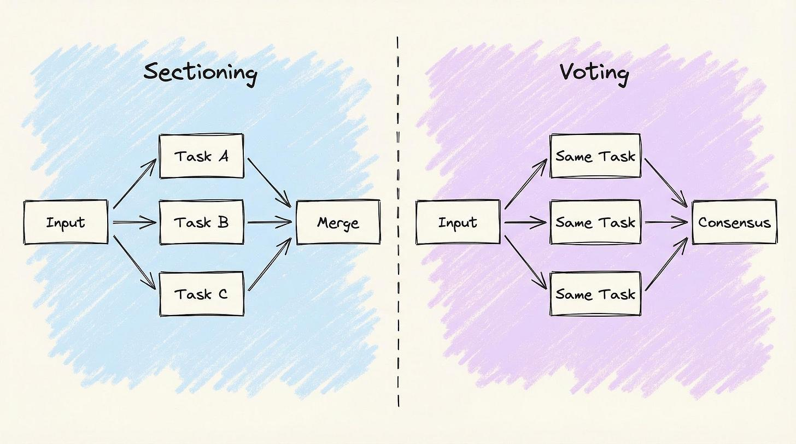
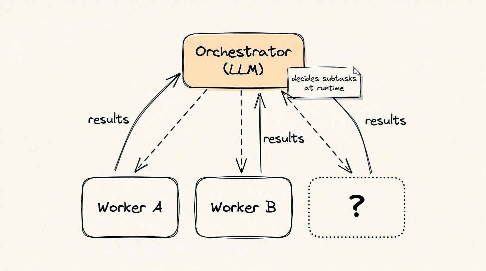
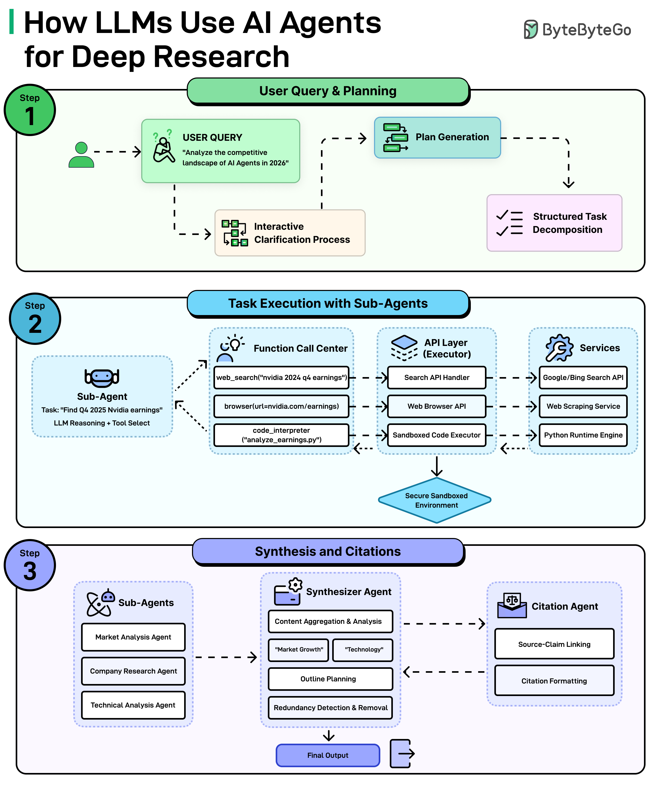
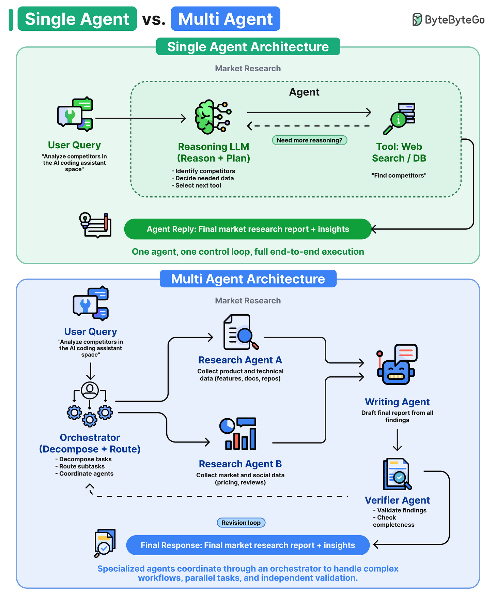

# Multi-Agent Systems and Workflow Patterns

## Key Takeaways

- Start with one agent — only go multi-agent when you hit context overflow, need parallelism, or require specialization (different tools/models/permissions)
- Three coordinated architectures (orchestrator-worker, pipeline, hierarchical) and four workflow patterns (chaining, routing, parallelization, orchestrator-workers) cover most production needs
- Most production systems shouldn't need to go beyond parallelization; orchestrator-workers introduces unpredictable failure modes
- Key tradeoff across all patterns: more coordination power = more cost and harder debugging

## When to Go Multi-Agent

Three hard limits that better prompts won't fix:

- **Context overflow** — context window full, earliest info drops out, agent loses track of its plan
- **Parallelism** — independent tasks shouldn't wait in line (Anthropic's research system reduced query time by 90% with parallel agents)
- **Specialization** — different parts need different models, tools, or access levels (code agent needs sandbox, research agent needs web, customer agent needs user data)

If none apply, stay with one agent.

## Multi-Agent Architectures

### Orchestrator-Worker

One central agent breaks tasks, assigns to workers, combines results. Workers don't talk to each other.

- **Example:** Claude Research — Opus 4 orchestrator spawns 2-10+ Sonnet 4 workers in parallel; beat single-agent Opus 4 by 90.2% on internal evals
- **Tradeoff:** central agent is the bottleneck (~7 tasks/sec if each call takes 3s); vague task splitting turns parallelism into duplicated work

### Pipeline

Agents run in fixed order, each agent's output becomes the next's input. Sequence set at design time.

- **Example:** Stripe fraud review — DAG of agent stages for business verification; cut handling time by 26%, 96% helpfulness rating
- **Tradeoff:** latency adds up linearly (5 stages x 2s = 10s); but every failure traces to exactly one step

### Hierarchical

Tree of managers and workers. Orders flow down, summaries flow up. No single agent needs full context.

- **Example:** IBM watsonx Orchestrate — top supervisor routes across 80+ domain agents (HR, sales, procurement); child agents handle vendor quotes, compliance, purchase requests
- **Tradeoff:** details get lost at each level as results get summarized upward

## Workflow Patterns (Code Controls the Flow)

### Prompt Chaining

Sequential LLM calls with validation gates between steps. Like a CI/CD pipeline — each step must pass before the next runs.

- **Example:** Legal contract review — extract clauses, classify by risk, summarize high-risk items
- **Tradeoff:** latency grows linearly; errors carry forward past what gates can catch

### Routing

Classify input, send to the right handler (different prompt, model, or sub-workflow).

- **Example:** Sierra AI routes across 15+ models; Intercom Fin routes by intent and sentiment to AI or human
- **Cost benefit:** simple queries hit cheap models, complex ones hit expensive models
- **Tradeoff:** misclassification is a single point of failure; router accuracy caps system accuracy

### Parallelization

Two variants: **sectioning** (split into independent parts, merge) and **voting** (same task multiple times, aggregate).

- **Sectioning example:** GitHub Advanced Security — CodeQL + Snyk + Semgrep scan same PR in parallel
- **Voting example:** security review — 3 prompts analyze same code, flag only if 2+ agree
- **Tradeoff:** cost multiplies per branch; partial failure handling must be designed upfront

### Orchestrator-Workers (Dynamic)

Central LLM decides subtasks at runtime (unlike pipeline where steps are predetermined).

- **Example:** Cursor agent mode — dynamically spawns agents for tests, docs, refactoring
- **Not multi-agent:** single central LLM stays in control; in true multi-agent, agents can call each other directly
- **Tradeoff:** orchestrator can lose track of the original goal or become a bottleneck

## Deep Research as a Canonical Multi-Agent Pattern

The "deep research" features in Claude, ChatGPT, and Gemini are all multi-agent systems following the same four-role pattern:

| Role | Job |
|---|---|
| **Planner** | Decompose the query into subtasks; ask clarifying questions up front rather than diving in blindly |
| **Sub-agent Searchers** | Parallel task execution; each picks its own tools (web search, page browse, code execution) and accesses the outside world through a secure API/services layer |
| **Synthesizer** | Aggregate sub-agent outputs, identify themes, plan outline, remove duplication |
| **Citation Agent** | Run alongside the Synthesizer; link every claim back to its source |

> "It's not just one model doing all the work. It's a coordinated system of specialized AI agents."

The architecture corresponds to **orchestrator-worker + pipeline + parallelization** combined:
- Orchestrator-worker shape (planner dispatches to searchers)
- Parallelization within searchers (multiple sources/topics in flight)
- Pipeline shape (planner → searchers → synthesizer → citation)

The output feels more thorough and grounded than a single-shot LLM response because:
1. The planner's clarifying questions catch ambiguity early
2. Parallel searchers cover more ground in the same wall-clock time
3. The synthesizer dedupes and structures
4. Citations make the output verifiable, not just plausible

This is the architectural shape behind any "research mode" you've seen in modern LLM products.

## Single-Agent vs. Multi-Agent: The Default Rule

**Default rule: start with single-agent. Move to multi-agent only when context or reliability becomes the observed bottleneck — not speculatively.**

| Architecture | What it is | Best for |
|---|---|---|
| **Single-agent** | One reasoning LLM: plans, selects tools, loops until done | Linear tasks; problem fits in one context window; debugging simplicity matters |
| **Multi-agent** | Orchestrator decomposes work; routes to specialized agents in parallel | Parallelizable subtasks; independent verification needed; scope exceeds single-agent coordination |

The tradeoff in one line: *"Single agents are cheaper and easier to build, but they hit a ceiling on complex work. Multi-agent systems are more capable and more reliable, but they add coordination cost."*

**Orchestrator pattern roles (multi-agent):**
- **Orchestrator** — decomposes the task and routes subtasks
- **Specialist agents** — domain-scoped execution (e.g., Research A for product data, Research B for market data)
- **Synthesis agent** — aggregates specialist outputs into a coherent result
- **Verifier agent** — validates findings and checks completeness; feeds a revision loop back to the orchestrator

**Decision signals:**

| Signal | Architecture |
|---|---|
| Linear task, bounded scope | Single-agent |
| Task exceeds context window | Multi-agent |
| Output reliability is critical | Multi-agent (add Verifier) |
| Subtasks are parallelizable | Multi-agent |
| Debugging simplicity required | Single-agent |

---

**Source:** https://blog.bytebytego.com/i/191425883/how-llms-use-ai-agents-with-deep-research
**Source:** https://blog.bytebytego.com/i/202318529/single-agent-vs-multi-agent-architecture
**Date:** 2026-05-28 (initial), 2026-06-05 (enriched with deep research pattern), 2026-06-21 (added single vs multi-agent decision framework)
**Tags:** multi-agent, orchestrator, pipeline, hierarchical, workflow-patterns, prompt-chaining, routing, parallelization, deep-research, planner-synthesizer, citation-agent, single-agent, agent-architecture, verifier-agent
