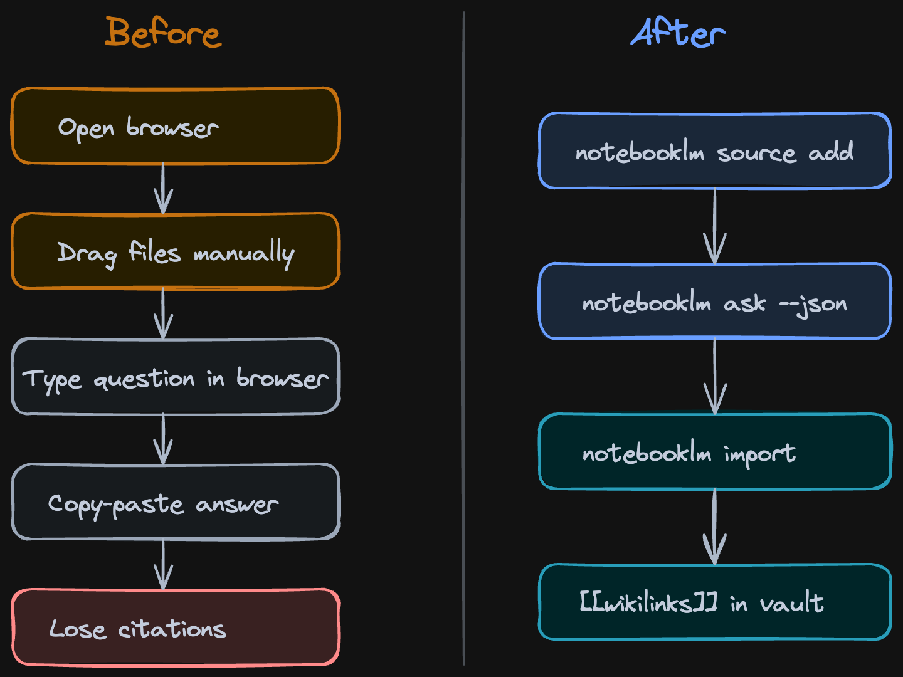
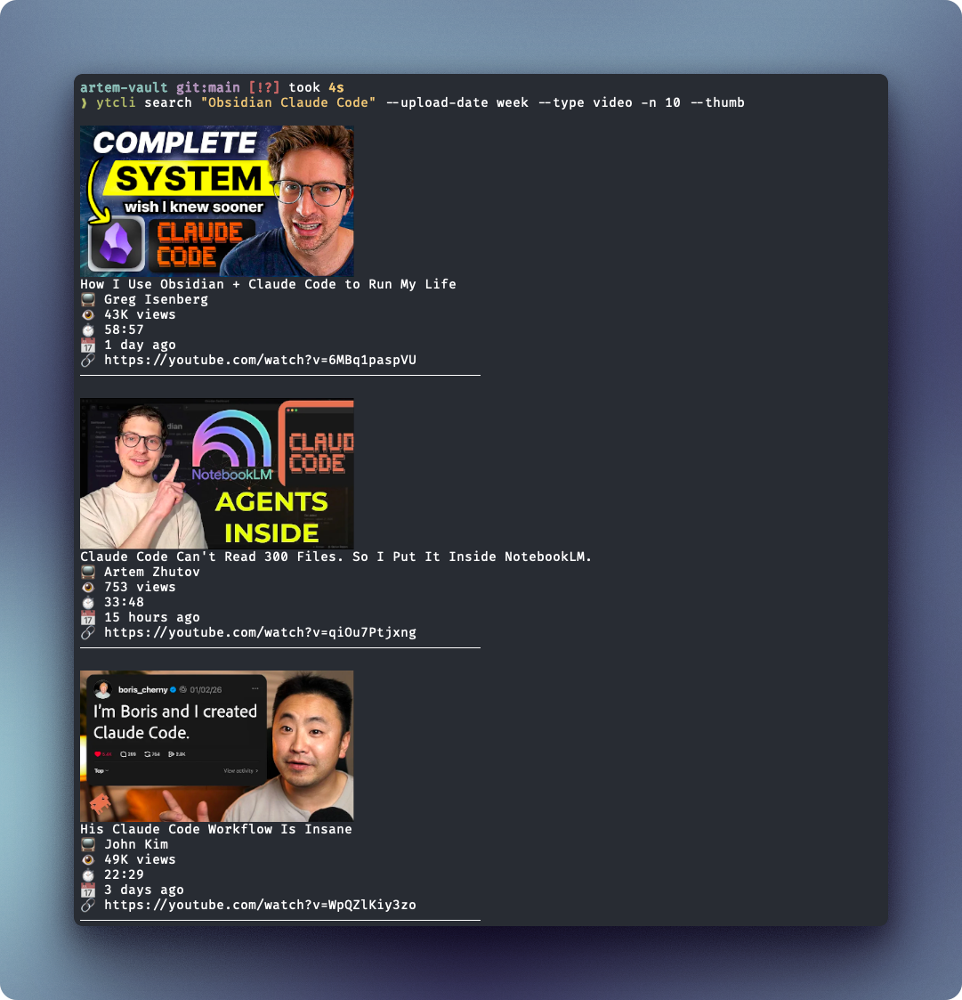
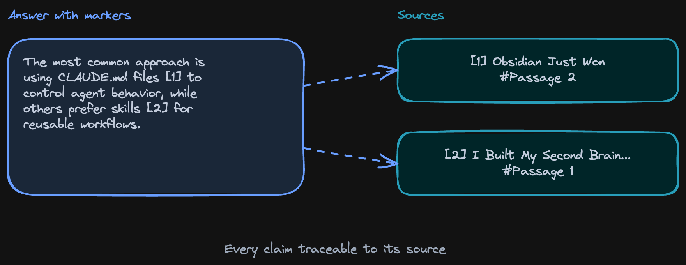

# NotebookLM as a Research Knowledge Graph

A research workflow that turns NotebookLM's implicit knowledge graph (sources → claims → citations) into a navigable, persistent vault by piping it through Claude Code into Obsidian.

## Key Takeaways

- NotebookLM already builds an **implicit knowledge graph** internally (sources → claims → citations) but traps the value inside browser tabs
- A Claude Code skill bridges NotebookLM's cited answers into Obsidian — each source becomes a file, each topic a hub, each citation a **bidirectional wikilink** to the exact passage
- **Citation-grounded retrieval** (not similarity search) — answers trace back to specific passages/timestamps, eliminating the hallucination class of failures
- **Terminal-first source curation** (e.g., `ytcli` for YouTube) yields higher signal-to-noise than NotebookLM's in-browser recommendations; pushes you past the 300-source ceiling
- Empirical citation accuracy: **~60% strong matches, ~31% partial, ~10-15% weak** — "good enough for research starting points, not formal citation"



## The Insight

NotebookLM's answers cite sources with `[1][2][3]` markers — links to specific passages in the uploaded materials. Under the hood, this is a **knowledge graph**:

- Nodes: sources (PDFs, videos, web pages, transcripts)
- Edges: citations (which claim references which passage)
- Synthesis: NotebookLM's response stitches the nodes together

The problem: this graph **exists only inside the browser session**. Close the tab, lose the graph. Move to a different project, start over.

## The Workflow: Pipeline From NotebookLM to Obsidian



```
ytcli (terminal source curation)
    ↓
NotebookLM (≤300 sources)
    ↓
JSON responses with [1][2] citations
    ↓
Claude Code skill (bridge)
    ↓
Markdown files in Obsidian vault
    ↓
Graph view + backlinks (browsable, persistent)
```

The bridge: a Claude Code skill that takes NotebookLM's structured JSON responses and writes them as Obsidian-compatible markdown.

## Data Structure

### Source Files

Each NotebookLM source becomes a markdown file:

```markdown
# YouTube — "Author's talk title"

**URL:** https://youtube.com/watch?v=...
**Duration:** 47 min
**Tags:** topic-A, topic-B
**Added:** 2026-06-05

## Summary
(NotebookLM-generated summary)

## Key Claims
- Claim 1 [timestamp 12:34]
- Claim 2 [timestamp 23:45]
- Claim 3 [timestamp 41:02]

## Referenced By
- [[topic-hub-A]]
- [[topic-hub-B]]
```

### Topic Hub Files

Topics get hub files that link to relevant sources:

```markdown
# Topic A

## What We Know
- Cross-source synthesis paragraph linking [[source-1]], [[source-2]]
- Another synthesis linking [[source-3]]

## Sources
- [[source-1]] — strong support
- [[source-2]] — partial support
- [[source-3]] — counter-evidence
```

### Bidirectional Wikilinks for Citations

Every claim links back to the exact source passage. Obsidian's backlinks panel shows "what other notes link to this passage" — turning isolated quotes into a navigable graph.



## Empirical Citation Accuracy

The author tested NotebookLM's citation accuracy by spot-checking:

| Citation quality | Rate |
|---|---|
| **Strong match** (exact passage) | ~60% |
| **Partial match** (related but not exact) | ~31% |
| **Weak/wrong** (doesn't actually support the claim) | ~10-15% |

Trust calibration:
- ✅ Research starting points
- ✅ "What's been said about X?"
- ❌ Citations in a paper
- ❌ Anything where wrong > nothing

> "Every answer is grounded — you can trace claims back to the source. Good enough to trust as a research starting point, not good enough to cite in a paper without checking."

## Practical Workloads (Tested by the Author)

1. **282-day journal pattern queries** — semantic search across personal notes for recurring themes
2. **20-video research synthesis + podcast** — feed 20 hand-picked talks, generate consolidated brief + audio summary
3. **58 auto-generated flashcards** — NotebookLM extracts learnable atoms; bridge converts to Anki/Mochi format
4. **Competitor analysis** — feed company blogs/talks, ask comparative questions
5. **arXiv paper discovery** — load papers, surface connections across them
6. **Onboarding docs** — feed internal docs to a new hire's notebook

## Why This Beats Similarity-Search RAG

| | NotebookLM citation-grounded | Similarity-search RAG |
|---|---|---|
| **Closed corpus** | ≤300 sources, curated | Open corpus, embeddings |
| **Answer provenance** | Exact passages with timestamps | Chunk-level, often imprecise |
| **Hallucination class** | Constrained to provided sources | Can fabricate within plausible range |
| **Trust ceiling** | Citation visible, verifiable | Black-box similarity |
| **Best for** | Deep research, learning | Production Q&A at scale |

NotebookLM's constraint to a small, curated corpus is the feature — not a limitation. You get citation-level traceability that vector RAG can't match.

See [rag.md](rag.md) for vector-search RAG patterns.

## Terminal-First Source Curation

A specific friction-reduction tactic: **don't pick sources in the browser, pick them in the terminal.**

- `ytcli` for YouTube — search, list, download captions
- `arxiv-cli` for papers
- `gh` for GitHub READMEs / discussions
- Local file globs for PDFs / docs

Browser-based picking is slow (5-10 sources/session at best). Terminal scripts let you batch-load 50-100 sources at once, hitting NotebookLM's 300-source ceiling regularly.

## Philosophy

Three principles the author calls out:

1. **Local markdown ownership** — your knowledge graph lives in plain text files you control, not a vendor's database
2. **Terminal-first curation** — friction reduction matters more than tool sophistication
3. **No browser lock-in** — every artifact (sources, notes, links, even generated podcasts) exports to standard formats

This is the same principle as [Claude Code's CLAUDE.md](../claude/claude-code-workflow.md) — context as version-controlled files, not vendor-locked state.

## When to Use This Stack

Strong fit:
- Long-form research projects spanning weeks/months
- Topics where you'll add sources progressively
- Cases where citations matter (academic, journalistic, legal-adjacent)
- Personal knowledge management at scale
- Researchers who already use Obsidian

Bad fit:
- One-off Q&A — overkill
- Production user-facing systems — use [vector RAG](rag.md) instead
- Real-time updates — NotebookLM doesn't crawl, you upload
- Multimodal where source isn't text-convertible

## Related

- [RAG](rag.md) — production similarity-search RAG (the orthogonal alternative)
- [Vector databases](vector-databases.md) — what powers similarity-search RAG
- [Claude Code workflow tips](../claude/claude-code-workflow.md) — the Claude Code skill that powers the bridge
- [Amazon Cosmo LLM recommendations](amazon-cosmo-llm-recommendations.md) — LLM-generated knowledge graph at production scale (different scale of problem)
- [Context engineering](context-engineering.md) — broader framing of context-as-curated-artifact

---

**Source:** https://artemxtech.substack.com/p/notebooklm-has-a-knowledge-graph
**Date:** 2026-06-05
**Tags:** notebooklm, claude-code, obsidian, knowledge-graph, citation-grounded-retrieval, research-workflow, personal-knowledge-management, rag-alternative
