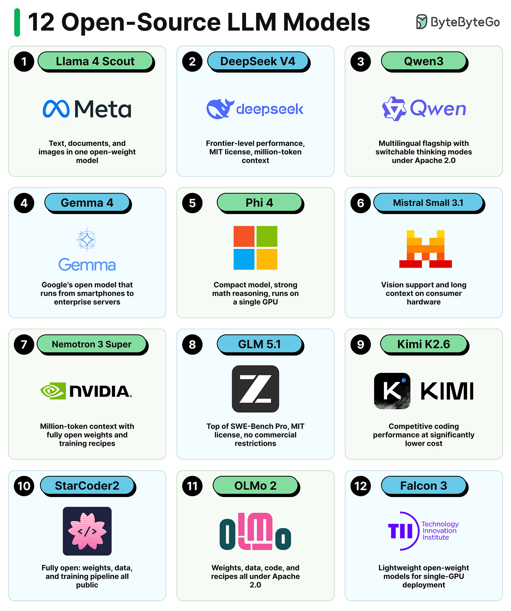
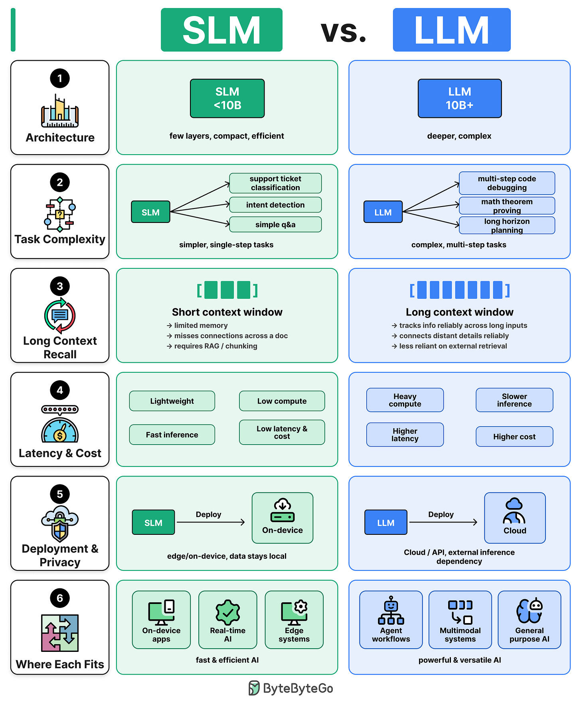

# Open-Weight Models

How the open-weight LLM ecosystem evolved into a borrow-and-build pipeline where competing labs publish innovations that the next model generation absorbs.

## Key Takeaways

- **"Open weight" ≠ "open source."** Open-weight models publish trained parameters publicly but keep training data and code proprietary — the term is precise for a reason
- All frontier open-weight models in 2025–2026 are **Mixture-of-Experts (MoE)**, with two parameter counts that matter: total (knowledge capacity) and active (compute per token)
- The competitive surface narrowed to three innovation axes: **attention strategy, expert count & sparsity, training approach** — each lab specializes in one and the others adopt within months
- **DeepSeek-V3 trained for ~$5.5M** demonstrated that frontier-quality models don't require hyperscaler budgets when architecture choices compound
- The 18-month innovation flow (DeepSeek MLA → Moonshot trillion-param scaling → DeepSeek sparse attention → Zhipu adoption) is what closed-weight competitors don't get for free
- The mid-2026 model landscape has matured beyond "best open model" to **purpose-fit selection**: multimodal (Llama 4 Scout), edge (Phi 4, Falcon 3), coding (GLM 5.1, Kimi K2.6), reproducibility (OLMo 2), long-context (DeepSeek V4, Nemotron 3 Super)
- **SLM (<10B) vs. LLM (10B+) is a deployment decision**, not a capability race — on-device privacy and latency constraints select for SLMs long before reasoning capability becomes the limit

## Open-Weight vs. Closed-Weight

| Dimension | Closed-Weight (GPT-5, Claude, Gemini) | Open-Weight (DeepSeek, Qwen, Kimi, GLM) |
|---|---|---|
| **Weights** | Hidden behind APIs | Published publicly |
| **Training code** | Proprietary | Often proprietary, sometimes partial |
| **Training data** | Proprietary | Proprietary |
| **Inference** | Vendor-controlled | Self-hostable on your hardware |
| **Innovation cycle** | Internal | Cross-lab cumulative |

"Open weight" is the accurate label — the weights are open, but you can't fully reproduce training without the data and full code.

## Why MoE Took Over

A dense model activates *all* parameters for *every* token. A Mixture-of-Experts model routes each token to a small subset of "expert" subnetworks. The result: massive knowledge capacity at a fraction of the per-token compute.

Frontier open-weight model parameter splits (2025–2026):

| Model | Total params | Active params | Active % |
|---|---|---|---|
| **DeepSeek V3** | 671B | 37B | ~5.5% |
| **Kimi K2** (Moonshot) | 1T | 32B | ~3.2% |
| **Qwen3** (Alibaba) | 235B | 22B | ~9.4% |

Total params = knowledge capacity. Active params = inference cost. MoE lets a 1T-param model run with the per-token cost of a ~32B dense model.

## The Three Innovation Axes

### 1. Attention Strategy

| Variant | Originator | Adopters | What it changes |
|---|---|---|---|
| **Grouped-Query Attention (GQA)** | Google | Qwen3, Llama 4 | K/V shared across head groups; modest memory savings |
| **Multi-Head Latent Attention (MLA)** | DeepSeek-V2 | Kimi K2 | Compresses K/V into a smaller latent space; large memory savings |
| **Sparse Attention** | DeepSeek-V3.2 | Zhipu GLM-5 | Each token attends to a subset of positions; enables long context cheaply |

The pattern: a lab publishes a novel attention variant, the next-generation model from a competitor adopts it within 6–12 months.

See [transformer architecture](transformer-architecture.md) for how GQA/MLA fit into the broader attention family.

### 2. Expert Count & Sparsity

The number of experts ranges from 16 to 384 across frontier models. Design choices that distinguish labs:

- **Shared experts** — some early MoE designs reserved a few experts that *every* token routed through (always-on capacity for common patterns). **Qwen3 eliminated shared experts** in its latest release without public justification
- **Dense/MoE alternation** — Llama 4 alternates dense layers with MoE layers, hybridizing the two regimes
- **Expert specialization** — more experts = finer specialization but harder routing; fewer experts = simpler routing but less differentiation

There's no settled "correct" number; the ecosystem is still exploring the design space.

### 3. Training Approach

| Technique | Pioneered by | What it gave the field |
|---|---|---|
| **RL with Verifiable Rewards (RLVR)** | DeepSeek-R1 | Reasoning training that doesn't need human preference labels — math/code/logic verifiers generate rewards automatically |
| **Distillation** | Llama 4 (Behemoth co-training), Qwen3 family | Scale a small model by training it against a larger teacher; how the Qwen3 family covers 0.5B → 235B from one recipe |
| **Synthetic agentic data** | Kimi K2 | Generated tool-use trajectories at scale to bake agent behavior into pretraining |
| **MuonClip optimizer** | Moonshot | Novel optimizer that enabled stable trillion-param training |
| **Slime training framework** | Zhipu | Infrastructure layer that other labs can borrow |

Compare to [AI trends 2026 — RLVR](ai-trends-2026.md#trend-1-reasoning-and-rlvr) for the broader context on how RLVR unlocked reasoning at scale.

## The 18-Month Innovation Flow

A concrete trace of how one architectural idea (MLA → MoE refinement → trillion-param scaling → sparse attention) propagated across four labs:

```
DeepSeek V2          → introduces Multi-Head Latent Attention (MLA)
         │
         ▼
DeepSeek V3          → refines MoE design; trains for ~$5.5M
         │
         ▼
Moonshot AI (Kimi K2) → adopts MLA; scales to 1T params; publishes MuonClip optimizer
         │
         ▼
DeepSeek V3.2        → adds sparse attention (long-context efficiency)
         │
         ▼
Zhipu AI (GLM-5)     → adopts sparse attention; publishes Slime training framework
```

Each arrow is a published paper or model release. The ecosystem isn't competing labs producing isolated breakthroughs — it's a **shared technical conversation** where the next lab's release starts from where the previous lab left off.

This is what closed-weight competitors don't get for free. OpenAI and Anthropic have to discover or rediscover each innovation internally; the open-weight ecosystem gets it published.

## What This Means

- **Specific model leaderboard positions will churn every few months** — the underlying architectural ideas and the borrow-and-build pattern are the durable story
- **Cost per intelligence is falling fast** — when DeepSeek-V3 trained for $5.5M and the next iteration from a different lab benefits from those same techniques, the floor keeps moving
- **The "Chinese open-weight ecosystem" framing is real but partial** — DeepSeek, Moonshot, Alibaba, Zhipu are the most visible participants, but Meta, Mistral, and Allen Institute also contribute; the pattern is ecosystem-wide, not nationality-bound
- **Reading research is back to being a competitive advantage** — labs that ingest published architectures fast can ship competitive models without doing all the discovery themselves

## Related

- [AI trends 2026](ai-trends-2026.md) — open-weight models as one of five reinforcing trends
- [Transformer architecture](transformer-architecture.md) — GQA, MLA, sparse attention in detail
- [Inference engineering](../inference/inference-engineering.md) — MoE has specific inference cost characteristics
- [Local LLM inference](../inference/local-llm-inference.md) — open weights are what makes self-hosting possible
- [LLM cost and routing](llm-cost-and-routing.md) — open-weight pricing pressure on closed APIs

## 12 Notable Open-Source Models (Mid-2026 Survey)

A reference card of models notable for a single defining strength — not a ranking.



| # | Model | Lab | Defining Strength | License |
|---|---|---|---|---|
| 1 | **Llama 4 Scout** | Meta | First natively multimodal open-weight model (text + docs + images) | — |
| 2 | **DeepSeek V4** | DeepSeek | MoE, frontier-level performance, MIT license, native 1M-token context | MIT |
| 3 | **Qwen3** | Alibaba | Multilingual flagship; switchable thinking/non-thinking modes | Apache 2.0 |
| 4 | **Gemma 4** | Google | Runs from smartphones to enterprise servers; widest language coverage | Apache 2.0 |
| 5 | **Phi 4** | Microsoft | Compact, synthetic-data trained; strong math reasoning; single-GPU deployable | — |
| 6 | **Mistral Small 3.1** | Mistral | VLM with vision support and long context; runs on consumer laptops | — |
| 7 | **Nemotron 3 Super** | NVIDIA | 1M-token context; fully open weights + datasets + training recipes; strong agentic coding | MIT |
| 8 | **GLM 5.1** | Zhipu | First open-weight model to top SWE-Bench Pro; no commercial restrictions | MIT |
| 9 | **Kimi K2.6** | Moonshot | Competitive coding vs. closed models at significantly lower cost | Modified MIT |
| 10 | **StarCoder2** | AI2 | Fully open: weights, data, and training pipeline all public | — |
| 11 | **OLMo 2** | AI2 | Weights, data, code, and recipes all under Apache 2.0 — most complete reproducibility | Apache 2.0 |
| 12 | **Falcon 3** | TII | Lightweight family for single-GPU deployment | — |

**Model selection shortcuts:**
- On-device / privacy-sensitive → Phi 4, Falcon 3, Mistral Small 3.1
- Coding / SWE use case → GLM 5.1 (SWE-Bench Pro leader), Kimi K2.6 (cost-efficient), StarCoder2 (transparent)
- Multimodal (vision + text) → Llama 4 Scout, Mistral Small 3.1
- Million-token context → DeepSeek V4, Nemotron 3 Super
- Full reproducibility for research → OLMo 2, StarCoder2
- Switchable reasoning modes → Qwen3 (thinking/non-thinking toggle)

## SLMs vs. LLMs: A Deployment Decision

The SLM (<10B params) vs. LLM (10B+) choice is a deployment and task-complexity decision, not a capability race. SLMs win on cost, latency, and privacy for bounded tasks; LLMs win on reasoning depth and context for complex workflows.



| Dimension | SLM (<10B params) | LLM (10B+ params) |
|---|---|---|
| **Architecture** | Few layers, compact, efficient | Deeper, more complex |
| **Task Complexity** | Simple single-step tasks (classification, intent detection, Q&A) | Complex multi-step code, math, long-horizon planning |
| **Long Context Recall** | Limited memory; loses coherence across long docs; requires RAG/chunking | Tracks inputs reliably across large contexts; less reliant on external retrieval |
| **Latency & Cost** | Lightweight, fast inference, low compute | Heavy compute, higher latency, higher cost |
| **Deployment & Privacy** | On-device or on-premise; data stays local | Cloud/API with external inference dependency |
| **Where Each Fits** | On-device apps, real-time AI, edge systems | Agent workflows, multimodal tasks, general-purpose AI |

**Hybrid default:** Route simple, high-frequency tasks to SLMs; escalate complex tasks to LLMs. Deployment model (on-device vs. cloud) is often the deciding constraint before reasoning capability.

---

**Source:** https://blog.bytebytego.com/p/how-open-weight-models-changed-the
**Source:** https://blog.bytebytego.com/i/202318529/12-open-source-llms
**Date:** 2026-06-16 (initial), 2026-06-21 (enriched with 12-model survey + SLM vs LLM framework)
**Tags:** open-weight-models, moe, mixture-of-experts, deepseek, qwen, kimi, moonshot, zhipu, glm, mla, gqa, sparse-attention, rlvr, distillation, muonclip, slime, llm-architecture, ai-ecosystem, slm, small-language-model, model-selection, edge-deployment, on-device-ai
