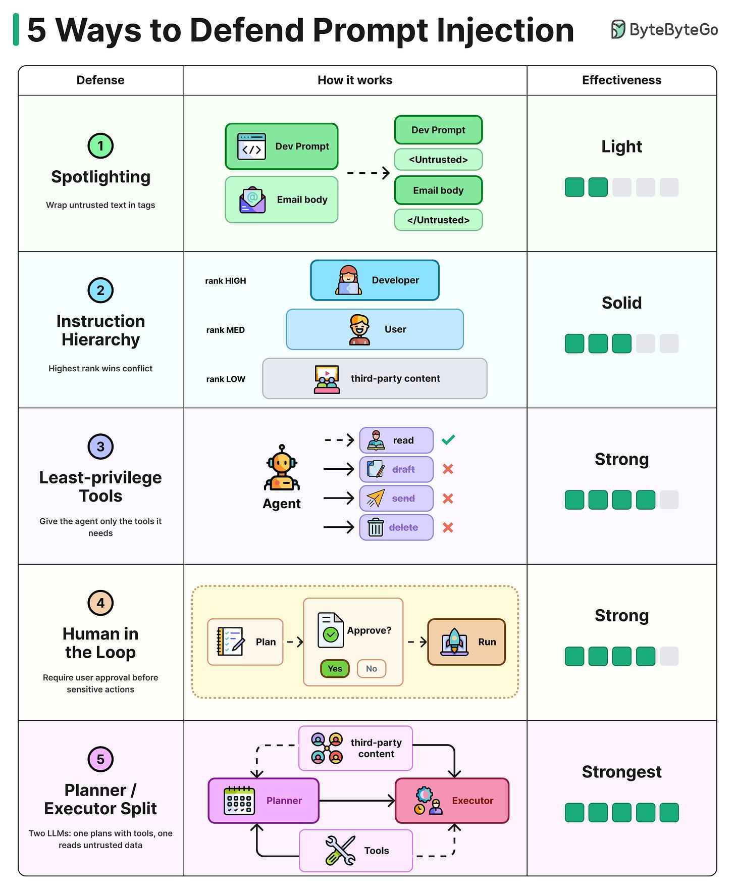

# Prompt Injection Defenses

## Key Takeaways

- Prompt injection tops the OWASP LLM Top 10 — no single fix exists, you stack defenses
- Two families: model-level (teach the model to resist) and system-level (bound the damage around it)
- Strongest defense is the planner/executor split — two LLMs where the one with tools never sees untrusted content
- Production systems like Gmail stack multiple defenses together to make indirect injection manageable

## Model-Level Defenses

- **Spotlighting** (Light) — wrap untrusted text in control tags like `<UNTRUSTED>...</UNTRUSTED>`, tell model to treat contents as data, not instructions
- **Instruction Hierarchy** (Solid) — fine-tune model to rank developer system prompt > user message > third-party content; highest rank wins on conflict

## System-Level Defenses

- **Least-Privilege Tools** (Strong) — give the agent only the minimum tools it needs (e.g., read-only, no send/delete)
- **Human-in-the-Loop** (Strong) — require explicit user approval before any sensitive action runs
- **Planner/Executor Split** (Strongest) — two separate LLMs: planner has tool access but never sees untrusted content; executor reads untrusted content but has no tools

---

**Date:** 2026-05-28
**Tags:** prompt-injection, owasp, llm-security, defense-in-depth
