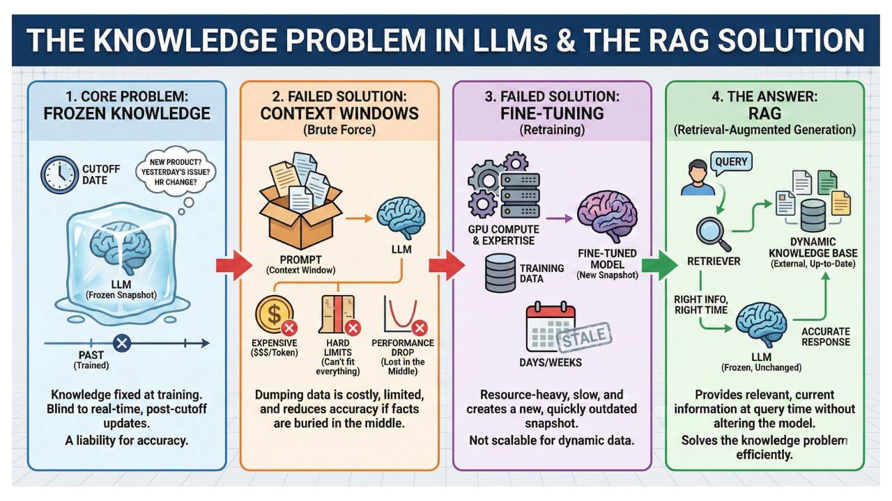
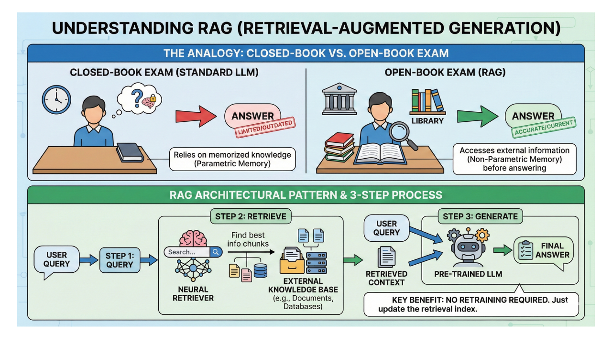
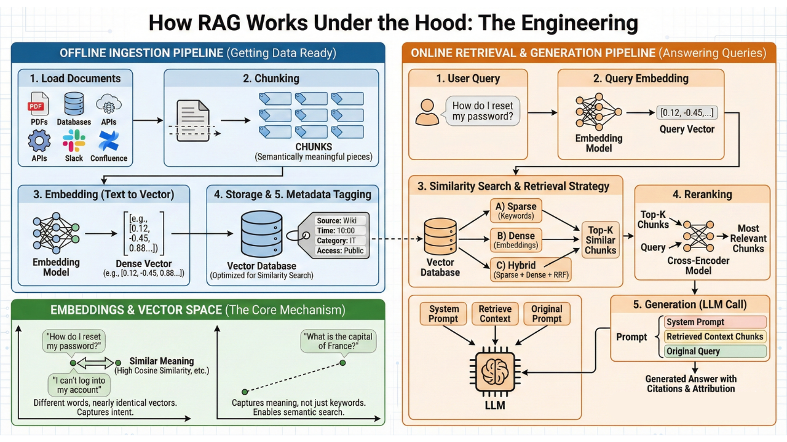
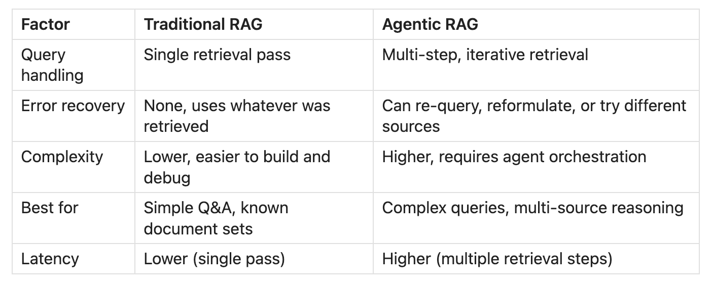
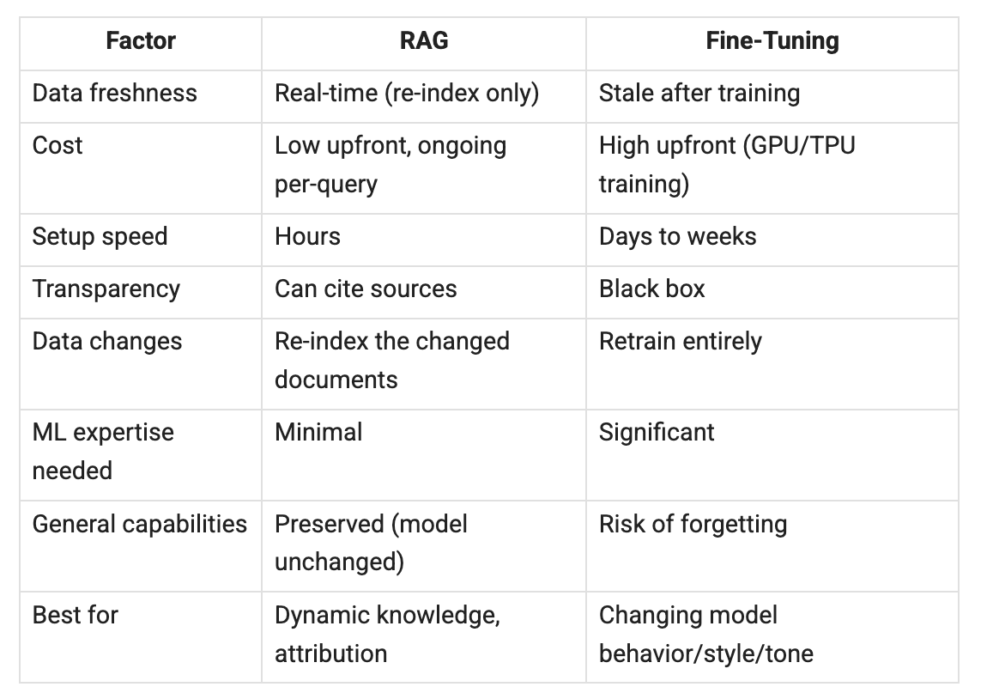

# RAG: Classic and Agentic

Retrieval-Augmented Generation — from the foundational one-shot pipeline to agentic loops with routing, query rewriting, and self-evaluation.

## Key Takeaways

- RAG solves the LLM "knowledge problem" — retrieve relevant context at query time instead of relying on parametric memory or stale training data
- **Two-phase architecture**: offline ingestion (load → chunk → embed → store → tag) and online retrieval (embed query → similarity search → re-rank → augment prompt → generate)
- **Three retrieval strategies** trade off precision vs recall: sparse (BM25 keyword), dense (semantic embeddings), and hybrid (combined via Reciprocal Rank Fusion)
- **Production-grade RAG is a multi-step pipeline** — intent parsing → query reformulation → retrieval → optional web search → re-rank → generate — not the naive three-step loop
- **Agentic RAG** turns the pipeline into a control loop with decision points: route to the right source, reformulate weak queries, evaluate retrieval before generation, retry if needed. It's an engineering decision, not a default — cost + latency trade-offs matter
- RAG and fine-tuning are **complementary**: fine-tune to shape style/behavior, use RAG to inject current/updatable knowledge. RAG also beats long context windows on cost, precision, and the "lost in the middle" problem



## Why RAG Exists

LLMs hallucinate because:
1. **Knowledge is frozen at training time** — they don't know what happened after their cutoff
2. **Parametric memory is unreliable** — they can't tell you *which* documents support a claim
3. **They generate plausible text** — fluency is not evidence

RAG fixes this by treating the LLM like a student taking an open-book exam: at query time, retrieve the most relevant chunks from an external knowledge base and stuff them into the prompt as grounding context.

> "Every large language model you use has lied to you with confidence, fluency, and frequency."

## Classic RAG — The Three-Step Loop



The minimal pattern:

```
1. RETRIEVE   — embed query, search vector DB, return top-K chunks
2. AUGMENT    — stuff chunks into system prompt + user query
3. GENERATE   — LLM produces answer grounded in retrieved chunks
```

This is the demo-quality version. Production needs more.

## Offline Ingestion Pipeline



Run once when adding new content (or as a streaming pipeline for changing corpora):

| Step | What | Tools |
|---|---|---|
| **Load** | Pull from PDFs, APIs, wikis, code, internal docs | LangChain, LlamaIndex loaders |
| **Chunk** | Split into semantically meaningful pieces | Recursive character splitter, semantic chunkers — **highest-leverage step** |
| **Embed** | Convert each chunk to a vector (1,536 or 3,072 dim) | OpenAI `text-embedding-3`, Cohere, BGE, E5 |
| **Store** | Persist vectors + chunks in a vector DB | pgvector, Pinecone, Weaviate, Qdrant, Chroma |
| **Tag metadata** | Add source, timestamp, category, ACLs | Required for filtering and access control |

**Chunking is the single most important decision.** Bad chunks → bad retrieval → bad generation. Strategies:
- Fixed-size with overlap (simple baseline)
- Semantic chunking (split on topic shifts, not character count)
- Document-aware chunking (preserve markdown structure, code blocks, tables)

See [vector-databases.md](vector-databases.md) for indexing details.

## Online Retrieval Flow

```
Query
  ↓
Embed (same model as offline)
  ↓
Vector DB similarity search → top-K candidates
  ↓
Re-rank with cross-encoder (optional but high-value)
  ↓
Filter by metadata (recency, ACLs)
  ↓
Top-K → assembled into prompt
  ↓
LLM → answer + citations
```

### Three Retrieval Strategies

| Strategy | How | When it wins | When it loses |
|---|---|---|---|
| **Sparse (BM25 / TF-IDF)** | Keyword overlap, term frequency | Exact terms, acronyms, code identifiers | Paraphrases, synonyms |
| **Dense (semantic embeddings)** | Vector similarity in embedding space | Conceptual queries, paraphrases | Rare terms, acronyms not in training |
| **Hybrid (RRF)** | Reciprocal Rank Fusion combines both | Most real workloads | Adds latency + complexity |

Hybrid usually beats either alone. The combination handles "how do I cancel my subscription?" matching a doc titled "Membership termination" while also matching exact product codes.

### Re-ranking

Top-K vector search returns 50-100 candidates fast but imprecisely. A **cross-encoder reranker** (slower, smarter model) scores each candidate against the query and keeps the top 5-10. Typical accuracy lift: 10-30%.

## Prompt Assembly

A typical RAG prompt:

```
System: You are a helpful assistant. Answer only using the provided context.
        If the context doesn't contain the answer, say "I don't know."
        Cite sources using [1], [2], etc.

Context:
[1] {chunk1_text}  (source: {file1}, page {n1})
[2] {chunk2_text}  (source: {file2}, page {n2})
[3] {chunk3_text}  (source: {file3}, page {n3})

User: {query}
```

**Always include citations.** Without them, RAG output is indistinguishable from hallucination.

## RAG vs Fine-Tuning vs Long Context

| Approach | Best for | Avoid for |
|---|---|---|
| **Fine-tuning** | Style, format, behavior, domain language | Adding knowledge (catastrophic forgetting, expensive to refresh) |
| **RAG** | Current / updatable / private knowledge | Behavior change (won't fix "model is too formal") |
| **Long context window** | One-shot processing of a single big document | Cost (every token costs every turn), lost-in-the-middle |

**Production usually combines all three:**
- Fine-tune for tone/format/structured output
- RAG for the knowledge that updates
- Long context for processing single large documents in-flight

RAG specifically beats long context because:
1. **Cost** — 5-20 chunks instead of 1M tokens
2. **Precision** — high-attention zones (start/end of context)
3. **Updatable** — change one chunk in the index instead of re-fine-tuning

## Production Multi-Step Pipeline



What separates demo-quality from production-quality:

```
1. Intent parsing       — classify query (factual? analytical? procedural? out-of-scope?)
2. Query reformulation  — rewrite for retrieval (decompose, expand, add context)
3. Retrieval            — hybrid search, top-K with metadata filter
4. (Optional) Web search — supplement when internal corpus is insufficient
5. Re-rank              — cross-encoder pares to top 5-10
6. Generate             — LLM produces answer with citations
```

Each stage is a decision point that can be made smarter.

## Agentic RAG



The leap from classic RAG: **insert a control loop with decision points** between retrieval and generation.

Classic RAG is a linear pipeline. Agentic RAG is a loop where the agent **pauses to evaluate retrieval quality before generation** and can **retry with a different strategy**.

### Three Distinguishing Capabilities

1. **Tool / source routing** — agent picks *which* knowledge base or tool to query (legal DB vs product DB vs live API)
2. **Query refinement** — decomposes complex queries into sub-queries; rewrites weak queries based on initial retrieval signals
3. **Self-evaluation** — judges whether retrieved chunks are sufficient before generation; retries with a different query or source if not

### The Three RAG Failure Modes Agentic-RAG Addresses

| Failure mode | What happens | Agentic fix |
|---|---|---|
| **Ambiguous queries** | Single search misses the right scope | Decompose into sub-queries; route to right source |
| **Scattered evidence** | Needed info is across many docs/sources | Multi-step retrieval, accumulate evidence |
| **False confidence** | Bad retrieval → confidently wrong answer | Self-evaluate retrieval quality; re-query or abstain |

### Implementation Spectrum (Cheapest First)

| Pattern | Complexity | When |
|---|---|---|
| **Simple router** | Low | Multiple knowledge sources; need to pick the right one |
| **Query rewriter** | Low-medium | Users phrase questions poorly; rewriting before retrieval helps |
| **ReAct loop** (Reason → Act → Observe) | Medium | Tasks need multi-step reasoning + retrieval interleaved |
| **Multi-agent system** | High | Distinct specialized roles (researcher, evaluator, synthesizer) |

Climb the ladder only as far as your failure mode requires. Most production RAG benefits from query rewriting; only complex cases need ReAct or multi-agent.

### When Agentic RAG Doesn't Help

- **Direct factual lookups** against a single, well-organized source — overhead is pure cost
- **High-volume, low-complexity queries** where latency and cost dominate quality
- **Retrieval issues from bad indexing** — agentic loops won't save bad chunks. Fix the index first

### The Trade-offs

- **Latency** — every decision is an extra LLM call
- **Cost** — agentic loops 2-5× the tokens of classic RAG
- **Debugging difficulty** — non-deterministic loops are harder to reason about
- **Evaluator paradox** — self-correction is bounded by the LLM's ability to judge relevance. A weak judge makes the loop unreliable
- **Overcorrection** — the loop can be "smarter than it needs to be" and end up with a worse answer than first-pass

> "Agentic RAG is an engineering decision, not a default."

### Decision Framework

Use **classic RAG** when:
- Direct factual lookups against a well-organized source
- High-volume + cost-sensitive
- Retrieval problems stem from chunking or stale data (fix the index)

Use **Agentic RAG** when all three are true:
- The right knowledge source is ambiguous (routing helps)
- The system can't judge retrieval quality (self-eval helps)
- There's no retry path on failure (loop helps)

## When to Reach For RAG vs Agents vs Long Context

See [rags-vs-agents.md](rags-vs-agents.md) for the broader comparison.

| Use case | Tool |
|---|---|
| "Answer based on these docs" | Classic RAG |
| "Answer based on these docs, possibly across multiple sources" | Agentic RAG (with routing) |
| "Take action in the world based on these docs" | Agent with RAG as a tool |
| "Analyze this 200-page document in one shot" | Long context (no retrieval needed) |

## Limitations of RAG

- **Retrieval failure cascades** — if the top-K doesn't contain the answer, generation is fluent fiction
- **Chunk boundaries break context** — a sentence split mid-clause loses meaning
- **Embedding bias** — semantic similarity isn't the same as relevance
- **Stale indexes** — content updates require re-indexing; sync lag = wrong answers
- **Multimodal gaps** — text-only embeddings miss diagrams, charts, code structure

## Related

- [Vector databases](vector-databases.md) — the storage layer underneath RAG
- [RAGs vs Agents (see decision section)](rag.md#when-to-reach-for-rag-vs-agents-vs-long-context) — the broader decision framework
- [LLM evals § RAG triad](llm-evals.md) — measuring faithfulness, relevance, retrieval precision
- [Context engineering](context-engineering.md) — RAG is the "Select" strategy in context engineering
- [NotebookLM research workflow](notebooklm-research-workflow.md) — citation-grounded retrieval (vs similarity-search RAG)
- [Amazon Cosmo LLM recommendations](amazon-cosmo-llm-recommendations.md) — LLM-generated knowledge graph as a RAG-adjacent pattern
- [OpenAI data agent](../agents/openai-data-agent.md) — production agentic RAG with six-layer context ranking
- [Multi-agent systems](../agents/multi-agent-systems.md) — when agentic-RAG escalates to true multi-agent

---

**Source:** https://newsletter.systemdesign.one/p/how-rag-works
**Source:** https://blog.bytebytego.com/i/198874402/rags-vs-agents
**Source:** https://blog.bytebytego.com/p/how-agentic-rag-works
**Date:** 2026-06-05
**Tags:** rag, retrieval-augmented-generation, agentic-rag, vector-database, embeddings, chunking, hybrid-search, reranking, react, llm, system-design
