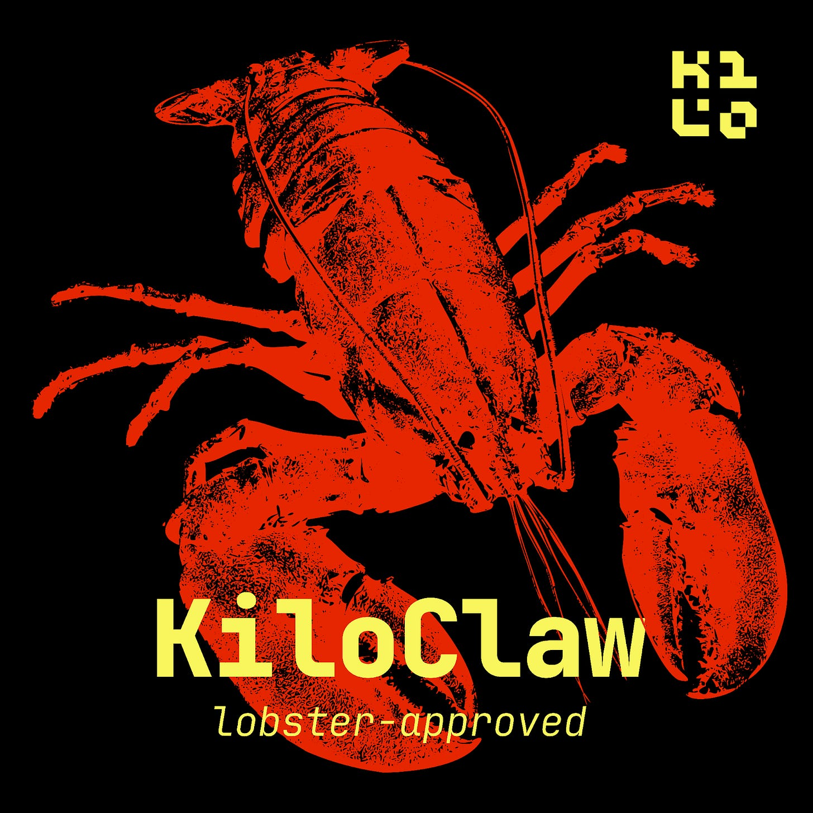
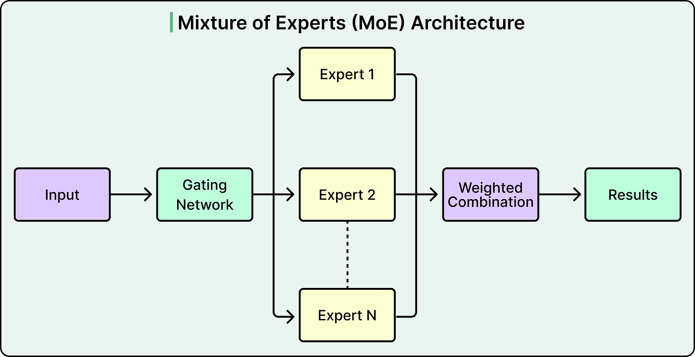
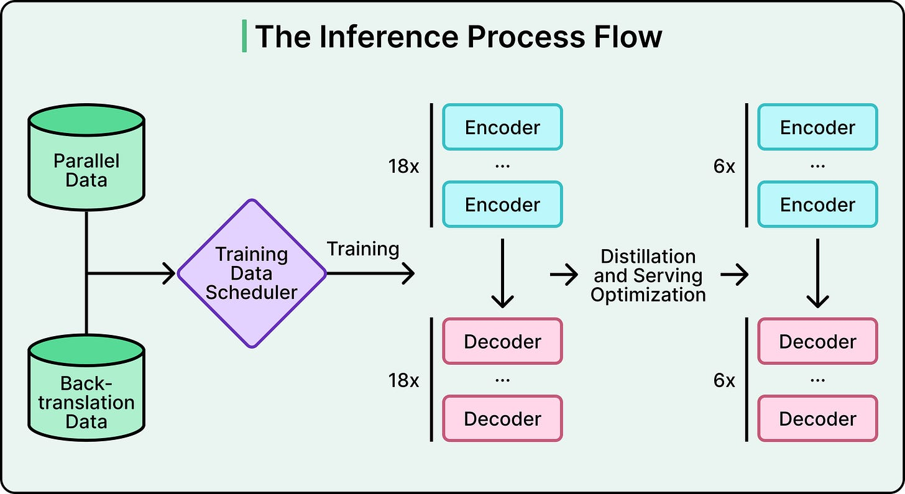
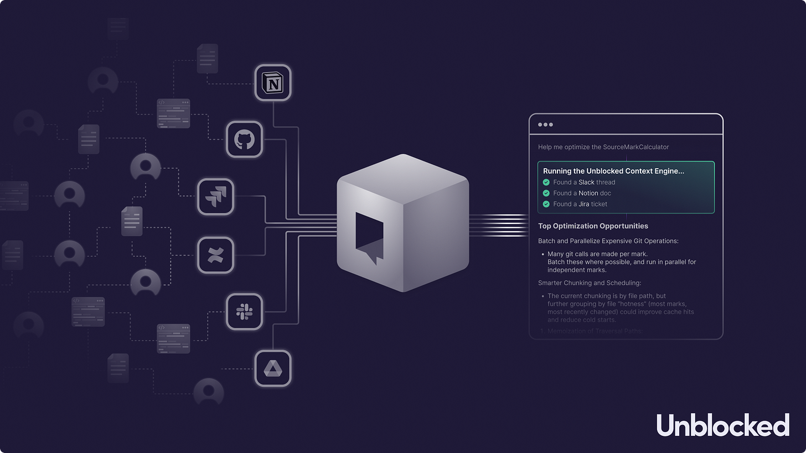
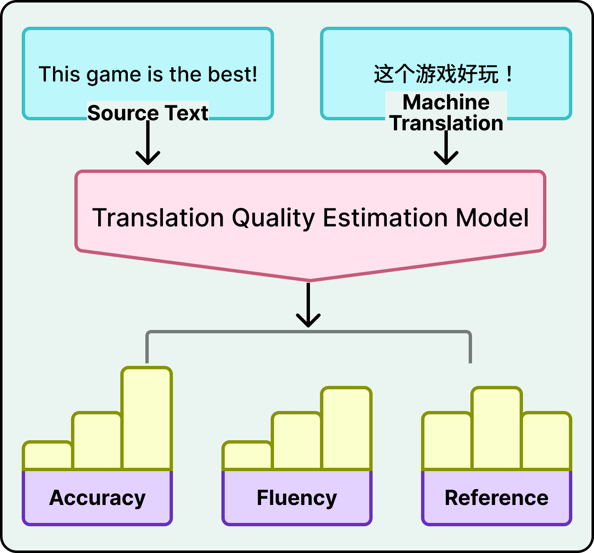
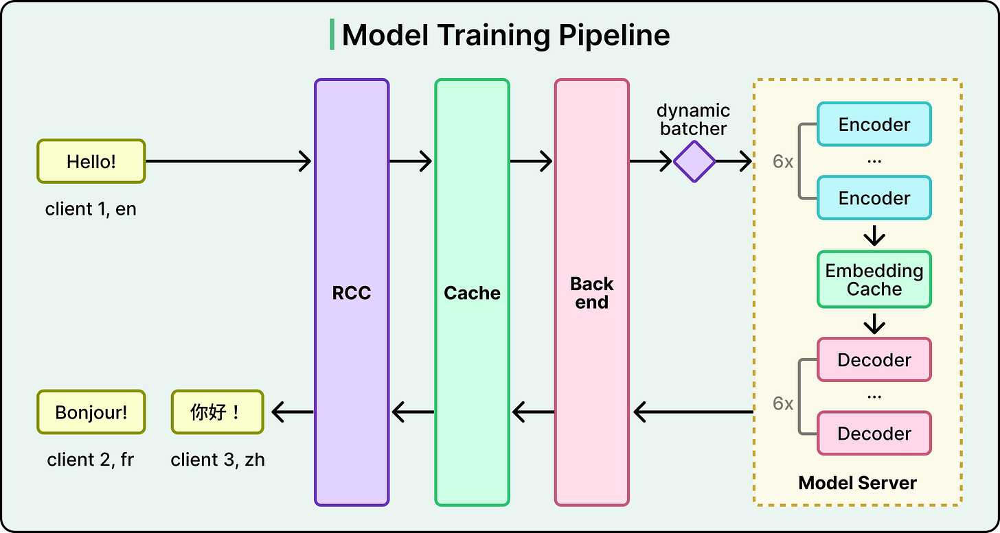

# Roblox AI Translation at Scale

A production case study in real-time multilingual chat: one MoE model handles 16 languages (256 directional pairs) at 5,000 chats/sec under a 100ms latency budget. Knowledge distillation, embedding caches, and a learned quality-estimation model substitute for ground truth.

## Key Takeaways

- Roblox built **one MoE transformer that handles all 256 directional pairs across 16 languages** — replacing the N² problem of one model per pair
- A ~1B-parameter **teacher is distilled** (+ quantization + compilation) into a <650M-parameter student to fit a **~100ms latency budget**
- Production serves **5,000+ chats/sec to 70M daily users** across 180 countries; the serving stack layers translation cache → dynamic batching → encoder → embedding cache → decoder → trust & safety
- Training data gaps for rare pairs (French-Thai) are closed with **iterative back-translation**; platform vocabulary like "obby" requires Roblox-specific corpora
- Because reference translations don't scale, Roblox built a **custom Quality Estimation model** that scores accuracy/fluency/contextual consistency — explicitly acknowledged to risk biases that overlap with the translator's weaknesses



## The Problem

Real-time multilingual chat at gaming scale isn't a model quality problem alone — it's a joint optimization of:

- **One model handling many language pairs** (16 langs = 256 directional pairs)
- **An aggressive distillation/quantization pipeline** that fits a 100ms budget
- **A serving stack engineered around caches and dynamic batching**
- **A quality measurement system that works without human reference translations**

Each is its own engineering project. Together they make real-time chat translation viable at 70M-DAU scale.

## One Model for 16 Languages



Naive approach: train one model per directional pair. For 16 languages that's:
- N × (N-1) = 16 × 15 = 240 directional pairs (or 256 including same-language pairs)

That doesn't scale operationally — 240+ models to train, deploy, version, and monitor.

### Mixture-of-Experts (MoE) Solution



A single MoE transformer routes per-token computation to specialized experts. Different experts learn different linguistic regularities — but they're trained together and share weights.

Benefits:
- **One artifact** to train/deploy/monitor
- **Cross-pair knowledge transfer** — improvements in one pair help others
- **Selective compute** — only relevant experts activate per token

## Compressing for Production



Three-stage compression pipeline:

| Stage | What | Result |
|---|---|---|
| **Knowledge distillation** | ~1B-parameter teacher trains a smaller student to mimic its probability distributions (not just hard labels) | <650M parameters |
| **Quantization** | Reduce numerical precision (e.g., FP16 → INT8) | Faster inference, less memory |
| **Model compilation** | Rewrite computation graphs for target GPU | Additional latency reduction |

Each stage trades a small amount of accuracy for the latency headroom needed to fit the 100ms budget.

### Distillation Detail

The teacher's softmax output (full probability distribution) carries far more signal than just the top-1 label. The student learns to match the distribution — including the model's *uncertainty* on edge cases — which preserves more signal than label-only distillation.

## Closing the Data Gap

Common pairs like English↔Spanish have billions of web-scraped parallel sentences. Rare pairs like French↔Thai don't.

### Iterative Back-Translation



```
1. Train French↔English (high-resource), English↔Thai (high-resource)
2. Round-trip Thai sentence: Thai → English → Thai (generates synthetic parallel pair)
3. Validate via quality estimation
4. Train French↔Thai on synthetic + real data
5. Iterate
```

The bridge through high-resource pairs (English) generates the parallel data the model needs.

### Platform Vocabulary

Roblox players use vocabulary that doesn't appear in standard web corpora:
- "obby" (obstacle course)
- "noob" (new player)
- Game-specific terminology

Generic web corpora don't capture this. Roblox supplements with **platform-specific corpora** — chat logs, game descriptions, in-game text — to build vocabulary the model wouldn't learn otherwise.

## Quality Measurement Without References

At 5,000 chats/sec, you can't compare each translation to a human reference — references don't exist for novel chat messages.

> "A translation model is only as good as two things. The data it was trained on, and your ability to measure whether it's working."

### Custom Quality Estimation (QE) Model

Roblox built a QE model that scores translations on:
- **Accuracy** — does it preserve meaning?
- **Fluency** — is it grammatical in the target language?
- **Contextual consistency** — does it fit the conversational context?

Plus word-level error tags: **critical / major / minor**.

The QE model is fine-tuned from a multilingual LM on human-labeled error data.

### The Acknowledged Risk

> The QE model "could have systematic biases that overlap with the translation model's own weaknesses."

If both models share blind spots (rare languages, ambiguous phrasing), QE will rate bad translations as good. Roblox names this risk explicitly — there's no perfect solution, just a pragmatic one paired with periodic human-evaluator calibration.

## The Production Serving Pipeline



A request flows through layered caches and batching:

```
incoming chat
   ↓
[1] Translation cache         ← instant for repeats
   ↓ (miss)
[2] Dynamic batching          ← groups concurrent requests for GPU efficiency
   ↓
[3] Encoder                   ← shared per source
   ↓
[4] Embedding cache           ← reuses encoder output when one source → many targets
   ↓
[5] Decoder                   ← per target language
   ↓
[6] Trust & safety screening  ← post-translation content filter
   ↓
delivered translation
```

### The Embedding Cache Is the Sleeper Optimization

In a chat with 5 players in 5 different languages, one source message needs translation into 4 other languages. Without the embedding cache, you'd encode the source 4 times. With it, you encode once and reuse the embedding for all 4 target languages.

Cost savings scale with **fan-out per source message** — exactly the workload pattern in multilingual group chats.

## Scale Numbers

| | Value |
|---|---|
| Daily active users | 70M |
| Countries | 180 |
| Languages | 16 |
| Directional pairs | 256 |
| Throughput | 5,000+ chats/sec |
| Teacher model | ~1B params |
| Production student | <650M params |
| Latency budget | ~100ms |

## Permanent Tradeoffs

Not solved problems — engineering accepts these as constants:

| Tradeoff | What it means |
|---|---|
| **Quality vs latency** | Distilled student is inherently weaker than the 1B teacher; 100ms cap limits maximum model size |
| **Common vs rare pairs** | English↔Spanish quality is excellent; rare pairs hit fallback chains more often |
| **Mixed-language input** | Code-switching (English + Spanish in one message) degrades accuracy |
| **Full-stack ownership vs commercial APIs** | Roblox built this rather than calling Google Translate — for control and cost at scale, but at the cost of significant engineering investment |

## Lessons That Generalize

1. **Translation isn't just a model problem.** It's a joint optimization of model architecture, data pipeline, serving stack, and evaluation
2. **Distillation pays its weight.** A 1B → 650M compression with quantization + compilation is the difference between feasible and not at 100ms
3. **Caches at the right boundary.** The embedding cache between encoder and decoder is the high-leverage location — pays off proportionally to fan-out
4. **Build the QE model.** Without scalable evaluation, you can't iterate. Pragmatic biased measurement beats no measurement
5. **Synthetic data for the long tail.** Iterative back-translation closes data gaps; without it, rare-language pairs would have unusable quality

## Related

- [Transformer architecture § attention efficiency](transformer-architecture.md#modern-attention-variants-the-efficiency-ladder) — GQA/MLA variants are similar production-driven model optimizations
- [ML systems at scale](../inference/ml-systems-at-scale.md) — Snapchat case with similar CPU/GPU split and feature pipelines
- [CPU vs GPU vs TPU](../inference/cpu-gpu-tpu.md) — the hardware substrate; dynamic batching is a GPU-utilization technique
- [LLM evals](llm-evals.md) — Roblox's QE model is the LLM-as-judge pattern applied to translation
- [LLM multi-pass pipelines](llm-multi-pass-pipelines.md) — Vimeo's split-brain approach for a related "format vs meaning" problem
- [Distributed system failure modes](../../system-design/distributed-system-failure-modes.md) — fan-out, queue depth, cascading failures relevant to chat-translation at scale

---

**Source:** https://blog.bytebytego.com/p/how-roblox-uses-ai-to-translate-16
**Date:** 2026-06-05
**Tags:** roblox, translation, llm-serving, ml-inference, mixture-of-experts, knowledge-distillation, quantization, embedding-cache, dynamic-batching, quality-estimation, back-translation, gaming-infrastructure
