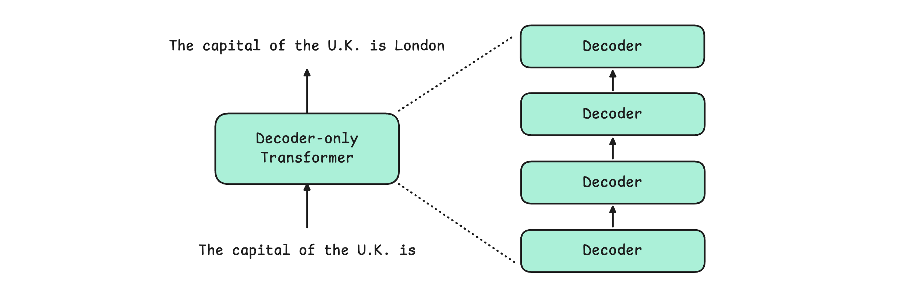
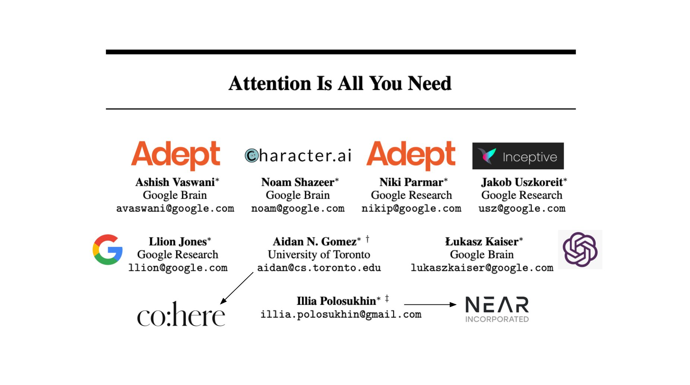
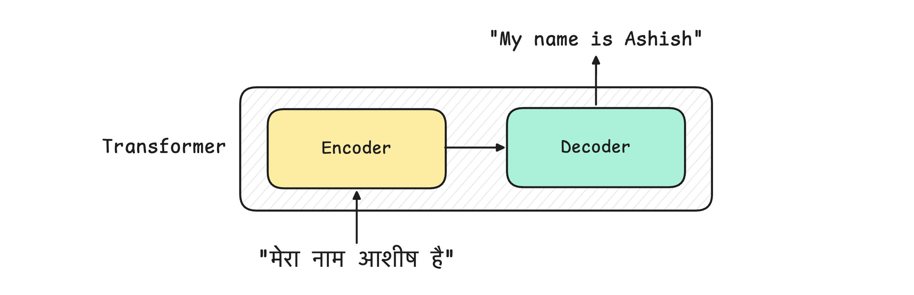
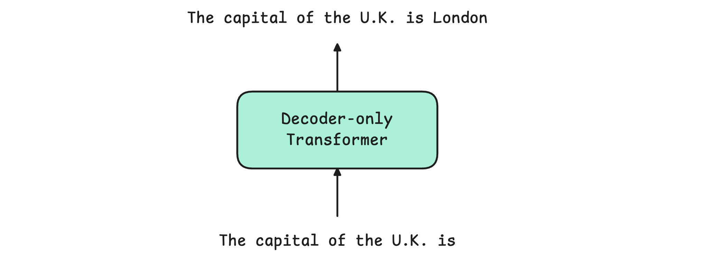
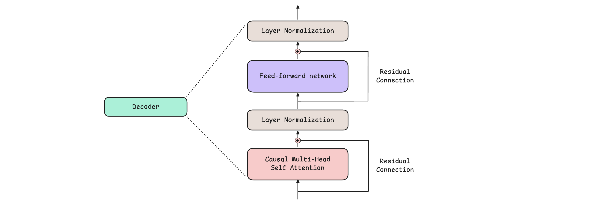
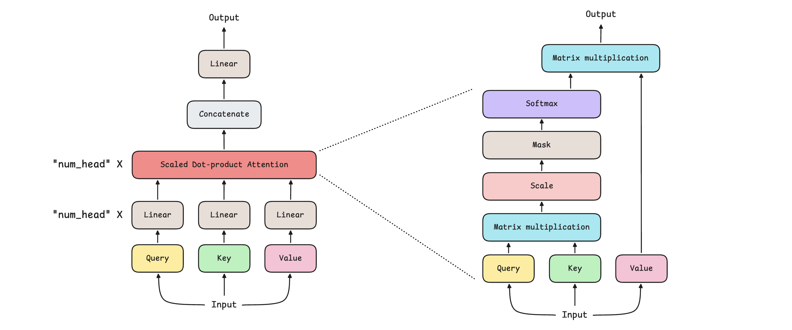
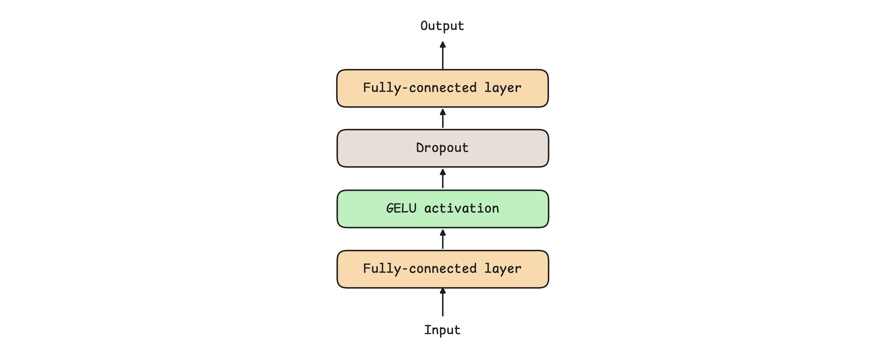
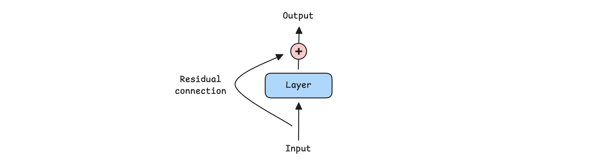
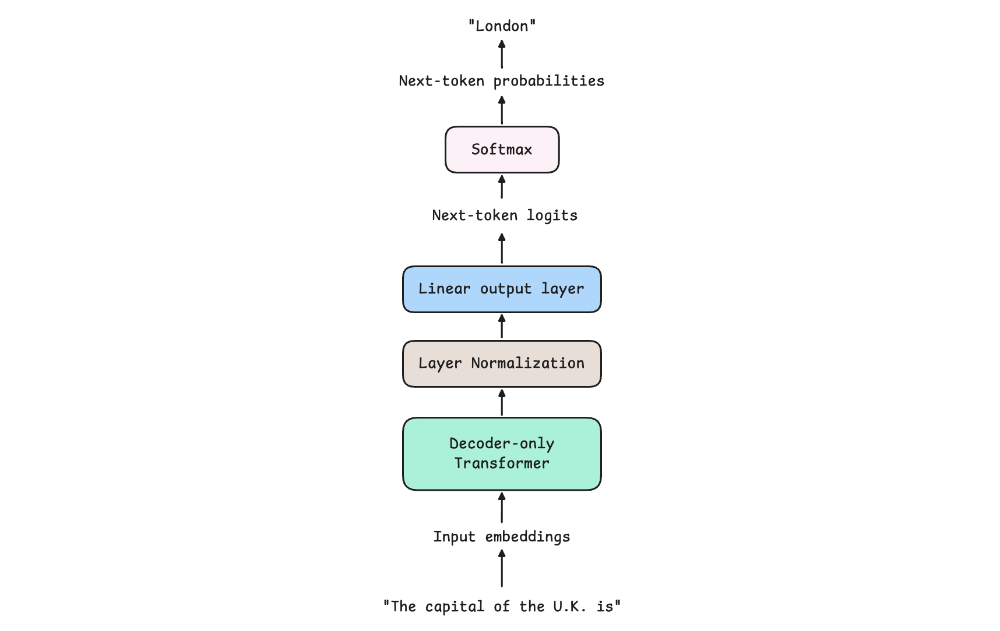
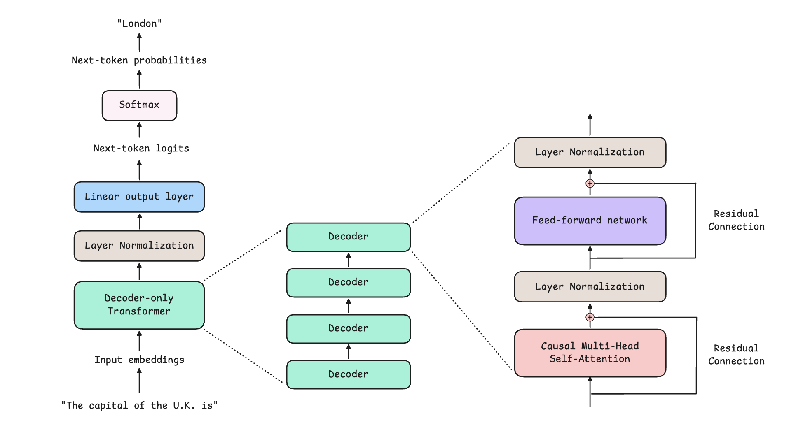

# Transformer Architecture

## Key Takeaways

- The 2017 "Attention Is All You Need" paper introduced the encoder-decoder Transformer; modern LLMs (GPT, Llama, DeepSeek, Qwen) use a **decoder-only** adaptation that strips the encoder and uses causal masking instead
- A decoder block has four repeating components: **causal multi-head self-attention**, **feed-forward network**, **layer normalization**, **residual connections** — stacked identically N times
- Self-attention lets tokens weigh other tokens by relevance via scaled dot-product math; **causal masking** prevents attending to future tokens so the model can't "cheat" during next-token prediction
- Modern variants optimize each component independently: **GQA/MLA** for attention, **SwiGLU** for activations, **RMSNorm + pre-LN** for normalization, **hyper-connections** for residuals — same shape, faster math
- End-to-end LLM flow: **tokenize → embed (with positional info) → N decoder blocks → final LayerNorm → linear projection → softmax → decoding strategy picks next token**



## From "Attention Is All You Need" to Modern LLMs

The original 2017 architecture has two halves:



- **Encoder** — consumes source input (e.g., a French sentence to translate)
- **Decoder** — emits target output one token at a time (e.g., the English translation)

Modern text-generation LLMs dropped the encoder. Why? Because the encoder existed to produce a representation of source text that the decoder cross-attended to — useful for translation, not needed for plain "given this prompt, generate the continuation." Causal masking on the decoder's self-attention gives the same training signal without needing a separate encoder pass.

### Decoder-Only Stack



All modern decoder-only LLMs share this skeleton: N identical decoder blocks stacked vertically, with the output of block `i` becoming the input of block `i+1`. "Bigger model" mostly means more blocks (deeper) and wider hidden dimension.

## Components of a Decoder Block



Each decoder block contains the same four building blocks. We'll unpack each.

## 1. Causal Multi-Head Self-Attention



Build up the term piece-by-piece:

| Concept | Meaning |
|---|---|
| **Attention** | A token "focuses" on other tokens, weighting their information by relevance |
| **Self-Attention** | The tokens being attended to are in the *same* sequence (not a separate source) |
| **Multi-Head** | Several parallel attention sub-blocks run in parallel; each learns a different relationship type (syntax, coreference, position, semantics) |
| **Causal / Masked** | Future tokens are hidden during training — when predicting token `t`, the model sees only tokens `1..t-1` |

### Mathematical Basis: Scaled Dot-Product Attention

For each token, the model computes:
- **Query (Q)** — what am I looking for?
- **Key (K)** — what do I offer?
- **Value (V)** — what's my actual content?

The attention output is:
```
Attention(Q, K, V) = softmax(Q · Kᵀ / √d_k) · V
```

The dot product `Q · Kᵀ` measures how well each query matches each key. The scaling factor `√d_k` keeps softmax inputs in a sane range. The softmax produces attention weights that sum to 1. Multiplying by `V` weighted-averages the values.

### Worked Example — Why Causal Masking Matters

Training on "The sky is blue":

- Predict "The" → see nothing
- Predict "sky" → see "The"
- Predict "is" → see "The", "sky"
- Predict "blue" → see "The", "sky", "is"

If "is" could attend to "blue" during training, the model would learn to peek instead of predict. Causal masking zeros out attention weights from each token to future tokens, forcing genuine prediction.

### Multi-Head Attention



Instead of one attention computation, run `h` of them in parallel with smaller Q/K/V projections, then concatenate. Each head can specialize: one head tracks subject-verb agreement, another tracks coreference, another tracks position.

### Modern Attention Variants (the efficiency ladder)

The naive multi-head attention is O(n²) in sequence length and stores N copies of K/V (one per head). Modern LLMs use cheaper variants:

| Variant | Used by | What it does |
|---|---|---|
| **Multi-Head Attention (MHA)** | Original Transformer, GPT-2/3 | Baseline; N heads, each with own Q/K/V |
| **Multi-Query Attention (MQA)** | PaLM | Single K/V shared across all heads; faster but quality regression |
| **Grouped Query Attention (GQA)** | Llama 2/3 | K/V shared within groups of heads — sweet spot between MHA and MQA |
| **Multi-Head Latent Attention (MLA)** | DeepSeek-V3 | Compresses K/V into a smaller latent space; major memory savings |
| **Compressed Sparse / Heavily Compressed Attention** | DeepSeek-V4 | Further compression + sparsity for very long contexts |

All preserve the attention *shape* — they change the math under the hood to cut memory and FLOPs.

## 2. Feed-Forward Network (FFN)



Attention handles *inter-token* mixing (how tokens influence each other). The FFN handles *token-wise* refinement (each token's representation independently).

Structure:
```
   hidden_dim ──> [Linear: expand] ──> 4×hidden_dim ──> [Activation] ──> [Linear: project back] ──> hidden_dim
```

Expanding to a higher dimension before projecting back gives the model representational capacity to encode complex per-token features.

### Activation Functions

- **ReLU** — original Transformer
- **GELU** — GPT-2/3 default; smoother
- **SwiGLU** — modern Llama, Qwen; a gated linear unit variant that empirically wins on language tasks

### Division of Labor

| Block | Pattern type | Operates on |
|---|---|---|
| Attention | Inter-token (relational) | Pairs of tokens |
| FFN | Token-wise (representational) | Each token independently |

A decoder block alternates these: mix between tokens, then refine each token, then mix again.

## 3. Layer Normalization



Normalize each token's feature vector to zero mean and unit variance, then apply learned scale and shift. This stabilizes training by keeping activations bounded as they flow through dozens of stacked blocks.

### Pre-LN vs Post-LN

| Placement | Where | Used by |
|---|---|---|
| **Post-LN** | After each sublayer (`x + Sublayer(x)`, then LN) | Original Transformer |
| **Pre-LN** | Before each sublayer (`x + Sublayer(LN(x))`) | GPT-2 onwards; standard today |

Pre-LN gives **more stable gradients** in deep stacks. Post-LN trains fine for 6-12 layers but becomes unstable at 24+; Pre-LN scales to 100+ layers.

### RMSNorm

Modern models (Llama, Qwen 3) use **RMSNorm**, which drops the mean-centering step:
```
LayerNorm:  y = (x - mean) / sqrt(var + ε) · γ + β
RMSNorm:    y = x / sqrt(mean(x²) + ε) · γ
```

Faster to compute, fewer parameters, comparable quality. The 2024-2025 default.

## 4. Residual / Skip Connections



Each sublayer (attention, FFN) outputs:
```
out = x + Sublayer(x)
```

The `+ x` is the residual. It provides:
- A **gradient highway** — backprop can flow through the skip without vanishing
- An **information highway** — original input survives unmodified to deeper layers
- Stability — early in training when Sublayer outputs noise, the model still has `x` to fall back on

Without residuals, training Transformers deeper than ~6 layers is brittle. With them, 100+ layers train cleanly.

### Modern Variants

- **Hyper-Connections** (DeepSeek-V4) — extend the residual to combine multiple previous layers' outputs
- **Manifold-Constrained Hyper-Connections** — constrain the combined residual to lie on a learned manifold

Same idea (preserve information across depth), more sophisticated mixing.

## End-to-End LLM Flow



Putting it all together:

```
input text
    │
    ▼
[1] Tokenize          (text → integer token IDs)
    │
    ▼
[2] Embed             (token IDs → vectors; add positional info)
    │
    ▼
[3] Stack of N        (each block: causal MHA → FFN → with LN + residual)
    decoder blocks
    │
    ▼
[4] Final LayerNorm   (stabilize before output projection)
    │
    ▼
[5] Linear output     (project hidden_dim → vocab_size; produces logits)
    │
    ▼
[6] Softmax           (logits → probability distribution over vocab)
    │
    ▼
[7] Decoding strategy (greedy, top-k, top-p, temperature → pick next token)
    │
    ▼
next token (append to input, loop back to [1] for the next prediction)
```

### Positional Encoding

Self-attention is permutation-invariant — it doesn't know token order on its own. Position information has to be injected:
- **Sinusoidal** — original paper; fixed functions
- **Learned absolute** — GPT-2 era
- **RoPE (Rotary Position Embedding)** — Llama, Qwen; rotates Q/K vectors based on position. Plays well with long contexts and is the modern default
- **ALiBi** — penalize attention by distance; trains fast and extrapolates to longer sequences

### Decoding Strategies

The model's softmax gives a probability distribution; the decoder picks one token:

| Strategy | How | When |
|---|---|---|
| **Greedy** | Pick argmax | Deterministic; often repetitive |
| **Top-k** | Sample from k most likely | More diverse |
| **Top-p (nucleus)** | Sample from smallest set whose cumulative probability ≥ p | Adapts to confidence; modern default |
| **Temperature** | Scale logits before softmax (lower = sharper, higher = flatter) | Controls creativity vs. determinism |

## Putting the Variants Together

A modern LLM like Llama 3 or Qwen 3 is the original Transformer with each component upgraded:

| Component | Original (2017) | Modern (2025) |
|---|---|---|
| Attention | MHA | GQA / MLA |
| Activation | ReLU | SwiGLU |
| Normalization | Post-LN LayerNorm | Pre-LN RMSNorm |
| Position | Sinusoidal | RoPE |
| Residuals | Plain skip | Hyper-connections (DeepSeek-V4) |

Same architecture shape. Faster, more stable, longer context, less memory. The 2017 paper still describes 90% of what's happening.

## Related

- [Vector databases](vector-databases.md) — embeddings are the input layer of a Transformer; the same vector math underpins similarity search
- [LLM tool use and MCP](llm-tool-use-and-mcp.md) — how decoder-only LLMs interact with external systems
- [AI engineering fundamentals](ai-engineering-fundamentals.md) — Transformers in the broader LLM stack
- [AI glossary](ai-glossary.md) — quick definitions of the building blocks discussed here

---

**Source:** https://blog.algomaster.io/p/transformer-architecture
**Date:** 2026-06-04
**Tags:** transformer, attention, self-attention, multi-head-attention, gqa, mla, decoder-only, llm, deep-learning, neural-networks, gpt, llama, deepseek, qwen, rmsnorm, swiglu, rope
