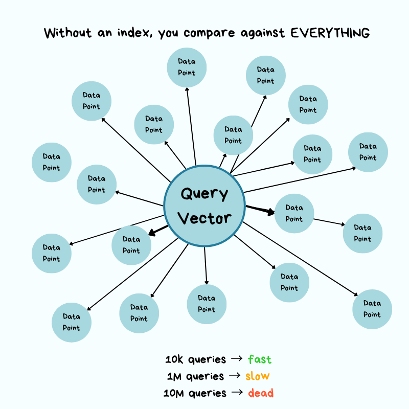
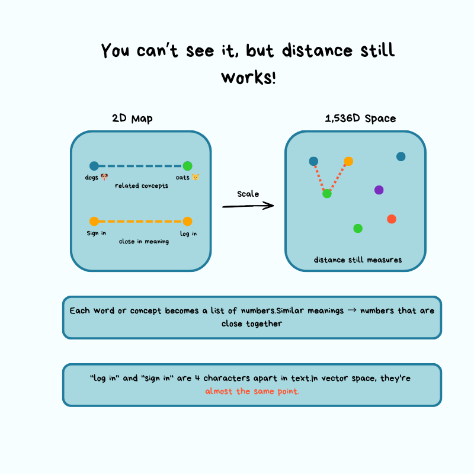
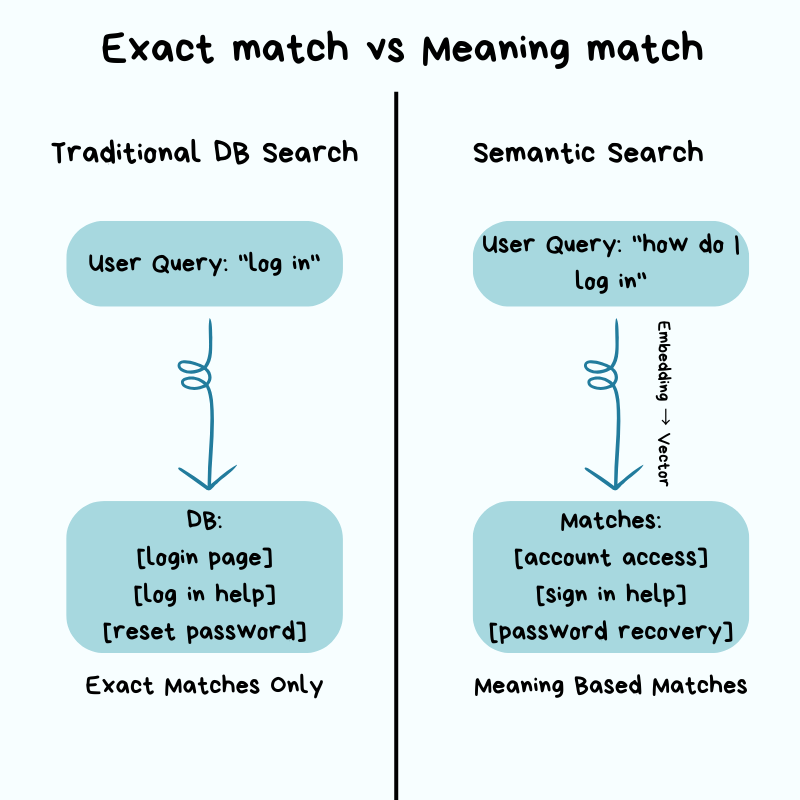
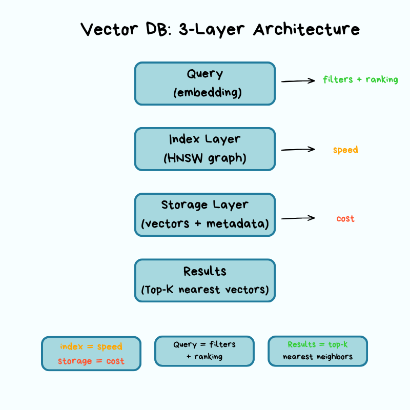
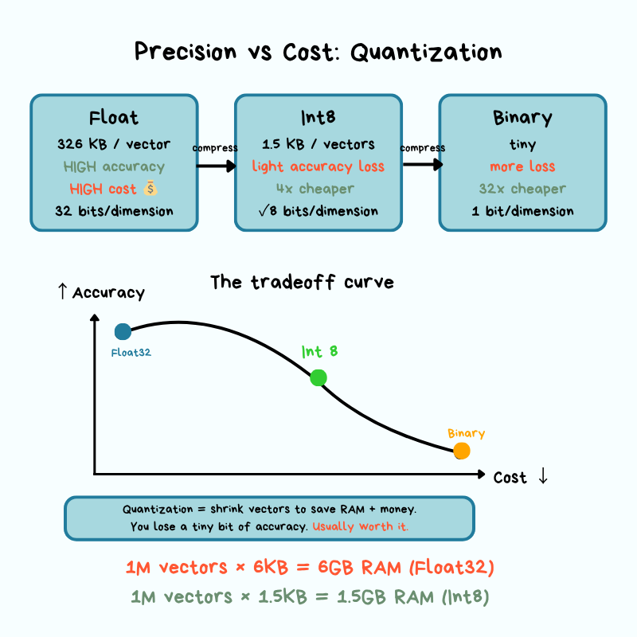
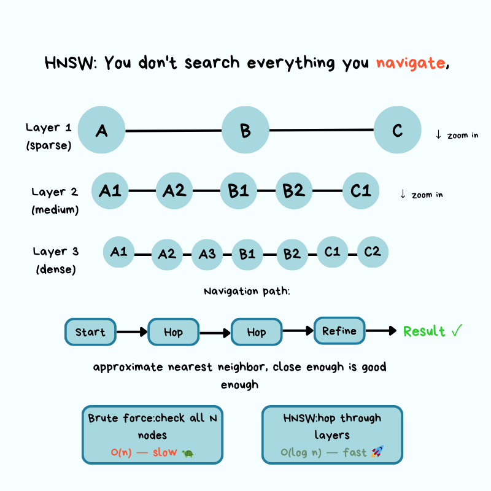
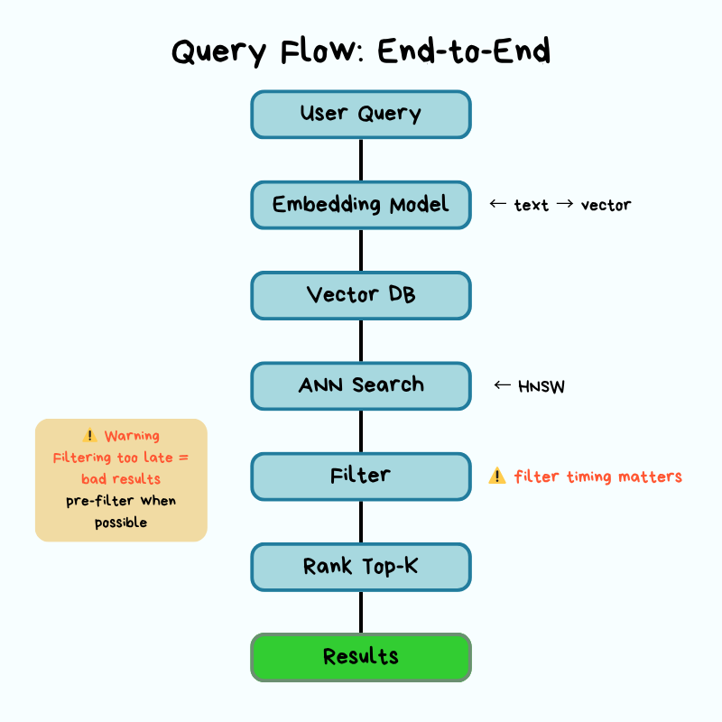
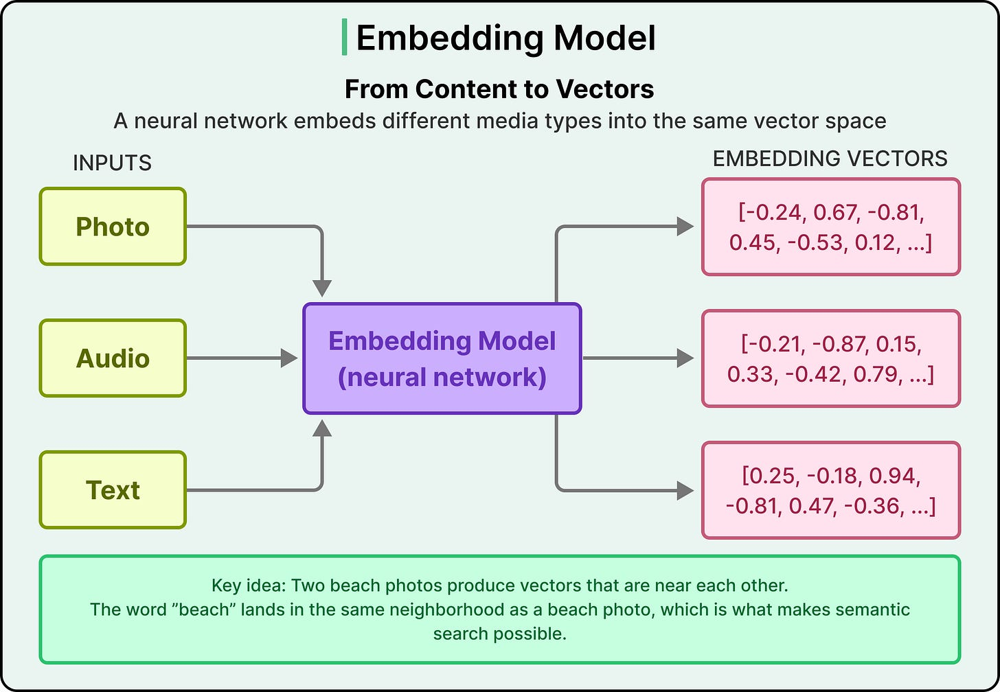
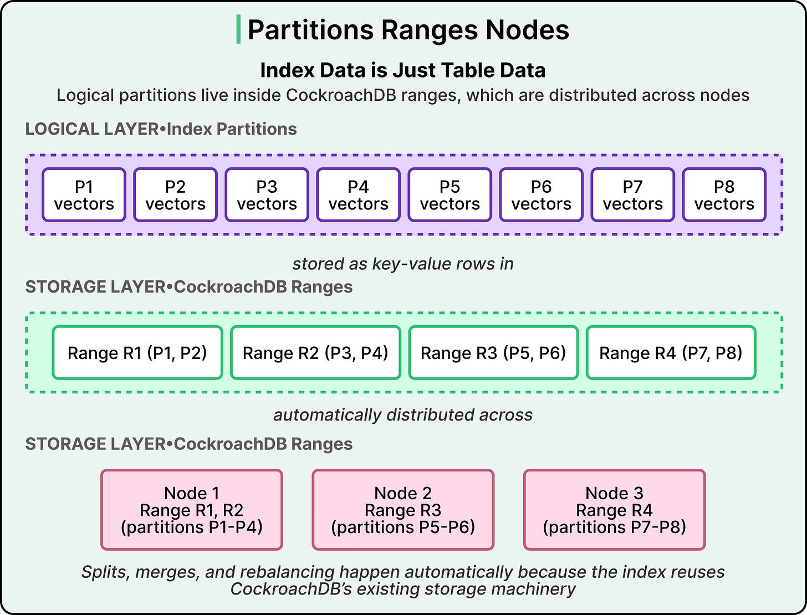

# Vector Databases

## Key Takeaways

- Vector databases solve the O(n) brute-force problem of similarity search by using specialized indexes like HNSW that reduce lookup to O(log n)
- Architecture has three layers: storage (vectors + metadata, quantization), indexing (HNSW graph), and query (embedding, filtering, ranking)
- Quantization compresses 32-bit float vectors to 8-bit integers or binary, cutting storage 4x+ with acceptable accuracy loss
- HNSW (Hierarchical Navigable Small World) is the dominant production algorithm -- it navigates a multi-layer graph from sparse (coarse) to dense (fine) layers
- For small datasets (<100K vectors), pgvector on PostgreSQL is sufficient; dedicated vector DBs become necessary at scale

## The Problem: Why Not a Regular Database?

Traditional databases use indexes (B-trees, hash) for exact-match lookups via WHERE clauses. Embeddings break this model because there is no exact value to match -- you need to find the *closest* vectors by meaning.

Without specialized indexing, finding similar vectors requires comparing the query against every vector in the database -- **O(n) time complexity**. At scale: a query taking 1 second with 10,000 vectors becomes 16 minutes with 10 million vectors.



## Embeddings and Semantic Search

An **embedding** is a list of numbers representing the semantic meaning of data. Similar meaning produces similar numerical values. A 1,536-dimensional vector using 32-bit floats requires ~6KB of storage.



**Semantic search** understands intent rather than keywords. A query for "how do I log in" retrieves results about "account access" and "sign in" even without exact word matches.



## Three-Layer Architecture

Vector databases are organized into three layers, each with distinct responsibilities and tradeoffs.



### Storage Layer

Responsible for persisting vectors and metadata. Key techniques:

- **Quantization:** Reduces precision from 32-bit floats to 8-bit integers or binary. Cuts storage 4x+ while introducing acceptable approximation error.
- **Memory vs. Disk:** Tiered storage keeps frequently accessed vectors in memory (fast, expensive) while cold data resides on disk (slow, cheap).



### Indexing Layer (HNSW)

**HNSW (Hierarchical Navigable Small World)** is the dominant algorithm in production vector databases. It creates a multi-layer graph:

- **Layer 1 (sparse):** Coarse navigation across the full dataset -- like a country-level map
- **Layer 2 (medium):** Narrows search to relevant regions -- like a city-level map
- **Layer 3 (dense):** Identifies closest neighbors -- like a street-level map



Key tuning parameters:

| Parameter | What It Controls | Higher Value Effect |
|-----------|-----------------|-------------------|
| **M** | Connections per vector | Better recall, more memory, slower inserts |
| **ef** (efSearch) | Exploration factor at query time | Better accuracy, slower queries |
| **efConstruction** | Exploration factor at build time | Better index quality, slower builds |

The core insight: you don't search everything, you *navigate*. Approximate nearest neighbor is "close enough" -- trading perfect recall for orders-of-magnitude speed improvement.

### Query Layer

The query execution pipeline:

1. **Embed** the query into a vector
2. **Traverse** the HNSW index (coarse to fine)
3. **Calculate** distances to candidate vectors
4. **Rank** and return top-K results



## Production Tradeoffs

Every operational decision in a vector database involves a tradeoff:

| Decision | Tradeoff |
|----------|----------|
| Quantization level | Storage cost vs. accuracy |
| Memory vs. disk | Query speed vs. infrastructure cost |
| HNSW M parameter | Recall quality vs. memory + insert speed |
| ef parameter | Query accuracy vs. latency |
| Index rebuild frequency | Recovery speed vs. data freshness |

## When to Use What

- **pgvector (PostgreSQL extension):** Good for <100K vectors with moderate query volume. Simplifies infrastructure by keeping vectors alongside relational data. Hits scalability limits with millions of vectors.
- **Dedicated vector database (Pinecone, Weaviate, Milvus, Qdrant):** Required when dataset size grows into millions+, query latency requirements tighten, or you need advanced features like filtered search, hybrid search, or multi-tenancy.
- **Distributed SQL with vector indexing (CockroachDB C-SPANN — see case study below):** When vectors must co-exist with transactional data, when multi-tenant isolation or multi-region domiciling matters, or when transactional freshness is critical.

## Case Study: CockroachDB C-SPANN — Vector Indexing in Distributed SQL

CockroachDB built **C-SPANN**, a custom distributed vector index inspired by Microsoft SPANN, Google ScaNN, and SPFresh — purpose-built for distributed SQL constraints rather than reusing HNSW or classical IVF.

### Why Not HNSW, IVF, or Pinecone?

Six non-negotiable constraints eliminated existing options:

- No central coordinator
- On-disk state
- Minimal network hops
- Shardable KV layout
- No hot spots
- Real-time incremental updates

**HNSW** (used by pgvector) requires in-memory graphs that resist sharding. **Classical IVF** assumes single-node deployment. **Specialized vector DBs** (Pinecone, etc.) separate vectors from transactional data, breaking unified queries and transactional freshness.

### The C-SPANN Architecture

A hierarchical K-means tree where vectors group into partitions with centroids; centroids themselves cluster up to a single root.



- Wide, shallow tree — fanout ~100 keeps tree depth low (3 levels for 1M vectors, 5 for 10B)
- Parallel partition traversal keeps latency predictable
- Leaf scans use **SIMD CPU instructions** for fast distance computation
- Background maintenance: K-means partition splitting, merging, and **nearest-partition reassignment** (from SPFresh paper) — keeps the index accurate without offline rebuilds

### The Core Architectural Trick: Index-as-Table-Rows

> "The architectural elegance stems from treating the vector index as ordinary table data rather than a special subsystem."

Each partition is a **self-contained set of KV rows in CockroachDB's normal storage ranges** — not a parallel index data structure.



Because the index *is* table data, it automatically inherits from CockroachDB's existing infrastructure:

| CockroachDB primitive | What the index gets for free |
|---|---|
| Range splitting & rebalancing | Auto-sharded as the index grows |
| Block cache | Hot partitions stay in memory |
| Multi-region replication | Vector index spans regions like any table |
| Range restart resilience | No warm-up after node restart |

### Compression: RaBitQ 1-Bit Quantization

1536-dim OpenAI embedding at fp16 = ~3 KB → 1 TB per 333M vectors. **RaBitQ** collapses each dimension to 1 bit (~200 bytes/vector, **94% reduction**) using random orthogonal transforms.

Two-phase search absorbs the lossy compression error:

1. **Filter** — scan quantized vectors fast
2. **Refine** — rerank top candidates against full-precision vectors

(The same "cheap filter, precise refine" pattern appears throughout systems engineering.)

### Multi-Tenancy via Prefix Columns

```sql
VECTOR INDEX (user_id, embedding)
```

Prefix columns build **separate K-means trees per tenant**. Combined with `REGIONAL BY ROW`, this gives geographic data domiciling for free.

> "A billion vectors across a million users behaves as a million-vector index per user."

Query syntax stays pgvector-compatible (`ORDER BY embedding <-> $2 LIMIT 10`), easing migration.

### Tradeoffs

| Strength | Limitation |
|---|---|
| Transactional freshness | Preview (25.2), Euclidean-only |
| Distributed scaling | Limited non-prefix filtering |
| Unified storage with relational data | Raw latency trails specialized in-memory systems |
| Restart resilience (no warm-up) | Pending SIMD and root-cache optimizations |
| Native multi-tenant + multi-region | |

### Transferable Lesson

Treating a "special subsystem" as ordinary table data is a powerful lever — distributed infrastructure came **for free**. Look for similar opportunities anywhere a system temptingly demands its own parallel storage plane.

---

**Source:** https://newsletter.systemdesign.one/p/what-is-a-vector-database
**Source:** https://blog.bytebytego.com/p/how-cockroachdb-built-vector-indexing
**Date:** 2026-05-31
**Tags:** vector-database, embeddings, hnsw, similarity-search, quantization, semantic-search, pgvector, cockroachdb, c-spann, k-means, rabitq, distributed-sql, multi-tenancy
