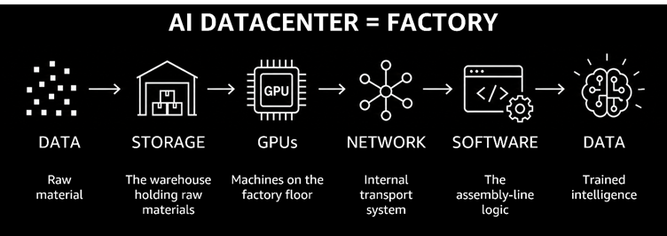
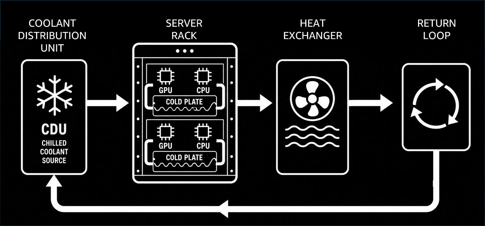
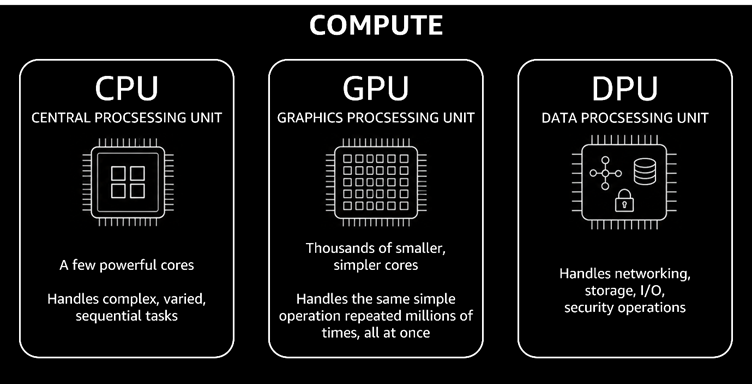
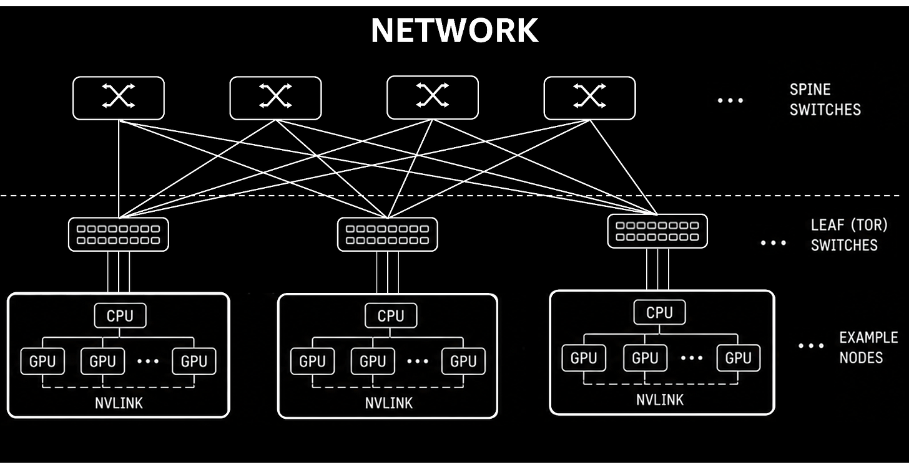

# AI Infrastructure

What a GPU data center actually is — not as a collection of servers, but as a constrained physical system. The biggest AI breakthroughs are increasingly coming from better infrastructure, not better models.

## Key Takeaways

- Think of an AI data center as a **factory**: data is raw material, storage is the warehouse, GPUs are the machines, the network is internal transport, and software is the assembly logic
- Three physical constraints dominate AI scaling: **power** (80-120 kW per rack), **cooling** (liquid is now mandatory at scale), and **space** (rack density and real estate)
- CPUs handle complex sequential decisions; GPUs execute the same operation millions of times in parallel; **DPUs** handle networking, storage I/O, and security — offloading this overhead from compute chips
- GPUs are data-starved, not compute-starved — the memory hierarchy (HBM → RAM → NVMe → object storage) determines throughput more than raw FLOPs
- The networking fabric is a first-class architectural concern: **NVLink** within a node, **InfiniBand/RoCE** between nodes, **RDMA** + **GPUDirect** to eliminate CPU copies

## The Factory Mental Model

| Factory component | AI data center equivalent |
|---|---|
| Raw material | Data |
| Warehouse | Storage |
| Factory machines | GPUs |
| Internal transport | Network |
| Assembly logic | Software |
| Output product | Trained intelligence |

The model is useful because it makes physical constraints visible: you can't run more machines (GPUs) than your power and cooling support, and the machines are only as productive as the supply chain (data pipeline + network) feeding them.

> "The biggest breakthroughs in AI are not coming from better models; they're coming from better infrastructure."

## Three Physical Constraints

### 1. Power

Modern GPU server racks consume **80–120 kW** — equivalent to powering ~40 homes simultaneously. Power delivery capacity is the primary hard limit on data center expansion. Operators must negotiate with utilities for raw power allocation before any other infrastructure decision.

### 2. Cooling

GPU racks cannot be air-cooled at this density. **Liquid cooling** is now the default at scale:

- **CDU (Coolant Distribution Unit)** circulates chilled coolant from a central source
- Coolant flows through **cold plates** attached directly to GPU and CPU surfaces
- Heated coolant passes through a **heat exchanger**, then returns to the CDU
- Without this loop, performance throttles and hardware fails prematurely

### 3. Space

Rack density and physical real estate constrain scaling. AI infrastructure growth is partly a real-estate and thermodynamics problem — the same land that hosts traditional compute handles far fewer GPU racks when each rack demands 10× more power and cooling than a typical server rack.

## Compute: CPU, GPU, and DPU

| Component | Design | Primary role |
|---|---|---|
| **CPU** | Few powerful cores | Complex, varied, sequential tasks — orchestration, control flow, OS |
| **GPU** | Thousands of simpler cores | Same simple operation (matrix multiply) repeated millions of times in parallel |
| **DPU** | Network + storage offload chip | Networking, storage I/O, and security operations — frees GPUs and CPUs for compute |

The DPU is the less-discussed third leg. Without it, GPU clusters waste cycles handling packet processing, NVMe I/O, and TLS termination. DPUs (NVIDIA BlueField, Intel IPU, AWS Nitro) offload that overhead so the GPU can spend 100% of cycles on math.

See [cpu-gpu-tpu.md](cpu-gpu-tpu.md) for deep architectural detail on GPU SIMT/SIMD model, tensor cores, and TPU systolic arrays.

## Memory and Storage Hierarchy

GPUs don't fail because they're slow — **they fail because they're data-starved**. The memory hierarchy is tiered by speed and cost:

| Tier | Technology | Capacity | Role |
|---|---|---|---|
| **GPU memory** | HBM (High Bandwidth Memory) | Tens of GB | Active model weights and KV cache |
| **CPU RAM** | DDR5 | Hundreds of GB | Buffer and CPU-side computation |
| **NVMe / SSD** | PCIe NVMe | Terabytes | Hot dataset storage; fast random access |
| **Parallel filesystem** | Lustre, GPFS | Petabytes | Warm data; parallel reads by many GPUs |
| **Object storage** | Amazon S3, GCS | Unlimited | Cold data; lowest cost, highest latency |

**Practical tiering:**
- **Hot tier:** NVMe SSDs holding the active training dataset (currently used)
- **Warm tier:** Parallel filesystems (Lustre, GPFS) for data accessed across training runs
- **Cold tier:** Object storage for raw data, checkpoints, and archived runs

The implication: adding GPUs without addressing the data pipeline just creates more expensive starvation.

## Networking: The Communication Bottleneck

At scale, thousands of GPUs must synchronize gradients and pass activations constantly. The network is not plumbing — it's a primary performance determinant.

### Cluster Topology

**Leaf-spine** ensures any GPU can reach any other GPU in **at most two hops**: leaf (Top-of-Rack) switch → spine switch → destination leaf → destination GPU. This bounds latency regardless of cluster size.

### Speed Hierarchy

| Fabric | Scope | Speed | Use |
|---|---|---|---|
| **NVLink** | Intra-node (GPU to GPU on same server) | Highest | Tensor parallelism within a node |
| **InfiniBand / RoCE** | Inter-node (server to server) | Very high | Gradient sync across nodes |
| **Ethernet** | General-purpose inter-node | Lower | Flexible but insufficient for extreme all-reduce workloads |

### Optimization Techniques

- **RDMA (Remote Direct Memory Access)** — transfers data directly between memory regions on separate machines, bypassing the CPU entirely. Critical for reducing synchronization latency in gradient all-reduce.
- **GPUDirect** — allows the GPU to read/write directly to network adapters and NVMe storage, bypassing CPU and system memory copies. Eliminates a full round-trip per communication event.
- **Zero-copy pipelines** — minimize redundant data movement at every layer.

### Amdahl's Law Constraint

Adding GPUs increases communication overhead. At some point, **synchronization cost grows faster than compute capacity** — the network becomes the scaling limit rather than the number of GPUs. This is why interconnect bandwidth (NVLink, InfiniBand) is a first-class engineering investment alongside GPU count.

## Related

- [cpu-gpu-tpu.md](cpu-gpu-tpu.md) — deep architectural detail on GPU SIMT model, tensor cores, HBM bandwidth, TPU systolic arrays
- [inference-engineering.md](inference-engineering.md) — optimization techniques (batching, disaggregation, parallelism) that operate on top of this infrastructure
- [local-llm-inference.md](local-llm-inference.md) — inference on commodity hardware (no InfiniBand, no HBM at scale)

---

**Source:** https://newsletter.systemdesign.one/p/what-is-ai-infrastructure
**Date:** 2026-06-21
**Tags:** ai-infrastructure, gpu-cluster, data-center, power, cooling, liquid-cooling, dpu, hbm, nvme, storage-hierarchy, networking, nvlink, infiniband, rdma, gpudirect, leaf-spine, amdahls-law
