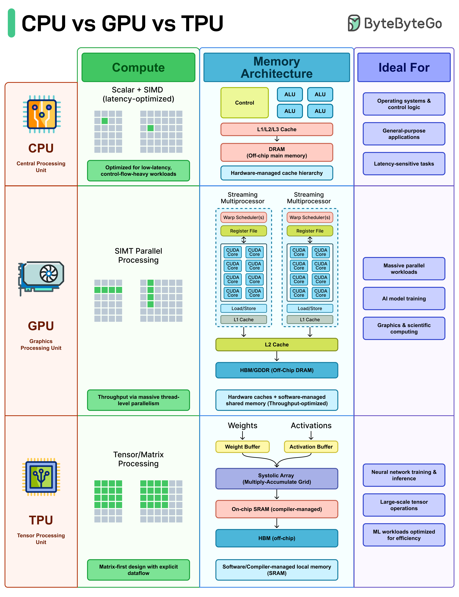
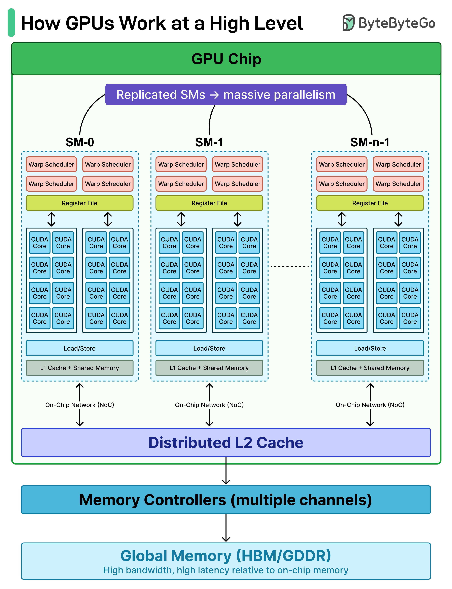

# CPU vs GPU vs TPU

The architectural differences between general-purpose processors and AI accelerators — and why workload-to-hardware fit drives performance more than raw spec sheets.

## Key Takeaways

- **CPUs** use few cores tuned for low latency + complex control flow (branching, syscalls, interrupts) — best for OS, databases, decision-heavy code
- **GPUs** use thousands of cores in a SIMT/SIMD model with a tiered memory hierarchy; they hide memory latency by switching among thousands of in-flight threads. Ideal for dense matrix math and embarrassingly-parallel workloads
- **TPUs** are specialized accelerators built around **systolic arrays** for matrix multiplication, with compiler-controlled dataflow and on-chip weight/activation buffers — purpose-built for neural network training and inference
- Architecture, not code, drives performance: the same workload can run slow on CPU, fast on GPU, faster still on TPU — *when the workload fits the hardware model*
- TPU performance is **highly sensitive to workload-to-hardware fit** — gains evaporate when the model shape doesn't map onto the systolic array



## Why the Same Code Runs Differently on Different Hardware

"The answer is architecture." Three fundamentally different designs:

| | CPU | GPU | TPU |
|---|---|---|---|
| **Core count** | Few (8-128) | Thousands (10K+ CUDA cores) | Specialized — systolic array |
| **Per-core perf** | High | Modest | N/A — array-based |
| **Parallelism model** | Sequential / few threads | SIMT (Single Instruction Multiple Thread) / SIMD | Matrix-multiply pipeline |
| **Memory hierarchy** | Standard cache hierarchy | Per-SM registers + L1 + shared L2 + global HBM | Compiler-controlled on-chip buffers |
| **Latency model** | Low per-instruction latency | High per-thread latency, hidden by massive thread-level parallelism | Pipelined; latency determined by array depth |
| **Primary workload** | OS, databases, branching code | Dense math, deep learning, image processing | NN training & inference |
| **Secondary workload** | Decision-heavy logic | Massively parallel data processing | ML inference where shape fits the array |

## CPU: Few Cores, Low Latency, Control Flow

CPUs are designed for **what code looks like most of the time**: branching, sequential, with frequent context switches and system interrupts.

- 8-128 cores typical
- Deep pipelines, branch predictors, out-of-order execution
- Large L1/L2/L3 caches optimized for serial access patterns
- Low per-instruction latency

**Strong fit:**
- Operating system kernels
- Databases (transactions, query planning)
- Anything with complex if/else logic
- Network and disk I/O
- Single-threaded workloads

**Weak fit:**
- Dense matrix math at scale
- Embarrassingly parallel data processing
- Real-time tensor operations

## GPU: Thousands of Cores, Latency Hiding



GPUs flip the CPU's design: trade per-thread latency for thread-level throughput.

### Architecture

- **Streaming Multiprocessors (SMs)** replicated across the chip (e.g., H100 has 132 SMs)
- Each SM has many **CUDA cores** (e.g., 128 cores per SM on H100)
- **Warp Scheduler** manages groups of 32 threads (warps) executing in lockstep (SIMT)
- Memory hierarchy:
  - **Per-SM Register File + L1 Cache + Load/Store** — fast, local
  - **Shared L2** across SMs — medium speed
  - **Global HBM (High-Bandwidth Memory)** — high bandwidth, high latency

### How Latency-Hiding Works

A single thread experiences high latency on memory accesses. The GPU compensates by **keeping thousands of threads in-flight per SM**. While one warp waits on memory, the scheduler runs other warps. The hardware is effectively never idle.

This is why **throughput wins on dense parallel work** — you're never paying for a single thread's stall.

**Strong fit:**
- Deep learning training and inference
- Matrix operations (BLAS, GEMM)
- Image and video processing
- Scientific computing
- Crypto (mining, anything hash-based)

**Weak fit:**
- Branchy, control-heavy code (divergent warps kill throughput)
- Workloads that don't parallelize well

### Modern GPU Specs (For Calibration)

| GPU | FP16 TFLOPS | HBM | Use |
|---|---|---|---|
| NVIDIA A100 | ~312 | 40-80 GB | Cloud training/inference workhorse (2020s) |
| NVIDIA H100 | ~989 | 80 GB | LLM training/inference standard (mid-2020s) |
| NVIDIA B200 | ~2,250 | 192 GB | Frontier training (late-2020s) |

LLM training fleets are tens of thousands of these in NVLink-interconnected clusters.

## TPU: Systolic Arrays for Matrix Multiplication

Google's TPUs throw out general-purpose flexibility to specialize on the single operation that dominates deep learning: **matrix multiplication**.

### Systolic Array

Think of a systolic array as a grid of multiply-accumulate units:
- Data flows in **rhythmically** (hence "systolic" — like a heartbeat)
- Each cell multiplies, accumulates, passes the result to the next cell
- The compiler scheduling means there's **no instruction fetch/decode overhead** per operation
- Weights live in on-chip buffers; activations stream through

For matrix multiplication, this is near-optimal — you get massive throughput with very little control overhead.

### Architecture Notes

- Compiler-controlled dataflow (XLA does the scheduling)
- On-chip buffers for weights and activations
- No CPU-style cache hierarchy — the compiler decides what stays on-chip

### When TPUs Win

- The model maps cleanly onto the systolic array
- Compiler can statically schedule the operations
- Batch sizes large enough to amortize the array setup

### When TPUs Lose

- Workload shape doesn't fit the array (small batches, irregular tensors)
- Dynamic computation graphs that the compiler can't reason about
- Anything that's not predominantly matrix-multiply

The lesson: **TPU benefit is highly fit-dependent.** Same model, different shape — completely different performance.

## Decision Framework

```
Control-heavy / branching / serial work?
    → CPU

Repetitive, data-parallel math (matrix ops, pixel shading, tensor ops)?
    → GPU

Neural network training/inference where workload maps cleanly to matrix multiplication?
    → TPU (if available; GPU if not)

Mixed workload?
    → CPU drives orchestration; GPU/TPU handle the math kernels
```

## Latency-Hiding Rule of Thumb

> "GPUs win on throughput by keeping thousands of threads in-flight so memory stalls are masked."

If you can't keep the GPU's SMs saturated with parallel work, you won't see the throughput. This is why:
- **Batch size matters** — small batches underutilize the hardware
- **Operator fusion matters** — separate ops mean more memory round trips
- **Memory layout matters** — coalesced access patterns hit the throughput sweet spot

## What This Means for AI System Design

| Decision | Implication |
|---|---|
| Choosing inference hardware | Match model shape to hardware: small LLMs on CPUs (4-bit quantized), medium on GPUs, large on multi-GPU clusters or TPU pods |
| Training large models | GPU clusters (NVIDIA H100/B200) dominate the commodity market; TPU pods (Google Cloud) are a serious alternative for the right workloads |
| Edge inference | CPUs + specialized NPUs (Apple Neural Engine, mobile accelerators); GPUs uncommon at the edge |
| Inference cost optimization | Quantization + batching + tensor parallelism — see [transformer-architecture.md](../concepts/transformer-architecture.md) for the kinds of optimizations that matter |

## Specialization Warning

The trend across all three is **more specialization, not less**. Modern GPUs have tensor cores specifically for low-precision matrix math. TPUs already specialized to begin with. Future accelerators (sparse-attention chips, transformer-specific designs) will be even narrower.

This means the **fit problem only gets sharper**: the more specialized the chip, the more performance depends on whether your workload happens to match what the chip was designed for.

## Related

- [ML systems at scale](ml-systems-at-scale.md) — production ML serving architecture (CPU/GPU split, batching, latency budgets)
- [Transformer architecture § attention efficiency ladder](../concepts/transformer-architecture.md#modern-attention-variants-the-efficiency-ladder) — the GQA/MLA/etc. variants are specifically designed for hardware efficiency
- [Scaling fundamentals](../../system-design/scaling-fundamentals.md) — general scaling tradeoffs that interact with hardware choice
- [GenAI system design](../concepts/genai-system-design.md) — broader framing of AI system design where hardware choice is one layer

---

## Why AI Specifically Needs This Hardware

AI workloads are fundamentally a **physics and mathematics problem**, not purely software. A 70B-parameter LLM forward pass requires **140+ trillion floating-point operations** — and this happens per inference request, not per training run.

### The Memory Wall

The Von Neumann bottleneck — processors can execute operations faster than memory delivers data — bites hardest for LLMs:

- A 70B-parameter model occupies **~140GB in FP16** (parameters alone)
- Every forward pass must stream most of that through compute units
- CPU memory bandwidth (~50 GB/s) means the math waits for the data
- **HBM (High Bandwidth Memory)** on GPUs: 3,350+ GB/s (H100) — ~70× CPU bandwidth
- **HBM on TPU Ironwood (v7)**: 7,400 GB/s

The memory wall is why "more cores" alone doesn't fix CPU AI performance — you starve them for data.

### Why CPUs Lose for AI

Most of a CPU's silicon handles:
- Branch prediction (LLMs don't branch)
- Out-of-order execution (LLMs have predictable instruction patterns)
- Large per-core caches (LLMs work on tensors much larger than cache)

These are features for *general computing* that ML doesn't need. Specialized AI silicon trades these features for raw matrix-multiply throughput.

### Tensor Cores: The Key GPU Upgrade

Standard CUDA cores do 1 multiply-accumulate per cycle. **Tensor Cores** (introduced in V100) do an **entire 4×4 matrix multiplication per cycle** — a 64× speedup for the operation that dominates LLM compute.

H100 has nearly 17,000 CUDA cores plus tensor cores. The combination is what makes a single GPU competitive for LLM inference at all.

## TPU Deep Dive: The Systolic Array

The TPU's heart is the **Matrix Multiply Unit (MXU)** — a 256×256 systolic array of multiply-accumulate cells.

### How a Systolic Array Works

```
A CPU processes sequentially:           multiply → add → multiply → add → ...
A GPU parallelizes thousands of workers: each worker does its slice independently
A systolic array passes data "bucket brigade" through a grid:

    weights →
              ┌────┬────┬────┐
   activ. →   │ MAC│ MAC│ MAC│
              ├────┼────┼────┤
              │ MAC│ MAC│ MAC│
              └────┴────┴────┘

Each cell multiplies + accumulates + passes the result to the next cell.
Data flows through spatially. Intermediate values never touch main memory.
```

### Why This Wins

- **>90% silicon utilization** doing useful compute, vs ~30% on a GPU (most GPU transistors handle scheduling, branching, control flow)
- **Energy efficiency**: 30-80× better performance/watt than CPUs
- **Memory traffic eliminated**: intermediate values stay on-chip
- **Specialization tax**: only fast for matrix multiplies in the right shape

### TPU Supporting Components

- **Matrix Multiply Unit (MXU)** — the systolic array (256×256)
- **Unified Buffer** — 24MB on-chip SRAM for staging
- **Vector Processing Unit (VPU)** — activations (ReLU, GELU, etc.)
- **HBM** — modern Ironwood: 7.4 TB/s

### TPU Generation Progress

| Generation | Year | Key Innovation |
|---|---|---|
| **v1** | 2015 | 92 trillion 8-bit ops/sec; inference-only |
| **v2** | 2017 | BFloat16; Inter-Chip Interconnect; 256-chip Pods |
| **v3** | 2018 | 420 TFLOPS; liquid cooling; 1,024-chip Pods |
| **v4** | 2021 | SparseCores; optical switches; 4,096-chip Pods (approaching exaflop) |
| **Ironwood (v7)** | 2025 | 4,614 TFLOPS; inference-optimized |

### BFloat16 — Google's Precision Innovation

Standard FP32 is 1 sign + 8 exponent + 23 mantissa bits. **BFloat16** keeps the FP32 exponent (8 bits) but truncates mantissa to 7 bits — 16 bits total.

Why this works for ML: neural network training depends more on **dynamic range** (the exponent) than precision (the mantissa). BFloat16 halves memory and bandwidth at near-zero quality loss for training.

This is now standard across all major AI accelerators (NVIDIA Tensor Cores natively support BF16; Intel and AMD followed).

## When TPUs Beat GPUs (and Vice Versa)

| TPU wins | GPU wins |
|---|---|
| Large-scale LLM training/inference | PyTorch / research workflows |
| Heavy matrix ops (CNNs, Transformers) | Small batch / rapid prototyping |
| High-throughput batch processing | Mixed workloads (some non-ML) |
| Energy-efficiency-critical | Need broad framework support |
| Predictable workload shapes | Workload-shape diversity |

The honest summary: **GPUs are easier to develop on; TPUs are more efficient when your workload fits them.** Most teams use GPUs; Google + the largest AI labs use TPU pods for the workloads that match.

## Generalizable Pattern

The progression CPU → GPU → TPU is the **specialization gradient**:

- CPU: general compute, modest parallelism
- GPU: parallel compute, general enough for many workloads
- TPU: matrix-multiply-specific, narrow but maximally efficient

You can repeat this pattern for any workload that becomes dominant enough to justify custom silicon — see also: dedicated video encoding chips, crypto ASICs, networking offload (DPUs).

---

**Source:** https://blog.bytebytego.com/p/ep205-cpu-vs-gpu-vs-tpu
**Source:** https://blog.bytebytego.com/p/why-ai-needs-gpus-and-tpus-the-hardware
**Source:** https://blog.bytebytego.com/p/how-googles-tensor-processing-unit
**Date:** 2026-06-05 (initial), 2026-06-05 (added AI-specific deep dive + TPU detail + memory wall framing)
**Tags:** cpu, gpu, tpu, accelerators, ml-hardware, simt, simd, systolic-array, hbm, h100, b200, latency-hiding, ml-infrastructure, bfloat16, ironwood, tensor-cores, memory-wall
