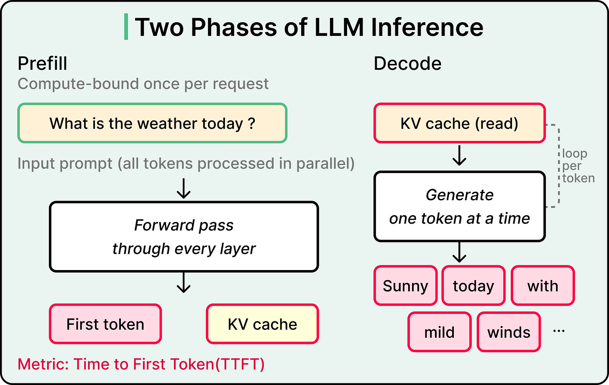
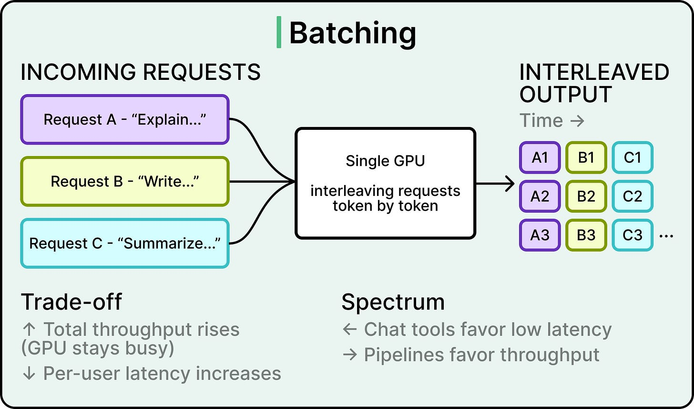
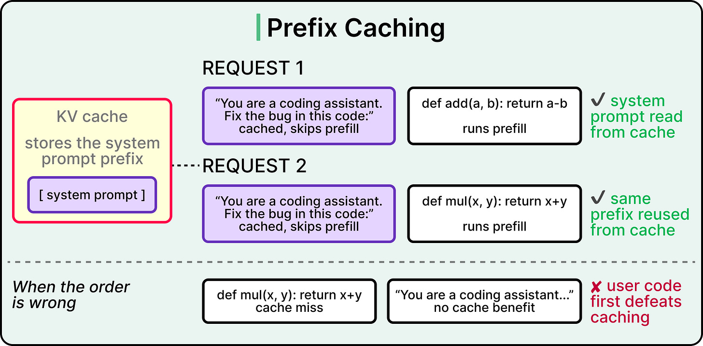
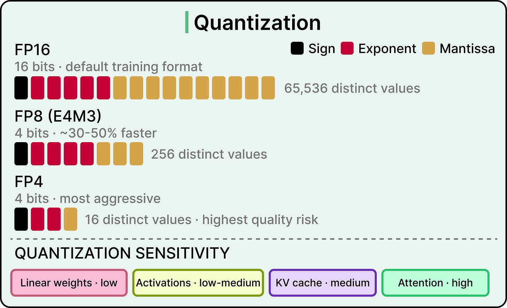
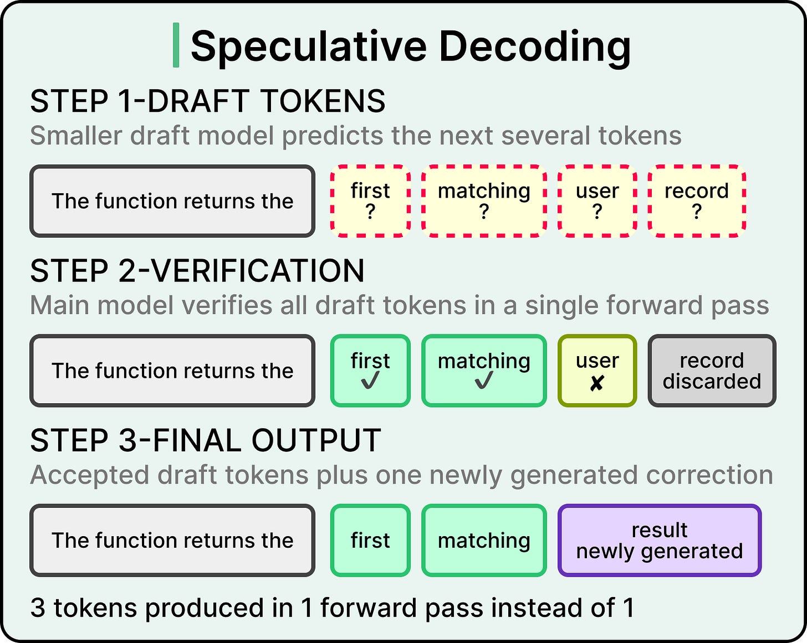
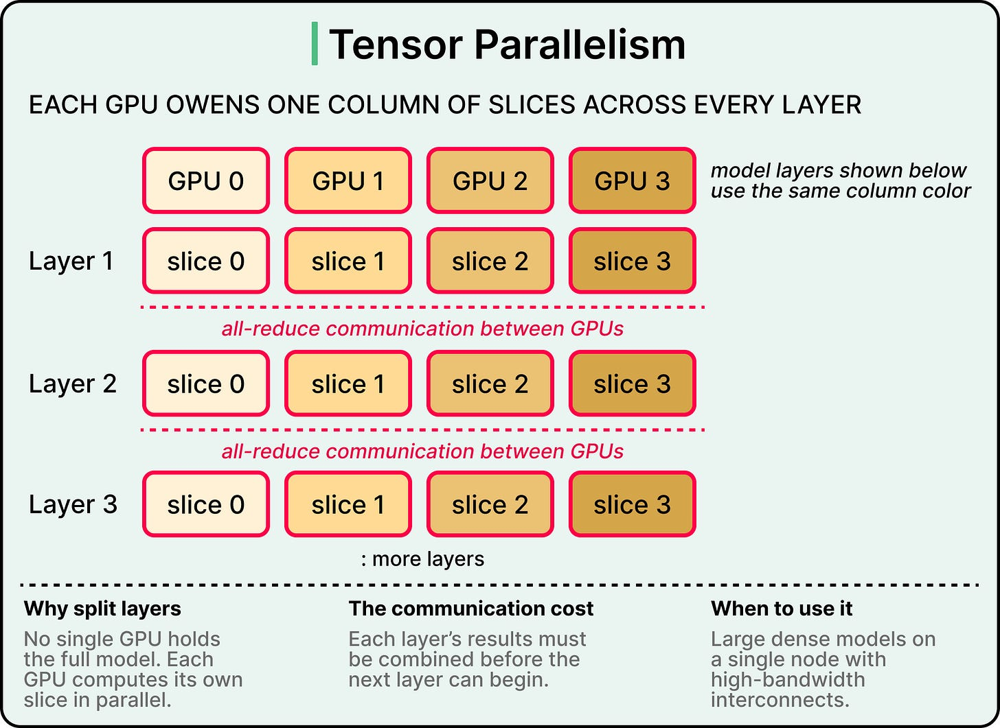
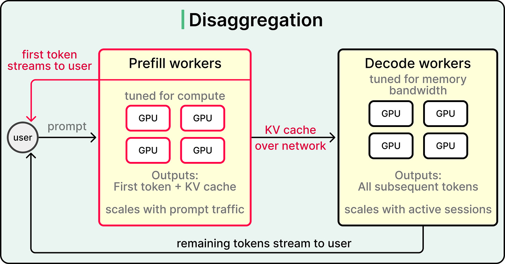

# AI Inference Engineering

What separates a research-grade model from a production-grade service. Inference engineering is the discipline of running trained models efficiently — bridging low-level GPU code, model-serving frameworks, and cloud infrastructure. Three years ago this lived inside frontier AI labs; today, with two million+ open models on Hugging Face, it's a mainstream specialization.

## Key Takeaways

- **LLM inference is two phases with opposing bottlenecks.** **Prefill** is compute-bound (processes the whole prompt in parallel → first token + KV cache). **Decode** is memory-bandwidth-bound (one token per forward pass, dominated by reading the KV cache). Optimizing them as one workload over-constrains both
- **The six core optimization techniques:** batching, prefix caching, quantization, speculative decoding, parallelism (tensor/expert), and disaggregation (separate prefill & decode clusters). Each trades a different axis — latency vs throughput vs quality vs hardware cost
- **The two metrics that matter** are **TTFT (Time to First Token)** for the prefill phase and **TPS (Tokens Per Second)** for the decode phase. Batching helps TPS at the cost of TTFT — that's the central tension
- **Self-hosting beats API only past three thresholds:** API cost has become a meaningful line item, latency requirements exceed public-API performance, *or* reliability needs exceed vendor SLAs. Below that bar, API usage is correct
- **At scale, self-hosting wins by ~80% on cost**, ~four-nines uptime vs. vendor two-nines, and per-workload latency tuning. None of those matter at small scale, where iteration speed dominates

## The Prefill / Decode Split

| Phase | What it does | Bottleneck | Metric |
|---|---|---|---|
| **Prefill** | Processes the entire input prompt through every model layer in **parallel**; outputs the first response token + the KV cache | **Compute-bound** (raw FLOPs) | **TTFT** — Time to First Token |
| **Decode** | Generates each subsequent token **sequentially** (each token depends on all previous tokens). Reads the KV cache every step | **Memory-bandwidth-bound** (moving the KV cache around) | **TPS** — Tokens Per Second |

Why this matters: optimizations that help prefill (more FLOPs) often don't help decode, and vice versa. Production systems either **co-locate** the two on the same GPU and live with the tradeoff, or **disaggregate** (see technique #6) and optimize each phase independently.

## The Six Optimization Techniques

### 1. Batching

Interleave multiple users' requests token-by-token on the same GPU. Each forward pass produces one token for each request in the batch.

- ✅ **Throughput** goes up linearly with batch size (until memory fills)
- ❌ **Per-user latency** goes up — your token is waiting for the slowest request in the batch
- The **primary tension** of inference serving: batching is the biggest throughput lever and the biggest latency tax

Modern serving frameworks use **continuous batching** — new requests join the batch mid-stream as old ones finish, instead of waiting for the whole batch to complete.

### 2. Prefix Caching

If many requests share the **same opening tokens** (system prompts, few-shot examples, the same RAG document), cache the KV values for that shared prefix and reuse them across requests.

- ✅ Eliminates redundant prefill work for the cached prefix
- ❌ **Effectiveness depends on prompt structure** — if the very first token differs, prefix caching delivers zero savings
- The structural fix is to keep stable content (system prompt, few-shot block) at the **start** of every prompt and user-specific content at the end

This is what makes RAG and multi-tenant-system-prompt workloads dramatically cheaper. SGLang's **RadixAttention** is one implementation (radix-tree of shared prefixes).

### 3. Quantization

Compress model weights from 16-bit to 8-bit or 4-bit (or lower) representations. Less data to move → faster decode; less compute per FLOP → faster prefill.

- ✅ Speeds up **both** phases (rare)
- ❌ Quality risk that **compounds across tokens**
- **Attention layers are the most sensitive** to precision loss — errors there propagate through the sequence. Many production setups quantize MLPs aggressively but keep attention at higher precision

GGUF / 4-bit quantization is what makes 70B models fit on a laptop (see [local-llm-inference.md](local-llm-inference.md)). Production systems typically use FP8 / INT8 with per-layer mixed precision.

### 4. Speculative Decoding

A **smaller draft model** predicts the next N tokens; the main model **verifies all of them in a single forward pass** (cheap because the main model would have computed each token's forward pass anyway). If the draft was right, you got N tokens for the cost of one main-model forward pass.

- ✅ Improves **TPS** (decode throughput)
- ✅ **Leaves TTFT unchanged** — only the decode loop benefits
- ❌ Wasted draft work when speculation is wrong (draft accuracy matters)
- Works best at **lower batch sizes** when the GPU has spare compute capacity to verify the drafts

### 5. Parallelism

Two distinct approaches for multi-GPU inference:

| Approach | What it splits | Communication cost | Fits |
|---|---|---|---|
| **Tensor Parallelism** | Each layer is split across GPUs (matrix multiplications partitioned) | **High** — every layer needs an all-reduce. Requires NVLink-class interconnect | Models too large to fit on one GPU; latency-critical workloads |
| **Expert Parallelism** | Mixture-of-experts components distributed across GPUs (each token routes to specific experts) | **Lower** — only routing communication, no per-layer sync | MoE architectures (Mixtral, DeepSeek-V3); cost-sensitive serving |

In practice, frontier models combine both (and often pipeline parallelism on top) — but the trade-off is always **how much interconnect bandwidth you can afford**.

### 6. Disaggregation

Run **prefill on one GPU cluster, decode on another**. The KV cache is transferred over fast interconnect between them.

- ✅ Each cluster's GPUs can be **tuned for its bottleneck** (compute-tuned for prefill, memory-bandwidth-tuned for decode)
- ✅ **Independent scaling** — scale prefill workers with prompt traffic, decode workers with active sessions
- ❌ The KV cache transfer adds latency and requires fast interconnect (RDMA / NVLink)
- **Conditional disaggregation**: short or fully-cached requests skip the handoff and run end-to-end on a single GPU

This is the architecture behind the highest-throughput production setups (xAI, Anthropic, OpenAI internal). The premise: a single GPU optimized for both phases is optimal for *neither*.

## Build vs Buy

When **API usage remains optimal**:
- Early product stage with **fuzzy traffic assumptions**
- Iteration speed > cost
- Latency and reliability constraints are still being discovered

When **self-hosting starts to make sense**:
- API cost has become a **meaningful expense line** in the P&L
- Latency requirements exceed what the public API can deliver (example: Cursor's sub-second autocomplete)
- Reliability needs exceed vendor SLAs (vendor APIs land around two-nines; self-hosted setups can reach four-nines+)
- Compliance / data residency / privacy requires data stay inside your perimeter

The headline numbers (claimed in the article):
- Self-hosted **costs typically drop ~80%** at scale vs. API
- Uptime: **four-nines or better** vs. **two-nines** typical for vendor APIs
- Latency tunable to specific workload patterns instead of inheriting vendor defaults

## Choosing the Optimization Mix

A quick decision frame:

- **Want lower TTFT** → prefix caching, smaller / quantized prefill model, disaggregated prefill cluster
- **Want higher TPS** → batching + continuous batching, speculative decoding, quantization
- **Hit GPU memory ceiling** → quantization, tensor or expert parallelism, KV-cache offload
- **Throughput target with variable traffic** → disaggregation + independent scaling
- **Heavy shared-context workload (RAG, system prompts)** → prefix caching is the single biggest win

## See Also

- [local-llm-inference.md](local-llm-inference.md) — the *tooling landscape* layer (Ollama, vLLM, SGLang, MLX-LM, llama.cpp) that implements these techniques
- [cpu-gpu-tpu.md](cpu-gpu-tpu.md) — the hardware-architecture layer that determines what these techniques can extract
- [ml-systems-at-scale.md](ml-systems-at-scale.md) — broader ML-serving infrastructure (Snapchat Bento case study)
- [../concepts/llm-cost-and-routing.md](../concepts/llm-cost-and-routing.md) — the cost-side answer (model routing) when self-hosting isn't yet the right move
- [../concepts/genai-system-design.md](../concepts/genai-system-design.md) — broader GenAI system design
- [../concepts/rag.md](../concepts/rag.md) — the workload that makes prefix caching the dominant lever

---

**Source:** https://blog.bytebytego.com/p/a-guide-to-ai-inference-engineering
**Date:** 2026-06-15
**Tags:** ai-inference, llm-serving, prefill-decode, ttft, tps, batching, continuous-batching, prefix-caching, quantization, speculative-decoding, tensor-parallelism, expert-parallelism, disaggregation, kv-cache, self-hosting, build-vs-buy
