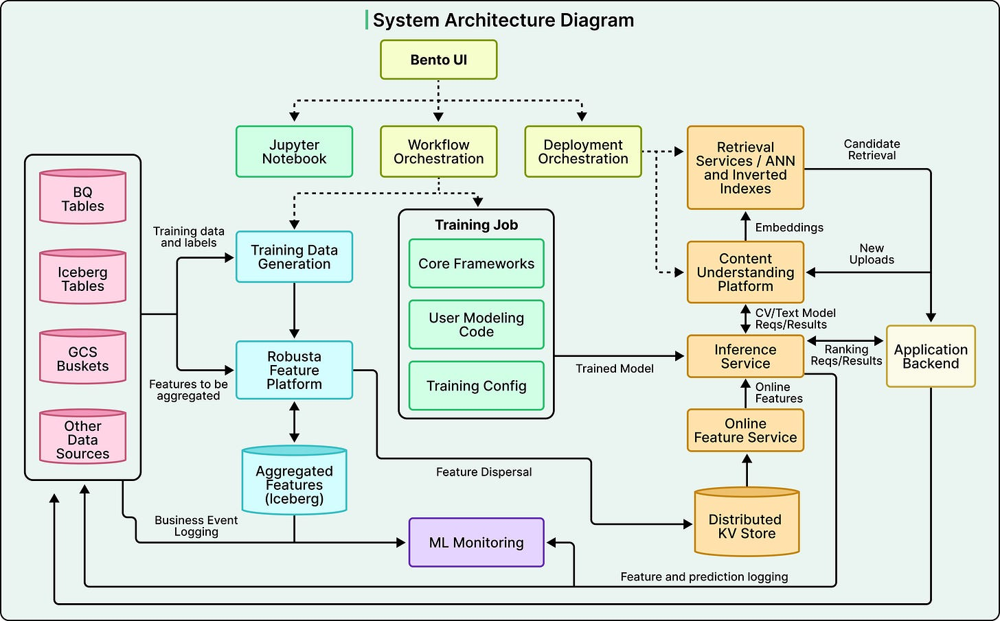
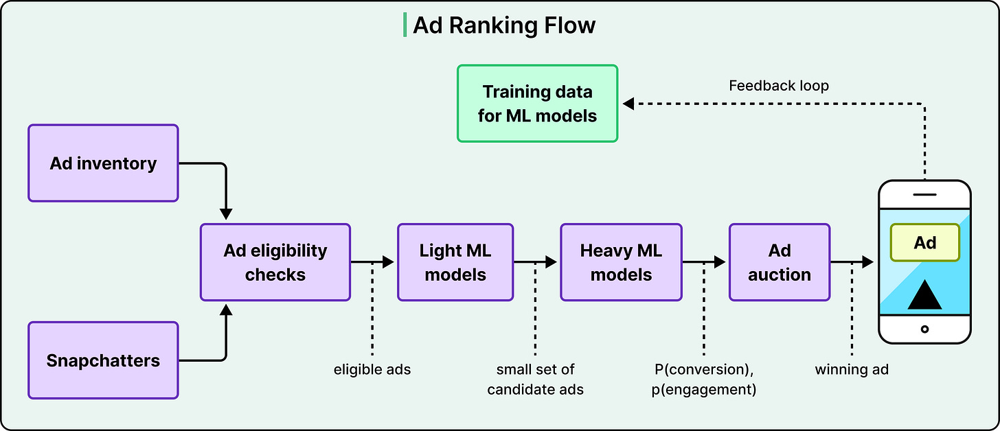
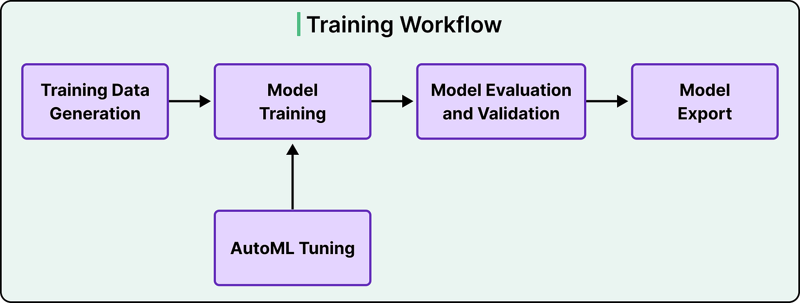
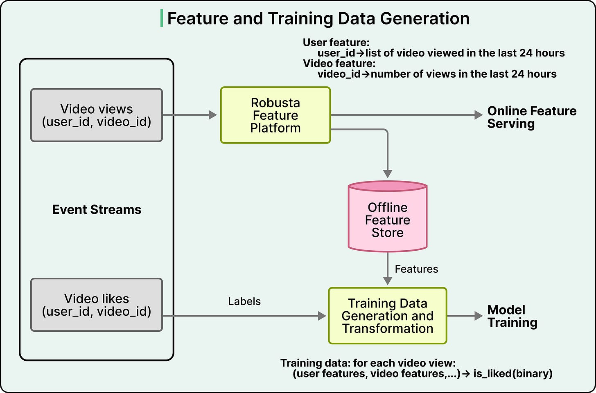
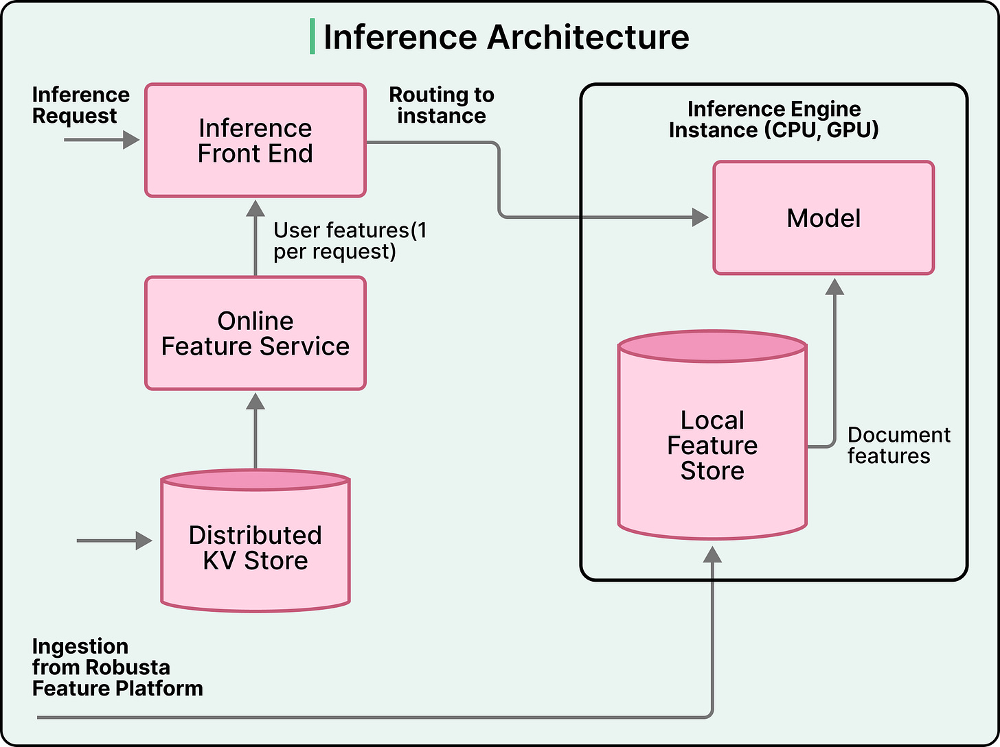
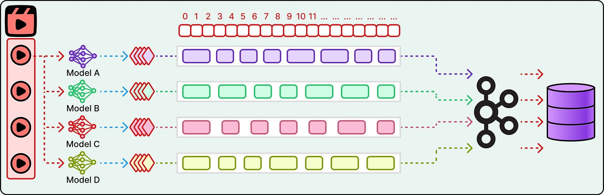
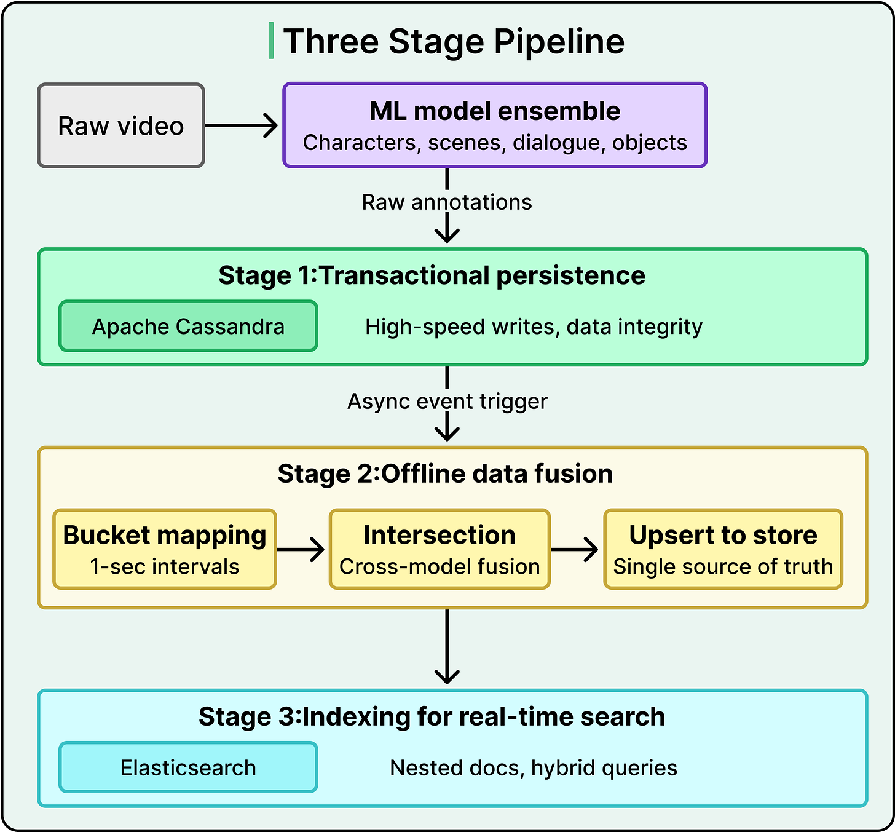
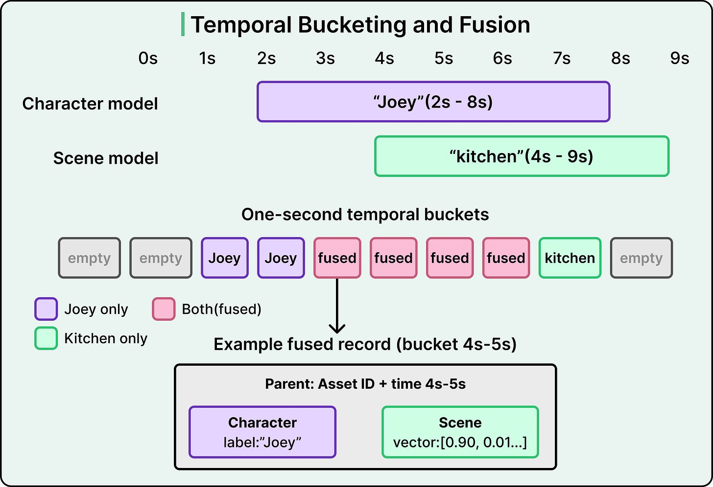

# ML Systems at Scale

## Key Takeaways

- At scale, most cost lives outside the model — serialization, feature fetching, and data plane dominate, not model computation
- Specialized models consistently outperform generalists, but the fusion layer merging their outputs is the hardest engineering challenge
- CPU/GPU compute split (embeddings on CPU, dense math on GPU) prevents wasting GPU memory on lookup tables
- Train-serve skew is the central operational concern — dual feature stores (offline + online) with continuous monitoring address it
- Pipeline architecture enabling discovery and retrieval at scale matters more than model capability alone

## Snapchat Bento — Inference Platform

474M daily active users, 1B+ predictions/sec, 100ms latency budget per request.

### Ad Ranking Flow

One user opens the app → platform scores millions of candidates (content, ads, friends, AR lenses). A single request creates hundreds or thousands of (user, candidate) pairs.

### Training Pipeline

Three layers: core TF/Keras framework → user model code → YAML training config. Model export splits computation: embedding lookups on CPU, dense matrix ops on GPU.

### Feature Store (Robusta)

- Processes 10 trillion events/day
- Online store: 800TB, serves 1TB/sec of reads
- Dual stores (offline Apache Iceberg + online KV store) to prevent train-serve skew

### Inference Architecture

**Two high-fanout strategies:**

1. **Feature collocation** — document features cached on inference instances; one user lookup then local memory reads
2. **Dedicated retrieval service** — ANN search + inverted indexes return pre-hydrated candidate sets

**Key optimization:** Serialization redesign allowing features to transfer as raw bytes → 2x lower latency, 10x cheaper data plane.

### Scale

| Metric | Value |
|---|---|
| Predictions/sec | 1B+ |
| Latency budget | 100ms |
| Online feature data | 800TB |
| Feature read throughput | 1TB/sec |
| Models trained/day | Hundreds |
| Training compute hours/day | 100,000+ |

## Netflix Video Search — Multi-Model Pipeline

Netflix processes 216M frames per season through multiple specialized models, then fuses outputs into 1-second temporal buckets for sub-second search.

### Why Multiple Models?

Each excels at a distinct task:

- Character recognition → text labels ("Joey")
- Scene classification → 512-dim vector embeddings
- Dialogue transcription → timestamped text
- Object detection → visual element identification

### Three-Stage Pipeline

1. **Transactional persistence** — raw annotations stored in Cassandra with zero transformation
2. **Offline data fusion** — async job normalizes outputs into 1-second temporal buckets, intersects annotations across models
3. **Real-time search indexing** — Elasticsearch ingests buckets as nested documents enabling cross-annotation queries

### Temporal Bucketing

- Continuous model detections become discrete 1-second intervals
- Multiple models' outputs for the same bucket merge into one record
- 2,000 hours of footage → 7.2M temporal buckets

### Search

- **Keyword matching** for proper nouns (character names)
- **Vector similarity** for semantic concepts ("kitchen")
- Hybrid: exact kNN (optimal but expensive) vs. approximate NN (faster)

### Tradeoffs

| Decision | Chose | Gave Up |
|---|---|---|
| Offline fusion | Throughput, consistency | Instant searchability |
| Approximate NN | Speed at scale | Some relevance precision |
| Ensemble of specialists | Per-task accuracy | Simpler infrastructure |

---

**Source:** https://blog.bytebytego.com/p/how-snapchat-serves-a-billion-predictions
**Source:** https://blog.bytebytego.com/p/how-netflix-is-using-multimodal-ai
**Date:** 2026-05-24
**Tags:** ml-inference, serving-infrastructure, feature-store, snapchat, netflix, multimodal-ai, ml-pipeline, gpu, ranking
