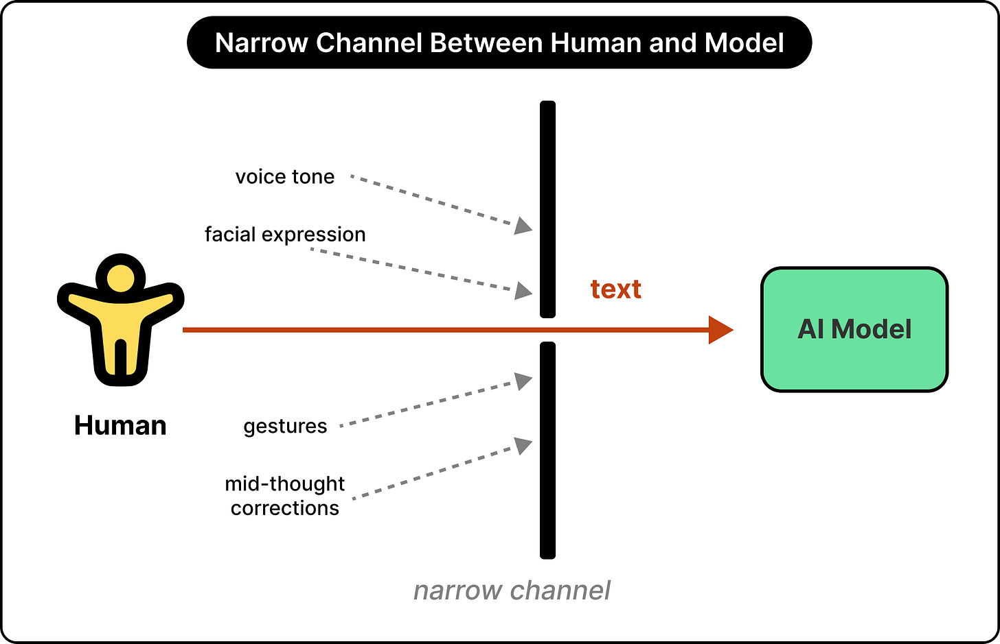
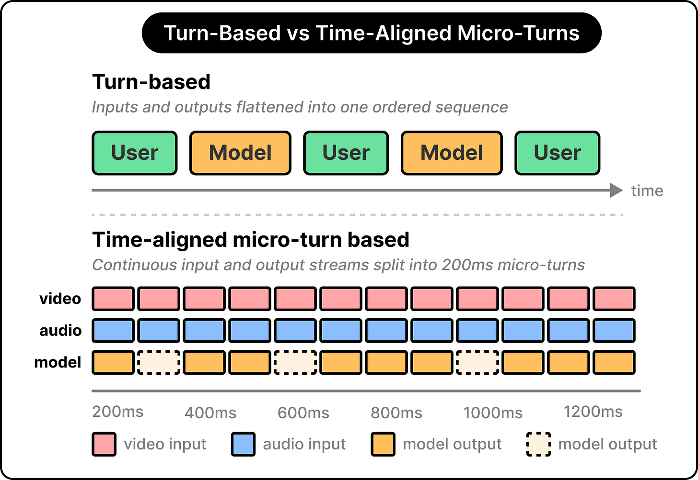
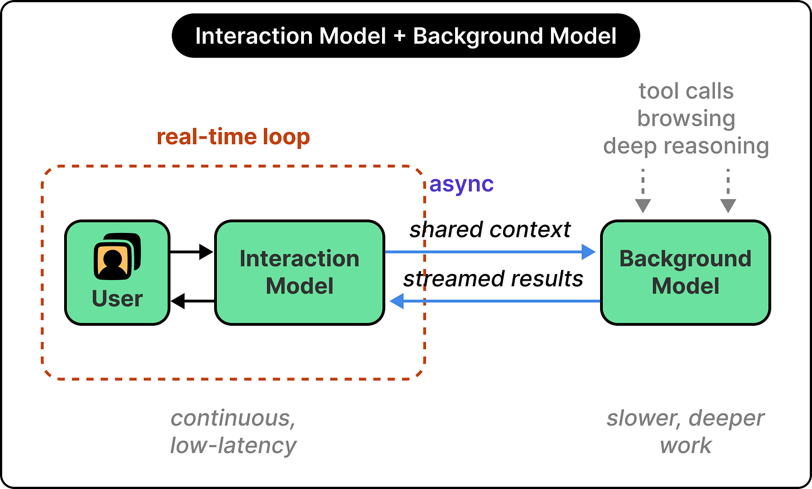
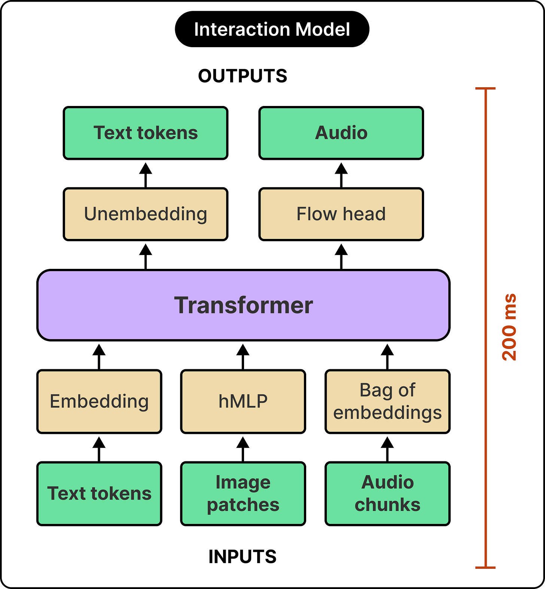
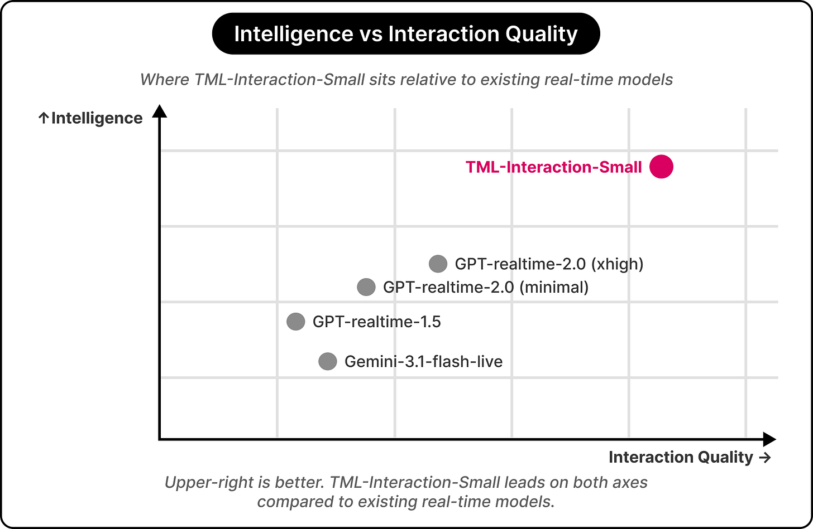

# Real-Time AI Interaction Architecture

## Key Takeaways

- Current voice AI systems force the model to wait for a full utterance before processing — a fundamental bandwidth limitation vs. natural human collaboration (continuous feedback, interruptions, mid-stream corrections)
- The **harness approach** stacks separate VAD → STT → LLM → TTS → dialog management components; "the helpers are simpler than the model itself," capping what's possible at each step
- **Micro-turns** (200ms time slices) replace discrete conversation turns, enabling simultaneous input/output: speaking while listening, watching while speaking, mid-sentence interjections
- **Two-model coordination** (fast interaction + slow reasoning) separates real-time dialog from sustained reasoning/tool use while sharing full conversation context
- "Methods leveraging general computation and learning consistently outperform methods that bake in human-designed heuristics" — embedded interactivity will eventually supersede harness-based real-time AI

## The Problem: Harness Architecture for Voice AI

Today's real-time voice AI systems stack multiple components built around a turn-based LLM core:

1. **Voice activity detection (VAD)** — detect when the user starts/stops speaking
2. **Speech-to-text (STT)** — transcribe the full utterance
3. **Language model** — generate a response (only after STT completes)
4. **Text-to-speech (TTS)** — synthesize audio from the response
5. **Dialog management** — orchestrate the above

Analogy: a scholar communicating only through letters slipped under a door, with helpers managing the simulation of real conversation. The bottleneck: **the model only perceives input after the user finishes speaking**. Proactive interjections, live visual reactions, mid-stream corrections — these require model-level reasoning, not acoustic signal heuristics.

## The Solution: Embedded Interactivity

### Micro-Turns (200ms Chunks)

Instead of discrete conversation turns, time is sliced into **200-millisecond chunks**. Each chunk is a full perceive-and-respond cycle:

| Capability enabled | Example |
|---|---|
| Speaking while listening | Live translation — model outputs translation while user is still speaking |
| Watching while speaking | Live sports commentary — model narrates visual events as they happen |
| Mid-sentence interjection | Correct codeswitching before the speaker finishes the sentence |
| Real-time corrections | Interrupting its own response when the user changes course |

### Two-Model Coordination

| Path | Model | Responsibilities |
|---|---|---|
| **Fast** | Interaction model | Real-time dialog, immediate responses, turn management |
| **Slow** | Background reasoning model | Tool use, web browsing, multi-step reasoning, sustained computation |

Both models share full conversation context. The slow path's results are integrated seamlessly into the conversation without disrupting dialog flow.

## TML-Interaction-Small

Thinking Machines' first released model:

| Attribute | Value |
|---|---|
| Architecture | Mixture-of-experts (MoE) |
| Total parameters | 276 billion |
| Active parameters | 12 billion (per token) |
| Latency target | 200ms per chunk |
| Input | Continuous audio/video streams |
| Encoders | Lightweight audio/video processors trained from scratch (not pretrained encoders like Whisper) |
| OSS contribution | Streaming session feature added to SGLang for efficient 200ms chunk processing |

"Small" refers to its position in a planned model lineup — larger versions expected.

## New Benchmark Categories

Existing voice AI benchmarks don't measure real-time interactivity. Thinking Machines developed four new evaluation categories:

| Benchmark | What it tests | Example task |
|---|---|---|
| **TimeSpeak** | Initiating speech at specified moments | "Remind me to breathe every 4 seconds until told to stop" |
| **CueSpeak** | Mid-utterance interjection with contextual accuracy | "Correct my codeswitching mid-sentence" |
| **RepCount-A** | Real-time physical activity counting from video | Count pushups from a video stream |
| **ProactiveVideoQA** | Time-dependent visual question answering | Questions requiring responses tied to specific visual moments |

Existing models fail these tasks entirely — suggesting this represents a new capability class, not incremental improvement.

## Identified Limitations

- Long sessions create rapid context accumulation challenges (200ms × many turns)
- Requires reliable low-latency internet connectivity for streaming
- Model size is constrained by the 200ms latency budget

## The Broader Pattern

The architectural principle generalizes: hand-crafted heuristics in the harness will be replaced by learned behavior embedded in the model — the same trajectory as hand-crafted vision features being superseded by deep learning. The harness is an interim scaffold, not the final architecture.

## Related

- [multimodal-llms.md](../concepts/multimodal-llms.md) — how multimodal models encode audio/video inputs
- [inference-engineering.md](inference-engineering.md) — serving optimization, batching, KV cache
- [ai-infrastructure.md](ai-infrastructure.md) — hardware and infrastructure for serving

---

**Source:** https://blog.bytebytego.com/p/inside-thinking-machines-interaction
**Date:** 2026-06-30
**Tags:** real-time-ai, voice-ai, multimodal, micro-turns, mixture-of-experts, streaming-inference, two-model-coordination, sglang, real-time-interaction, thinking-machines
