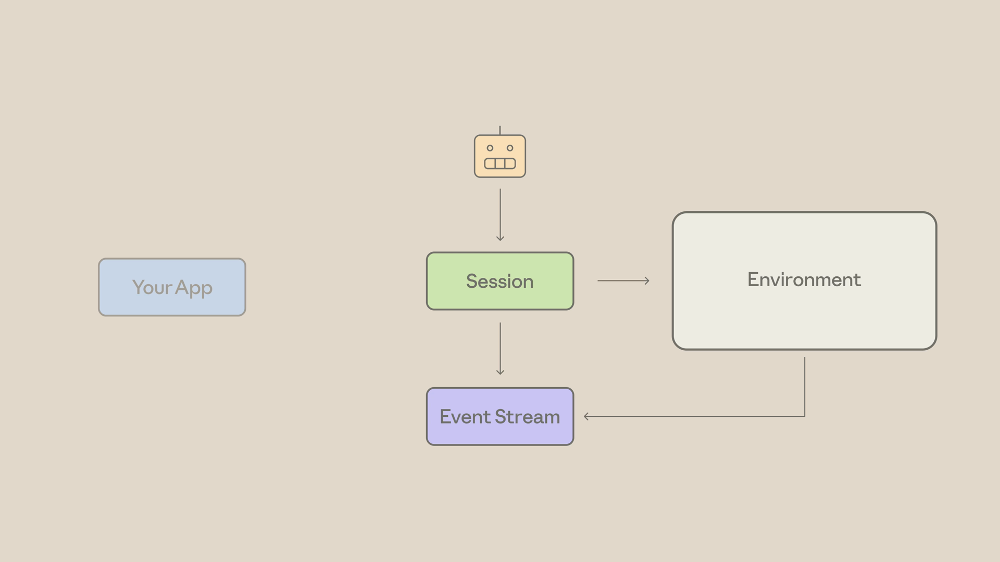

# Claude Platform 101

## Key Takeaways

- The platform has three layers: **Primitives** (Messages API, tool use, files, web search, code execution, MCP, skills), **Infrastructure** (managed agents, retries, queues, observability), and **Controls** (dashboards, evals) — build with primitives, scale on infrastructure, run with controls
- Every API call goes through `messages.create`; the response `content` is an array of typed blocks (text, tool_use, thinking), not a plain string — always loop and check type
- The agent loop pattern: send message → if `stop_reason == "tool_use"`, execute tools and push results back → repeat until `stop_reason == "end_turn"`
- Pick the cheapest model that passes your eval: Haiku for volume/classification, Sonnet for daily production work, Opus for deep reasoning — always evaluate before choosing
- Managed Agents host the entire agent loop on Anthropic's infrastructure — four primitives: Agent, Environment, Session, Events

---

## The Claude Developer Platform

API-level access to Claude's models, tools, and infrastructure. Components:
- REST API (any language), SDKs, CLIs
- Console — manage API keys, usage, deploy managed agents, test prompts

**Three layers:**
- **Primitives** — Messages API, tool use, files, web search, code execution, MCP servers, skills
- **Infrastructure** — managed agents, retries, queues, observability, prompt caching, memory
- **Controls** — dashboards, evaluations, workspaces, usage & spend limits, request logs

---

## Your First API Call

Store API key in `.env.local`, never hardcode in source.

```python
import anthropic

client = anthropic.Anthropic()
response = client.messages.create(
    model="claude-sonnet-4-6",
    max_tokens=1024,
    system="You are a terse senior code reviewer.",
    messages=[{"role": "user", "content": "Review this code:\n" + buggy_code}],
)

for block in response.content:
    if block.type == "text":
        print(block.text)
```

Key parameters: `model`, `max_tokens`, `system` (shapes behavior), `messages` (array of role/content objects). Response `content` is an array of blocks — loop and check `block.type`.

---

## Choosing the Right Model

| Tier | Use case | Trade-off |
|---|---|---|
| Haiku | High volume, classification, extraction, routing | Fastest, cheapest — less capable |
| Sonnet | Most production work | Balanced |
| Opus | Deep reasoning, complex analysis, nuanced writing | Slowest, most expensive |
| Fable | Toughest challenges (new, above Opus) | Significantly higher cost |

**Evaluation workflow:** Build a set of 20–30 representative examples. Run from Haiku upward, stop at the cheapest model whose output you'd ship. Route different task types to different models within the same endpoint.

```python
models = ["claude-haiku-4-5", "claude-sonnet-4-6", "claude-opus-4-7"]
for model in models:
    response = client.messages.create(model=model, max_tokens=300, messages=[...])
    print(model, response.usage)  # usage.input_tokens, usage.output_tokens
```

---

## The Agent Loop

An agent runs both sides of the messaging loop autonomously — receives a task, calls tools, reads results, repeats until done.

```python
while True:
    response = client.messages.create(
        model="claude-sonnet-4-6",
        max_tokens=1024,
        tools=tools,
        messages=messages,
    )
    if response.stop_reason == "end_turn":
        # done — print final text and break
        break
    if response.stop_reason == "tool_use":
        tool_results = []
        for block in response.content:
            if block.type == "tool_use":
                result = run_tool(block.name, block.input)
                tool_results.append({
                    "type": "tool_result",
                    "tool_use_id": block.id,
                    "content": result,
                })
        messages.append({"role": "assistant", "content": response.content})
        messages.append({"role": "user", "content": tool_results})
```

---

## Tool Use

A tool is a function you define and expose to Claude. **Claude requests the call; your code executes it.**

```json
{
    "name": "lookup_building_code",
    "description": "Look up a specific building code section by ID. Returns full text.",
    "input_schema": {
        "type": "object",
        "properties": {
            "section": {"type": "string", "description": "The section identifier"}
        },
        "required": ["section"]
    }
}
```

The description is the most critical field — vague descriptions are the #1 cause of agents misfiring. Pass multiple tools in the `tools` array; Claude picks which one(s) to call and in what order.

---

## Extended Thinking

Lets Claude reason step-by-step before answering. Reasoning is visible in the response alongside final text. Best for: multi-step logic, code debugging, regulatory analysis, trade-off decisions. Skip for simple classification/extraction — adds latency and cost with no benefit.

**Opus 4.7 — adaptive thinking** (no token budget needed):

```python
response = client.messages.create(
    model="claude-opus-4-7",
    max_tokens=16000,
    thinking={"type": "adaptive"},
    output_config={"effort": "high"},  # low | medium | high | xhigh | max
    tools=[...],
    messages=[...],
)
```

Response contains `thinking` blocks (reasoning) + `tool_use` blocks + `text` blocks.

---

## Built-in Tools

### Server tools — declared by you, run by Anthropic

No agent loop required. Anthropic executes the tool; the result is in the same response.

```python
# Web search
client.messages.create(
    model="claude-opus-4-7",
    max_tokens=1024,
    tools=[{"type": "web_search_20260209", "name": "web_search"}],
    messages=[{"role": "user", "content": "..."}],
)

# Code execution
client.messages.create(
    model="claude-opus-4-7",
    max_tokens=1024,
    tools=[{"type": "code_execution_20260120", "name": "code_execution"}],
    messages=[{"role": "user", "content": "Calculate mean and std dev of [1..10]"}],
)
```

Response block types: `server_tool_use`, `bash_code_execution_tool_result`, `text`.

**Available server tools:** web search, code execution, web fetch.

### Client tools — run where your code runs

Memory (cross-session persistence) and Bash (persistent shell). SDK ships the schema and runner.

---

## Skills

Folders of instructions, scripts, and resources that Claude loads dynamically. Core: a `SKILL.md` file that defines your procedure. **Tools are about what Claude can do; Skills are about how you want it done.**

Skills load progressively — only name + description load at first; full content loads when the agent decides the Skill is relevant.

```
my-skill/
├── SKILL.md       # entry point — instructions, when to use, what to do
├── scripts/       # executable helpers
├── references/    # background docs
└── assets/        # templates, examples
```

```python
# Upload once
skill = client.beta.skills.create(
    display_title="Status Report Generator",
    files=files_from_dir("status-report-skill"),
)

# Attach to request via container
response = client.beta.messages.create(
    model="claude-sonnet-4-5",
    max_tokens=4096,
    betas=["skills-2025-10-02", "code-execution-2025-08-25"],
    container={"skills": [{"type": "custom", "skill_id": skill.id, "version": "latest"}]},
    tools=[{"type": "code_execution_20250825", "name": "code_execution"}],
    messages=[{"role": "user", "content": "Generate daily status report from:\n" + activity_log}],
)
```

Multiple Skills can be layered on one call. Skills is currently a beta feature.

---

## MCP (Model Context Protocol)

MCP shifts integration maintenance to the service provider. Asana, Slack, Google each publish their own MCP server — when their API changes, they update the server; you change nothing.

**Decision guide:**
- **Tools** — your internal systems (your database, your APIs). You own the code and maintenance.
- **Skills** — your procedures (report templates, review checklists). Instructions, not integrations.
- **MCP** — third-party services (Asana, Slack, Linear). Provider maintains the integration.

```python
response = client.beta.messages.create(
    model="claude-opus-4-7",
    max_tokens=1000,
    messages=[{"role": "user", "content": "What tools do you have available?"}],
    mcp_servers=[{
        "type": "url",
        "url": "https://mcp.linear.app/mcp",
        "name": "linear",
        "authorization_token": os.environ["LINEAR_MCP_TOKEN"],
    }],
    tools=[{"type": "mcp_toolset", "mcp_server_name": "linear"}],
    betas=["mcp-client-2025-11-20"],
)
```

Claude introspects the server and discovers tools — no schemas to write.

**Scoping access** (e.g., read-only):
```python
tools=[{
    "type": "mcp_toolset",
    "mcp_server_name": "slack",
    "default_config": {"enabled": False},
    "configs": {
        "search_messages": {"enabled": True},
        "list_channels": {"enabled": True},
    },
}]
```

Reference: [modelcontextprotocol.io](https://modelcontextprotocol.io) for available servers.

---

## Context Management

Context = everything Claude sees on a turn: system prompt + message history + tool definitions + tool results + attached files/skills + thinking blocks. You pay for it in and out. Once the window fills, the request fails.

**Four patterns:**

| Pattern | Mechanism | Handles |
|---|---|---|
| Just-in-time context | Load what's needed now via tools; pull more on demand | Window bloat upfront |
| Server-side compaction | `context_management: {edits: [{type: "compact"}]}` | Long conversations |
| Prompt caching | Mark stable parts (system prompt, tool defs, docs) for reuse | Cost |
| Memory tool | Claude reads/writes memory dir via tool calls; you own the storage | Cross-session state |

```python
# Server-side compaction
response = client.messages.create(
    model="claude-sonnet-4-5",
    max_tokens=1024,
    context_management={"edits": [{"type": "compact"}]},
    messages=messages,
)
```

In production, layer all four. Managed agents ship with caching and compaction on by default.

---

## Managed Agents

An agent loop hosted on Anthropic's infrastructure. You describe the agent once, configure an environment, fire sessions — Anthropic runs the loop, you stream the events.

**Four primitives:**
1. **Agent** — persona: model, system prompt, toolset. Reusable across many sessions.
2. **Environment** — where it runs: cloud/local, networking config. Isolated container with file system, bash, web search.
3. **Session** — a single run of an agent in an environment. The unit of work.
4. **Events** — messages flowing in/out: actions, tool calls, results, replies.



```python
# 1. Create agent (reusable)
agent = client.beta.agents.create(
    name="Line Counter",
    model="claude-opus-4-7",
    system="You are a helpful agent that completes small file tasks.",
    tools=[{"type": "agent_toolset_20260401", "default_config": {"enabled": True}}],
)

# 2. Create environment
environment = client.beta.environments.create(
    name="line-counter-env",
    config={"type": "cloud", "networking": {"type": "unrestricted"}},
)

# 3. Create session
session = client.beta.sessions.create(
    agent=agent.id,
    environment_id=environment.id,
    title="Count lines demo",
)

# 4. Open stream FIRST, then send kickoff (stream only delivers events after it opens)
with client.beta.sessions.events.stream(session_id=session.id) as stream:
    client.beta.sessions.events.send(
        session_id=session.id,
        events=[{"type": "user.message", "content": [{"type": "text", "text": "Create a file, count its lines, and report back."}]}],
    )
    for event in stream:
        # handle event types: agent.message, tool.use, tool.result, session.complete
        ...
```

**Use cases:** long-running tasks (minutes to hours), parallel sessions on separate tickets, recurring agents with memory, multi-agent coordination (coordinator + specialist pattern with shared file system).

---

## Building with Claude Code

Claude Code can write API integration code from stubs. The built-in **Claude API skill** loads automatically when it detects the TypeScript SDK, or invoke with `/claude-api`.

A good prompt for Claude Code names: (1) the file to change, (2) the pattern to use, (3) the expected end state. Claude writes the code, runs it, and patches errors in place.

**The Claude API code shape:**
1. Define a tool (name, description, JSON schema)
2. Hand it to a runner (tool runner handles the agent loop)
3. Return the result

---

**Source:** /Users/vimittal/Downloads/Claude Platform 101 (Anthropic Academy course)
**Date:** 2026-06-23
**Tags:** claude-api, anthropic, messages-api, agent-loop, tool-use, extended-thinking, built-in-tools, skills, mcp, context-management, managed-agents, claude-code, model-selection, prompt-caching
